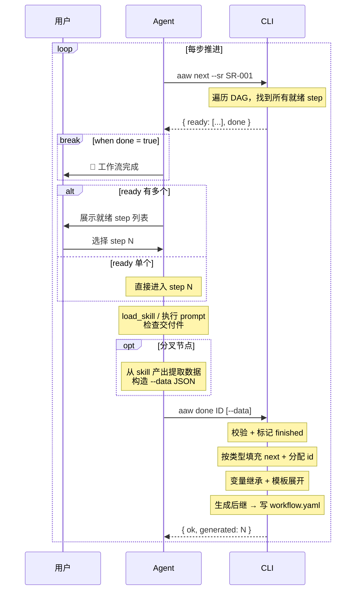
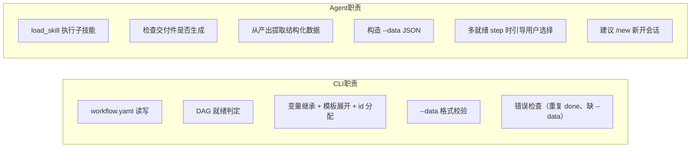

# AAW Workflow CLI 设计方案（终版）

## 一、目录结构

```
.sdd/SR-001/
  workflow.yaml          # 唯一文件，包含 SR 追踪 + 全部 step
```

没有 `steps/` 子目录，没有独立 step YAML。一个文件纵览全局。

---

## 二、workflow.yaml 格式

```yaml
sr: SR-001
status: in_progress    # "in_progress" | "done"
created_at: "2026-07-03T20:13:52"
steps:
  - id: 1
    type: sr-design
    name: sr-design
    finished: false
    skill: ['sr-design']
    prompt: ""
    input: ['xxxxx', '.sdd/software_architecture.md']
    output: ['.sdd/SR-001/SR-design.md']
    available_next: ['ar-split']
    next: [2]
```

渐进式追加——每次 `aaw done` 在 `steps` 列表末尾追加新 step，并更新已完成 step 的 `finished`。

### Step 字段

| 字段 | 类型 | 说明 |
|------|------|------|
| `id` | int | 全局自增，生成时分配 |
| `type` | str | 步骤类型标识，用于 CLI 判断分支行为 |
| `name` | str | 步骤名称 |
| `finished` | bool | 是否完成 |
| `skill` | list[str] | 要执行的 skill 名列表 |
| `prompt` | str | 执行引导提示 |
| `input` | list[str] | 输入文件/描述列表 |
| `output` | list[str] | 输出交付件列表 |
| `available_next` | list[str] | 下一步可选 skill（定义层面，信息展示用） |
| `next` | list[int] | 确认后的下一步 step id，**创建时为空 `[]`，`aaw done` 时填充** |

`type` 取值：

| type | next 行为 | --data 要求 |
|------|----------|------------|
| `sr-design` | 分配 1 个新 id | 无 |
| `ar-split` | 按 `--data.ars` 条目数分配 N 个新 id | **必须** |
| `ar-clarify` | 分配 1 个新 id | 无 |
| `module-boundary-design` | 分配 1 个新 id | 无 |
| `module-detail-design-split` | 按 `--data.module_groups` 条目数分配 N 个新 id | **必须** |
| `module-asis-analysis` | 分配 1 个新 id | 无 |
| `module-tobe-design` | 分配 1 个新 id | 无 |
| `module-test-design` | 分配 1 个新 id | 无 |
| `module-design-gate` | 分配 1 个新 id | 无 |
| `task-split` | 按 `--data.tasks` 条目数分配 N 个新 id | **必须** |
| `task-dev` | 保持 `[]`（终止节点） | 无 |

终止条件：`type: task-dev` 或 `available_next: []` 且 `next: []` → 工作流结束。

---

## 四、Step 类型模板

以下模板展示了生成后的完整形态。注意 `next` 字段的值是**填充后的结果**，创建时均为 `[]`。

### Step 1：sr-design（init 时生成，唯一初始 step）

```yaml
id: 1
type: sr-design
name: sr-design
finished: false
skill: ['sr-design']
prompt: ""
input: ['xxxxx', '.sdd/software_architecture.md']
output: ['.sdd/SR-001/SR-design.md']
available_next: ['ar-split']
next: []
```

### ar-split（done 1 后生成）

```yaml
id: 2
type: ar-split
name: ar-split
finished: false
skill: []
prompt: "根据SR-design拆分AR,并以AR编号创建目录"
input: ['.sdd/SR-001/SR-design.md']
output: []
available_next: ['ar-clarify', 'module-boundary-design']
next: []
```

### ar-clarify（done 2 后按 AR 数量生成。以 AR-001 为例）

```yaml
id: 3
type: ar-clarify
name: AR-001-ar-clarify
finished: false
skill: ['ar-clarify']
prompt: ""
input: ['.sdd/SR-001/SR-design.md', 'AR-001:用户管理']
output: ['.sdd/SR-001/AR-001/AR-clarify.md']
available_next: ['module-boundary-design']
next: []
```

AR-002 同理生成 id:4。

### module-boundary-design（done ar-clarify 后生成。以 AR-001 为例）

```yaml
id: 5
type: module-boundary-design
name: module-boundary-design
finished: false
skill: ['module-boundary-design']
prompt: ""
input: ['.sdd/SR-001/AR-001/AR-clarify.md']
output: ['.sdd/SR-001/AR-001/module-boundary-design.md']
available_next: ['module-detail-design-split']
next: []
```

**注意**：AR-002 的 boundary-design 是另一个 step（id 不同），不共用。

### module-detail-design-split（done boundary 后生成）

```yaml
id: 6
type: module-detail-design-split
name: module-detail-design-split
finished: false
skill: ['module-detail-design-split']
prompt: ""
input: ['.sdd/SR-001/AR-001/module-boundary-design.md']
output: []
available_next: ['module-asis-analysis']
next: []
```

### module-asis-analysis（done detail-split 后按模块组数量生成。以"模块A,B"为例）

```yaml
id: 7
type: module-asis-analysis
name: "模块A,B-module-asis-analysis"
finished: false
skill: ['module-asis-analysis']
prompt: ""
input: ['.sdd/SR-001/AR-001/module-boundary-design.md']
output: ['.sdd/SR-001/AR-001/AR-001-用户管理-模块A,B模块详细设计说明书.context.md']
available_next: ['module-tobe-design']
next: []
```

### module-tobe-design（done asis 后生成）

```yaml
id: 9
type: module-tobe-design
name: "模块A,B-module-tobe-design"
finished: false
skill: ['module-tobe-design']
prompt: ""
input: ['.sdd/SR-001/AR-001/AR-001-用户管理-模块A,B模块详细设计说明书.context.md']
output: ['.sdd/SR-001/AR-001/AR-001-用户管理-模块A,B模块详细设计说明书.md']
available_next: ['module-test-design']
next: []
```

### module-test-design（done tobe 后生成）

```yaml
id: 10
type: module-test-design
name: "模块A,B-module-test-design"
finished: false
skill: ['module-test-design']
prompt: ""
input: ['.sdd/SR-001/AR-001/AR-001-用户管理-模块A,B模块详细设计说明书.md']
output: ['.sdd/SR-001/AR-001/AR-001-用户管理-模块A,B模块测试用例设计.md']
available_next: ['module-design-gate']
next: []
```

### module-design-gate（done test 后生成）

```yaml
id: 11
type: module-design-gate
name: "模块A,B-module-design-gate"
finished: false
skill: ['module-design-gate']
prompt: ""
input:
  - '.sdd/SR-001/AR-001/AR-001-用户管理-模块A,B模块详细设计说明书.context.md'
  - '.sdd/SR-001/AR-001/AR-001-用户管理-模块A,B模块详细设计说明书.md'
  - '.sdd/SR-001/AR-001/AR-001-用户管理-模块A,B模块测试用例设计.md'
output: []
available_next: ['task-split']
next: []
```

### task-split（done gate 后生成）

```yaml
id: 12
type: task-split
name: task-split
finished: false
skill: ['task-split']
prompt: ""
input:
  - '.sdd/SR-001/AR-001/AR-001-用户管理-模块A,B模块详细设计说明书.md'
  - '.sdd/SR-001/AR-001/AR-001-用户管理-模块A,B模块测试用例设计.md'
output:
  - '.sdd/SR-001/AR-001/模块A,B_tasks/overview.md'
  - '.sdd/SR-001/AR-001/模块A,B_tasks/T1-{任务标题}.md'
  - '.sdd/SR-001/AR-001/模块A,B_tasks/T2-{任务标题}.md'
available_next: ['task-dev']
next: []
```

### task-dev（done task-split 后按任务数量生成。终止节点。以 T1 为例）

```yaml
id: 13
type: task-dev
name: T1-task-dev
finished: false
skill: ['task-dev']
prompt: ""
input: ['.sdd/SR-001/AR-001/模块A,B_tasks/T1-用户CRUD.md']
output: []
available_next: []
next: []    # 终止
```

---

## 五、DAG 拓扑（责任链）

每个 AR 独立分叉，每个模块组独立分叉，互不收敛。以 2 个 AR × 2 个模块组 × 2 个任务为例：

```
1(sr-design)
  └→ 2(ar-split)
       ├→ 3(AR-001 clarify) → 5(AR-001 boundary) → 6(AR-001 detail-split)
       │                                              ├→ 7(asis-A,B)  → 9(tobe) → 10(test) → 11(gate) → 12(task-split)
       │                                              │                                                ├→ 13(T1-dev)
       │                                              │                                                └→ 14(T2-dev)
       │                                              └→ 8(asis-C)    → 15(tobe) → 16(test) → 17(gate) → 18(task-split)
       │                                                                                                 ├→ 19(T1-dev)
       │                                                                                                 └→ 20(T2-dev)
       └→ 4(AR-002 clarify) → 21(AR-002 boundary) → 22(AR-002 detail-split)
                                                        ├→ 23(asis-X)  → ...
                                                        └→ 24(asis-Y)  → ...
```

### "可执行"判定

一个 step 可执行当且仅当：
- `finished == false`
- 所有指向它的前置 step 都已 `finished == true`

---

## 六、CLI 命令

所有命令默认人类可读输出，加 `--json` 输出 JSON（供 Agent 解析）。

```bash
# 使用方式（无需安装到 PATH）
python -m cli.main init
python -m cli.main init --sr SR-001
python -m cli.main status --sr SR-001
python -m cli.main next --sr SR-001 --json
python -m cli.main done --sr SR-001 <id> [--data '...'] --json
```

### `aaw init`

```bash
aaw init                       # 创建 .sdd/ 目录骨架
aaw init --sr SR-001           # 创建 SR 目录 + workflow.yaml（只含 step 1）
```

### `aaw status`

```bash
aaw status                     # 列出所有 SR（表格）
aaw status --sr SR-001         # 列出某 SR 的所有 step（表格）
aaw status --sr SR-001 --json  # JSON 格式
```

`--json` 输出：

```json
{
  "sr": "SR-001",
  "status": "in_progress",
  "steps": [
    {"id": 1, "name": "sr-design", "finished": true},
    {"id": 2, "name": "ar-split", "finished": false}
  ]
}
```

### `aaw next`

```bash
aaw next --sr SR-001            # 人类可读
aaw next --sr SR-001 --json     # JSON（Agent 调用）
```

`--json` 输出：

```json
{
  "sr": "SR-001",
  "ready": [
    {"id": 7, "type": "module-asis-analysis", "name": "模块A,B-module-asis-analysis", "skill": ["module-asis-analysis"], "input": [".sdd/SR-001/AR-001/module-boundary-design.md"], "output": ["..."]},
    {"id": 8, "type": "module-asis-analysis", "name": "模块C-module-asis-analysis", "skill": ["module-asis-analysis"], "input": [".sdd/SR-001/AR-001/module-boundary-design.md"], "output": ["..."]}
  ],
  "done": false
}
```

全部完成时：

```json
{
  "sr": "SR-001",
  "ready": [],
  "done": true
}
```

### `aaw done`

```bash
aaw done --sr SR-001 <id>
aaw done --sr SR-001 <id> --json
aaw done --sr SR-001 <id> --data '{"ars":[{"id":"AR-001","title":"用户管理"}]}'
aaw done --sr SR-001 <id> --data '{"module_groups":[{"name":"A,B","modules":["模块A","模块B"],"requirement":"用户管理"}]}'
aaw done --sr SR-001 <id> --data '{"tasks":["T1-用户CRUD","T2-权限校验"]}'
```

`--data` 三种结构：

**ars**（ar-split 使用）：

```json
{
  "ars": [
    {"id": "AR-001", "title": "用户管理"},
    {"id": "AR-002", "title": "权限控制"}
  ]
}
```

**module_groups**（detail-split 使用）：

```json
{
  "module_groups": [
    {"name": "A,B", "modules": ["模块A","模块B"], "requirement": "用户管理"},
    {"name": "C", "modules": ["模块C"], "requirement": "用户管理"}
  ]
}
```

| 字段 | 说明 |
|------|------|
| `name` | 模块组简称（用于目录名和 step 名称） |
| `modules` | 该组包含的模块列表 |
| `requirement` | 对应 `{需求短名}`，用于 output 文件名 |

**tasks**（task-split 使用）：

```json
{
  "tasks": ["T1-用户CRUD", "T2-权限校验"]
}
```

**执行流程：**

1. 校验：step 存在、未完成、前置已满足
2. 将当前 step 的 `finished` 设为 `true`
3. 根据 step 的 `type` 决定 `next`：
   - `ar-split` / `module-detail-design-split` / `task-split` → 必须带 `--data`，按条目数分配 N 个新 id
   - `task-dev` → 终止，`next` 保持 `[]`
   - 其余 → 1:1，分配 1 个新 id
4. 为 `next` 中每个 id 生成后继 step（变量继承 + `--data` 展开模板）
5. 追加到 `steps` 列表末尾
6. 若所有 step 均 `finished: true` → 更新 `status: done`
7. 写回 `workflow.yaml`

**错误场景：**

- `aaw done <id>` 但 step 已 `finished: true` → 报错
- 分叉类型不带 `--data` → 报错并提示需要的数据格式
- `--data` 格式不符 → 报错并提示正确格式

---

## 七、变量传递机制

生成后继 step 时，模板变量通过两种来源解析：

| 来源 | 变量 | 说明 |
|------|------|------|
| workflow.yaml | `{SR}` | 从 `sr` 字段读取 |
| 父 step **所有已解析字段**（input + output） | `{AR}`, `{需求短名}`, `{模块组名}` | 从父 step 的 input 和 output 路径中模式匹配提取 |
| `--data` | AR 列表、模块组、任务 | 仅分叉节点使用 |

### 提取规则

从父 step 的 `input` + `output` 所有已解析路径中，按模式匹配提取变量：

```
step 6 (detail-split) 的 output 为空 → 从 input 提取：
  input: ['.sdd/SR-001/AR-001/module-boundary-design.md']
             └─SR    └─AR

step 9 (tobe-A,B) 的 output 已解析：
  output: ['.sdd/SR-001/AR-001/AR-001-用户管理-模块A,B模块详细设计说明书.md']
              └─SR    └─AR     └─AR    └─需求          └─模块组
```

### 示例——done 3（AR-001 clarify）→ 生成 AR-001 boundary-design

```
父 step 3:
  output: ['.sdd/SR-001/AR-001/AR-clarify.md']

提取: SR=SR-001, AR=AR-001

boundary-design 模板:
  input:  ['.sdd/{SR}/{AR}/AR-clarify.md']
  output: ['.sdd/{SR}/{AR}/module-boundary-design.md']

展开:
  input:  ['.sdd/SR-001/AR-001/AR-clarify.md']
  output: ['.sdd/SR-001/AR-001/module-boundary-design.md']
```

### 示例——done 6（AR-001 detail-split）→ 生成 asis-A,B + asis-C

```
父 step 6:
  input: ['.sdd/SR-001/AR-001/module-boundary-design.md']

提取: SR=SR-001, AR=AR-001

--data:
  {"module_groups": [
    {"name": "A,B", "modules": ["模块A","模块B"], "requirement": "用户管理"},
    {"name": "C",   "modules": ["模块C"],        "requirement": "用户管理"}
  ]}

asis 模板 (N=2):
  name:   "{模块组名}-module-asis-analysis"
  input:  ['.sdd/{SR}/{AR}/module-boundary-design.md']
  output: ['.sdd/{SR}/{AR}/{AR}-{需求短名}-{模块组名}模块详细设计说明书.context.md']

展开 step 7 (name=A,B):
  name:   "模块A,B-module-asis-analysis"
  output: ['.sdd/SR-001/AR-001/AR-001-用户管理-模块A,B模块详细设计说明书.context.md']

展开 step 8 (name=C):
  name:   "模块C-module-asis-analysis"
  output: ['.sdd/SR-001/AR-001/AR-001-用户管理-模块C模块详细设计说明书.context.md']
```

---

## 八、渐进式生成流程

```
aaw init --sr SR-001
  → workflow.yaml: steps=[1]

aaw next --sr SR-001                     → ready: [1]

# agent 执行 sr-design skill，产出 SR-design.md
aaw done --sr SR-001 1
  → step 1.finished = true
  → 1:1 类型 → 分配 1 个 id → step 1.next = [2]
  → 生成 step 2 (ar-split)
  → workflow.yaml: steps=[1✓, 2]

aaw next --sr SR-001                     → ready: [2]

# agent 执行 ar-split prompt，从 SR-design.md 分析出 AR 列表
aaw done --sr SR-001 2 --data '{"ars":[{"id":"AR-001","title":"用户管理"},{"id":"AR-002","title":"权限控制"}]}'
  → step 2.finished = true
  → 分叉类型 → ars 有 2 条 → 分配 2 个 id → step 2.next = [3, 4]
  → 生成 step 3 (AR-001 clarify) + step 4 (AR-002 clarify)
  → workflow.yaml: steps=[1✓, 2✓, 3, 4]

aaw next --sr SR-001                     → ready: [3, 4]

# 用户选择 AR-001
aaw done --sr SR-001 3
  → step 3.finished = true
  → 1:1 类型 → 分配 1 个 id → step 3.next = [5]
  → 生成 step 5 (AR-001 boundary-design)
  → workflow.yaml: steps=[1✓, 2✓, 3✓, 4, 5]

aaw next --sr SR-001                     → ready: [4, 5]

aaw done --sr SR-001 5
  → step 5.finished = true
  → step 5.next = [6]
  → 生成 step 6 (AR-001 detail-split)

aaw next --sr SR-001                     → ready: [4, 6]

aaw done --sr SR-001 6 --data '{"module_groups":[{"name":"A,B","modules":["模块A","模块B"],"requirement":"用户管理"},{"name":"C","modules":["模块C"],"requirement":"用户管理"}]}'
  → step 6.finished = true
  → module_groups 2 条 → step 6.next = [7, 8]
  → 生成 step 7 (asis-A,B) + step 8 (asis-C)

aaw next --sr SR-001                     → ready: [4, 7, 8]

# 依次推进 asis-A,B 子链
aaw done --sr SR-001 7 → step 7.next=[9]  → 生成 step 9  (tobe-A,B)
aaw done --sr SR-001 9 → step 9.next=[10] → 生成 step 10 (test-A,B)
aaw done --sr SR-001 10 → step 10.next=[11] → 生成 step 11 (gate-A,B)
aaw done --sr SR-001 11 → step 11.next=[12] → 生成 step 12 (task-split-A,B)

aaw done --sr SR-001 12 --data '{"tasks":["T1-用户CRUD","T2-权限校验"]}'
  → tasks 2 条 → step 12.next = [13, 14]
  → 生成 step 13 (T1-dev) + step 14 (T2-dev)

aaw done --sr SR-001 13 → 终止，next 保持 []
aaw done --sr SR-001 14 → 终止，next 保持 []

# asis-A,B 子链完成，回到 asis-C
aaw next --sr SR-001                     → ready: [4, 8]

aaw done --sr SR-001 8 → step 8.next=[15] → 生成 tobe-C
...（同 A,B 子链模式，生成 test-C → gate-C → task-split-C → task-dev*2）

# 所有模块组完成后，回到 AR-002
aaw next --sr SR-001                     → ready: [4]

aaw done --sr SR-001 4 → 生成 AR-002 boundary → detail-split → ...（同 AR-001 子链模式）

# 全部完成
aaw next --sr SR-001                     → ready: [], done: true
```

---

## 九、Agent ↔ CLI 交互时序

### 核心循环

Agent 只管三件事：**问 CLI 做什么 → 做 → 告诉 CLI 做完了**。所有状态管理、DAG 遍历、模板展开都在 CLI 内部。



### 完整时序（拆 AR 模式）

```mermaid
sequenceDiagram
    participant A as Agent
    participant C as CLI
    participant W as workflow.yaml

    rect rgb(240, 248, 255)
        Note over A,W: 初始化
        A->>C: aaw init --sr SR-001
        C->>W: 创建 .sdd/SR-001/
        C->>W: 写入 step 1 (sr-design)
        C-->>A: { ok }
    end

    rect rgb(255, 250, 240)
        Note over A,W: Step 1: SR设计
        A->>C: aaw next --sr SR-001
        C-->>A: { ready: [1] }
        A->>A: load_skill sr-design → 产出 SR-design.md
        A->>A: 检查交付件 ✓
        A->>C: aaw done --sr SR-001 1
        C->>W: step 1.finished = true
        C->>C: 1:1 → next = [2]
        C->>W: 生成 step 2 (ar-split)
        C-->>A: { ok, generated: 1 }
    end

    rect rgb(240, 255, 240)
        Note over A,W: Step 2: AR拆分
        A->>C: aaw next --sr SR-001
        C-->>A: { ready: [2] }
        A->>A: 执行 ar-split prompt
        A->>A: 分析 SR-design.md → AR-001:用户管理, AR-002:权限控制
        A->>C: aaw done 2 --data '{"ars":[{"id":"AR-001","title":"用户管理"},{"id":"AR-002","title":"权限控制"}]}'
        C->>W: step 2.finished = true
        C->>C: 分叉 → next = [3,4]
        C->>W: 生成 step 3 (AR-001 clarify)
        C->>W: 生成 step 4 (AR-002 clarify)
        C-->>A: { ok, generated: 2 }
    end

    rect rgb(255, 240, 255)
        Note over A,W: 用户选择 AR-001 继续
        A->>C: aaw next --sr SR-001
        C-->>A: { ready: [3, 4] }
        Note over A: 用户选 step 3: AR-001-ar-clarify
        A->>A: load_skill ar-clarify → 产出 AR-clarify.md
        A->>C: aaw done --sr SR-001 3
        C->>W: step 3.finished = true
        C->>C: 1:1 → next = [5]
        C->>C: 继承变量 AR=AR-001 → 模板展开
        C->>W: 生成 step 5 (AR-001 boundary-design)
        C-->>A: { ok, generated: 1 }
    end

    rect rgb(255, 255, 240)
        Note over A,W: Step 5: boundary-design
        A->>C: aaw next --sr SR-001
        C-->>A: { ready: [4, 5] }
        Note over A: 用户选 step 5: boundary-design
        A->>A: load_skill module-boundary-design
        A->>C: aaw done --sr SR-001 5
        C->>W: step 5.finished = true
        C->>C: 1:1 → next = [6]
        C->>C: 继承变量 → 模板展开
        C->>W: 生成 step 6 (detail-split)
        C-->>A: { ok, generated: 1 }
    end

    rect rgb(255, 245, 230)
        Note over A,W: Step 6: detail-split 分叉
        A->>C: aaw next --sr SR-001
        C-->>A: { ready: [4, 6] }
        Note over A: 用户选 step 6: detail-split
        A->>A: load_skill module-detail-design-split
        A->>A: 分析产出 → 模块组: A,B(模块A,模块B), C(模块C)
        A->>C: aaw done 6 --data '{"module_groups":[{"name":"A,B","modules":["模块A","模块B"],"requirement":"用户管理"},{"name":"C","modules":["模块C"],"requirement":"用户管理"}]}'
        C->>W: step 6.finished = true
        C->>C: 分叉 → next = [7,8]
        C->>W: 生成 step 7 (asis-A,B)
        C->>W: 生成 step 8 (asis-C)
        C-->>A: { ok, generated: 2 }
    end

    rect rgb(245, 240, 255)
        Note over A,W: 推进 asis-A,B 子链
        A->>C: aaw next --sr SR-001
        C-->>A: { ready: [4, 7, 8] }
        Note over A: 用户选 step 7: asis-A,B
        A->>A: load_skill module-asis-analysis
        A->>C: aaw done --sr SR-001 7
        C->>W: step 7.finished = true
        C->>C: 1:1 → next = [9]
        C->>W: 生成 step 9 (tobe-A,B)
        C-->>A: { ok, generated: 1 }
        Note over A,W: ... 依次 done 9(tobe) → done 10(test) → done 11(gate) ...
    end

    rect rgb(240, 255, 255)
        Note over A,W: Step 12: task-split 分叉
        A->>C: aaw done --sr SR-001 11
        C->>W: step 11.finished = true
        C-->>A: { ok, generated: 1 }
        Note over A: 执行 task-split → 产出任务列表
        A->>C: aaw done --sr SR-001 12 --data '{"tasks":["T1-用户CRUD","T2-权限校验"]}'
        C->>W: step 12.finished = true
        C->>C: 分叉 → next = [13,14]
        C->>W: 生成 step 13 (T1-dev)
        C->>W: 生成 step 14 (T2-dev)
        C-->>A: { ok, generated: 2 }
    end

    rect rgb(250, 250, 220)
        Note over A,W: Step 13,14: 终止节点
        A->>C: aaw done --sr SR-001 13
        C->>W: step 13.finished = true
        C->>C: 终止类型 → next 保持 []
        C-->>A: { ok, generated: 0 }
        A->>C: aaw done --sr SR-001 14
        C->>W: step 14.finished = true
        C->>C: 终止类型 → next 保持 []
        C-->>A: { ok, generated: 0 }
    end

    rect rgb(245, 245, 245)
        Note over A,W: 回到其他分支 (asis-C, AR-002...)
        A->>C: aaw next --sr SR-001
        C-->>A: { ready: [...], done: false }
        Note over A: 逐一推进所有剩余分支
    end

    rect rgb(220, 255, 220)
        Note over A,W: 完成
        A->>C: aaw next --sr SR-001
        C-->>A: { ready: [], done: true }
    end
```



### Agent 的职责边界



---

## 十、文件清单

| 文件 | 职责 |
|------|------|
| `cli/__init__.py` | 包声明 |
| `cli/models.py` | Step dataclass + workflow.yaml 读写 + --data 解析与校验 |
| `cli/workflow.py` | DAG 遍历、step 生成（模板展开、变量继承、id 分配）、就绪判定 |
| `cli/main.py` | typer CLI：init / status / next / done |

---

## 十一、用例设计

### TC1: `aaw init`

#### TC1.1 初始化目录骨架

```
Given   .sdd/ 目录不存在
When    aaw init
Then    .sdd/ 目录被创建
        返回成功信息
```

#### TC1.2 初始化 SR

```
Given   .sdd/ 目录已存在
When    aaw init --sr SR-001
Then    .sdd/SR-001/ 目录被创建
        workflow.yaml 存在且只包含 step 1
        step 1: id=1, type=sr-design, finished=false, next=[]
        workflow.yaml status=in_progress
```

#### TC1.3 重复初始化同一 SR

```
Given   .sdd/SR-001/ 已存在
When    aaw init --sr SR-001
Then    报错：SR-001 已存在
```

---

### TC2: `aaw status`

#### TC2.1 无 SR 时列出

```
Given   .sdd/ 存在但无子目录
When    aaw status
Then    显示空列表
```

#### TC2.2 有 SR 时列出

```
Given   .sdd/SR-001/workflow.yaml 存在，steps=[1]
When    aaw status
Then    列出 SR-001，状态 in_progress
```

#### TC2.3 查看单个 SR

```
Given   .sdd/SR-001/workflow.yaml 存在，steps=[1✓, 2]
When    aaw status --sr SR-001
Then    显示 step 1: sr-design ✅
        显示 step 2: ar-split ❌
```

#### TC2.4 JSON 输出

```
Given   .sdd/SR-001/workflow.yaml 存在
When    aaw status --sr SR-001 --json
Then    输出合法 JSON
        sr="SR-001", status="in_progress"
        steps 数组包含全部 step
```

---

### TC3: `aaw next`

#### TC3.1 单个就绪

```
Given   workflow.yaml steps=[1✓, 2]
        step 1 finished=true, step 2 finished=false
When    aaw next --sr SR-001 --json
Then    ready: [{id: 2, type: "ar-split", ...}]
        done: false
```

#### TC3.2 多个就绪（fan-out）

```
Given   workflow.yaml steps=[1✓, 2✓, 3, 4]
        step 1,2 finished=true, step 3,4 finished=false
When    aaw next --sr SR-001 --json
Then    ready: [{id: 3, ...}, {id: 4, ...}]
        done: false
```

#### TC3.3 前置未完成的不返回

```
Given   workflow.yaml steps=[1✓, 2✓, 3, 4, 5]
        step 3 finished=false, step 4 finished=false, step 5 finished=false
        step 5 的前置是 step 4（未完成）
When    aaw next --sr SR-001 --json
Then    ready 只包含 step 3（其前置 step 2 已完成）
        step 4 的前置 step 2 也完成，但 step 4 本身 finished=false → 返回
        step 5 不返回（前置 step 4 未完成）
```

#### TC3.4 全部完成

```
Given   所有 step finished=true
When    aaw next --sr SR-001 --json
Then    ready: []
        done: true
```

#### TC3.5 SR 不存在

```
Given   .sdd/SR-999/ 不存在
When    aaw next --sr SR-999
Then    报错：SR-999 不存在
```

---

### TC4: `aaw done`

#### TC4.1 1:1 类型（sr-design → ar-split）

```
Given   steps=[1]  step 1: type=sr-design, finished=false, next=[]
When    aaw done --sr SR-001 1 --json
Then    step 1.finished = true
        step 1.next = [2]
        生成 step 2: type=ar-split, finished=false, next=[]
        { ok, generated: 1 }
```

#### TC4.2 1:1 类型变量继承（ar-clarify → boundary-design）

```
Given   step 3: type=ar-clarify, finished=false
         output: ['.sdd/SR-001/AR-001/AR-clarify.md']
When    aaw done --sr SR-001 3 --json
Then    step 3.finished = true
        step 3.next = [5]
        生成 step 5: type=module-boundary-design
         input: ['.sdd/SR-001/AR-001/AR-clarify.md']    ← AR 从 step 3 继承
         output: ['.sdd/SR-001/AR-001/module-boundary-design.md']
```

#### TC4.3 分叉类型——ars（ar-split → 2个 ar-clarify）

```
Given   step 2: type=ar-split, finished=false, next=[]
When    aaw done --sr SR-001 2
         --data '{"ars":[{"id":"AR-001","title":"用户管理"},{"id":"AR-002","title":"权限控制"}]}'
        --json
Then    step 2.finished = true
        step 2.next = [3, 4]
        生成 step 3: type=ar-clarify, name="AR-001-ar-clarify"
          input: ['...', 'AR-001:用户管理']
          output: ['.sdd/SR-001/AR-001/AR-clarify.md']
        生成 step 4: type=ar-clarify, name="AR-002-ar-clarify"
          input: ['...', 'AR-002:权限控制']
          output: ['.sdd/SR-001/AR-002/AR-clarify.md']
        { ok, generated: 2 }
```

#### TC4.4 分叉类型——module_groups（detail-split → 2个 asis-analysis）

```
Given   step 6: type=module-detail-design-split, finished=false
         input: ['.sdd/SR-001/AR-001/module-boundary-design.md']
When    aaw done --sr SR-001 6
         --data '{"module_groups":[{"name":"A,B","modules":["模块A","模块B"],"requirement":"用户管理"},{"name":"C","modules":["模块C"],"requirement":"用户管理"}]}'
        --json
Then    生成 step N:   type=module-asis-analysis, name="模块A,B-module-asis-analysis"
          output: ['...AR-001-用户管理-模块A,B模块详细设计说明书.context.md']
        生成 step N+1: type=module-asis-analysis, name="模块C-module-asis-analysis"
          output: ['...AR-001-用户管理-模块C模块详细设计说明书.context.md']
```

#### TC4.5 分叉类型——tasks（task-split → 2个 task-dev）

```
Given   step 12: type=task-split, finished=false
When    aaw done --sr SR-001 12
         --data '{"tasks":["T1-用户CRUD","T2-权限校验"]}'
        --json
Then    生成 step N:   type=task-dev, name="T1-task-dev"
          input: ['...T1-用户CRUD.md'], next=[]
        生成 step N+1: type=task-dev, name="T2-task-dev"
          input: ['...T2-权限校验.md'], next=[]
```

#### TC4.6 终止类型（task-dev）

```
Given   step 13: type=task-dev, finished=false, next=[]
When    aaw done --sr SR-001 13 --json
Then    step 13.finished = true
        step 13.next 保持 []
        { ok, generated: 0 }
```

#### TC4.7 最后一个 step 完成 → status: done

```
Given   workflow.yaml 有 step 1(finished=true) 和 step 13(finished=false)
        step 13 是最后一个未完成 step
When    aaw done --sr SR-001 13
Then    step 13.finished = true
        workflow.yaml status 更新为 "done"
```

#### TC4.8 重复 done

```
Given   step 1.finished = true
When    aaw done --sr SR-001 1
Then    报错：step 1 已完成
```

#### TC4.9 分叉类型缺 --data

```
Given   step 2: type=ar-split, finished=false
When    aaw done --sr SR-001 2
        （不带 --data）
Then    报错：ar-split 需要 --data，格式为 {"ars": [...]}
```

#### TC4.10 --data 格式错误

```
Given   step 2: type=ar-split
When    aaw done --sr SR-001 2 --data '{"wrong_key": []}'
Then    报错：--data 格式错误，缺少 "ars" 字段
```

#### TC4.11 step 不存在

```
Given   不存在 step 99
When    aaw done --sr SR-001 99
Then    报错：step 99 不存在
```

---

### TC5: 端到端——免拆分模式（9步）

```
初始化:
  aaw init --sr SR-001

Step 1: SR设计
  aaw next --sr SR-001 --json           → ready: [1]
  aaw done --sr SR-001 1 --json         → generated: 1   (step 2)

Step 2: 模块边界设计
  aaw next --sr SR-001 --json           → ready: [2]
  aaw done --sr SR-001 2 --json         → generated: 1   (step 3)

Step 3: 模块详细设计划分
  aaw next --sr SR-001 --json           → ready: [3]
  aaw done --sr SR-001 3 --json
    --data '{"module_groups":[{"name":"A","modules":["模块A"],"requirement":"用户管理"}]}'
                                        → generated: 1   (step 4: asis-A)

Step 4: 模块现状分析
  aaw next --sr SR-001 --json           → ready: [4]
  aaw done --sr SR-001 4 --json         → generated: 1   (step 5: tobe-A)

Step 5-7: tobe → test → gate
  aaw done 5 → done 6 → done 7          → 各 generated: 1

Step 8: 任务拆分
  aaw done --sr SR-001 8 --json
    --data '{"tasks":["T1-用户CRUD"]}'
                                        → generated: 1   (step 9: T1-dev)

Step 9: 代码实现
  aaw done --sr SR-001 9 --json         → generated: 0

验证:
  aaw next --sr SR-001 --json           → ready: [], done: true
  aaw status --sr SR-001 --json         → status: done, 所有 step finished=true
```

### TC6: 端到端——拆分模式（多 AR + 多模块组）

```
初始化:
  aaw init --sr SR-001

Step 1:
  aaw done --sr SR-001 1    → 生成 step 2 (ar-split)

Step 2: 拆 AR
  aaw done 2 --data '{"ars":[{"id":"AR-001","title":"用户管理"},{"id":"AR-002","title":"权限控制"}]}'
                            → 生成 step 3 (AR-001), step 4 (AR-002)

Step 3: AR-001 clarify
  aaw done 3                → 生成 step 5 (AR-001 boundary)

Step 5: AR-001 boundary
  aaw done 5                → 生成 step 6 (AR-001 detail-split)

Step 6: AR-001 detail-split
  aaw done 6 --data '{"module_groups":[{"name":"A","modules":["模块A"],"requirement":"用户管理"},{"name":"B","modules":["模块B"],"requirement":"用户管理"}]}'
                            → 生成 step 7 (asis-A), step 8 (asis-B)

  此时 aaw next             → ready: [4, 7, 8]
  (AR-002还在step 4等着，两个asis同时就绪)

等 AR-001 的 asis-A 和 asis-B 子链全部完成：
  done 7 → done 9(tobe-A) → done 10(test-A) → done 11(gate-A)
  done 11 → 生成 step 12(task-split-A)
  done 12 --data '{"tasks":["T1-XX"]}' → 生成 step 13(T1-dev)
  done 13 (终止)

  done 8 → done 14(tobe-B) → done 15(test-B) → done 16(gate-B)
  done 16 → 生成 step 17(task-split-B)
  ...

  此时 aaw next             → ready: [4]
  (只剩 AR-002 待处理)

Step 4: AR-002 clarify
  ...同 AR-001 流程，生成 AR-002 的完整子链...

全部完成:
  aaw next --sr SR-001 --json  → ready: [], done: true
```

### TC7: 变量继承——output 为空的 step

```
Given   step 6: type=module-detail-design-split
         input:  ['.sdd/SR-001/AR-001/module-boundary-design.md']
         output: []                                           ← 空
When    aaw done --sr SR-001 6 --data '{...}'
Then    从 step 6.input 提取 SR=SR-001, AR=AR-001
        后继 step 的 output 正确展开 AR-001
```
