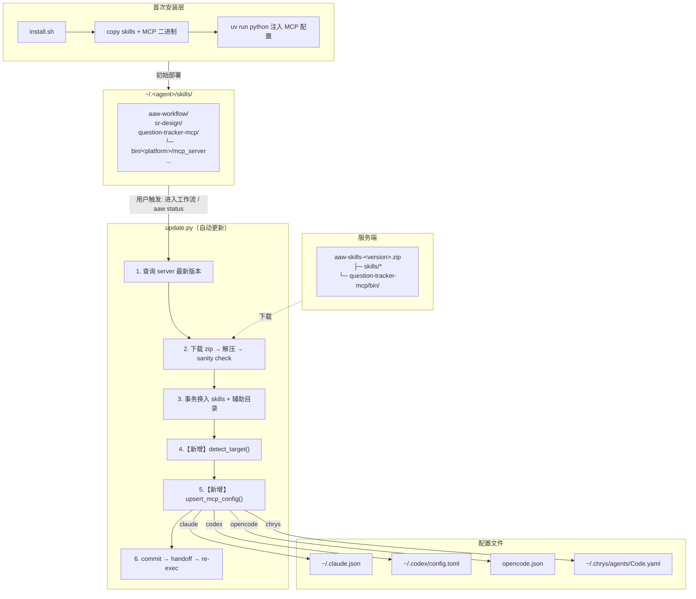
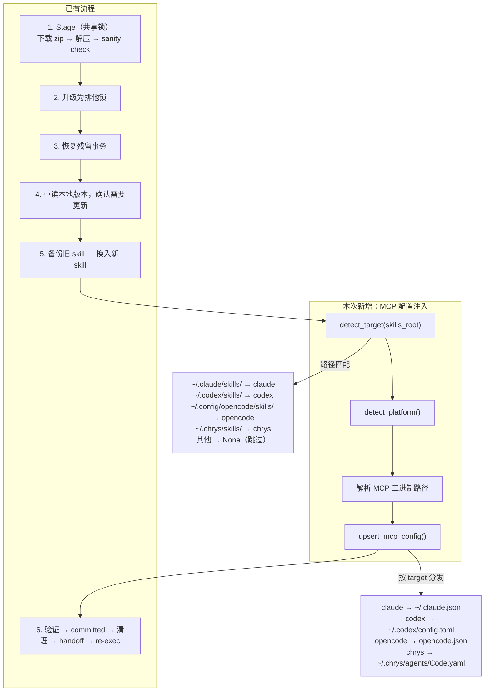
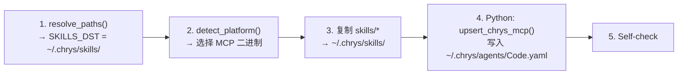
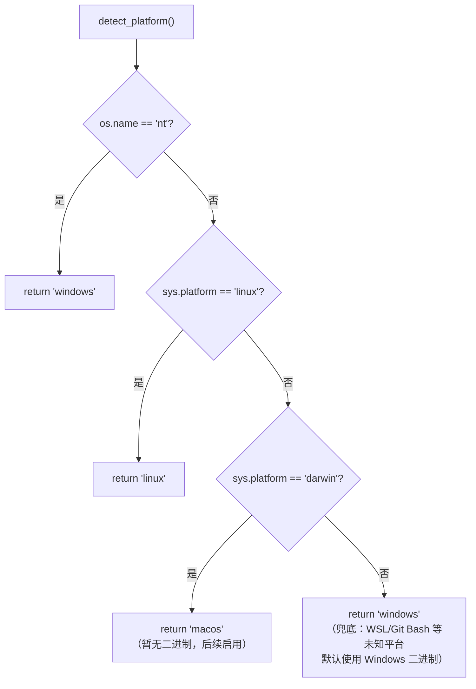
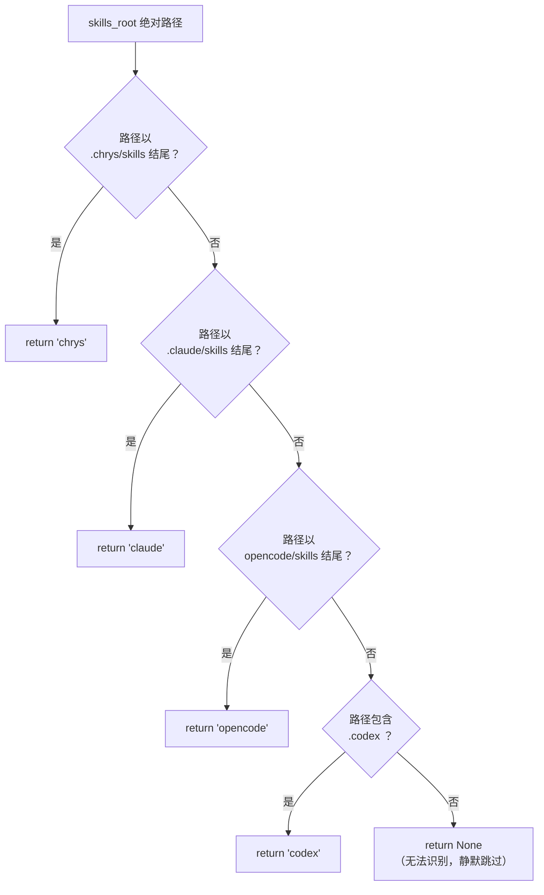
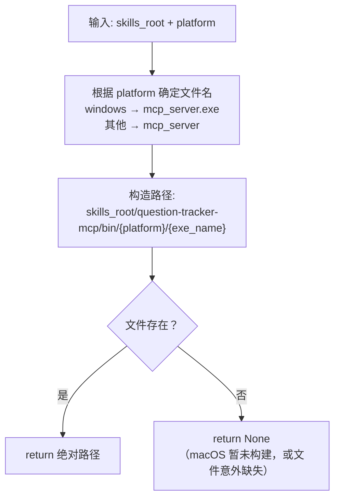
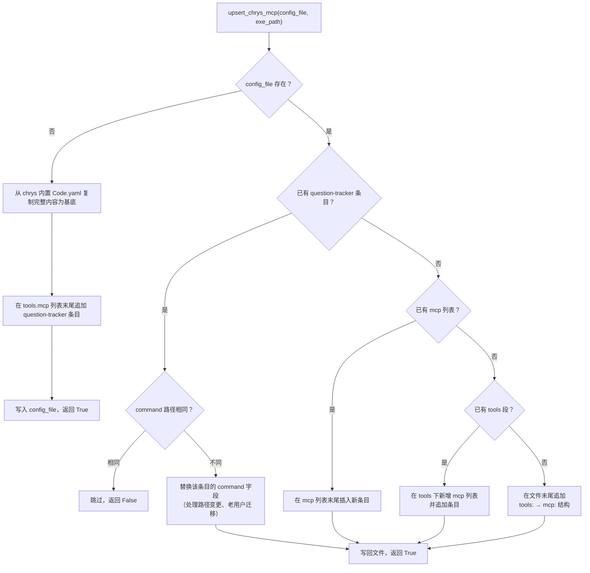
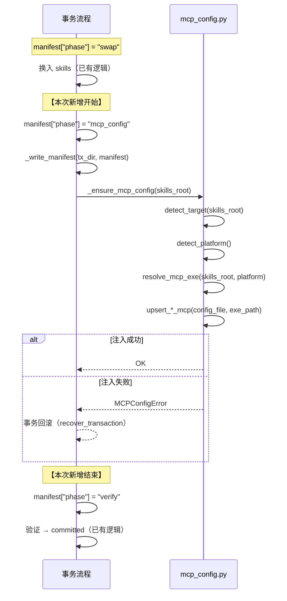
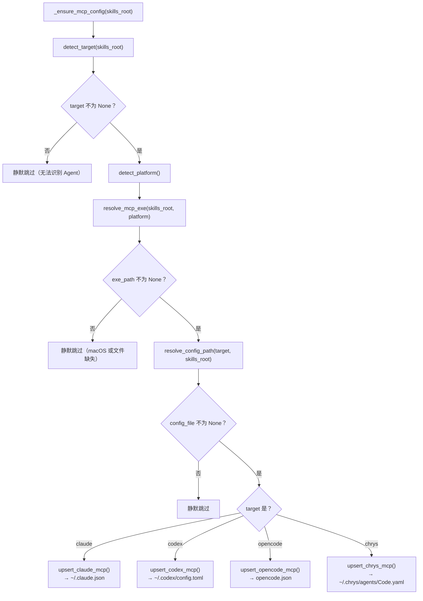

# 《AAW 自动更新 MCP exe 化与 Chrys 适配》功能设计说明书

| 文档版本 | V1.0 |
|---|---|
| 编写日期 | 2026-07-23 |
| 编写人 | sdfang |
| 审核人 | sdfang |
| 批准人 | sdfang |
| 文档状态 | 草稿 |

**修订记录**

| 版本 | 日期 | 修改人 | 修改说明 |
|---|---|---|---|
| V1.0 | 2026-07-23 | sdfang | 初稿 |

---

## 1. 引言

### 1.1 编写目的

本文档描述 AAW（Awesome-Agent-Workflow）自动更新流程中的两项核心改造：

1. **MCP 运行时 exe 化**：将 question-tracker MCP 服务器从 `uv run python` 切换为预编译 Go 可执行文件，消除 Python/uv/fastmcp 运行时依赖。
2. **新增 Chrys 适配**：自动更新时检测当前安装所属的 Agent 类型（claude / codex / opencode / chrys），并向对应的配置文件注入 MCP 注册信息。

**核心载体是 `update.py`（自动更新流程）**，`install.sh`（首次安装脚本）同步适配以保持一致性。

预期读者：开发人员、测试人员、审核人员。

### 1.2 项目背景

- 软件系统名称：Awesome-Agent-Workflow（AAW）
- 任务提出者：sdfang 
- 开发者：sdfang 
- 用户：AAW 的 Claude Code / OpenCode / Codex / Chrys 用户
- 与其他系统的关系：
  - `update.py` 是 AAW 的运行时自动更新引擎（每次 `aaw status` 触发）
  - `install.sh` 是 AAW 的首次安装引导脚本
  - question-tracker MCP 是 sr-design 技能的依赖组件
  - Go 二进制由 `skills/question-tracker-mcp/go/` 源码编译产出，存放于 `skills/question-tracker-mcp/bin/<platform>/`
  - Chrys 的 Agent 配置文件为 `~/.chrys/agents/Code.yaml`（YAML 格式，shadow profile 覆盖内置 Code agent）

### 1.3 术语与缩略语

| 术语/缩略语 | 定义 |
|---|---|
| AAW | Awesome-Agent-Workflow |
| MCP | Model Context Protocol，模型上下文协议 |
| Agent | 指 Claude Code / OpenCode / Codex / Chrys 等 AI 编码助手宿主 |
| skills_root | skills 安装根目录，由 `aaw.py` 通过 `__file__` 自定位（`parents[2]`） |
| target | Agent 类型标识（claude / codex / opencode / chrys），运行时从 skills_root 路径推断 |
| exe 化 | 将 MCP 服务器从 Python 脚本切换为预编译 Go 可执行文件 |
| upsert | 插入或更新：配置项不存在则新增，存在则更新 |
| shadow profile | Chrys 的用户级 agent 配置，存放在 `~/.chrys/agents/`，覆盖同名的内置 profile |
| handoff | 自动更新成功后，旧进程通过文件交接将控制权转交给新版本 CLI 的进程 |

### 1.4 参考资料

| 序号 | 文档名称 | 版本 | 来源 |
|---|---|---|---|
| 1 | auto-update-design.md | — | AAW docs/ |
| 2 | mcp-exe-auto-update-design.md | V1.0 | AAW docs/ |
| 3 | install.sh 源码 | 当前 | AAW 仓库根目录 |
| 4 | update.py 源码 | 当前 | skills/aaw-workflow/scripts/cli/update.py |
| 5 | make_release.py 源码 | 当前 | scripts/make_release.py |
| 6 | Chrys AGENTS.md | 0.16.0 | chrys 仓库 |
| 7 | Chrys MCPServerConfig schema | 0.16.0 | chrys/.../profiles/agents/schema.py |
| 8 | question-tracker-mcp Go 实现 | 当前 | skills/question-tracker-mcp/go/ |

---

## 2. 总体设计

### 2.1 设计目标

| 编号 | 目标 | 说明 |
|------|------|------|
| G1 | 消除 Python 运行时依赖 | MCP 服务器以 Go 可执行文件分发，用户不再需要安装 Python / uv / fastmcp |
| G2 | 自动更新中注入 MCP 配置 | 每次 `aaw status` 触发的自动更新（或 `aaw update` 手动更新）时，向 Agent 配置文件写入/更新 question-tracker 的 MCP 注册 |
| G3 | 自动检测 Agent 类型 | 从 `skills_root` 路径推断当前安装属于哪个 Agent（claude / codex / opencode / chrys），无需用户传参 |
| G4 | 四个 Agent 统一走 Go exe | claude、codex、opencode、chrys 全部使用 Go 二进制，不再使用 `uv run python` |
| G5 | 老用户无缝迁移 | 已通过 install.sh 安装的老用户（MCP 配置为 `uv run python`），下次自动更新时自动切换到 Go exe 配置 |
| G6 | install.sh 同步适配 | install.sh 新增 `--target=chrys`，内部复用的 MCP 配置注入逻辑与 update.py 保持一致 |
| G7 | 幂等性 | 重复执行自动更新不会产生重复 MCP 配置条目 |
| G8 | MCP 二进制随 zip 分发 | 将 question-tracker-mcp/bin/ 打包进 `aaw-skills-*.zip`，自动更新时与 skills 一并替换 |

### 2.2 设计原则与约束

- **最小侵入**：MCP 配置注入在 update.py 的事务换入完成后、committed 之前执行（与 skills 替换在同一事务边界内），注入失败触发整体回滚
- **路径自适应**：不需要用户告知当前是哪个 Agent，从 skills_root 路径直接推断
- **单一职责**：MCP 配置注入逻辑封装为独立模块，install.sh 和 update.py 共享同一实现
- **技术约束**：
  - update.py 是 Python 3.10+ 进程，已有 `yaml`（PyYAML）依赖，可直接处理 JSON/TOML
  - **Chrys YAML 使用纯文本 upsert**：在 Code.yaml 中找到 `tools:` / `mcp:` 段做局部修改，不重写整个文件，避免引入 ruamel.yaml 依赖、保留用户注释和格式
  - Go 二进制零外部依赖，静态编译，大小约 3MB/平台
  - install.sh 保留 `uv run python` 用于 MCP 配置注入（一次性脚本运行，用完即走），MCP 服务器本身不再依赖 Python/uv/fastmcp

### 2.3 总体架构设计



**分层说明：**

- **首次安装层**（install.sh）：负责初始文件部署（skills + MCP 二进制），并调用共享的 MCP 配置注入模块
- **运行时更新层**（update.py）：每次 `aaw status` 自动触发，负责 skills 版本更新 + MCP 配置维护
- **共享逻辑层**（`mcp_config.py`，新增）：封装 platform 检测、Agent target 检测、各 Agent 的 MCP 配置读写

### 2.4 功能结构

| 模块编号 | 模块名称 | 功能概述 | 优先级 |
|---|---|---|---|
| M01 | 平台检测 | `detect_platform()` 返回 `windows`/`linux`/`macos`/`unknown` | 高 |
| M02 | Agent 类型检测 | `detect_target(skills_root)` 从路径推断 claude/codex/opencode/chrys | 高 |
| M03 | MCP 二进制路径解析 | 根据 platform 和 skills_root 计算 MCP exe 的绝对路径 | 高 |
| M04 | MCP 配置注入 — Claude | `upsert_claude_mcp(config_file, exe_path)` 读写 `~/.claude.json` | 高 |
| M05 | MCP 配置注入 — Codex | `upsert_codex_mcp(config_file, exe_path)` 读写 `~/.codex/config.toml` | 高 |
| M06 | MCP 配置注入 — OpenCode | `upsert_opencode_mcp(config_file, exe_path)` 读写 `opencode.json` | 高 |
| M07 | MCP 配置注入 — Chrys | `upsert_chrys_mcp(config_file, exe_path)` 读写 `~/.chrys/agents/Code.yaml` | 高 |
| M08 | update.py 集成 | 在 `_perform_update()` 事务中调用 MCP 配置注入 | 高 |
| M09 | install.sh 适配 | 新增 `--target=chrys`，MCP 注入改用 exe 路径 | 高 |
| M10 | 老用户迁移 | 自动检测配置中是否为 `uv run python` 格式，若是则替换为 Go exe | 高 |
| M11 | 测试框架 | roundtrip 测试 + Agent 自动检测测试 + 老用户迁移测试 | 中 |
| M12 | 打包脚本适配 | make_release.py 将 question-tracker-mcp/bin/ 打入 `aaw-skills-*.zip` | 高 |

### 2.5 处理流程

#### 2.5.1 自动更新主流程（update.py `_perform_update` 内）



#### 2.5.2 install.sh 流程（Chrys target 新增）



### 2.6 运行环境

| 类别 | 配置要求 |
|---|---|
| 操作系统 | Linux、Windows（Git Bash / WSL）、macOS |
| Python | 3.10+（update.py 运行环境，已有 PyYAML 依赖） |
| Go 二进制 | 静态编译，零外部依赖 |
| 网络环境 | update.py 需要访问 telemetry-server（已有）；install.sh 无网络依赖 |

### 2.7 Agent 类型检测规则

Agent 类型从 `skills_root` 路径推断：

| skills_root 路径模式 | Agent 类型 | 配置文件路径 |
|---|---|---|
| `~/.claude/skills/` | `claude` | `~/.claude.json` |
| `~/.codex/skills/` 或 `~/.codex/` | `codex` | `~/.codex/config.toml` |
| `~/.config/opencode/skills/` | `opencode` | `~/.config/opencode/opencode.json` |
| `~/.chrys/skills/` | `chrys` | `~/.chrys/agents/Code.yaml` |
| `%APPDATA%/chrys/skills/` (Windows) | `chrys` | `%APPDATA%/chrys/agents/Code.yaml` |
| `<project>/.claude/skills/` | `claude` (project) | `~/.claude.json` (project scope under `projects.<cwd>`) |
| `<project>/.opencode/skills/` | `opencode` (project) | `<project>/opencode.json` |
| `<project>/.codex/skills/` | `codex` (project) | `<project>/.codex/config.toml` |
| 无法匹配 | `None` | 跳过 MCP 注入 |

**检测优先级**：先精确匹配路径特征（chrys → claude → opencode → codex），未匹配返回 None。

### 2.8 尚未解决的问题

1. **macOS 二进制**：Go 交叉编译 macOS 目标（`GOOS=darwin`）可在 CI 中实现，但不属于本次改造范围。macOS 用户暂时无法使用 MCP exe 模式，自动更新时静默跳过 MCP 注入，不影响 skills 更新

### 2.9 决策记录

| 编号 | 问题 | 决策 | 理由 |
|------|------|------|------|
| D4 | Chrys shadow profile 创建方式 | 复制 chrys 内置 Code.yaml 作为基底，追加 MCP 条目后写入 `~/.chrys/agents/Code.yaml` | Chrys 的 profile 加载是「完全替换」而非「深度合并」。创建最简 YAML 会丢弃内置的 instructions、tools.builtins、sub_agents 等配置 |
| D5 | install.sh 对 Python 的依赖 | 保留 `uv run python` 用于 MCP 配置注入 | MCP 服务器本身已消除 Python 依赖（核心收益）；install.sh 的 Python 依赖仅一次性脚本运行，改造成本最低 |
| D6 | MCP 二进制更新策略 | 将 `question-tracker-mcp/bin/` 打包进 `aaw-skills-*.zip`，随自动更新一并替换 | Go 二进制仅约 3MB，对 zip 大小影响可接受；用户无需手动操作，MCP 变更自动分发 |
| D8 | Chrys YAML 写入方式 | 纯文本 upsert，正则定位 `tools.mcp` 段做局部修改 | 不引入 ruamel.yaml 依赖；保留用户注释和原有格式；改动范围最小 |
| D7 | 项目级 Chrys MCP 配置 | 不需要特殊处理。`detect_target(skills_root)` + `resolve_config_path()` 已从路径自动推断，MCP 统一写入 `~/.chrys/agents/Code.yaml`（默认 Code Agent） | 与自动更新的自定位机制一致，无需用户告知 scope |
| D9 | Codex MCP 二进制路径 | 同其他 Agent：`skills_root/question-tracker-mcp/bin/<platform>/`。若 marketplace 安装不带二进制，D6 的 zip 分发自动补全 | 与所有 target 共享同一套路径解析逻辑 |
| D10 | Agent 检测冲突 | 采用路径后缀精确匹配（`.chrys/skills`、`.claude/skills` 等），不做模糊包含匹配。`my.chrys.test/skills/` 等非标准路径不会误匹配 | 用户自定义路径不在已知模式内，返回 None 静默跳过 |

---

## 3. 功能模块设计

### 3.1 模块 M01：平台检测

#### 3.1.1 功能描述

根据 `platform.system()` 或 `os.name` 返回值判定当前平台，用于选择正确的 MCP 二进制文件。

| 平台常量 | 判定规则 | 二进制文件名 |
|----------|---------|------------|
| `windows` | `os.name == "nt"` | `mcp_server.exe` |
| `linux` | `sys.platform == "linux"` | `mcp_server` |
| `macos` | `sys.platform == "darwin"` | `mcp_server`（暂未构建，文件不存在时跳过 MCP 注入） |
| 未知（兜底） | 以上均不匹配 | `mcp_server.exe`（默认使用 Windows 二进制，WSL/Git Bash 兼容） |

> 注：update.py 是 Python 进程，使用 `os.name` / `sys.platform` 检测平台，比 bash 的 `uname -s` 更可靠。install.sh 仍使用 `uname -s`。

#### 3.1.2 输入 / 输出

| 类型 | 名称 | 数据类型 | 约束条件 | 说明 |
|---|---|---|---|---|
| 输入 | —（无参数，读系统信息） | — | — | — |
| 输出 | `platform` | `str` | 必定返回 `"windows"` / `"linux"` / `"macos"` 之一 | 标准化平台标识，未知平台默认返回 `"windows"` |

#### 3.1.3 处理流程



#### 3.1.4 兜底策略

当平台检测无法匹配任何已知平台时（`sys.platform` 既不是 `linux`、`darwin` 也不是 `nt`），**默认返回 `"windows"`**。

**设计理由**：
- 未知平台大概率是 Windows 子系统（WSL、Git Bash、MSYS2）或类 Unix 环境，这些环境通常兼容 Windows 可执行文件（`.exe`）
- 真实的 Windows 环境已被 `os.name == "nt"` 精确捕获，兜底分支主要处理虚拟化/模拟环境
- 返回 `None` 会导致 MCP 注入静默跳过，用户无法使用 question-tracker；返回一个可用的二进制比什么都不做更好
- `mcp_server.exe` 是静态编译的 Go 二进制，在 Wine、WSL 等环境下也能运行

### 3.2 模块 M02：Agent 类型检测

#### 3.2.1 功能描述

从 `skills_root` 的绝对路径推断当前安装属于哪个 Agent。核心逻辑：将 `skills_root` 通过 `os.path.abspath` 词法化后（不解析 symlink），与各 Agent 的已知路径模式按优先级逐项匹配。

#### 3.2.2 输入 / 输出

| 类型 | 名称 | 数据类型 | 约束条件 | 说明 |
|---|---|---|---|---|
| 输入 | `skills_root` | `Path` | 已词法化的绝对路径 | update.py 传入 `install_paths()` 返回的 skills_root |
| 输出 | `target` | `str \| None` | `"claude"` / `"codex"` / `"opencode"` / `"chrys"` / `None` | None 表示无法确定 Agent，跳过 MCP 注入 |

#### 3.2.3 检测流程



#### 3.2.4 匹配规则

| 优先级 | Agent | 匹配条件 | 示例路径 |
|--------|-------|----------|----------|
| 1 | chrys | 路径以 `/.chrys/skills` 或 `/chrys/skills` 结尾 | `~/.chrys/skills`, `%APPDATA%/chrys/skills` |
| 2 | claude | 路径以 `/.claude/skills` 结尾 | `~/.claude/skills`, `<cwd>/.claude/skills` |
| 3 | opencode | 路径以 `/opencode/skills` 结尾 | `~/.config/opencode/skills`, `<cwd>/.opencode/skills` |
| 4 | codex | 路径包含 `/.codex` | `~/.codex/skills`, `~/.codex/` |
| — | 未知 | 以上均不匹配 | 返回 None，静默跳过 MCP 注入 |

> 注：Chrys 的 Windows 路径为 `%APPDATA%/chrys/skills`（如 `C:/Users/xxx/AppData/Roaming/chrys/skills`），不含 `.chrys` 中的点号。因此同时匹配 `/.chrys/skills` 和 `/chrys/skills` 两种模式。

#### 3.2.5 配置文件路径解析

根据 `target` 和 `skills_root` 确定 Agent 配置文件路径：

| target | 配置文件路径 | 说明 |
|--------|-------------|------|
| `claude` | `~/.claude.json` | 用户级；项目级通过 `projects.<cwd>` 键区分 |
| `codex` | `{codex_root}/config.toml` | codex_root 由 skills_root 反推（`skills_root.parent`） |
| `opencode` | `{skills_root.parent}/opencode.json` | 与 skills/ 同级目录 |
| `chrys` | `~/.chrys/agents/Code.yaml`（Unix）；`%APPDATA%/chrys/agents/Code.yaml`（Windows） | 仅操作默认 Code Agent，不碰用户自定义 Agent |
| `None` | — | 不操作任何配置文件 |

---

### 3.3 模块 M03：MCP 二进制路径解析

#### 3.3.1 功能描述

根据 `platform` 和 `skills_root` 计算 MCP 可执行文件的绝对路径。

#### 3.3.2 输入 / 输出

| 类型 | 名称 | 数据类型 | 约束条件 | 说明 |
|---|---|---|---|---|
| 输入 | `skills_root` | `Path` | 已词法化 | skills 根目录 |
| 输入 | `platform` | `str` | M01 的输出，必定为 `"windows"` / `"linux"` / `"macos"` | 平台标识 |
| 输出 | `exe_path` | `Path \| None` | 文件存在则返回路径 | MCP 二进制绝对路径；macOS 暂未构建或文件缺失时返回 None |

#### 3.3.3 平台-二进制映射

| 平台标识 | 二进制文件名 | 相对路径（相对于 skills_root） |
|---------|------------|---------------------------|
| `linux` | `mcp_server` | `question-tracker-mcp/bin/linux/mcp_server` |
| `windows` | `mcp_server.exe` | `question-tracker-mcp/bin/windows/mcp_server.exe` |
| `macos` | `mcp_server` | `question-tracker-mcp/bin/darwin/mcp_server`（待构建） |
| `None` | — | 无可用二进制 |

#### 3.3.4 处理流程



---

### 3.4 模块 M07：Chrys MCP 配置注入

#### 3.4.1 功能描述

向 `~/.chrys/agents/Code.yaml` 的 `tools.mcp` 段注入或更新 question-tracker MCP 服务器配置。这是四个 Agent 中唯一使用 YAML 格式的，因此单独设计。

#### 3.4.2 输入 / 输出

| 类型 | 名称 | 数据类型 | 约束条件 | 说明 |
|---|---|---|---|---|
| 输入 | `config_file` | `Path` | `~/.chrys/agents/Code.yaml` | 目标 YAML 文件 |
| 输入 | `exe_path` | `Path` | 绝对路径，文件存在 | MCP 可执行文件绝对路径 |
| 输出 | 写入后的 `config_file` | YAML 文件 | 包含 question-tracker 的 `tools.mcp` 条目 | — |

#### 3.4.3 生成的目标 YAML 片段

```yaml
# ~/.chrys/agents/Code.yaml（仅展示 tools.mcp 段，其余用户配置保留不动）
tools:
  mcp:
    - name: question-tracker
      transport: stdio
      command: /home/user/.chrys/skills/question-tracker-mcp/bin/linux/mcp_server
      args: []
      enabled: true
```

#### 3.4.4 业务规则

1. **文件不存在**：从 chrys 内置 `Code.yaml` 复制完整内容作为基底（保留所有 instructions、tools.builtins、sub_agents、approval、compaction 等字段），追加 question-tracker 到 `tools.mcp` 段。Chrys 的 profile 加载是「完全替换」而非「深度合并」，不能创建最简 YAML
2. **文件存在但无 `tools` 键**：在 YAML 末尾追加 `tools:` → `mcp:` 结构
3. **文件存在且有 `tools` 但无 `mcp`**：在 `tools:` 段后追加 `mcp:` 列表
4. **文件存在且有 `tools.mcp` 但无 question-tracker**：在 `mcp:` 列表末尾追加条目
5. **文件存在且有 question-tracker 条目**：更新 `command` 路径（处理 exe 路径变更、老用户 `uv run python` 迁移场景）
6. **纯文本 upsert**：使用逐行读取、正则定位的方式修改 YAML 文件，不重写整个文件，不引入 ruamel.yaml 依赖，保留用户注释和格式

#### 3.4.5 异常处理

| 异常场景 | 系统响应 | 提示信息 |
|---|---|---|
| Code.yaml 格式损坏 | 跳过，输出 warning | `[WARN] Code.yaml 格式异常，请手动配置 MCP` |
| 写入权限不足 | 报错退出 | `[ERROR] 无法写入 ~/.chrys/agents/Code.yaml` |
| question-tracker 已存在且 command 相同 | 跳过 | `[OK] question-tracker 已配置` |
| MCP 二进制文件不存在 | 跳过，输出 warning | `[WARN] 未找到当前平台的 MCP 二进制，跳过 MCP 注册` |

#### 3.4.6 处理流程



#### 3.4.7 纯文本 upsert 实现要点

| 操作 | 实现方式 | 说明 |
|------|----------|------|
| 定位 `tools:` 段 | 按行扫描，匹配 `tools:`（顶格或缩进） | 不确定缩进层级，依次尝试 0/2/4 空格 |
| 定位 `mcp:` 列表 | 在 `tools:` 段内查找 `mcp:` 键 | mcp 是 tools 的子键，缩进比 tools 多 2 空格 |
| 查找已有条目 | 按 YAML 列表项 `- name: question-tracker` 定位，找到后扫描到下一个 `- name:` 为止 | 条目边界由缩进和下一个列表项确定 |
| 新增条目 | 在 mcp 列表最后一个条目后追加，保持与前一列表项相同的缩进 | 追加后文件其余内容不变 |
| 替换条目 | 用新条目文本替换旧条目的行范围，其余内容不变 | 不重写整个文件，注释和其他配置完全保留 |

---

### 3.5 模块 M04—M06：Claude / Codex / OpenCode MCP 配置注入

三个模块逻辑相似，差异仅在于配置文件格式和数据结构。以下以 Claude 为例详述，Codex / OpenCode 仅列出差异。

#### 3.5.1 Claude MCP 配置注入

**配置文件**：`~/.claude.json`（JSON 格式）

**目标结构**：
```json
{
  "mcpServers": {
    "question-tracker": {
      "command": "/absolute/path/to/mcp_server[.exe]",
      "args": [],
      "env": {}
    }
  }
}
```

**用户级 vs 项目级**：
- 用户级（`skills_root` = `~/.claude/skills/`）：写入 `mcpServers["question-tracker"]`
- 项目级（`skills_root` = `<cwd>/.claude/skills/`）：写入 `projects["<cwd>"]["mcpServers"]["question-tracker"]`

**迁移逻辑**：若检测到当前 `command` 为 `"uv"` 且 `args` 含 `"python"` 和 `"fastmcp"`，自动替换为 Go exe 配置。

#### 3.5.2 Codex MCP 配置注入

**配置文件**：`~/.codex/config.toml`（TOML 格式）

**目标结构**：
```toml
[mcp_servers.question-tracker]
command = "/absolute/path/to/mcp_server[.exe]"
args = []
```

**处理方式**：正则匹配 `[mcp_servers.question-tracker]` 段，整段替换。

#### 3.5.3 OpenCode MCP 配置注入

**配置文件**：`opencode.json`（JSON 格式）

**目标结构**：
```json
{
  "mcp": {
    "question-tracker": {
      "type": "local",
      "command": ["/absolute/path/to/mcp_server[.exe]"],
      "enabled": true,
      "environment": {}
    }
  }
}
```

**注意**：OpenCode 的 `command` 字段是字符串数组，Go exe 无参数时为单元素数组。

---

### 3.6 模块 M08：update.py 集成

#### 3.6.1 功能描述

在 `_perform_update()` 事务流程中集成 MCP 配置注入。注入时机：skills 换入完成后、committed 之前。注入失败视为事务的一部分，触发整体回滚。

#### 3.6.2 集成位置（`_perform_update` 函数内）



#### 3.6.3 顶层入口函数



#### 3.6.4 异常处理

| 异常场景 | 系统响应 |
|---|---|
| target = None（无法识别 Agent） | 静默跳过，不阻断更新 |
| MCP 二进制不存在（macOS 或文件缺失） | 静默跳过（warning），不阻断更新 |
| 配置文件写入失败 | 抛出 UpdateError，触发事务回滚 |

> 设计理由：MCP 配置注入是增量功能——不应因为无法识别 Agent 或缺少二进制而阻断用户的 skills 更新。未知平台默认使用 Windows 二进制兜底，只有文件确实不存在时才跳过。

---

### 3.7 模块 M09：install.sh 适配

#### 3.7.1 功能描述

install.sh 新增 `--target=chrys` target，并将 MCP 配置注入从直接操作文件改为调用 update.py 共享的 Python 模块。

#### 3.7.2 变更内容

| 变更项 | 说明 |
|---|---|
| 新增 `chrys` target 校验 | `case "$TARGET" in claude\|codex\|opencode\|chrys)` |
| 新增 `chrys` 路径解析 | `resolve_paths()` 中新增 chrys 分支 |
| MCP 注入切到 exe | 将 `command: "uv"` + `args: ["run", ...]` 替换为 Go exe 路径（`command: "/path/to/mcp_server"`，`args: []`） |
| 保留 `uv run python` 用于配置注入 | MCP 服务器本身不再需要 Python，但 install.sh 中的配置写入脚本仍通过 `uv run python` 内嵌执行（一次性，用完即走） |

#### 3.7.3 Chrys 路径解析

`resolve_paths()` 中新增 chrys 分支，根据 scope 和平台确定安装路径：

| scope | 平台 | `SKILLS_DST` |
|-------|------|-------------|
| `user` | Unix | `$HOME/.chrys/skills` |
| `user` | Windows (Git Bash/WSL) | `$APPDATA/chrys/skills` |
| `project` | 通用 | `$PWD/.chrys/skills` |

> 注：Chrys 的 agent profile（Code.yaml）为 user 级，project scope 安装时 MCP 配置仍写入 `~/.chrys/agents/Code.yaml`。

#### 3.7.4 MCP 二进制选择

`detect_platform()` 使用 `uname -s` 判定平台，选择对应的二进制文件名。与 update.py 的 `detect_platform()` 保持相同的兜底策略：未知平台默认使用 Windows 二进制。

| 平台 | `uname -s` 匹配 | 二进制文件名 |
|------|----------------|------------|
| `linux` | `Linux*` | `mcp_server` |
| `macos` | `Darwin*` | `mcp_server` |
| `windows` | `MINGW*` / `CYGWIN*` / `MSYS*` | `mcp_server.exe` |
| 未知（兜底） | 以上均不匹配 | `mcp_server.exe` |

最终路径：`$SKILLS_DST/question-tracker-mcp/bin/$PLATFORM/$MCP_EXE_NAME`

#### 3.7.5 MCP 配置注入

install.sh 通过 `uv run python` 内嵌脚本向 Agent 配置文件写入 question-tracker 条目。各 Agent 的目标结构见 3.5（M04-M06）和 3.4（M07）。与旧版本的关键差异：

| 字段 | 旧值 | 新值 |
|------|------|------|
| `command` | `"uv"` | `/absolute/path/to/mcp_server` |
| `args` | `["run", "--with", "fastmcp", "python", "mcp_server.py"]` | `[]` |

---

### 3.8 模块 M10：老用户迁移

#### 3.8.1 功能描述

已通过旧版 `install.sh` 安装的用户，其 Agent 配置文件中 MCP 注册为 `uv run python` 格式。首次触发自动更新时，`upsert_*_mcp()` 函数自动检测并替换为 Go exe 格式。

#### 3.8.2 迁移检测规则

各 Agent 的 `upsert_*_mcp()` 函数在读取到 question-tracker 现有条目时，通过以下特征判断是否为旧的 `uv run python` 格式：

| Agent | 旧格式特征 | 检测方法 |
|-------|-----------|----------|
| claude | `command: "uv"` 且 `args` 包含 `"fastmcp"` 和 `"mcp_server.py"` | 检查 `entry["command"] == "uv"` 且 args 列表中包含特征字符串 |
| codex | 同上 | 同上（TOML 字段语义等价） |
| opencode | `command` 是数组，首元素为 `"uv"`，且数组字符串化后包含 `"fastmcp"` | 检查 `entry["command"][0] == "uv"` 且 `str(command)` 包含 `"fastmcp"` |
| chrys | `command: "uv"`，`args` 包含 `"fastmcp"` | 与 claude 相同的检测逻辑 |

**迁移行为**：检测到旧格式时，`upsert_*_mcp()` 内部走与「新增」相同的路径——用 Go exe 配置替换整个条目。迁移不在独立的步骤中执行，而是集成在 upsert 逻辑中。

#### 3.8.3 迁移策略

- 检测到旧格式 → 用 Go exe 配置替换（与新增逻辑相同）
- 检测到已是 Go exe 格式但路径不同 → 更新 `command` 路径
- 检测到已是 Go exe 格式且路径相同 → 跳过（幂等）
- 迁移不在独立的步骤中执行，而是集成在 upsert 逻辑中

---

### 3.9 模块 M12：打包脚本适配

#### 3.9.1 功能描述

修改 `make_release.py` 和 `release.yaml`，将 `question-tracker-mcp/bin/`（所有平台二进制）打包进 `aaw-skills-*.zip`。自动更新时，`update.py` 在事务换入阶段将二进制与 skills 一并部署。

#### 3.9.2 变更范围

| 文件 | 变更 |
|------|------|
| `scripts/release.yaml` | 新增 `auxiliary` 键，声明 `question-tracker-mcp` 为辅助目录 |
| `scripts/make_release.py` | `build_zip()` 读取 `auxiliary` 配置，将对应目录的 `bin/` 子目录打包进 zip；`verify_zip()` 校验辅助目录存在 |
| `release-manifest.json` | 新增 `auxiliary` 字段，列出辅助目录名称 |
| `update.py` | `_sanity_check()` 校验辅助目录中的二进制文件；事务换入时将辅助目录与 skills 一并部署 |

#### 3.9.3 release.yaml 变更

```yaml
# AAW 发布配置
external_skills: []
removed_skills: []
auxiliary:
  - question-tracker-mcp
```

#### 3.9.4 release-manifest.json 变更

```json
{
  "schema": 1,
  "version": "1.2.0",
  "skills": ["aaw-workflow", "..."],
  "external_skills": [],
  "removed_skills": [],
  "auxiliary": ["question-tracker-mcp"]
}
```

> 注：不修改 manifest schema 版本号。`external_skills` 和 `removed_skills` 默认均为 `[]`，按设计要点 §3.2 规则校验。向后兼容：旧版客户端解析到未知 `auxiliary` 键时忽略即可，不阻断更新。

#### 3.9.5 update.py 事务换入适配

辅助目录的处理方式与 skills 一致：换入前备份旧目录、换入 payload 中的新目录、换入失败时回滚。辅助目录的二进制文件不参与 SKILL.md 校验。

---

## 4. 接口设计

## 4. 接口设计

### 4.1 用户接口

**install.sh** 新增 chrys target：
```bash
./install.sh --target=chrys --user --copy
./install.sh --target=chrys --user --symlink
./install.sh --uninstall --target=chrys --user
```

**aaw update** 无新增参数，自动检测 Agent 并注入 MCP 配置：
```bash
aaw update           # 手动触发更新，自动检测 Agent
aaw status           # 进入 workflow 时自动检查更新 + MCP 配置
```

### 4.2 外部接口

| 接口编号 | 接口名称 | 对接系统 | 协议/方式 | 数据格式 | 说明 |
|---|---|---|---|---|---|
| IF-01 | MCP stdio | Chrys / Claude / Codex / OpenCode | JSON-RPC 2.0 over stdio | JSON | MCP 服务器标准协议，无变化 |
| IF-02 | Code.yaml 读写 | Chrys Agent Registry | 文件系统 | YAML | Chrys agent profile 读写 |
| IF-03 | telemetry-server release API | telemetry-server | HTTP | JSON | 查询最新版本 + 下载 zip，无变化 |

### 4.3 内部接口

| 接口名称 | 提供方 | 调用方 | 说明 |
|---|---|---|---|
| `detect_platform()` | M01 | update.py, install.sh | 返回当前平台标识 |
| `detect_target(skills_root)` | M02 | update.py | 从 skills_root 推断 Agent 类型 |
| `resolve_config_path(target, skills_root)` | M02 | update.py | 获取 Agent 配置文件路径 |
| `resolve_mcp_exe(skills_root, platform)` | M03 | update.py, install.sh | 获取 MCP 二进制路径 |
| `upsert_claude_mcp(config, exe, root)` | M04 | update.py, install.sh | Claude MCP 配置注入 |
| `upsert_codex_mcp(config, exe)` | M05 | update.py, install.sh | Codex MCP 配置注入 |
| `upsert_opencode_mcp(config, exe)` | M06 | update.py, install.sh | OpenCode MCP 配置注入 |
| `upsert_chrys_mcp(config, exe)` | M07 | update.py, install.sh | Chrys MCP 配置注入 |
| `_ensure_mcp_config(skills_root)` | M08 | update.py `_perform_update()` | 自动检测 + 调度各 upsert |

---

## 5. 数据设计

### 5.1 核心数据结构

**MCPServerConfig（概念模型）**：

| 数据项名称 | 类型 | 约束 | 说明 |
|---|---|---|---|
| name | string | `"question-tracker"` | MCP 服务器唯一名称 |
| transport | string | `"stdio"` | 传输协议 |
| command | string | 绝对路径 | Go 可执行文件路径 |
| args | list[string] | `[]` | 命令行参数（Go exe 无参数） |
| enabled | bool | `true` | 是否启用 |

不同 Agent 的序列化格式：

| Agent | 配置格式 | command 表示 |
|---|---|---|
| claude | JSON `mcpServers` | `"command": "/path/to/exe"`，`"args": []` |
| codex | TOML `[mcp_servers]` | `command = "/path/to/exe"`，`args = []` |
| opencode | JSON `mcp` | `"command": ["/path/to/exe"]`（数组） |
| chrys | YAML `tools.mcp` | `command: /path/to/exe`，`args: []` |

### 5.2 平台-二进制映射表

| 平台标识 | 二进制文件名 | 相对路径（相对于 skills_root） |
|---------|------------|---------------------------|
| `linux` | `mcp_server` | `question-tracker-mcp/bin/linux/mcp_server` |
| `windows` | `mcp_server.exe` | `question-tracker-mcp/bin/windows/mcp_server.exe` |
| `macos` | `mcp_server` | `question-tracker-mcp/bin/darwin/mcp_server`（待构建） |

---

## 6. 运行设计

### 6.1 运行模块组合

| 运行模式 | 涉及模块 | 说明 |
|---|---|---|
| aaw status 自动更新 | M01 + M02 + M03 + M04/M05/M06/M07 + M08 | 完整自动检测 + 更新 + MCP 注入流程 |
| aaw update 手动更新 | M01 + M02 + M03 + M04/M05/M06/M07 + M08 | 同自动更新，差异仅在失败处理 |
| install.sh 首次安装 | M01 + M03 + M04/M05/M06/M07/M09 | 首次部署 + MCP 注入 |

### 6.2 运行控制

- `update.py` 中 MCP 注入处于排他锁保护下，与 skills 事务换入在同一临界区
- MCP 注入失败时触发事务回滚：已换入的新 skills 被移出，旧 skills 从 backup 恢复
- 非 fatal 错误（无法识别 Agent、无可用二进制）静默跳过，不阻断 skills 更新

### 6.3 运行时间

- MCP 配置注入：< 0.1 秒（单次文件读写）
- 对自动更新的整体耗时无显著影响

---

## 7. 安全与可靠性设计

### 7.1 安全性设计

- MCP 配置注入仅操作用户目录下的 Agent 配置文件，不访问系统路径
- MCP 二进制以用户权限运行，不涉及提权
- 路径检测不解析 symlink（避免写入被重定向的位置）
- 仅操作已知的 Agent 配置文件路径，不根据用户输入动态构造路径

### 7.2 出错处理设计

#### 7.2.1 出错信息

| 错误/故障情况 | 系统输出信息 | 含义 | 处理方法 |
|---|---|---|---|
| 平台无对应二进制 | `[WARN] 未找到当前平台的 MCP 二进制，跳过 MCP 注册` | macOS 用户或二进制缺失 | 跳过 MCP 注入，skills 更新继续 |
| 无法识别 Agent | 无输出（静默） | skills_root 不匹配已知模式 | 跳过 MCP 注入，skills 更新继续 |
| Code.yaml 写入失败 | `[ERROR] 无法写入 ~/.chrys/agents/Code.yaml` | 权限不足或磁盘满 | 触发事务回滚 |
| MCP 二进制不可执行 | `[WARN] MCP 二进制无执行权限，跳过 MCP 注册` | 文件权限问题 | 跳过，并提示 `chmod +x` |

#### 7.2.2 补救措施

- MCP 注入在 committed 之前执行，失败时 skills 事务回滚，当前安装不受影响
- 重复执行 `aaw status`（或 `aaw update`）可修复不完整的 MCP 配置（幂等）
- 用户可手动编辑 Agent 配置文件来修复 MCP 注册

### 7.3 系统维护设计

- Go 二进制重新编译：
  ```bash
  cd skills/question-tracker-mcp/go
  GOOS=linux GOARCH=amd64 go build -o ../bin/linux/mcp_server .
  GOOS=windows GOARCH=amd64 go build -o ../bin/windows/mcp_server.exe .
  ```
- 新增 Agent target：在 `detect_target()` 中添加路径匹配模式 + 实现对应的 `upsert_*_mcp()` 函数
- 新增平台二进制：编译并放入 `bin/<platform>/`，更新 `detect_platform()` 的返回值

---

## 8. 黑盒测试

以下测试从用户视角出发，不依赖内部实现细节。所有测试在本地开发环境执行。

### 8.1 测试环境准备

```bash
# 1. 构建 Chrys（源码运行，无需安装）
cd chrys
uv build --wheel
# 验证 chrys 可启动:
uv run chrys --help

# 2. 编译 Go MCP 二进制（若 bin/ 下为空）
cd Awesome-Agent-Workflow/skills/question-tracker-mcp/go
GOOS=linux GOARCH=amd64 go build -o ../bin/linux/mcp_server .
GOOS=windows GOARCH=amd64 go build -o ../bin/windows/mcp_server.exe .

# 3. 确认 install.sh 可用
cd Awesome-Agent-Workflow
./install.sh --help
```

### 8.2 测试用例

#### TC01：Chrys 首次安装（user scope + copy）

| 步骤 | 操作 | 预期结果 |
|------|------|----------|
| 1 | `./install.sh --target=chrys --user --copy` | 正常退出，退出码 0 |
| 2 | 检查 `~/.chrys/skills/` | 存在 aaw-workflow、sr-design 等 skill 目录 |
| 3 | 检查二进制 | `~/.chrys/skills/question-tracker-mcp/bin/linux/mcp_server` 存在且可执行 |
| 4 | 检查 `~/.chrys/agents/Code.yaml` | 文件存在，包含 `name: Code`、`instructions`、`tools.builtins`、`tools.mcp` 等段 |
| 5 | 检查 `tools.mcp` 中 question-tracker | `command` 为绝对路径，指向步骤 3 的二进制；`transport: stdio`；`enabled: true` |
| 6 | 检查其他内置字段 | `sub_agents`、`approval`、`compaction` 等段与 chrys 内置 Code.yaml 一致，未被清空 |

#### TC02：Chrys 首次安装（user scope + symlink）

| 步骤 | 操作 | 预期结果 |
|------|------|----------|
| 1 | `./install.sh --target=chrys --user --symlink` | 正常退出 |
| 2 | `ls -l ~/.chrys/skills/aaw-workflow` | 符号链接指向仓库中的 skills/aaw-workflow/ |

#### TC03：幂等性 — 重复安装

| 步骤 | 操作 | 预期结果 |
|------|------|----------|
| 1 | 执行两次 `./install.sh --target=chrys --user --copy` | 两次均正常退出 |
| 2 | 检查 `~/.chrys/agents/Code.yaml` 的 `tools.mcp` | 只有一个 question-tracker 条目 |

#### TC04：卸载

| 步骤 | 操作 | 预期结果 |
|------|------|----------|
| 1 | `./install.sh --uninstall --target=chrys --user` | 正常退出 |
| 2 | 检查 `~/.chrys/skills/` | 已安装的 skill 目录被移除 |
| 3 | 检查 `~/.chrys/agents/Code.yaml` | question-tracker 条目被移除，其余配置保留 |

#### TC05：Agent 类型自动检测

| 步骤 | 操作 | 预期结果 |
|------|------|----------|
| 1 | 部署到 `~/.chrys/skills/` | `detect_target()` 返回 `"chrys"` |
| 2 | 部署到 `~/.claude/skills/` | `detect_target()` 返回 `"claude"` |
| 3 | 部署到 `~/.config/opencode/skills/` | `detect_target()` 返回 `"opencode"` |
| 4 | 部署到 `~/.codex/skills/` | `detect_target()` 返回 `"codex"` |
| 5 | 部署到 `/tmp/unknown/skills/` | `detect_target()` 返回 `None`，MCP 注入静默跳过 |

#### TC06：老用户 MCP 配置迁移

| 步骤 | 操作 | 预期结果 |
|------|------|----------|
| 1 | 手动修改 `~/.claude.json`，将 question-tracker 的 `command` 设为 `"uv"`，`args` 设为 `["run", "--with", "fastmcp", "python", "mcp_server.py"]` | 模拟旧版安装 |
| 2 | 触发 MCP 配置注入（`aaw update` 或首次 `aaw status`） | 正常执行 |
| 3 | 检查 `~/.claude.json` 中 question-tracker | `command` 变为 Go exe 绝对路径，`args` 变为 `[]` |

#### TC07：自动更新后 MCP 配置保持一致

| 步骤 | 操作 | 预期结果 |
|------|------|----------|
| 1 | 首次安装：`./install.sh --target=chrys --user --copy` | 正常退出 |
| 2 | 记录 `~/.chrys/agents/Code.yaml` 中 question-tracker 的 `command` 路径 | 备用 |
| 3 | 修改本地 VERSION 为较低版本号，触发自动更新 | `aaw status` 走完更新流程 |
| 4 | 检查 `~/.chrys/agents/Code.yaml` | question-tracker 条目仍存在，`command` 指向更新后的二进制路径（路径不变则值不变） |

#### TC08：Chrys 运行时 MCP 连接

| 步骤 | 操作 | 预期结果 |
|------|------|----------|
| 1 | 完成 TC01 安装 | — |
| 2 | `uv run chrys` 启动 Chrys TUI | Code Agent 正常显示 |
| 3 | 在 Chrys 中输入"进入工作流"（触发 sr-design skill） | AAW workflow 正常启动 |
| 4 | 检查 Chrys 的 MCP 工具列表 | question-tracker 的 MCP 工具可见（如 `create_question`、`resolve_question` 等） |

#### TC09：不需要 Python/uv 运行 MCP 服务器

| 步骤 | 操作 | 预期结果 |
|------|------|----------|
| 1 | 完成 TC01 安装 | — |
| 2 | 直接运行 MCP 二进制：`~/.chrys/skills/question-tracker-mcp/bin/linux/mcp_server` | 进程启动，监听 stdio |
| 3 | 卸载 uv：`pip uninstall uv`（或临时移除 PATH） | — |
| 4 | 启动 Chrys 并触发 workflow | MCP 服务器正常工作（Go exe 不依赖 uv/Python） |

#### TC10：Windows 平台（Git Bash / WSL）

| 步骤 | 操作 | 预期结果 |
|------|------|----------|
| 1 | 在 Git Bash 中执行 `./install.sh --target=chrys --user --copy` | 正常退出 |
| 2 | 检查 `%APPDATA%/chrys/skills/` | skills 部署到 Windows 路径 |
| 3 | 检查 `%APPDATA%/chrys/agents/Code.yaml` | MCP 配置写入 Windows 路径 |
| 4 | 检查二进制 | `mcp_server.exe` 存在 |

#### TC11：未知平台兜底

| 步骤 | 操作 | 预期结果 |
|------|------|----------|
| 1 | 模拟未知平台（临时修改 `detect_platform()` 使所有已知分支不命中） | — |
| 2 | 执行安装或更新 | 使用 `mcp_server.exe`（Windows 二进制）兜底 |

### 8.3 测试数据

| 测试数据 | 用途 | 位置 |
|----------|------|------|
| Chrys 内置 Code.yaml | TC01 对比基线 | `chrys/src/chrys/service/profiles/agents/builtins/Code.yaml` |
| 旧版 MCP 配置（claude） | TC06 迁移模拟 | 手动构造：`{"command": "uv", "args": ["run", "--with", "fastmcp", "python", ".../mcp_server.py"]}` |
| 旧版 MCP 配置（opencode） | TC06 迁移模拟 | 手动构造：`{"command": ["uv", "run", "--with", "fastmcp", "python", ".../mcp_server.py"]}` |
| 旧版 MCP 配置（chrys） | TC06 迁移模拟 | 手动构造：YAML 中 `command: uv`，`args: ["run", "--with", "fastmcp", "python", ".../mcp_server.py"]` |

| 需求编号 | 需求名称 | 设计章节 | 状态 |
|---|---|---|---|
| G1 | 消除 Python 运行时依赖 | 3.5（M04-M06）、3.4（M07） | 已覆盖 |
| G2 | 自动更新中注入 MCP 配置 | 3.6（M08） | 已覆盖 |
| G3 | 自动检测 Agent 类型 | 3.2（M02） | 已覆盖 |
| G4 | 四个 Agent 统一走 Go exe | 3.5、3.4 | 已覆盖 |
| G5 | 老用户无缝迁移 | 3.8（M10） | 已覆盖 |
| G6 | install.sh 同步适配 | 3.7（M09） | 已覆盖 |
| G7 | 幂等性 | 3.4.4、3.5 | 已覆盖 |
| G8 | MCP 二进制随 zip 分发 | 3.9（M12） | 已覆盖 |

---

## 9. 附录

### 9.1 提交划分建议

| # | 内容 | 主要文件 |
|---|---|---|
| 1 | 新增 `mcp_config.py`（共享 MCP 配置注入模块） | `skills/aaw-workflow/scripts/cli/mcp_config.py` |
| 2 | update.py 集成（`_ensure_mcp_config` 调用 + 事务编排 + 辅助目录换入） | `skills/aaw-workflow/scripts/cli/update.py` |
| 3 | 打包脚本适配（MCP 二进制打入 zip） | `scripts/release.yaml`、`scripts/make_release.py` |
| 4 | install.sh 适配（chrys target + exe 切换） | `install.sh` |
| 5 | 测试框架（各 Agent roundtrip + 老用户迁移） | `test/aaw_workflow/test_mcp_config.py` |
