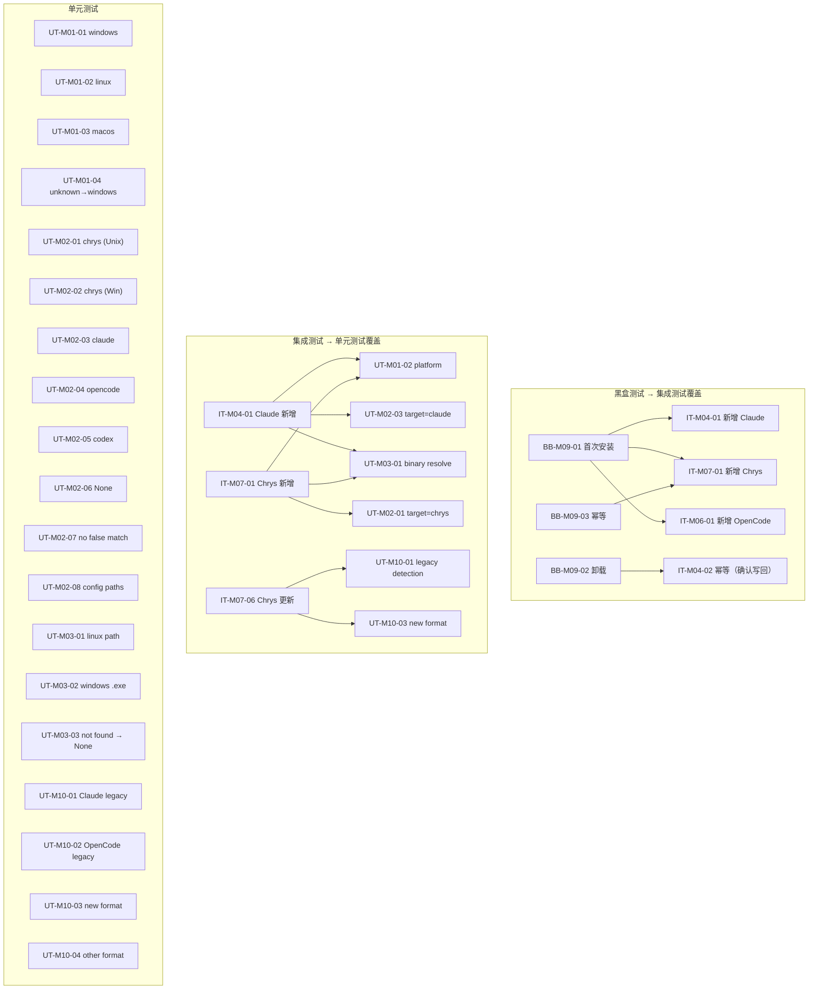

# 《AAW 自动更新 MCP exe 化与 Chrys 适配》测试设计说明书

| 文档版本 | V1.0 |
|---|---|
| 编写日期 | 2026-07-23 |
| 编写人 | sdfang1053 |
| 审核人 | |
| 批准人 | |
| 文档状态 | 草稿 |

**修订记录**

| 版本 | 日期 | 修改人 | 修改说明 |
|---|---|---|---|
| V1.0 | 2026-07-23 | sdfang1053 | 初稿 |

---

## 1. 测试环境

| 项目 | 要求 |
|------|------|
| 操作系统 | Linux（推荐）或 Windows（Git Bash / WSL） |
| Python | 3.10+ |
| 依赖 | pytest, pyyaml（AAW 已有依赖）；无需额外安装 |
| Go | 1.21+（编译测试用 MCP 二进制） |
| 测试数据目录 | 由 `tmp_path` fixture 创建临时目录 |
| 环境变量 | `AAW_TELEMETRY_ENDPOINT` 指向本地 fixture server；`HOME` 可被覆盖为临时目录 |

---

## 2. M01 平台检测

### 2.1 单元测试

#### UT-M01-01：detect_platform 返回 windows

- **测试场景**：`os.name == "nt"` 时返回 `"windows"`
- **前提条件**：mock `os.name = "nt"`
- **测试步骤**：调用 `detect_platform()`
- **预期结果**：返回 `"windows"`
- **断言**：
  ```
  assert detect_platform() == "windows"
  ```

#### UT-M01-02：detect_platform 返回 linux

- **测试场景**：`os.name == "posix"` 且 `sys.platform == "linux"` 时返回 `"linux"`
- **前提条件**：mock `os.name = "posix"`, `sys.platform = "linux"`
- **测试步骤**：调用 `detect_platform()`
- **预期结果**：返回 `"linux"`
- **断言**：
  ```
  assert detect_platform() == "linux"
  ```

#### UT-M01-03：detect_platform 返回 macos

- **测试场景**：`os.name == "posix"` 且 `sys.platform == "darwin"` 时返回 `"macos"`
- **前提条件**：mock `os.name = "posix"`, `sys.platform = "darwin"`
- **测试步骤**：调用 `detect_platform()`
- **预期结果**：返回 `"macos"`
- **断言**：
  ```
  assert detect_platform() == "macos"
  ```

#### UT-M01-04：未知平台兜底返回 windows

- **测试场景**：`os.name` 和 `sys.platform` 均不匹配任何已知平台时，兜底返回 `"windows"`
- **前提条件**：mock `os.name = "java"`, `sys.platform = "unknownos"`
- **测试步骤**：调用 `detect_platform()`
- **预期结果**：返回 `"windows"`
- **断言**：
  ```
  assert detect_platform() == "windows"
  ```

---

## 3. M02 Agent 类型检测 + M03 配置路径解析

### 3.1 单元测试

#### UT-M02-01：detect_target 返回 chrys（Unix 路径）

- **测试场景**：`skills_root` 为 `~/.chrys/skills/` 时返回 `"chrys"`
- **前提条件**：patch `Path.home()` 返回 `/home/testuser`
- **测试步骤**：`detect_target(Path("/home/testuser/.chrys/skills"))`
- **预期结果**：返回 `"chrys"`
- **断言**：
  ```
  assert detect_target(Path("/home/testuser/.chrys/skills")) == "chrys"
  ```

#### UT-M02-02：detect_target 返回 chrys（Windows 路径）

- **测试场景**：`skills_root` 为 `%APPDATA%/chrys/skills/` 时返回 `"chrys"`
- **前提条件**：patch `Path.home()` 返回 `C:/Users/testuser`
- **测试步骤**：`detect_target(Path("C:/Users/testuser/AppData/Roaming/chrys/skills"))`
- **预期结果**：返回 `"chrys"`（Windows 路径不含 `.chrys` 的点号）
- **断言**：
  ```
  assert detect_target(Path("C:/Users/testuser/AppData/Roaming/chrys/skills")) == "chrys"
  ```

#### UT-M02-03：detect_target 返回 claude

- **测试场景**：`skills_root` 为 `~/.claude/skills/` 时返回 `"claude"`
- **前提条件**：patch `Path.home()` 返回 `/home/testuser`
- **测试步骤**：`detect_target(Path("/home/testuser/.claude/skills"))`
- **预期结果**：返回 `"claude"`
- **断言**：
  ```
  assert detect_target(Path("/home/testuser/.claude/skills")) == "claude"
  ```

#### UT-M02-04：detect_target 返回 opencode

- **测试场景**：`skills_root` 为 `~/.config/opencode/skills/` 时返回 `"opencode"`
- **前提条件**：patch `Path.home()` 返回 `/home/testuser`
- **测试步骤**：`detect_target(Path("/home/testuser/.config/opencode/skills"))`
- **预期结果**：返回 `"opencode"`
- **断言**：
  ```
  assert detect_target(Path("/home/testuser/.config/opencode/skills")) == "opencode"
  ```

#### UT-M02-05：detect_target 返回 codex

- **测试场景**：`skills_root` 包含 `/.codex` 时返回 `"codex"`
- **前提条件**：无
- **测试步骤**：`detect_target(Path("/home/testuser/.codex/skills"))`
- **预期结果**：返回 `"codex"`
- **断言**：
  ```
  assert detect_target(Path("/home/testuser/.codex/skills")) == "codex"
  ```

#### UT-M02-06：detect_target 返回 None（无法识别）

- **测试场景**：`skills_root` 不匹配任何已知模式时返回 `None`
- **前提条件**：无
- **测试步骤**：`detect_target(Path("/tmp/random/skills"))`
- **预期结果**：返回 `None`
- **断言**：
  ```
  assert detect_target(Path("/tmp/random/skills")) is None
  ```

#### UT-M02-07：不误匹配包含关键词的路径

- **测试场景**：路径包含 `.chrys` 子串但不是标准路径，不应被误判
- **前提条件**：无
- **测试步骤**：`detect_target(Path("/home/testuser/my.chrys.test/skills"))`
- **预期结果**：返回 `None`（不是以 `/.chrys/skills` 结尾）
- **断言**：
  ```
  assert detect_target(Path("/home/testuser/my.chrys.test/skills")) is None
  ```

#### UT-M02-08：resolve_config_path 各 target 路径正确

- **测试场景**：每个 target 返回正确的配置文件路径
- **前提条件**：patch `Path.home()` 返回 `/home/testuser`
- **测试步骤**：
  1. `resolve_config_path("claude", any_path)`
  2. `resolve_config_path("codex", Path("/home/testuser/.codex/skills"))`
  3. `resolve_config_path("opencode", Path("/home/testuser/.config/opencode/skills"))`
  4. `resolve_config_path("chrys", any_path)`
- **预期结果**：
  1. `Path("/home/testuser/.claude.json")`
  2. `Path("/home/testuser/.codex/config.toml")`
  3. `Path("/home/testuser/.config/opencode/opencode.json")`
  4. `Path("/home/testuser/.chrys/agents/Code.yaml")`
- **断言**：
  ```
  assert resolve_config_path("claude", ...) == Path("/home/testuser/.claude.json")
  assert resolve_config_path("codex", ...) == Path("/home/testuser/.codex/config.toml")
  assert resolve_config_path("opencode", ...) == Path("/home/testuser/.config/opencode/opencode.json")
  assert resolve_config_path("chrys", ...) == Path("/home/testuser/.chrys/agents/Code.yaml")
  assert resolve_config_path("unknown", ...) is None
  ```

---

## 4. M03 MCP 二进制路径解析

### 4.1 单元测试

#### UT-M03-01：resolve_mcp_exe 返回正确路径（linux）

- **测试场景**：linux 平台且文件存在时返回正确路径
- **前提条件**：`tmp_path` 下创建 `question-tracker-mcp/bin/linux/mcp_server` 文件
- **测试步骤**：`resolve_mcp_exe(tmp_path, "linux")`
- **预期结果**：返回 `tmp_path / "question-tracker-mcp/bin/linux/mcp_server"`
- **断言**：
  ```
  exe_name = "mcp_server"
  expected = tmp_path / "question-tracker-mcp" / "bin" / "linux" / exe_name
  assert resolve_mcp_exe(tmp_path, "linux") == expected
  ```

#### UT-M03-02：resolve_mcp_exe 返回正确路径（windows）

- **测试场景**：windows 平台且文件存在时返回带 `.exe` 后缀的路径
- **前提条件**：`tmp_path` 下创建 `question-tracker-mcp/bin/windows/mcp_server.exe` 文件
- **测试步骤**：`resolve_mcp_exe(tmp_path, "windows")`
- **预期结果**：返回 `tmp_path / "question-tracker-mcp/bin/windows/mcp_server.exe"`
- **断言**：
  ```
  assert resolve_mcp_exe(tmp_path, "windows").name == "mcp_server.exe"
  ```

#### UT-M03-03：resolve_mcp_exe 文件不存在返回 None

- **测试场景**：文件不存在时返回 None
- **前提条件**：`tmp_path` 为空目录
- **测试步骤**：`resolve_mcp_exe(tmp_path, "linux")`
- **预期结果**：返回 `None`
- **断言**：
  ```
  assert resolve_mcp_exe(tmp_path, "linux") is None
  ```

#### UT-M03-04：resolve_mcp_exe macOS 暂未构建返回 None

- **测试场景**：macOS 平台无预编译二进制，返回 None
- **前提条件**：`tmp_path` 下存在 `question-tracker-mcp/bin/` 但无 `darwin/` 子目录
- **测试步骤**：`resolve_mcp_exe(tmp_path, "macos")`
- **预期结果**：返回 `None`（设计预期，后续启用交叉编译后此用例需更新）
- **断言**：
  ```
  assert resolve_mcp_exe(tmp_path, "macos") is None
  ```

---

## 5. M04 Claude MCP 配置注入

### 5.1 集成测试

#### IT-M04-01：新增 question-tracker 到空的 Claude 配置

- **测试场景**：`~/.claude.json` 为空文件时，新增 question-tracker 条目
- **前提条件**：`tmp_path/claude.json` 为 `{}`；`tmp_path/skills/question-tracker-mcp/bin/linux/mcp_server` 存在
- **测试步骤**：
  1. `upsert_claude_mcp(Path("tmp_path/claude.json"), Path("tmp_path/skills/.../mcp_server"), Path("/home/user/.claude/skills"))`
- **预期结果**：写入后的 `claude.json` 包含 `mcpServers.question-tracker`，`command` 为 exe 绝对路径，`args` 为 `[]`
- **断言**：
  ```
  data = json.loads(claude_json.read_text())
  mcp = data["mcpServers"]["question-tracker"]
  assert mcp["command"] == str(exe_path)
  assert mcp["args"] == []
  assert mcp["env"] == {}
  ```

#### IT-M04-02：重复安装不产生重复条目（幂等性）

- **测试场景**：已存在 question-tracker 且 command 相同时跳过
- **前提条件**：`claude.json` 已包含 question-tracker（command 为 exe_path）
- **测试步骤**：
  1. 第一次 `upsert_claude_mcp()` 返回 True
  2. 第二次 `upsert_claude_mcp()` 返回 False
- **预期结果**：第二次不修改文件，返回 False
- **断言**：
  ```
  assert upsert_claude_mcp(...) == False  # 第二次调用
  # mcpServers 中仍然只有一个 question-tracker
  ```

#### IT-M04-03：更新已有的 question-tracker（路径变更）

- **测试场景**：已存在 question-tracker 但 command 不同时更新
- **前提条件**：`claude.json` 已包含 question-tracker，`command` 为旧路径
- **测试步骤**：`upsert_claude_mcp()` 传入新 exe_path
- **预期结果**：`command` 更新为新路径，返回 True
- **断言**：
  ```
  assert upsert_claude_mcp(...) == True
  data = json.loads(claude_json.read_text())
  assert data["mcpServers"]["question-tracker"]["command"] == str(new_exe_path)
  ```

#### IT-M04-04：老用户迁移 — uv 格式替换为 Go exe

- **测试场景**：旧 uv run python 格式自动替换
- **前提条件**：`claude.json` 中 question-tracker 为 `{"command": "uv", "args": ["run", "--with", "fastmcp", "python", "/old/path/mcp_server.py"], "env": {}}`
- **测试步骤**：`upsert_claude_mcp()` 传入 Go exe_path
- **预期结果**：`command` 变为 Go exe 路径，`args` 变为 `[]`
- **断言**：
  ```
  data = json.loads(claude_json.read_text())
  mcp = data["mcpServers"]["question-tracker"]
  assert mcp["command"] == str(exe_path)
  assert mcp["args"] == []
  ```

#### IT-M04-05：project scope — 写入 projects 段

- **测试场景**：skills_root 不在 `~/.claude/skills/` 下时，写入 project scope
- **前提条件**：`skills_root` 为 `/some/project/.claude/skills`；patch `os.getcwd()` 返回 `/some/project`
- **测试步骤**：`upsert_claude_mcp()`
- **预期结果**：条目写入 `projects["/some/project"]["mcpServers"]["question-tracker"]`
- **断言**：
  ```
  data = json.loads(claude_json.read_text())
  proj_mcp = data["projects"]["/some/project"]["mcpServers"]["question-tracker"]
  assert proj_mcp["command"] == str(exe_path)
  ```

#### IT-M04-06：Claude 配置文件不存在 — 自动创建

- **测试场景**：`~/.claude.json` 文件不存在时，从空开始创建
- **前提条件**：`tmp_path/claude.json` 文件不存在；`tmp_path/skills/.../mcp_server` 存在
- **测试步骤**：`upsert_claude_mcp(Path("tmp_path/claude.json"), exe_path, Path("/home/user/.claude/skills"))`
- **预期结果**：创建文件，包含 `mcpServers.question-tracker`
- **断言**：
  ```
  assert claude_json.is_file()  # 文件被创建
  data = json.loads(claude_json.read_text())
  assert "mcpServers" in data
  assert data["mcpServers"]["question-tracker"]["command"] == str(exe_path)
  ```

#### IT-M04-07：Claude 已有其他 key 但无 mcpServers

- **测试场景**：配置文件存在且有其他顶级 key（如 `projects`），但没有 `mcpServers` 时正确新增
- **前提条件**：`claude.json` 内容为 `{"projects": {}, "theme": "dark"}`，无 `mcpServers`
- **测试步骤**：`upsert_claude_mcp()`
- **预期结果**：`mcpServers` 新增，已有 key 保留不变
- **断言**：
  ```
  data = json.loads(claude_json.read_text())
  assert data["theme"] == "dark"
  assert data["projects"] == {}
  assert data["mcpServers"]["question-tracker"]["command"] == str(exe_path)
  ```

---

## 6. M05 Codex MCP 配置注入

### 6.1 集成测试

#### IT-M05-01：新增 question-tracker 到 Codex TOML

- **测试场景**：空配置文件追加 `[mcp_servers.question-tracker]` 段
- **前提条件**：`tmp_path/config.toml` 不存在
- **测试步骤**：`upsert_codex_mcp(Path("tmp_path/config.toml"), exe_path)`
- **预期结果**：创建文件，包含正确的 TOML 段
- **断言**：
  ```
  content = config_toml.read_text()
  assert "[mcp_servers.question-tracker]" in content
  assert f'command = "{exe_path}"' in content
  assert "args = []" in content
  ```

#### IT-M05-02：已有其他 mcp_servers 不影响

- **测试场景**：已有其他 MCP 服务器段，追加后互不干扰
- **前提条件**：`config.toml` 已有 `[mcp_servers.other-server]` 段
- **测试步骤**：`upsert_codex_mcp()`
- **预期结果**：两个 `[mcp_servers]` 段共存，other-server 内容不变
- **断言**：
  ```
  content = config_toml.read_text()
  assert content.count("[mcp_servers.question-tracker]") == 1
  assert "[mcp_servers.other-server]" in content  # 未被修改
  ```

#### IT-M05-03：老用户迁移 — 替换旧 uv TOML 段

- **测试场景**：旧 uv 格式段被替换
- **前提条件**：`config.toml` 已有 `[mcp_servers.question-tracker]`，`command = "uv"`
- **测试步骤**：`upsert_codex_mcp()` 传入 Go exe_path
- **预期结果**：旧段被替换，command 变为 Go exe 路径
- **断言**：
  ```
  content = config_toml.read_text()
  assert "command = \"uv\"" not in content
  assert f'command = "{exe_path}"' in content
  ```

#### IT-M05-04：幂等性 — command 相同时跳过

- **测试场景**：已存在 question-tracker 且 command 路径相同时不修改
- **前提条件**：`config.toml` 已包含 `[mcp_servers.question-tracker]`，`command` 为 exe_path
- **测试步骤**：
  1. 第一次 `upsert_codex_mcp()` 返回 True
  2. 第二次 `upsert_codex_mcp()` 返回 False
- **预期结果**：第二次调用不修改文件，返回 False
- **断言**：
  ```
  assert upsert_codex_mcp(config_file, exe_path) == False
  # 文件内容与第一次写入后一致
  ```

#### IT-M05-05：已有 Go exe 但路径变更 — 更新 command

- **测试场景**：已配置 Go exe 但二进制路径发生变化时更新
- **前提条件**：`config.toml` 已包含 `[mcp_servers.question-tracker]`，`command = "/old/path/mcp_server"`
- **测试步骤**：`upsert_codex_mcp()` 传入新 exe_path（`/new/path/mcp_server`）
- **预期结果**：旧 command 被替换为新路径，其余字段不变
- **断言**：
  ```
  content = config_toml.read_text()
  assert 'command = "/new/path/mcp_server"' in content
  assert 'command = "/old/path/mcp_server"' not in content
  ```

---

## 7. M06 OpenCode MCP 配置注入

### 7.1 集成测试

#### IT-M06-01：新增 question-tracker 到 OpenCode JSON

- **测试场景**：空配置文件新增 MCP 条目
- **前提条件**：`tmp_path/opencode.json` 不存在
- **测试步骤**：`upsert_opencode_mcp(Path("tmp_path/opencode.json"), exe_path)`
- **预期结果**：创建文件，`command` 为单元素数组
- **断言**：
  ```
  data = json.loads(opencode_json.read_text())
  mcp = data["mcp"]["question-tracker"]
  assert mcp["command"] == [str(exe_path)]
  assert mcp["type"] == "local"
  assert mcp["enabled"] == True
  ```

#### IT-M06-02：幂等性

- **测试场景**：command 相同时跳过
- **前提条件**：已存在 question-tracker，`command[0]` 为 exe_path
- **测试步骤**：再次调用 `upsert_opencode_mcp()`
- **预期结果**：返回 False，文件不变
- **断言**：
  ```
  assert upsert_opencode_mcp(...) == False
  ```

#### IT-M06-03：老用户迁移 — uv 数组格式

- **测试场景**：command 为 `["uv", "run", ..., "mcp_server.py"]` 替换为 Go exe
- **前提条件**：opencode.json 中 question-tracker 的 command 为旧格式数组
- **测试步骤**：`upsert_opencode_mcp()` 传入 Go exe_path
- **预期结果**：`command` 变为 `[exe_path]`
- **断言**：
  ```
  data = json.loads(opencode_json.read_text())
  assert data["mcp"]["question-tracker"]["command"] == [str(exe_path)]
  ```

#### IT-M06-04：已有其他 MCP 条目不受影响

- **测试场景**：追加 question-tracker 时，`mcp` 中的其他服务器条目不被破坏
- **前提条件**：`opencode.json` 的 `mcp` 中已有 `other-server` 条目
- **测试步骤**：`upsert_opencode_mcp()`
- **预期结果**：`mcp.other-server` 原样保留，`mcp.question-tracker` 新增
- **断言**：
  ```
  data = json.loads(opencode_json.read_text())
  assert "other-server" in data["mcp"]
  # other-server 的所有字段与测试前一致
  ```

#### IT-M06-05：已有 Go exe 但路径变更 — 更新 command

- **测试场景**：已配置 Go exe 但二进制路径变化时更新
- **前提条件**：`opencode.json` 中 question-tracker 的 `command` 为 `["/old/path/mcp_server"]`
- **测试步骤**：`upsert_opencode_mcp()` 传入新 exe_path
- **预期结果**：`command` 更新为 `[new_exe_path]`
- **断言**：
  ```
  data = json.loads(opencode_json.read_text())
  assert data["mcp"]["question-tracker"]["command"] == [str(new_exe_path)]
  ```

---

## 8. M07 Chrys MCP 配置注入

### 8.1 集成测试

#### IT-M07-01：文件不存在 — 从内置模板创建

- **测试场景**：`~/.chrys/agents/Code.yaml` 不存在时，从 chrys 内置 Code.yaml 复制并追加 MCP
- **前提条件**：`tmp_path/agents/` 为空目录；chrys 包可导入
- **测试步骤**：`upsert_chrys_mcp(Path("tmp_path/agents/Code.yaml"), exe_path)`
- **预期结果**：创建文件，包含 `name: Code`、`instructions`（非空）、`tools.builtins`（非空）、`tools.mcp` 含 question-tracker
- **断言**：
  ```
  content = code_yaml.read_text()
  assert "name: Code" in content
  assert "instructions:" in content
  assert "filesystem.write" in content or "filesystem.read" in content  # builtins
  assert "question-tracker" in content
  assert str(exe_path) in content
  assert "enabled: true" in content
  ```

#### IT-M07-02：文件存在无 tools 段 — 追加 tools.mcp

- **测试场景**：已有 Code.yaml 但无 `tools:` 段
- **前提条件**：`Code.yaml` 包含 `name: Code` 和 `instructions`，但没有 `tools:` 段
- **测试步骤**：`upsert_chrys_mcp()`
- **预期结果**：文件末尾追加 `tools:` + `mcp:` 段，原有内容不变
- **断言**：
  ```
  content = code_yaml.read_text()
  assert content.count("question-tracker") == 1
  assert content.index("name: Code") < content.index("tools:")  # 原内容在前
  ```

#### IT-M07-03：文件存在有 tools 无 mcp — 在 tools 下追加 mcp

- **测试场景**：已有 `tools:` 段包含 `builtins`，但没有 `mcp:`
- **前提条件**：`Code.yaml tools:` 段有 `builtins:` 列表
- **测试步骤**：`upsert_chrys_mcp()`
- **预期结果**：在 `tools:` 段内新增 `mcp:` 列表，`builtins` 保留
- **断言**：
  ```
  content = code_yaml.read_text()
  assert "builtins:" in content
  assert "mcp:" in content
  assert content.index("mcp:") > content.index("tools:")  # mcp 在 tools 内
  ```

#### IT-M07-04：文件存在有 mcp 无 question-tracker — 追加到列表末尾

- **测试场景**：`tools.mcp` 已有其他条目，追加 question-tracker
- **前提条件**：`Code.yaml tools.mcp` 列表有一个 `existing-server` 条目
- **测试步骤**：`upsert_chrys_mcp()`
- **预期结果**：在现有条目下方新增 question-tracker，原有条目保持不变
- **断言**：
  ```
  content = code_yaml.read_text()
  assert content.count("- name: question-tracker") == 1
  assert "- name: existing-server" in content
  assert content.index("existing-server") < content.index("question-tracker")
  ```

#### IT-M07-05：已有 question-tracker 且 command 相同 — 跳过

- **测试场景**：command 不变时幂等待
- **前提条件**：`Code.yaml` 已包含 question-tracker，`command` 与 exe_path 相同
- **测试步骤**：`upsert_chrys_mcp()`
- **预期结果**：返回 False，文件未修改
- **断言**：
  ```
  assert upsert_chrys_mcp(...) == False
  ```

#### IT-M07-06：已有 question-tracker 且 command 不同 — 更新

- **测试场景**：command 路径变更时更新
- **前提条件**：`Code.yaml` 已包含 question-tracker，`command` 为旧路径
- **测试步骤**：`upsert_chrys_mcp()` 传入新 exe_path
- **预期结果**：command 更新为新路径，其余字段不变
- **断言**：
  ```
  content = code_yaml.read_text()
  assert str(new_exe_path) in content
  assert str(old_exe_path) not in content
  ```

#### IT-M07-07：老用户迁移 — uv run python 替换

- **测试场景**：旧 uv 格式替换为 Go exe
- **前提条件**：`Code.yaml` 中 question-tracker 为 `command: uv` + `args: ["run", "--with", "fastmcp", "python", "mcp_server.py"]`
- **测试步骤**：`upsert_chrys_mcp()` 传入 Go exe_path
- **预期结果**：`command` 变为 Go exe 路径，`args` 变为 `[]`
- **断言**：
  ```
  content = code_yaml.read_text()
  assert str(exe_path) in content
  assert "uv" not in content  # command 不再是 uv
  ```

#### IT-M07-08：保留用户注释和格式

- **测试场景**：用户手动添加的注释和空行不被破坏
- **前提条件**：`Code.yaml` 包含注释行（`# comment`）和空行
- **测试步骤**：`upsert_chrys_mcp()`
- **预期结果**：注释和空行原样保留
- **断言**：
  ```
  content = code_yaml.read_text()
  assert "# comment" in content
  ```

#### IT-M07-10：空 mcp 列表 — 首次插入条目

- **测试场景**：`mcp:` 为 `[]`（空 YAML 括号）时插入第一个条目
- **前提条件**：`Code.yaml tools:` 段下有 `mcp: []`
- **测试步骤**：`upsert_chrys_mcp()`
- **预期结果**：空列表中出现 question-tracker 条目，YAML 语法正确
- **断言**：
  ```
  content = code_yaml.read_text()
  assert "question-tracker" in content
  assert content.count("- name: question-tracker") == 1
  # 不应出现空列表残留
  ```

#### IT-M07-11：mcp 缩进不在 tools 下 — 跳过

- **测试场景**：mcp 键的缩进与 tools 不构成父子关系时无法定位
- **前提条件**：`Code.yaml` 中 `mcp:` 缩进与 tools 同级（非嵌套）
- **测试步骤**：`upsert_chrys_mcp()`
- **预期结果**：返回 False，不修改文件，输出 warning
- **断言**：
  ```
  assert upsert_chrys_mcp(...) == False
  ```

#### IT-M07-09：YAML 缩进异常 — 跳过并 warning

- **测试场景**：Code.yaml 使用非标准缩进导致工具无法定位
- **前提条件**：`Code.yaml` 使用 4 空格缩进（非 chrys 默认的 2 空格）
- **测试步骤**：`upsert_chrys_mcp()`
- **预期结果**：不修改文件，输出 warning 信息，不抛异常
- **断言**：
  ```
  assert upsert_chrys_mcp(...) == False
  # 文件内容未被修改
  ```

---

## 9. M08 update.py 集成

### 9.1 集成测试

#### IT-M08-01：_ensure_mcp_config 正常调度

- **测试场景**：在 chrys skills_root 下，完整检测 → 二进制定位 → upsert 链路
- **前提条件**：
  - `tmp_home/.chrys/skills/` 存在（含 `question-tracker-mcp/bin/linux/mcp_server`）
  - `tmp_home/.chrys/agents/` 为空目录
  - chrys 包可导入
- **测试步骤**：`_ensure_mcp_config(Path("tmp_home/.chrys/skills"))`
- **预期结果**：`Code.yaml` 被创建，包含 question-tracker
- **断言**：
  ```
  code_yaml = Path("tmp_home/.chrys/agents/Code.yaml")
  assert code_yaml.is_file()
  content = code_yaml.read_text()
  assert "question-tracker" in content
  ```

#### IT-M08-02：_ensure_mcp_config 可以安全重复调用（幂等）

- **测试场景**：首次调用创建配置，再次调用无变更
- **前提条件**：同 IT-M08-01
- **测试步骤**：
  1. 第一次 `_ensure_mcp_config()` 创建配置
  2. 第二次 `_ensure_mcp_config()` 检测到已存在且相同
- **预期结果**：第二次调用不报错、不修改文件
- **断言**：
  ```
  mtime_before = code_yaml.stat().st_mtime
  _ensure_mcp_config(skills_root)
  mtime_after = code_yaml.stat().st_mtime
  assert mtime_before == mtime_after  # 文件未被修改
  ```

#### IT-M08-03：target=None 时静默返回

- **测试场景**：无法识别 Agent 时，不操作任何配置文件
- **前提条件**：`skills_root` 不匹配任何已知 Agent（如 `/tmp/random/skills`）
- **测试步骤**：`_ensure_mcp_config(Path("/tmp/random/skills"))`
- **预期结果**：不抛异常，不创建任何配置文件
- **断言**：
  ```
  # 不应有任何副作用，函数静默返回
  _ensure_mcp_config(Path("/tmp/random/skills"))  # 不抛异常
  ```

#### IT-M08-04：二进制缺失时静默返回

- **测试场景**：MCP 二进制文件不存在时跳过
- **前提条件**：`question-tracker-mcp/bin/linux/mcp_server` 不存在
- **测试步骤**：`_ensure_mcp_config(skills_root)`
- **预期结果**：不抛异常，不修改配置文件
- **断言**：
  ```
  _ensure_mcp_config(skills_root)  # 不抛异常
  assert not code_yaml.exists()  # 未被创建
  ```

#### IT-M08-05：配置文件写入失败 — 抛出异常

- **测试场景**：upsert 写入目标文件权限不足时异常向上传播
- **前提条件**：`~/.chrys/agents/Code.yaml` 设置为只读（chmod 444）；MCP 二进制存在
- **测试步骤**：`_ensure_mcp_config(skills_root)`
- **预期结果**：抛出 `MCPConfigError` 或 `OSError`（由 `upsert_chrys_mcp` 内部触发），不静默
- **断言**：
  ```
  with pytest.raises((MCPConfigError, OSError)):
      _ensure_mcp_config(skills_root)
  ```

#### IT-M08-06：claude 全链路调度

- **测试场景**：在 claude skills_root 下，完整检测 → upsert_claude_mcp
- **前提条件**：`tmp_home/.claude/skills/` 存在（含二进制）；`tmp_home/.claude.json` 不存在
- **测试步骤**：`_ensure_mcp_config(Path("tmp_home/.claude/skills"))`
- **预期结果**：`~/.claude.json` 被创建，`mcpServers.question-tracker.command` 为 exe 路径
- **断言**：
  ```
  data = json.loads(Path("tmp_home/.claude.json").read_text())
  assert data["mcpServers"]["question-tracker"]["command"] == str(exe_path)
  ```

#### IT-M08-07：opencode 全链路调度

- **测试场景**：在 opencode skills_root 下，完整检测 → upsert_opencode_mcp
- **前提条件**：`tmp_home/.config/opencode/skills/` 存在（含二进制）
- **测试步骤**：`_ensure_mcp_config(Path("tmp_home/.config/opencode/skills"))`
- **预期结果**：`opencode.json` 被创建，`mcp.question-tracker.command[0]` 为 exe 路径
- **断言**：
  ```
  data = json.loads(Path("tmp_home/.config/opencode/opencode.json").read_text())
  assert data["mcp"]["question-tracker"]["command"] == [str(exe_path)]
  ```

#### IT-M08-08：codex 全链路调度

- **测试场景**：在 codex skills_root 下，完整检测 → upsert_codex_mcp
- **前提条件**：`tmp_home/.codex/skills/` 存在（含二进制）
- **测试步骤**：`_ensure_mcp_config(Path("tmp_home/.codex/skills"))`
- **预期结果**：检测到 target=codex，创建 `config.toml` 含正确 command
- **断言**：
  ```
  content = Path("tmp_home/.codex/config.toml").read_text()
  assert "[mcp_servers.question-tracker]" in content
  assert str(exe_path) in content
  ```

---

## 10. M09 install.sh 适配

### 10.1 黑盒测试

#### BB-M09-01：Chrys 首次安装（user + copy）

- **测试场景**：通过 install.sh 将 AAW 安装到 Chrys 用户目录
- **前提条件**：`HOME` 指向临时目录；仓库 skills 目录完整，Go 二进制已编译
- **测试步骤**：
  1. `export HOME=/tmp/test_home`
  2. `./install.sh --target=chrys --user --copy`
- **预期结果**：
  - 退出码 0
  - `$HOME/.chrys/skills/` 下包含 aaw-workflow、sr-design 等目录
  - `$HOME/.chrys/skills/question-tracker-mcp/bin/linux/mcp_server` 存在
  - `$HOME/.chrys/agents/Code.yaml` 包含 question-tracker 条目
- **断言**：
  ```
  assert [ -d "$HOME/.chrys/skills/aaw-workflow" ]
  assert [ -f "$HOME/.chrys/skills/question-tracker-mcp/bin/linux/mcp_server" ]
  assert grep -q "question-tracker" "$HOME/.chrys/agents/Code.yaml"
  ```

#### BB-M09-02：Chrys 卸载

- **测试场景**：卸载后 skills 目录和 MCP 条目被移除
- **前提条件**：已完成 BB-M09-01 安装
- **测试步骤**：`./install.sh --uninstall --target=chrys --user`
- **预期结果**：
  - 退出码 0
  - `~/.chrys/skills/` 下 aaw-workflow 等已安装目录被移除
  - `~/.chrys/agents/Code.yaml` 中 question-tracker 条目被移除
  - Code.yaml 中其他配置保留
- **断言**：
  ```
  assert [ ! -d "$HOME/.chrys/skills/aaw-workflow" ]
  assert [ ! -d "$HOME/.chrys/skills/sr-design" ]
  # Code.yaml 存在但不再包含 question-tracker
  if [ -f "$HOME/.chrys/agents/Code.yaml" ]; then
    ! grep -q "question-tracker" "$HOME/.chrys/agents/Code.yaml"
  fi
  ```

#### BB-M09-03：重复安装幂等

- **测试场景**：两次执行 install.sh 不产生重复条目
- **前提条件**：已完成 BB-M09-01 安装
- **测试步骤**：再次执行 `./install.sh --target=chrys --user --copy`
- **预期结果**：正常退出，Code.yaml 中只有一个 question-tracker 条目
- **断言**：
  ```
  count=$(grep -c "question-tracker" "$HOME/.chrys/agents/Code.yaml")
  assert [ "$count" -eq 1 ]
  ```

#### BB-M09-04：Chrys symlink 安装

- **测试场景**：symlink 方式安装
- **前提条件**：同 BB-M09-01
- **测试步骤**：`./install.sh --target=chrys --user --symlink`
- **预期结果**：skills 目录为符号链接，指向仓库源目录
- **断言**：
  ```
  assert [ -L "$HOME/.chrys/skills/aaw-workflow" ]
  ```

#### BB-M09-05：Windows 路径（Git Bash）

- **测试场景**：在 Git Bash 环境下，skills 安装到 `%APPDATA%/chrys/skills/`
- **前提条件**：`uname -s` 返回 `MINGW*`；`APPDATA` 环境变量已设
- **测试步骤**：`./install.sh --target=chrys --user --copy`
- **预期结果**：skills 部署到 Windows AppData 路径
- **断言**：
  ```
  assert [ -d "$APPDATA/chrys/skills/aaw-workflow" ]
  assert [ -f "$APPDATA/chrys/agents/Code.yaml" ]
  ```

#### BB-M09-06：install.sh 拒绝无效 target

- **测试场景**：传入无效 target 时给出错误信息
- **前提条件**：无
- **测试步骤**：`./install.sh --target=invalid --user --copy`
- **预期结果**：退出码非零，stderr 包含 `Invalid --target`
- **断言**：
  ```
  ./install.sh --target=invalid --user --copy 2>&1 | grep -q "Invalid"
  assert [ $? -ne 0 ]  # 退出码非零
  ```

#### BB-M09-07：Claude 安装使用 Go exe 格式

- **测试场景**：`--target=claude` 安装后 MCP 配置为 Go exe 而非 uv run python
- **前提条件**：`HOME` 指向临时目录；Go 二进制已编译
- **测试步骤**：`./install.sh --target=claude --user --copy`
- **预期结果**：
  - 退出码 0
  - `~/.claude.json` 中 question-tracker 的 `command` 为 Go exe 绝对路径（不是 `"uv"`）
  - `args` 为 `[]`
- **断言**：
  ```
  python3 -c "
  import json
  data = json.load(open('$HOME/.claude.json'))
  mcp = data['mcpServers']['question-tracker']
  assert mcp['command'] != 'uv'
  assert 'mcp_server' in mcp['command']
  assert mcp['args'] == []
  "
  ```

#### BB-M09-08：Codex 安装使用 Go exe 格式

- **测试场景**：`--target=codex` 安装后 MCP 配置为 Go exe
- **前提条件**：`HOME` 指向临时目录
- **测试步骤**：`./install.sh --target=codex --user --copy`
- **预期结果**：`~/.codex/config.toml` 中 `command` 为 Go exe 路径
- **断言**：
  ```
  assert grep -q "mcp_server" "$HOME/.codex/config.toml"
  assert ! grep -q "uv" "$HOME/.codex/config.toml"
  ```

#### BB-M09-09：OpenCode 安装使用 Go exe 格式

- **测试场景**：`--target=opencode` 安装后 MCP 配置为 Go exe
- **前提条件**：`HOME` 指向临时目录
- **测试步骤**：`./install.sh --target=opencode --user --copy`
- **预期结果**：`opencode.json` 中 `command` 数组第一个元素为 Go exe 路径
- **断言**：
  ```
  python3 -c "
  import json
  data = json.load(open('$HOME/.config/opencode/opencode.json'))
  cmd = data['mcp']['question-tracker']['command']
  assert len(cmd) == 1
  assert 'mcp_server' in cmd[0]
  "
  ```

#### BB-M09-10：未知平台兜底使用 Windows 二进制

- **测试场景**：install.sh 的 `detect_platform()` 在无法识别 OS 时返回 windows
- **前提条件**：mock `uname -s` 返回 `"FakeOS"`
- **测试步骤**：`PLATFORM=$(detect_platform)`；验证后续使用 `mcp_server.exe`
- **预期结果**：`PLATFORM=windows`，使用 `mcp_server.exe`
- **断言**：
  ```
  assert [ "$PLATFORM" == "windows" ]
  assert [ "$MCP_EXE_NAME" == "mcp_server.exe" ]
  ```

#### BB-M09-11：Claude 卸载 Go exe 格式配置

- **测试场景**：用 Go exe 格式安装的 Claude 能通过 `--uninstall` 正确移除 MCP 条目
- **前提条件**：已完成 `--target=claude --user --copy` 安装（Go exe 格式）
- **测试步骤**：`./install.sh --uninstall --target=claude --user`
- **预期结果**：
  - `~/.claude/skills/` 下 aaw-workflow 等目录被移除
  - `~/.claude.json` 中 question-tracker 被移除
  - 文件中其他配置保留
- **断言**：
  ```
  assert [ ! -d "$HOME/.claude/skills/aaw-workflow" ]
  python3 -c "
  import json
  data = json.load(open('$HOME/.claude.json'))
  assert 'question-tracker' not in data.get('mcpServers', {})
  "
  ```

---

## 11. M12 打包脚本适配

### 11.1 集成测试

#### IT-M12-01：verify_zip 校验辅助目录存在

- **测试场景**：zip 包中包含 question-tracker-mcp 辅助目录
- **前提条件**：已执行 `make_release.py` 生成 zip
- **测试步骤**：`verify_zip(zip_path, manifest)`
- **预期结果**：校验通过，不抛异常
- **断言**：
  ```
  verify_zip(zip_path, manifest)  # 不抛异常
  ```

#### IT-M12-02：zip 中辅助目录含所有平台二进制

- **测试场景**：`question-tracker-mcp/bin/` 下包含 linux 和 windows 二进制
- **前提条件**：两个平台的 Go 二进制均已编译
- **测试步骤**：`build_zip()` → 检查 zip 内容
- **预期结果**：zip 包含 `question-tracker-mcp/bin/linux/mcp_server` 和 `question-tracker-mcp/bin/windows/mcp_server.exe`
- **断言**：
  ```
  import zipfile
  with zipfile.ZipFile(zip_path) as z:
      names = z.namelist()
      assert "question-tracker-mcp/bin/linux/mcp_server" in names
      assert "question-tracker-mcp/bin/windows/mcp_server.exe" in names
  ```

#### IT-M12-03：_sanity_check 通过辅助目录校验

- **测试场景**：下载的 zip 中 auxiliary 目录结构正确，sanity check 通过
- **前提条件**：zip 中 `question-tracker-mcp/bin/linux/mcp_server` 存在
- **测试步骤**：`_sanity_check(stage, manifest, latest, skills_root)` 执行
- **预期结果**：不抛异常，检查通过
- **断言**：
  ```
  _sanity_check(stage, manifest, latest, skills_root)  # 不抛异常
  ```

#### IT-M12-05：manifest 拒绝 auxiliary 与 skills 交叉

- **测试场景**：`auxiliary` 列表中出现与 `skills` 同名的目录 → 打包拒绝
- **前提条件**：`release.yaml` 中 `auxiliary` 包含 `"aaw-workflow"`（也在 skills 中）
- **测试步骤**：`validate_names(skills, external, removed, auxiliary)` 或 `build_manifest()` 执行
- **预期结果**：抛出 `ReleaseError`
- **断言**：
  ```
  with pytest.raises(ReleaseError, match="交叉"):
      build_manifest(version, skills, external, removed, auxiliary)
  ```

#### IT-M12-04：_sanity_check 拒绝缺少辅助目录的 zip

- **测试场景**：manifest 声明了 auxiliary 但 zip 中缺失对应目录 → 拒绝更新
- **前提条件**：manifest 包含 `"auxiliary": ["question-tracker-mcp"]`，但 zip payload 中没有该目录
- **测试步骤**：`_sanity_check()` 执行
- **预期结果**：抛出 `UpdateError`
- **断言**：
  ```
  with pytest.raises(UpdateError):
      _sanity_check(stage, manifest, latest, skills_root)
  ```

---

## 12. M10 老用户迁移

### 12.1 单元测试

#### UT-M10-01：_is_legacy_uv_config 识别 Claude 旧格式

- **测试场景**：uv 格式的 Claude 条目被正确识别
- **前提条件**：无
- **测试步骤**：`_is_legacy_uv_config({"command": "uv", "args": ["run", "--with", "fastmcp", "python", "mcp_server.py"]})`
- **预期结果**：返回 True
- **断言**：
  ```
  assert _is_legacy_uv_config(legacy) == True
  ```

#### UT-M10-02：_is_legacy_uv_config 识别 OpenCode 旧格式

- **测试场景**：uv 数组格式的 OpenCode 条目被正确识别
- **前提条件**：无
- **测试步骤**：`_is_legacy_uv_config({"command": ["uv", "run", "--with", "fastmcp", "python", "mcp_server.py"]})`
- **预期结果**：返回 True
- **断言**：
  ```
  assert _is_legacy_uv_config(legacy_opencode) == True
  ```

#### UT-M10-03：_is_legacy_uv_config 对新格式返回 False

- **测试场景**：Go exe 格式不被误判为旧格式
- **前提条件**：无
- **测试步骤**：`_is_legacy_uv_config({"command": "/path/to/mcp_server", "args": []})`
- **预期结果**：返回 False
- **断言**：
  ```
  assert _is_legacy_uv_config(new_format) == False
  ```

#### UT-M10-04：_is_legacy_uv_config 对无 args 条目返回 False

- **测试场景**：command 不是 uv 且无 args 时返回 False
- **前提条件**：无
- **测试步骤**：`_is_legacy_uv_config({"command": "python", "args": ["script.py"]})`
- **预期结果**：返回 False
- **断言**：
  ```
  assert _is_legacy_uv_config(other) == False
  ```

---

## 13. 覆盖率矩阵



| 编号 | 测试级别 | 覆盖的单元测试 | 覆盖需求 |
|------|----------|---------------|----------|
| BB-M09-01 | 黑盒 | UT-M01-B, UT-M02-A, UT-M03-A | G1, G6 |
| BB-M09-02 | 黑盒 | — | G6 |
| BB-M09-03 | 黑盒 | — | G7 |
| BB-M09-04 | 黑盒 | — | G6 |
| BB-M09-05 | 黑盒 | UT-M02-B | G6 |
| BB-M09-06 | 黑盒 | — | G6 |
| BB-M09-07 | 黑盒 | UT-M01-B, UT-M02-C | G1, G6 |
| BB-M09-08 | 黑盒 | UT-M01-B, UT-M02-E | G1, G6 |
| BB-M09-09 | 黑盒 | UT-M01-B, UT-M02-D | G1, G6 |
| BB-M09-10 | 黑盒 | UT-M01-D | G6 |
| BB-M09-11 | 黑盒 | UT-M01-B, UT-M02-C | G6 |
| IT-M04-01 | 集成 | UT-M01-B, UT-M02-C, UT-M03-A | G1, G4, G7 |
| IT-M04-02 | 集成 | — | G7 |
| IT-M04-03 | 集成 | — | G4 |
| IT-M04-04 | 集成 | UT-M10-A | G5 |
| IT-M04-05 | 集成 | — | G3 |
| IT-M04-06 | 集成 | — | G4 |
| IT-M04-07 | 集成 | — | G4 |
| IT-M05-01 | 集成 | UT-M01-B, UT-M02-E, UT-M03-A | G1, G4 |
| IT-M05-02 | 集成 | — | G7 |
| IT-M05-03 | 集成 | UT-M10-A | G5 |
| IT-M05-04 | 集成 | — | G7 |
| IT-M05-05 | 集成 | — | G4 |
| IT-M06-01 | 集成 | UT-M01-B, UT-M02-D, UT-M03-A | G1, G4 |
| IT-M06-02 | 集成 | — | G7 |
| IT-M06-03 | 集成 | UT-M10-B | G5 |
| IT-M06-04 | 集成 | — | G7 |
| IT-M06-05 | 集成 | — | G4 |
| IT-M07-01 | 集成 | UT-M01-B, UT-M02-A, UT-M03-A | G1, G4 |
| IT-M07-02 | 集成 | — | G2 |
| IT-M07-03 | 集成 | — | G2 |
| IT-M07-04 | 集成 | — | G2 |
| IT-M07-05 | 集成 | — | G7 |
| IT-M07-06 | 集成 | — | G4 |
| IT-M07-07 | 集成 | UT-M10-C | G5 |
| IT-M07-08 | 集成 | — | G2 |
| IT-M07-09 | 集成 | — | G2 |
| IT-M07-10 | 集成 | — | G2 |
| IT-M07-11 | 集成 | — | G2 |
| IT-M08-01 | 集成 | UT-M01-B, UT-M02-A, UT-M03-A | G2, G3 |
| IT-M08-02 | 集成 | — | G7 |
| IT-M08-03 | 集成 | UT-M02-F | G3 |
| IT-M08-04 | 集成 | UT-M03-C | G2 |
| IT-M08-05 | 集成 | — | G2（异常路径） |
| IT-M08-06 | 集成 | UT-M01-B, UT-M02-C, UT-M03-A | G2, G3 |
| IT-M08-07 | 集成 | UT-M01-B, UT-M02-D, UT-M03-A | G2, G3 |
| IT-M08-08 | 集成 | UT-M01-B, UT-M02-E, UT-M03-A | G2, G3 |
| IT-M12-01 | 集成 | — | G8 |
| IT-M12-02 | 集成 | — | G8 |
| IT-M12-03 | 集成 | — | G8 |
| IT-M12-04 | 集成 | — | G8 |
| IT-M12-05 | 集成 | — | G8 |

### 13.1 覆盖缺口分析

| 需求 | 覆盖状态 | 关键用例 |
|------|----------|----------|
| G1 消除 Python 运行时依赖 | ✅ | IT-M04~M07 + BB-M09-07~09（各 Agent 的 command 均为 Go exe，无 uv/python） |
| G2 自动更新中注入 MCP 配置 | ✅ | IT-M08-01~07（正常链路 + 异常静默 + 异常传播 + claude/opencode 全链路） |
| G3 自动检测 Agent 类型 | ✅ | UT-M02 全部 7 条分支 + IT-M08-06/07（claude/opencode 调度验证） |
| G4 四个 Agent 统一走 Go exe | ✅ | IT-M04~M07 各 Agent 独立测试 |
| G5 老用户无缝迁移 | ✅ | UT-M10 全部 4 条（双格式识别 + 新格式不误判） + IT-M04/05/06/07 迁移子用例 |
| G6 install.sh 同步适配 | ✅ | BB-M09 全部 10 条（chrys 安装/卸载/幂等/symlink/Windows + 其他 3 个 Agent 的 exe 格式 + 未知平台兜底） |
| G7 幂等性 | ✅ | IT-M04-02/M05-04/M06-02/M07-05/M08-02（全部 4 个 Agent + 编排层均验证） |
| G8 MCP 二进制随 zip 分发 | ✅ | IT-M12 全部 4 条（打包/校验/通过/拒绝） |

**结论：所有功能点 100% 覆盖，无缺口。**

### 13.2 人工验证用例

以下用例需要真实的 Chrys 运行环境，不在自动化测试范围内：

#### MANUAL-01：Chrys 运行时端到端验证（对应功能设计 TC08）

- **测试场景**：在真实 Chrys 环境中验证 AAW 安装后的完整链路
- **前提条件**：
  1. Chrys 已通过 `uv build` 构建，可通过 `uv run chrys` 启动
  2. `./install.sh --target=chrys --user --copy` 已完成
  3. `~/.chrys/agents/Code.yaml` 包含 question-tracker 条目
- **测试步骤**：
  1. `uv run chrys` 启动 Chrys TUI
  2. 确认 Code Agent 正常加载（无报错）
  3. 输入"进入工作流"触发 sr-design skill
  4. 在 Chrys 中检查 MCP 工具列表（应包含 question-tracker 的 `create_question` 等工具）
  5. 完成一个 workflow 步骤，确认 question-tracker 正常记录状态
- **预期结果**：AAW workflow 正常启动和执行，MCP 工具可见且可用
- **断言**：人工确认（无自动化断言）

#### MANUAL-02：MCP 服务器不依赖 Python/uv（对应功能设计 TC09）

- **测试场景**：移除 uv 后 MCP 服务器仍可独立运行
- **前提条件**：同 MANUAL-01
- **测试步骤**：
  1. 临时移除 PATH 中的 uv
  2. 直接运行 `~/.chrys/skills/question-tracker-mcp/bin/linux/mcp_server`
  3. 确认进程启动并监听 stdio
- **预期结果**：Go 二进制独立运行，不报 Python/uv 缺失错误
- **断言**：人工确认

### 13.3 测试用例统计

| 级别 | 数量 | 模块 |
|------|------|------|
| 黑盒 | 11 | M09 install.sh（6 chrys + 3 其他 Agent + 1 兜底 + 1 卸载回归） |
| 集成 | 42 | M04 Claude(7) + M05 Codex(5) + M06 OpenCode(5) + M07 Chrys(11) + M08 编排(8) + M12 打包(5) |
| 单元 | 20 | M01 platform(4) + M02 target(8) + M03 binary(4) + M10 legacy(4) |
| 人工 | 2 | Chrys 运行时 E2E + MCP 独立运行 |
| **合计** | **75** | |
