# 《AAW 自动更新 MCP exe 化与 Chrys 适配》详细设计说明书

| 文档版本 | V1.0 |
|---|---|
| 编写日期 | 2026-07-23 |
| 编写人 | sdfang1053 |
| 审核人 | |
| 批准人 | |
| 文档状态 | 草稿 |

**修订记录**

| 版本 | 日期 | 修改人 | 修改说明 |
|---|---|---|---|
| V1.0 | 2026-07-23 | sdfang1053 | 初稿 |

---

## 1. 引言

### 1.1 编写目的

本文档是《MCP 自动更新 exe 化与 Chrys 适配》功能设计说明书的配套详细设计文档。预期读者为编码人员和测试人员，文档内容必须包含程序员编写代码所需的全部信息：模块接口签名、算法步骤、数据结构、异常处理、测试要求。

### 1.2 项目背景

- 软件系统名称：Awesome-Agent-Workflow（AAW）
- 任务提出者：sdfang1053
- 开发者：sdfang1053
- 部署环境：所有 AAW 支持的 Agent 宿主（Claude Code / Codex / OpenCode / Chrys）

### 1.3 术语与缩略语

| 术语/缩略语 | 定义 |
|---|---|
| AAW | Awesome-Agent-Workflow |
| MCP | Model Context Protocol |
| skills_root | skills 安装根目录，由 `aaw.py` 通过 `parents[2]` 自定位 |
| upsert | 插入或更新：不存在则新增，存在则更新 |
| wal | Write-Ahead Log，update.py 事务持久化清单 |
| handoff | 更新完成后旧进程向新进程交接控制权的文件协议 |

### 1.4 参考资料

| 序号 | 文档名称 | 版本 | 来源 |
|---|---|---|---|
| 1 | MCP自动更新exe化与Chrys适配-功能设计说明书 | V1.0 | AAW docs/ |
| 2 | update.py 源码 | 当前 | skills/aaw-workflow/scripts/cli/update.py |
| 3 | install.sh 源码 | 当前 | AAW 仓库根目录 |
| 4 | make_release.py 源码 | 当前 | scripts/make_release.py |
| 5 | Chrys MCPServerConfig schema | 0.16.0 | chrys/src/chrys/service/profiles/agents/schema.py |

---

## 2. 程序系统的组织结构

### 2.1 模块结构图

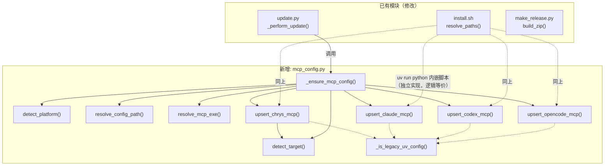

### 2.2 程序清单

| 程序标识符 | 程序（模块）名称 | 所属层次 | 说明 |
|---|---|---|---|
| `PG01` | `detect_platform` | mcp_config.py | 平台检测 |
| `PG02` | `detect_target` | mcp_config.py | Agent 类型检测 |
| `PG03` | `resolve_config_path` | mcp_config.py | 配置文件路径解析 |
| `PG04` | `resolve_mcp_exe` | mcp_config.py | MCP 二进制路径解析 |
| `PG05` | `upsert_claude_mcp` | mcp_config.py | Claude MCP 配置注入 |
| `PG06` | `upsert_codex_mcp` | mcp_config.py | Codex MCP 配置注入 |
| `PG07` | `upsert_opencode_mcp` | mcp_config.py | OpenCode MCP 配置注入 |
| `PG08` | `upsert_chrys_mcp` | mcp_config.py | Chrys MCP 配置注入 |
| `PG09` | `_ensure_mcp_config` | mcp_config.py | 编排入口，被 update.py 调用 |
| `PG10` | `_is_legacy_uv_config` | mcp_config.py | 老用户迁移检测 |
| `PG11` | `_perform_update` 变更 | update.py | 事务流程中插入 MCP 注入 |
| `PG12` | `resolve_paths` 变更 | install.sh | 新增 chrys target 路径 |
| `PG13` | MCP 配置注入脚本变更 | install.sh | 内嵌 Python 脚本切到 Go exe |
| `PG14` | `build_zip` 变更 | make_release.py | 辅助目录打包 |

---

## 3. 程序N（标识符）设计说明

### 3.1 程序 PG01：detect_platform

#### 3.1.1 程序描述

Python 函数，无状态。根据 OS 环境判定当前平台，用于选择 MCP 二进制文件。非子程序，同步调用，无并发/覆盖要求。

#### 3.1.2 功能

| 输入 | 处理 | 输出 |
|------|------|------|
| 无（隐式读取 `os.name`、`sys.platform`） | 按优先级判定：`os.name == "nt"` → windows；`sys.platform == "linux"` → linux；`sys.platform == "darwin"` → macos；其他兜底 windows | `str`：`"windows"` / `"linux"` / `"macos"` |

#### 3.1.3 性能

- 精度：无计算精度要求
- 时间特性：< 1μs（两个系统变量读 + 三次字符串比较）
- 灵活性：新增平台只需加一个 `elif` 分支
- 资源占用：零内存分配

#### 3.1.4 输入项

| 名称 | 标识 | 数据类型 | 格式 | 有效范围 | 输入方式 | 来源 | 保密条件 |
|------|------|----------|------|----------|----------|------|----------|
| 操作系统类型 | `os.name` | `str` | `"nt"` / `"posix"` / `"java"` | 任意 | 标准库属性 | Python 运行时 | 无 |
| 平台标识 | `sys.platform` | `str` | `"linux"` / `"darwin"` / `"win32"` / ... | 任意 | 标准库属性 | Python 运行时 | 无 |

#### 3.1.5 输出项

| 名称 | 标识 | 数据类型 | 格式 | 输出方式 | 去向 | 说明 |
|------|------|----------|------|----------|------|------|
| 平台标识 | 返回值 | `str` | `"windows"` / `"linux"` / `"macos"` | 函数返回值 | 调用方（M03、M08） | 必定返回三者之一，不返回 None |

#### 3.1.6 算法

```
Step 1: if os.name == "nt" → return "windows"
Step 2: if sys.platform == "linux" → return "linux"  
Step 3: if sys.platform == "darwin" → return "macos"
Step 4: return "windows"  (兜底)
```

#### 3.1.7 流程逻辑

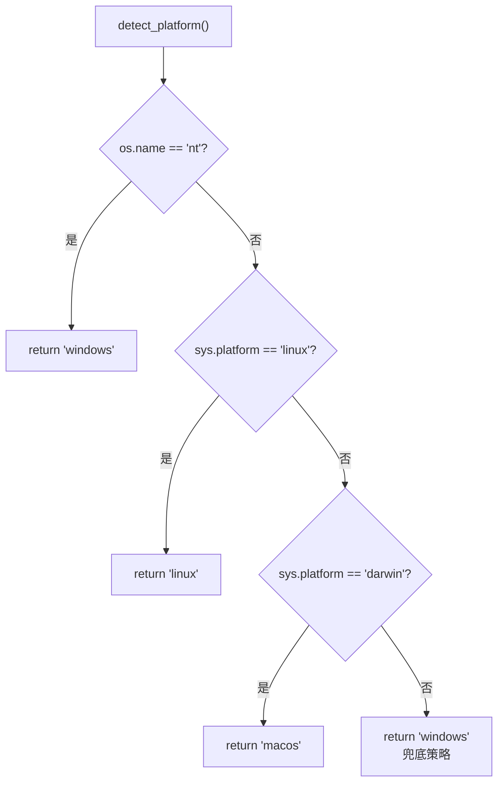

#### 3.1.8 接口

| 接口类型 | 模块/对象 | 传递参数 | 参数类型 | 说明 |
|------|------|------|------|------|
| 调用本程序的模块 | PG04 `resolve_mcp_exe` | 无 | — | — |
| 调用本程序的模块 | PG09 `_ensure_mcp_config` | 无 | — | — |
| 关联数据结构 | 无 | — | — | 无状态，无共享数据 |

#### 3.1.9 存储分配

无。无状态纯函数，不分配堆内存。

#### 3.1.10 注释设计

```
# Platform detection for MCP binary selection.
# Returns: "windows" | "linux" | "macos"
#
# Falls back to "windows" on unknown platforms (WSL, Git Bash, MSYS2) because
# the statically-linked mcp_server.exe runs under Wine and WSL compat layers.
```

#### 3.1.11 限制条件

- 依赖 Python 标准库 `os.name` 和 `sys.platform`，不依赖第三方包
- 在非标准 Python 实现（Jython、IronPython）上 `os.name` 和 `sys.platform` 值可能不同，但兜底分支保证返回有效值

#### 3.1.12 测试计划

- 白盒：覆盖 4 条分支路径
- 输入数据设计：
  - 正常：Windows 环境（`os.name == "nt"`）
  - 正常：Linux 环境（`sys.platform == "linux"`）
  - 正常：macOS 环境（`sys.platform == "darwin"`）
  - 边界：未知平台（mock `sys.platform` 为任意非法值）
- 预期结果：未知平台返回 `"windows"`，其余返回对应平台标识

#### 3.1.13 尚未解决的问题

无。

---

### 3.2 程序 PG02：detect_target

#### 3.2.1 程序描述

Python 函数，无状态。从 `skills_root` 绝对路径推断当前安装所属的 Agent 类型。非子程序，同步调用。

#### 3.2.2 功能

| 输入 | 处理 | 输出 |
|------|------|------|
| `skills_root: Path` | 词法化路径 → 按优先级（chrys → claude → opencode → codex）匹配已知路径模式 | `str \| None`：Agent 类型，None 表示无法识别 |

#### 3.2.3 性能

- 精度：路径匹配基于 `str.endswith`，精确到目录分隔符
- 时间特性：< 10μs（一次 `resolve()` + 四次字符串匹配）

#### 3.2.4 输入项

| 名称 | 标识 | 数据类型 | 格式 | 有效范围 | 输入方式 | 来源 | 保密条件 |
|------|------|----------|------|----------|----------|------|----------|
| skills 根目录路径 | `skills_root` | `pathlib.Path` | 词法化绝对路径 | 已通过 `os.path.abspath(__file__).parents[2]` 定位 | 函数参数 | `install_paths()` 返回值 | 无 |

#### 3.2.5 输出项

| 名称 | 标识 | 数据类型 | 格式 | 输出方式 | 去向 | 说明 |
|------|------|----------|------|----------|------|------|
| Agent 类型 | 返回值 | `str \| None` | `"claude"` / `"codex"` / `"opencode"` / `"chrys"` / `None` | 函数返回值 | PG03、PG09 | None 时静默跳过 |

#### 3.2.6 算法

```
Step 1: root = str(os.path.abspath(skills_root))       # 不含 .. 和相对路径
Step 2: 用 os.sep 构造匹配后缀：
        if root ends with "/.chrys/skills" or "/chrys/skills" → return "chrys"
        if root ends with "/.claude/skills"               → return "claude"
        if root ends with "/opencode/skills"              → return "opencode"
        if "/.codex" in root                               → return "codex"
Step 3: return None
```

> 注：Chrys 的 Windows 路径为 `C:/Users/.../AppData/Roaming/chrys/skills`（不含 `.chrys` 中的点号），因此同时匹配 `/chrys/skills`。Codex 使用 `in root` 而非 `endswith`，因为其 skills 可能直接在 `.codex` 目录下，不一定在 `skills/` 子目录。

#### 3.2.7 流程逻辑

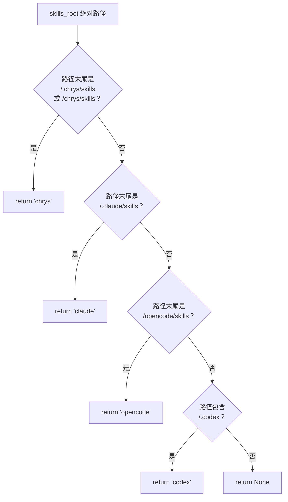

#### 3.2.8 接口

| 接口类型 | 模块/对象 | 传递参数 | 参数类型 | 说明 |
|------|------|------|------|------|
| 调用本程序的模块 | PG03 `resolve_config_path` | skills_root | Path | 间接调用，用于确定配置路径 |
| 调用本程序的模块 | PG09 `_ensure_mcp_config` | skills_root | Path | 直接调用 |
| 关联数据结构 | 无 | — | — | 无状态 |

#### 3.2.9 存储分配

无。

#### 3.2.10 注释设计

```
# Detect which agent host the AAW installation belongs to.
#
# Match priority: chrys → claude → opencode → codex → None.
# Uses suffix matching with os.sep to avoid false matches with
# unrelated paths that just happen to contain ".chrys" etc.
#
# Returns None when skills_root does not match any known agent pattern,
# signalling callers to skip MCP config injection.
```

#### 3.2.11 限制条件

- `skills_root` 必须先通过 `os.path.abspath()` 词法化，不得包含 `..` 或相对路径段
- 不解析 symlink：如果安装路径通过 symlink 指向仓库，不会误写源仓库的配置
- 路径段分隔符使用 `os.sep` 保证跨平台

#### 3.2.12 测试计划

- 白盒：覆盖 5 条分支路径（chrys / claude / opencode / codex / None）
- 输入数据设计：
  - 正常：`Path("/home/user/.chrys/skills")` → `"chrys"`
  - 正常：`Path("/home/user/.claude/skills")` → `"claude"`
  - 正常：`Path("/home/user/.config/opencode/skills")` → `"opencode"`
  - 正常：`Path("/home/user/.codex/skills")` → `"codex"`
  - 正常：`Path("C:/Users/x/AppData/Roaming/chrys/skills")` → `"chrys"`（Windows）
  - 边界：`Path("/tmp/unknown/skills")` → `None`
  - 边界：`Path("/home/user/my.chrys.test/skills")` → `None`（不误匹配）
  - 边界：`Path("/home/user/.codex")` → `"codex"`（codex 无 skills 子目录）

#### 3.2.13 尚未解决的问题

无。

---

### 3.3 程序 PG03：resolve_config_path

#### 3.3.1 程序描述

Python 函数，无状态。根据 `target` 和 `skills_root` 确定 Agent 配置文件的绝对路径。非子程序，同步调用。

#### 3.3.2 功能

| 输入 | 处理 | 输出 |
|------|------|------|
| `target: str`，`skills_root: Path` | 按 target 类型查表，构造配置文件路径 | `Path \| None`：配置文件绝对路径，None 表示无效 target |

#### 3.3.3 性能

- 时间特性：< 5μs（一次查表 + 路径拼接）

#### 3.3.4 输入项

| 名称 | 标识 | 数据类型 | 格式 | 有效范围 | 输入方式 | 来源 | 保密条件 |
|------|------|----------|------|----------|----------|------|----------|
| Agent 类型 | `target` | `str` | `"claude"` / `"codex"` / `"opencode"` / `"chrys"` | PG02 输出 | 函数参数 | `detect_target()` | 无 |
| skills 根目录 | `skills_root` | `Path` | 绝对路径 | 已词法化 | 函数参数 | `install_paths()` | 无 |

#### 3.3.5 输出项

| 名称 | 标识 | 数据类型 | 格式 | 输出方式 | 去向 | 说明 |
|------|------|----------|------|----------|------|------|
| 配置文件路径 | 返回值 | `Path \| None` | 绝对路径 | 函数返回值 | PG05-PG08 的 `config_file` 参数 | None 仅当 target 不在已知集合中 |

#### 3.3.6 算法

```
Step 1: home = Path.home()
Step 2: switch target:
          "claude"   → return home / ".claude.json"
          "codex"    → codex_root = skills_root.parent if skills_root.name == "skills" else skills_root
                        return codex_root / "config.toml"
          "opencode" → return skills_root.parent / "opencode.json"
          "chrys"    → if os.name == "nt":
                          appdata = os.environ["APPDATA"] or default
                          return appdata / "chrys" / "agents" / "Code.yaml"
                        return home / ".chrys" / "agents" / "Code.yaml"
Step 3: return None
```

#### 3.3.7 流程逻辑

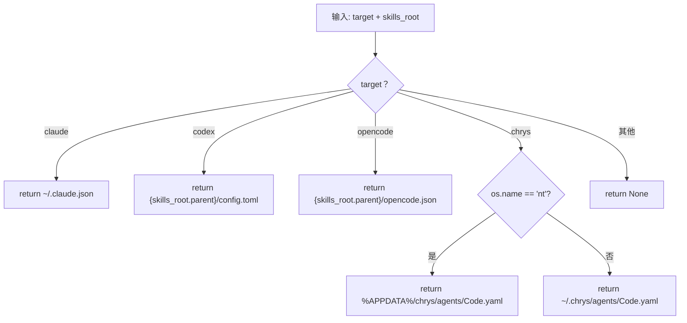

#### 3.3.8 接口

| 接口类型 | 模块/对象 | 传递参数 | 参数类型 | 说明 |
|------|------|------|------|------|
| 调用本程序的模块 | PG09 `_ensure_mcp_config` | target, skills_root | str, Path | — |
| 关联数据结构 | 无 | — | — | — |

#### 3.3.9 存储分配

无。

#### 3.3.10 注释设计

```
# Map agent target to its configuration file path.
#
# Claude: always ~/.claude.json (project scope differentiated by
# {"projects": {"<cwd>": ...}} key inside the same file).
#
# Codex: config.toml lives next to the skills directory.
#
# Chrys: always the agent profile YAML under the chrys config dir,
# regardless of user/project scope.
```

#### 3.3.11 限制条件

- 仅操作默认 Agent 配置，不碰用户自定义 Agent
- Windows 下依赖 `APPDATA` 环境变量

#### 3.3.12 测试计划

- 白盒：覆盖 5 条分支（4 个 target + None）
- 预期结果：每个 target 返回正确的配置文件路径

---

### 3.4 程序 PG04：resolve_mcp_exe

#### 3.4.1 程序描述

Python 函数，无状态。根据 `platform` 和 `skills_root` 构造 MCP 二进制的绝对路径，并验证文件存在。非子程序，同步调用。

#### 3.4.2 功能

| 输入 | 处理 | 输出 |
|------|------|------|
| `skills_root: Path`，`platform: str` | 查表确定文件名 → 拼接路径 → `Path.is_file()` 验证 | `Path \| None`：二进制绝对路径，None 表示文件不存在 |

#### 3.4.3 性能

- 时间特性：< 100μs（一次磁盘 stat）

#### 3.4.4 输入项

| 名称 | 标识 | 数据类型 | 格式 | 有效范围 | 输入方式 | 来源 | 保密条件 |
|------|------|----------|------|----------|----------|------|----------|
| skills 根目录 | `skills_root` | `Path` | 绝对路径 | 已词法化 | 函数参数 | `install_paths()` | 无 |
| 平台标识 | `platform` | `str` | `"windows"` / `"linux"` / `"macos"` | PG01 输出，必定有效 | 函数参数 | `detect_platform()` | 无 |

#### 3.4.5 输出项

| 名称 | 标识 | 数据类型 | 格式 | 输出方式 | 去向 | 说明 |
|------|------|----------|------|----------|------|------|
| MCP 二进制路径 | 返回值 | `Path \| None` | 绝对路径 | 函数返回值 | PG09 | None 时跳过 MCP 注入 |

#### 3.4.6 算法

```
Step 1: exe_name = "mcp_server.exe" if platform == "windows" else "mcp_server"
Step 2: exe_path = skills_root / "question-tracker-mcp" / "bin" / platform / exe_name
Step 3: return exe_path if exe_path.is_file() else None
```

#### 3.4.7 流程逻辑

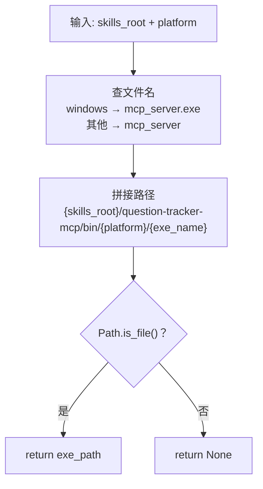

#### 3.4.8 接口

| 接口类型 | 模块/对象 | 传递参数 | 参数类型 | 说明 |
|------|------|------|------|------|
| 调用本程序的模块 | PG09 `_ensure_mcp_config` | skills_root, platform | Path, str | — |
| 关联数据结构 | 无 | — | — | — |

#### 3.4.9 存储分配

无。

#### 3.4.10 注释设计

```
# Locate the Go MCP binary for the current platform.
#
# The binary lives at <skills_root>/question-tracker-mcp/bin/<platform>/.
# Validates existence on disk. Returns None for macOS (not yet built) or
# if the file was unexpectedly deleted.
```

#### 3.4.11 限制条件

- 二进制路径硬编码为 `question-tracker-mcp/bin/{platform}/`。若 `question-tracker-mcp` 目录结构变更，需同步更新
- 不检查文件可执行权限，仅检查存在性。权限问题由 Agent 启动 MCP 时报错

#### 3.4.12 测试计划

- 输入数据设计：
  - 正常：`linux` + 已有二进制 → 返回路径
  - 正常：`windows` + 已有二进制 → 返回路径含 `.exe`
  - 异常：`macos` + 无二进制 → 返回 None
  - 异常：`linux` + 二进制被删除 → 返回 None

---

### 3.5 程序 PG05：upsert_claude_mcp

#### 3.5.1 程序描述

Python 函数。向 `~/.claude.json` 的 `mcpServers` 段写入/更新 question-tracker 条目。读写 JSON，可能产生文件 I/O。同步调用。

#### 3.5.2 功能

| 输入 | 处理 | 输出 |
|------|------|------|
| `config_file: Path`，`exe_path: Path`，`skills_root: Path` | 读 JSON → 确定 scope 键（user/project）→ 构建条目 → upsert → 写回 | `bool`：True 表示配置已变更 |

#### 3.5.3 性能

- 时间特性：< 10ms（单次 JSON 读写，文件 < 100KB）

#### 3.5.4 输入项

| 名称 | 标识 | 数据类型 | 格式 | 有效范围 | 输入方式 | 来源 | 保密条件 |
|------|------|----------|------|----------|----------|------|----------|
| 配置文件路径 | `config_file` | `Path` | `~/.claude.json` | 文件需存在（或可创建） | 函数参数 | PG03 | 用户 home 目录 |
| MCP 可执行文件路径 | `exe_path` | `Path` | 绝对路径 | 文件须存在 | 函数参数 | PG04 | 无 |
| skills 根目录 | `skills_root` | `Path` | 绝对路径 | 用于区分 user/project scope | 函数参数 | `install_paths()` | 无 |

#### 3.5.5 输出项

| 名称 | 标识 | 数据类型 | 格式 | 输出方式 | 去向 | 说明 |
|------|------|----------|------|----------|------|------|
| 是否变更 | 返回值 | `bool` | `True`/`False` | 函数返回值 | PG09 | False 时调用方无操作 |

#### 3.5.6 算法

```
Step 1: 读取 config_file，JSON 解析（不存在则为 {}）
Step 2: 确定 scope：skills_root 以 home + "/.claude/skills" 开头 → user scope
                    否则 → project scope
Step 3: 如果是 user scope：
           scope_key = "__global__"
           定位 mcpServers = data["mcpServers"]
        如果是 project scope：
           scope_key = str(PWD)
           定位 mcpServers = data["projects"][scope_key]["mcpServers"]
Step 4: 构建 entry = {"command": str(exe_path), "args": [], "env": {}}
Step 5: 如果 mcpServers 中已有 question-tracker：
           如果 command 相同 → 跳过，返回 False
           否则 → 替换，写回，返回 True
        否则：
           新增 mcpServers["question-tracker"] = entry，写回，返回 True
Step 6: 写回时确保目录存在，JSON indent=2
```

#### 3.5.7 流程逻辑

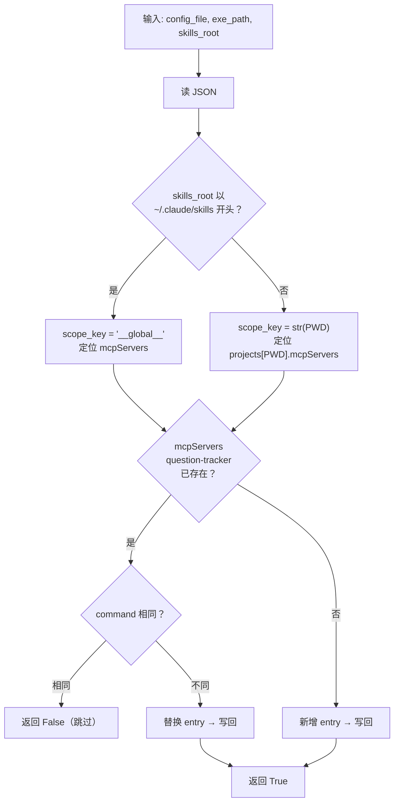

#### 3.5.8 接口

| 接口类型 | 模块/对象 | 传递参数 | 参数类型 | 说明 |
|------|------|------|------|------|
| 调用本程序的模块 | PG09 `_ensure_mcp_config` | config_file, exe_path, skills_root | Path, Path, Path | — |
| 本程序调用的模块 | `json`（标准库） | — | — | 读写 Claude 配置 |
| 关联数据结构 | Claude 配置文件 | `~/.claude.json` | JSON | 顶层 `mcpServers` 对象 |

#### 3.5.9 存储分配

- 内存：读取 `~/.claude.json` 全部内容（一般 < 50KB）
- 磁盘写：同文件写回

#### 3.5.10 注释设计

```
# Upsert question-tracker MCP server into Claude's config (~/.claude.json).
#
# Scope: user-level (global mcpServers) or project-level (projects[<cwd>].mcpServers),
# inferred from whether skills_root lives under ~/.claude/skills/.
#
# Migrates legacy uv run python configs automatically: when the existing entry
# has command=="uv" and args containing "fastmcp"/"mcp_server.py", replace it
# with the Go binary entry.
```

#### 3.5.11 限制条件

- 仅操作 question-tracker 条目，不碰 `mcpServers` 中的其他 MCP 服务器
- project scope 依赖 `os.getcwd()` 与 `skills_root` 在同一个项目目录下

#### 3.5.12 测试计划

- 输入数据设计：
  - 正常：新安装 → 新增条目
  - 正常：重复安装 → 跳过（幂等）
  - 正常：路径变更 → 更新 command
  - 正常：老用户 uv 格式 → 替换为 Go exe
  - 异常：文件不存在 → 创建文件

---

### 3.6 程序 PG06：upsert_codex_mcp

#### 3.6.1 程序描述

Python 函数。向 `~/.codex/config.toml` 的 `[mcp_servers.question-tracker]` 段写入/更新。纯文本正则操作，不引入 TOML 解析库。

#### 3.6.2 功能

| 输入 | 处理 | 输出 |
|------|------|------|
| `config_file: Path`，`exe_path: Path` | 读 TOML 文本 → 正则匹配现有 `[mcp_servers.question-tracker]` 段 → upsert → 写回 | `bool` |

#### 3.6.3 算法

```
Step 1: 读 config_file（不存在则为空字符串）
Step 2: 正则匹配 [mcp_servers.question-tracker] 段（包括所有非 [ 开头的属性行）
Step 3: 构造目标段：
          [mcp_servers.question-tracker]
          command = "{exe_path}"
          args = []
Step 4: 如果已有段：
           如果 command 路径相同 → 跳过，返回 False
           否则 → 替换整个段，写回，返回 True
        否则：
           在文件末尾追加段，写回，返回 True
```

#### 3.6.4 流程逻辑

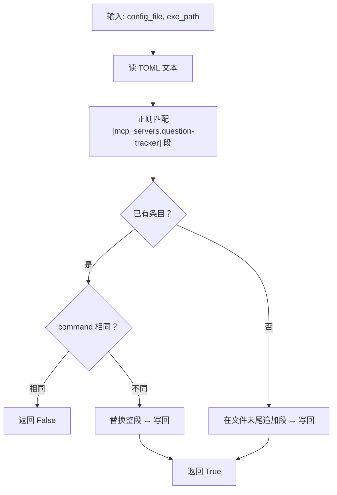

#### 3.6.5 接口

| 接口类型 | 模块/对象 | 传递参数 | 参数类型 | 说明 |
|------|------|------|------|------|
| 调用本程序的模块 | PG09 `_ensure_mcp_config` | config_file, exe_path | Path, Path | — |
| 本程序调用的模块 | `re`（标准库） | — | — | TOML 段匹配替换 |
| 关联数据结构 | Codex 配置文件 | `config.toml` | TOML | `[mcp_servers]` 段 |

#### 3.6.6 测试计划

- 输入数据设计：
  - 正常：新安装 → 追加段
  - 正常：已有其他 mcp_servers → 不影响
  - 正常：老用户 uv 格式 → 替换为 Go exe 段

---

### 3.7 程序 PG07：upsert_opencode_mcp

#### 3.7.1 程序描述

Python 函数。向 `opencode.json` 的 `mcp` 段写入/更新 question-tracker 条目。读写 JSON。

#### 3.7.2 功能

| 输入 | 处理 | 输出 |
|------|------|------|
| `config_file: Path`，`exe_path: Path` | 读 JSON → 构建条目 → upsert → 写回 | `bool` |

#### 3.7.3 算法

```
Step 1: 读 config_file，JSON 解析（不存在则为 {}）
Step 2: 构建 entry：
          {
            "type": "local",
            "command": [str(exe_path)],   # 注意：单元素数组
            "enabled": true,
            "environment": {}
          }
Step 3: 确定 mcp 对象 → upsert question-tracker
        如果已存在且 command 数组的第一个元素路径相同 → 跳过
        否则 → 替换/新增，写回
Step 4: 写回时确保 $schema 字段存在
```

#### 3.7.4 流程逻辑

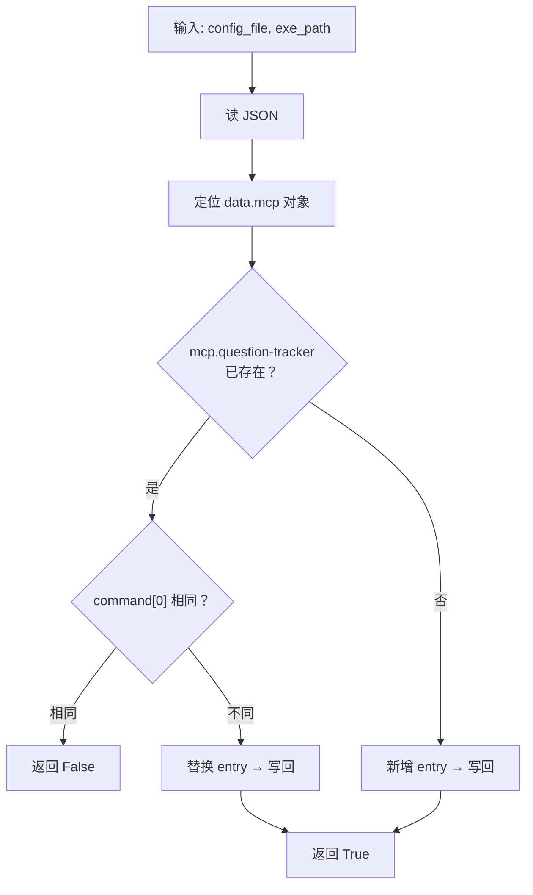

> 注：OpenCode 的 `command` 字段是字符串数组，Go exe 无参数时为单元素数组 `["/path/to/mcp_server"]`。老用户迁移时，旧格式 `["uv", "run", "--with", "fastmcp", "python", ".../mcp_server.py"]` 将被替换。

#### 3.7.5 接口

| 接口类型 | 模块/对象 | 传递参数 | 参数类型 | 说明 |
|------|------|------|------|------|
| 调用本程序的模块 | PG09 `_ensure_mcp_config` | config_file, exe_path | Path, Path | — |
| 关联数据结构 | OpenCode 配置文件 | `opencode.json` | JSON | 顶层 `mcp` 对象 |

---

### 3.8 程序 PG08：upsert_chrys_mcp

#### 3.8.1 程序描述

Python 函数。向 `~/.chrys/agents/Code.yaml` 的 `tools.mcp` 段写入/更新 question-tracker 条目。使用纯文本逐行操作，不引入 YAML 解析/重写库，保留用户注释和格式。

#### 3.8.2 功能

| 输入 | 处理 | 输出 |
|------|------|------|
| `config_file: Path`，`exe_path: Path` | 判断文件是否存在 → 不存在从内置模板创建；存在纯文本 upsert | `bool` |

#### 3.8.3 性能

- 时间特性：< 20ms（纯文本逐行扫描 + 插入，文件 < 5KB）

#### 3.8.4 输入项

| 名称 | 标识 | 数据类型 | 格式 | 有效范围 | 来源 |
|------|------|----------|------|----------|------|
| 配置文件路径 | `config_file` | `Path` | `~/.chrys/agents/Code.yaml` | 可创建或存在 | PG03 |
| MCP 可执行文件路径 | `exe_path` | `Path` | 绝对路径 | 文件须存在 | PG04 |

#### 3.8.5 输出项

| 名称 | 标识 | 数据类型 | 格式 | 输出方式 | 说明 |
|------|------|----------|------|----------|------|
| 是否变更 | 返回值 | `bool` | — | 函数返回 | True 表示已写入或更新 |

#### 3.8.6 算法

```
情况1：文件不存在
  Step A: importlib.resources 读取 chrys 内置 Code.yaml
  Step B: 解析 YAML 文本，定位 tools.mcp 段
  Step C: 如果无 tools 段 → 在文件末尾追加 tools: + mcp: 段 + 条目
          如果 tools 段存在但无 mcp → 在 tools: 下追加 mcp: + 条目
          如果 tools.mcp 段存在 → 在列表末尾追加条目
  Step D: 写入 config_file（json 序列化到 YAML 格式的条目）
  Step E: 返回 True

情况2：文件存在
  Step A: 按行读入（保留换行符）
  Step B: 定位 tools 段的行范围（逐行扫描，匹配正则 r'^(\s*)tools:(\s*)$'）
  Step C: 在 tools 段内定位 mcp 列表（匹配缩进比 tools 多 2 空格的 r'^(\s*)mcp:(\s*)$'）
  Step D: 在 mcp 列表内定位 question-tracker 条目
          （定位 r'^(\s*)-\s+name:\s+question-tracker(\s*)$'，
           到下一个同缩进的 - name: 为止）
  Step E: 构造新条目字符串（带正确缩进）：
              - name: question-tracker
                transport: stdio
                command: {exe_path}
                args: []
                enabled: true
  Step F: 如果已有条目：
            提取当前 command 字段值，与 str(exe_path) 比较
            相同 → 返回 False
            不同 → 替换行范围（lines[start:end] = [new_entry_lines]）
          如果无条目：
            找到 mcp 列表最后一个条目的结束位置 → 插入新条目
          如果无 mcp 段：
            在 tools: 后插入 mcp: + 条目
          如果无 tools 段：
            在文件末尾追加 tools: + mcp: + 条目
  Step G: 写回文件（lines.join("")）
  Step H: 返回 True
```

#### 3.8.7 流程逻辑

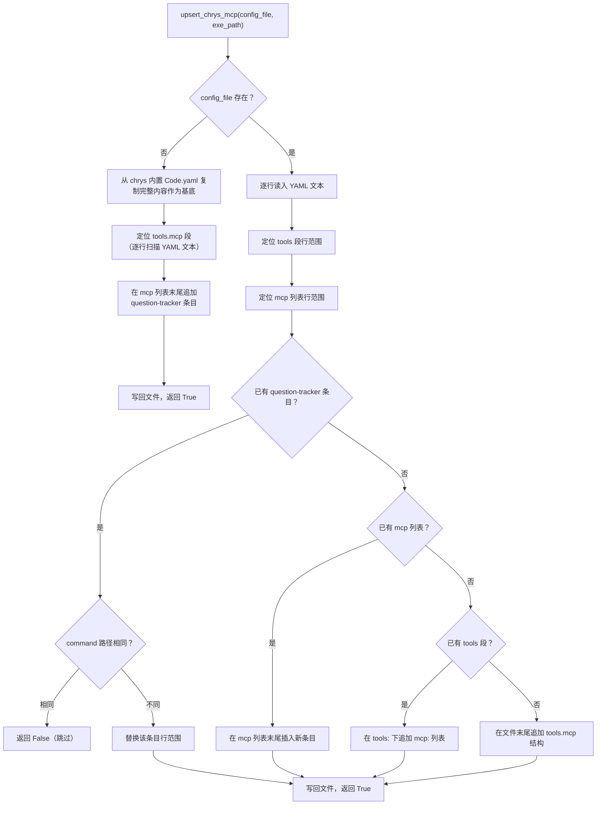

#### 3.8.8 关键正则表达式

| 用途 | 正则 | 说明 |
|------|------|------|
| 定位 `tools:` 段 | `r'^(\s*)tools:\s*$'` | 捕获缩进量 |
| 定位 `mcp:` 列表 | `r'^(\s*)mcp:\s*$'` | 缩进须比 tools 多 2 空格 |
| 定位列表项 | `r'^(\s*)-\s+name:\s+'` | 同缩进的 `- name:` 标记条目边界 |
| 提取字段值 | `r'^\s*command:\s*(.+)$'` | 提取已存在的 command 路径 |

#### 3.8.9 接口

| 接口类型 | 模块/对象 | 传递参数 | 参数类型 | 说明 |
|------|------|------|------|------|
| 调用本程序的模块 | PG09 `_ensure_mcp_config` | config_file, exe_path | Path, Path | — |
| 本程序调用的模块 | `importlib.resources`（标准库） | — | — | 读取 chrys 内置 Code.yaml |
| 关联数据结构 | Chrys Agent Profile | `~/.chrys/agents/Code.yaml` | YAML | `tools.mcp` 列表 |

#### 3.8.10 存储分配

- 内存：YAML 文件全文（< 5KB）+ 各行列表
- 磁盘写：同文件写回

#### 3.8.11 注释设计

```
# Pure-text upsert for Chrys Code.yaml: never parse the whole YAML,
# never rewrite the whole file.  This preserves user comments, blank
# lines, and Yaml formatting that a full dump would destroy.
#
# Edge cases:
# - File not found: copy the chrys builtin Code.yaml as base, append MCP entry
# - No tools section: append at end
# - tools exists, no mcp: append mcp after tools
# - mcp exists, no question-tracker: insert at list end
# - question-tracker exists, different command: replace entry lines
# - question-tracker exists, same command: no-op
```

#### 3.8.12 限制条件

- 依赖 chrys 已通过 pip/uv 安装在当前 Python 环境中（`importlib.resources` 需要 chrys 包可导入），**仅文件不存在时触发**
- 若文件已存在、但 YAML 缩进不标准（如非 2 空格缩进），定位正则可能失败 → 跳过并输出 warning
- 不操作非 Code 的 Agent（如用户自定义 Agent），只碰 `Code.yaml`

#### 3.8.13 测试计划

- 白盒：覆盖 7 条路径（文件不存在 / 无 tools / 无 mcp / 无条目 / 已存在相同 / 已存在不同 / 缩进异常）
- 输入数据设计：
  - 正常：空目录 → 从内置创建
  - 正常：已有 Code.yaml 但无 mcp → 追加 tools.mcp
  - 正常：已有 Code.yaml 且有 mcp 但无 question-tracker → 追加条目
  - 正常：已有 question-tracker 且 command 相同 → 跳过
  - 正常：已有 question-tracker 且 command 不同 → 替换
  - 边界：Code.yaml 使用非常规缩进 → 输出 warning 跳过
  - 边界：mcp 列表为空（`mcp: []`）→ 追加条目
  - 异常：文件权限不足 → 抛出异常

---

### 3.9 程序 PG09：_ensure_mcp_config

#### 3.9.1 程序描述

Python 函数，被 `update.py` 的 `_perform_update()` 事务流程调用。自动检测当前 Agent 类型 → 检测平台 → 定位二进制 → 定位配置文件 → 调度对应的 upsert 函数。所有分支失败均为非致命：返回 None / 文件不存在时静默跳过，只有明确的配置文件写入失败才抛出。

#### 3.9.2 功能

| 输入 | 处理 | 输出 |
|------|------|------|
| `skills_root: Path` | detect_target → detect_platform → resolve_mcp_exe → resolve_config_path → 调度 upsert_*_mcp | 无返回值，成功/静默跳过，仅在写入失败时抛异常 |

#### 3.9.3 算法

```
Step 1: target = detect_target(skills_root)
        如果 target is None → 返回（静默跳过）
Step 2: platform = detect_platform()
Step 3: exe_path = resolve_mcp_exe(skills_root, platform)
        如果 exe_path is None → 返回（静默跳过）
Step 4: config_file = resolve_config_path(target, skills_root)
        如果 config_file is None → 返回
Step 5: switch target:
          "claude"   → upsert_claude_mcp(config_file, exe_path, skills_root)
          "codex"    → upsert_codex_mcp(config_file, exe_path)
          "opencode" → upsert_opencode_mcp(config_file, exe_path)
          "chrys"    → upsert_chrys_mcp(config_file, exe_path)
Step 6: 如果 upsert 抛出异常 → 原样传播（由 update.py 事务层捕获回滚）
```

#### 3.9.4 流程逻辑

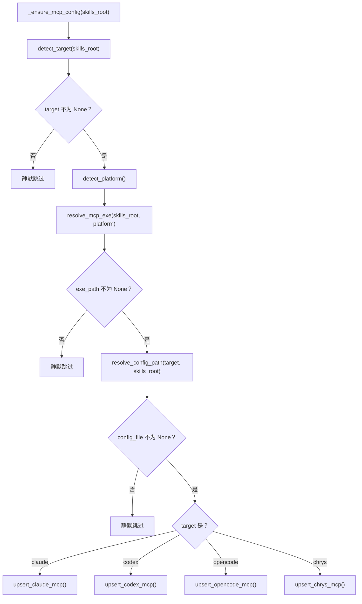

#### 3.9.5 接口

| 接口类型 | 模块/对象 | 传递参数 | 参数类型 | 说明 |
|------|------|------|------|------|
| 调用本程序的模块 | `update.py:_perform_update` | skills_root | Path | 事务换入后的 mcp_config 阶段 |
| 本程序调用的模块 | PG01-PG08 | 见各节 | — | — |

#### 3.9.6 异常处理

| 场景 | 行为 |
|------|------|
| `detect_target` 返回 None，`resolve_mcp_exe` 返回 None，`resolve_config_path` 返回 None | 静默返回，不阻断 skills 更新 |
| `upsert_chrys_mcp` 中文件权限不足 | `OSError` 原样传播 |
| `upsert_*_mcp` 中 JSON/TOML/YAML 格式损坏 | 自定义 `MCPConfigError`（继承自 `Exception`），原样传播 |

> 只有最后一类异常才触发 update.py 事务回滚。

#### 3.9.7 限制条件

- 必须在排他锁持有期间调用（与 skills 换入在同一临界区）
- 不需要 `import yaml`：chrys upsert 使用纯文本，其余 agent 使用 `json` 或 `re`

#### 3.9.8 测试计划

- 集成测试：mock `skills_root` 为各 agent 路径，验证正确的 upsert 函数被调度
- 异常测试：mock `upsert_*_mcp` 抛异常，验证异常传播

---

### 3.10 程序 PG10：_is_legacy_uv_config

#### 3.10.1 程序描述

Python 辅助函数。检查 MCP 条目字典是否为旧的 `uv run python` 格式。被 PG05-PG08 内部调用。

#### 3.10.2 算法

```
Step 1: 提取 command 和 args 字段
Step 2: claude/codex/chrys 格式检测：
          如果 command == "uv" 且 "fastmcp" in str(args) 且 "mcp_server.py" in str(args)
          → 返回 True
Step 3: opencode 格式检测：
          如果 isinstance(command, list) 且 len(command) > 0
          且 command[0] == "uv" 且 "fastmcp" in str(command)
          → 返回 True
Step 4: 返回 False
```

#### 3.10.3 接口

| 接口类型 | 模块/对象 | 传递参数 | 参数类型 | 说明 |
|------|------|------|------|------|
| 调用本程序的模块 | PG05-PG08 | entry | dict | MCP 条目字典 |
| 本程序调用的模块 | 无 | — | — | 纯函数 |

---

### 3.11 程序 PG11：update.py `_perform_update` 变更

#### 3.11.1 程序描述

对已有函数 `_perform_update()` 的事务流程进行扩展。变更范围：在 skills 换入完成后、committed 之前插入 MCP 配置注入阶段。

#### 3.11.2 变更内容

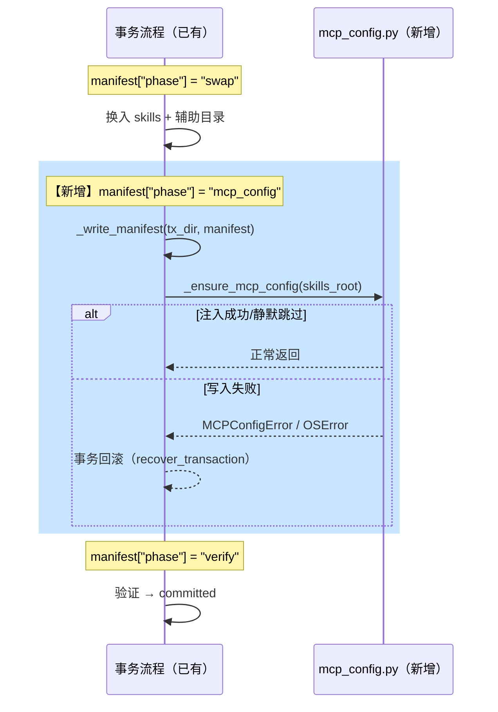

#### 3.11.3 代码变更

在 `_perform_update()` 中，`manifest["phase"] = "swap"` 的换入循环结束后，`manifest["phase"] = "verify"` 之前插入：

```
manifest["phase"] = "mcp_config"
_write_manifest(tx_dir, manifest)
try:
    from .mcp_config import _ensure_mcp_config
    _ensure_mcp_config(skills_root)
except Exception:
    # 回滚在 except (UpdateError, OSError) 分支处理
    raise
```

#### 3.11.4 辅助目录换入

`_perform_update()` 的 skills 换入循环中，增加对 `auxiliary` 目录的处理。辅助目录的换入逻辑与 skills 一致：备份旧目录、换入 payload 中的新目录、失败时回滚。辅助目录不参与 SKILL.md 校验。

#### 3.11.5 接口

| 接口类型 | 模块/对象 | 传递参数 | 参数类型 | 说明 |
|------|------|------|------|------|
| 本程序调用的模块 | `mcp_config._ensure_mcp_config` | skills_root | Path | 新增调用 |
| 关联数据结构 | 事务清单 | `manifest["phase"]` | str | 新增 `"mcp_config"` 阶段 |

---

### 3.12 程序 PG12：install.sh `resolve_paths` 变更

#### 3.12.1 程序描述

在 `resolve_paths()` 函数的 `case "$TARGET"` 分支中新增 chrys target。纯 bash。

#### 3.12.2 变更内容

**target 校验：**
```
case "$TARGET" in
  claude|codex|opencode|chrys) ;;   # chrys 新增
  *) echo "Invalid --target: $TARGET" >&2; exit 2 ;;
esac
```

**路径解析新增 chrys 分支：**
```
chrys)
  if [[ "$SCOPE" == "user" ]]; then
    if [[ "$(uname -s)" == MINGW* || "$(uname -s)" == CYGWIN* || "$(uname -s)" == MSYS* ]]; then
      SKILLS_DST="$APPDATA/chrys/skills"
    else
      SKILLS_DST="$HOME/.chrys/skills"
    fi
  else
    SKILLS_DST="$PWD/.chrys/skills"
  fi
  CONFIG_FMT=chrys-yaml
  ;;
```

---

### 3.13 程序 PG13：install.sh MCP 配置注入脚本变更

#### 3.13.1 程序描述

将 install.sh 中内嵌的 Python 脚本（MCP 注册部分）从写入 `uv run python` 格式改为写入 Go exe 格式。各 Agent 的变更：

#### 3.13.2 Claude 变更

旧 entry：
```
{"command": "uv", "args": ["run", "--with", "fastmcp", "python", server_path], "env": {}}
```
新 entry：
```
{"command": exe_path, "args": [], "env": {}}
```
其中 `exe_path` 由 shell 变量 `$MCP_EXE` 传入。

#### 3.13.3 Codex 变更

旧 block：
```
command = "uv"
args = ["run", "--with", "fastmcp", "python", "{server_path}"]
```
新 block：
```
command = "{exe_path}"
args = []
```

#### 3.13.4 OpenCode 变更

旧 entry：
```
"command": ["uv", "run", "--with", "fastmcp", "python", server_path]
```
新 entry：
```
"command": [exe_path]
```

#### 3.13.5 Chrys 新增

install.sh 中新增 chrys 的 MCP 注入代码段，内嵌 Python 脚本通过 `uv run python` 执行纯文本 upsert（逻辑与 PG08 一致）。

---

### 3.14 程序 PG14：make_release.py `build_zip` 变更

#### 3.14.1 程序描述

修改 `build_zip()` 和 `verify_zip()`，将 `release.yaml` 中 `auxiliary` 列表声明的目录的 `bin/` 子目录打包进 `aaw-skills-*.zip`。辅助目录不要求包含 `SKILL.md`。

#### 3.14.2 release.yaml 变更

```yaml
external_skills: []
removed_skills: []
auxiliary:
  - question-tracker-mcp
```

#### 3.14.3 build_zip 变更

```
Step 1: 读取 release.yaml 的 auxiliary 列表
Step 2: 对每个 auxiliary 目录：
          for path in (skills/aux_dir/bin/**/*):
            打包 arcname = f"{aux_dir}/{path.relative_to(skills/aux_dir)}"
Step 3: 生成 release-manifest.json 时，写入 "auxiliary": [...]
```

#### 3.14.4 verify_zip 变更

```
Step 1: 校验 zip 顶层包含 manifest["auxiliary"] 中的所有辅助目录
Step 2: 辅助目录下的 bin/ 子目录存在且至少包含一个平台二进制文件
Step 3: auxiliary 与 skills 列表不交叉
```

#### 3.14.5 update.py `_sanity_check` 变更

`sanity_check` 中增加对 auxiliary 目录的校验：每个辅助目录的 `bin/` 子目录存在且至少含一个文件。

---

## 4. 公共数据结构设计

### 4.1 全局常量与变量定义

| 名称 | 类型 | 取值范围 | 初始值 | 说明 |
|------|------|----------|--------|------|
| `MCP_SERVER_NAME` | `str` | — | `"question-tracker"` | MCP 服务器唯一标识名 |
| `MCP_BINARY_DIR` | `str` | — | `"question-tracker-mcp"` | MCP 二进制所在目录 |
| `MCP_BIN_SUBDIR` | `str` | — | `"bin"` | 二进制平台子目录 |
| `CHRYS_BUILTIN_PROFILE` | `str` | — | `"chrys.service.profiles.agents.builtins"` | Chrys 内置 profile 包路径 |
| `CHRYS_PROFILE_NAME` | `str` | — | `"Code"` | 默认 Agent profile 名称 |

### 4.2 公共数据结构 / 类定义

#### MCPConfigError

```python
class MCPConfigError(Exception):
    """MCP 配置注入异常。由 upsert_*_mcp 抛出，update.py 事务层捕获回滚。"""
    def __init__(self, message: str, config_file: str = ""):
        super().__init__(message)
        self.config_file = config_file
```

#### ReleaseInfo 扩展（update.py 已有）

无新增字段。`release-manifest.json` 新增 `auxiliary: list[str]`，与 `skills` / `external_skills` / `removed_skills` 同层，校验规则一致（名称合法、不交叉）。

### 4.3 错误码定义

| 错误码 | 含义 | 触发条件 | 处理方式 |
|------|------|------|------|
| 无（Warning） | Unknown agent target | `detect_target()` 返回 None | 静默跳过 MCP 注入 |
| 无（Warning） | MCP binary not found | `resolve_mcp_exe()` 返回 None | 静默跳过 MCP 注入 |
| 无（Exception） | Config file write failed | 权限不足或磁盘满 | 抛出 `MCPConfigError`，事务回滚 |
| 无（Warning） | Chrys YAML malformed | 缩进不标准，正则匹配失败 | 跳过该文件，输出 `[WARN]` |

---

## 5. 需求追踪矩阵

| 需求编号 | 概要设计章节 | 详细设计章节 | 状态 |
|------|------|------|------|
| G1 | M04-M07 | PG05-PG08 | 已覆盖 |
| G2 | M08 | PG09, PG11 | 已覆盖 |
| G3 | M02 | PG02, PG03 | 已覆盖 |
| G4 | M04-M07 | PG05-PG08 | 已覆盖 |
| G5 | M10 | PG10 | 已覆盖 |
| G6 | M09 | PG12, PG13 | 已覆盖 |
| G7 | 幂等性 | PG05-PG08 算法 Step 5（command 相同则跳过） | 已覆盖 |
| G8 | M12 | PG14 | 已覆盖 |

---

## 8. 附录

### 8.1 各 Agent MCP 条目结构对照表

| Agent | command 字段 | args 字段 | 额外字段 | 格式 |
|------|-------------|----------|---------|------|
| claude | `"command": "/path/to/exe"` | `"args": []` | `"env": {}` | JSON |
| codex | `command = "/path/to/exe"` | `args = []` | 无 | TOML |
| opencode | `"command": ["/path/to/exe"]`（数组） | 无 | `"type": "local"`, `"enabled": true`, `"environment": {}` | JSON |
| chrys | `command: /path/to/exe` | `args: []` | `transport: stdio`, `enabled: true` | YAML |

### 8.2 mcp_config.py 完整接口清单

```
# 平台检测
detect_platform() -> str                                    # PG01

# Agent 检测
detect_target(skills_root: Path) -> str | None               # PG02
resolve_config_path(target: str, skills_root: Path) -> Path | None  # PG03

# 二进制定位
resolve_mcp_exe(skills_root: Path, platform: str) -> Path | None  # PG04

# MCP 配置注入（四个 Agent）
upsert_claude_mcp(config_file: Path, exe_path: Path, skills_root: Path) -> bool   # PG05
upsert_codex_mcp(config_file: Path, exe_path: Path) -> bool                       # PG06
upsert_opencode_mcp(config_file: Path, exe_path: Path) -> bool                    # PG07
upsert_chrys_mcp(config_file: Path, exe_path: Path) -> bool                       # PG08

# 编排入口（被 update.py 调用）
_ensure_mcp_config(skills_root: Path) -> None               # PG09

# 内部辅助
_is_legacy_uv_config(entry: dict) -> bool                   # PG10
MCPConfigError                                             # 异常类
```
