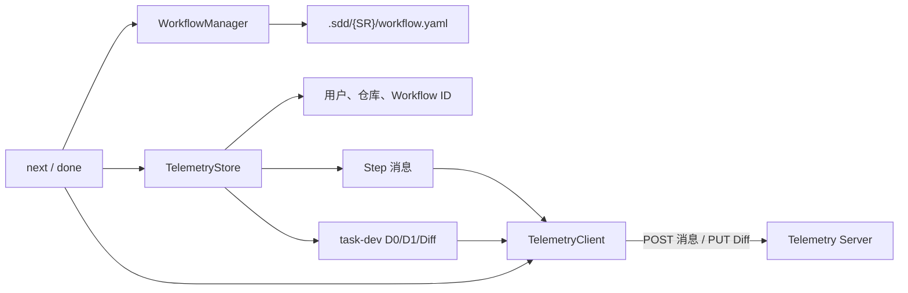
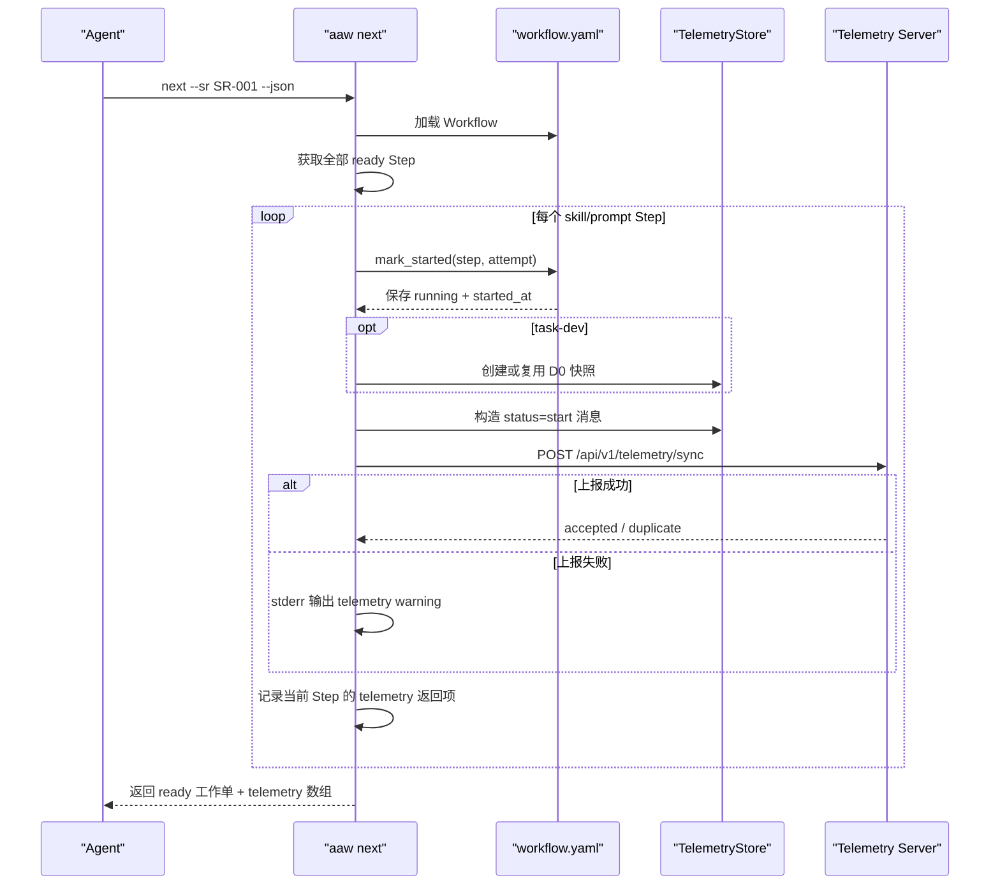
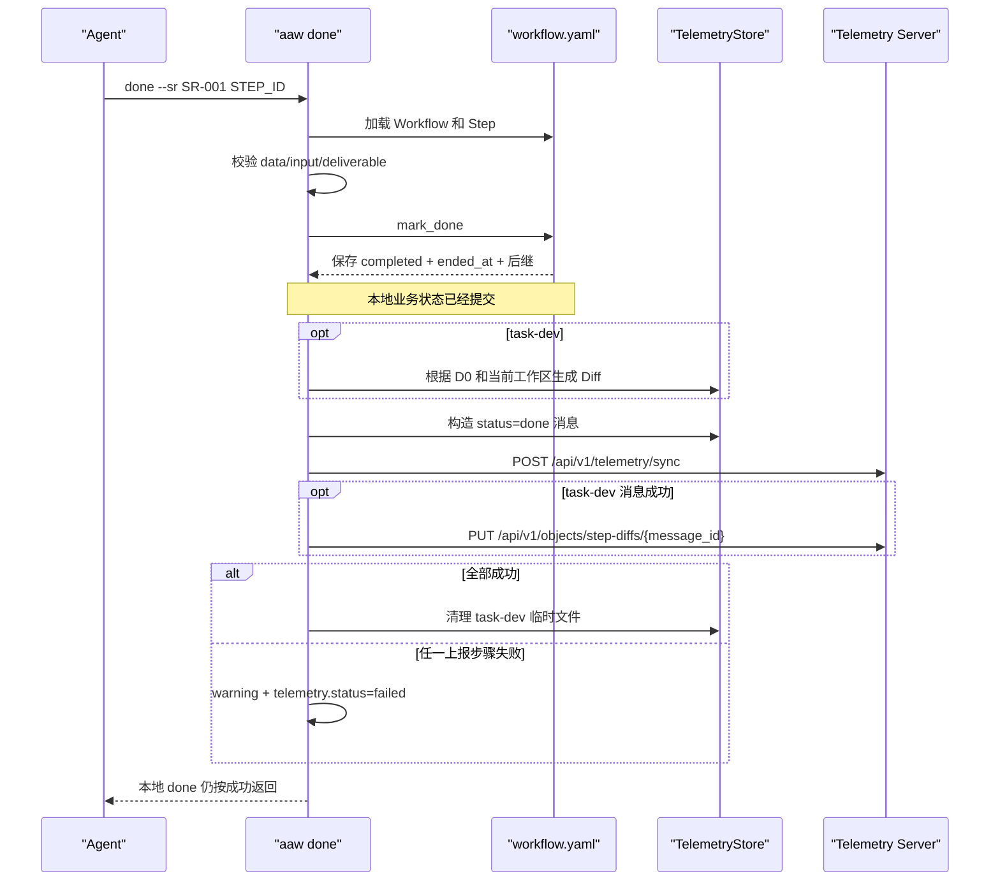
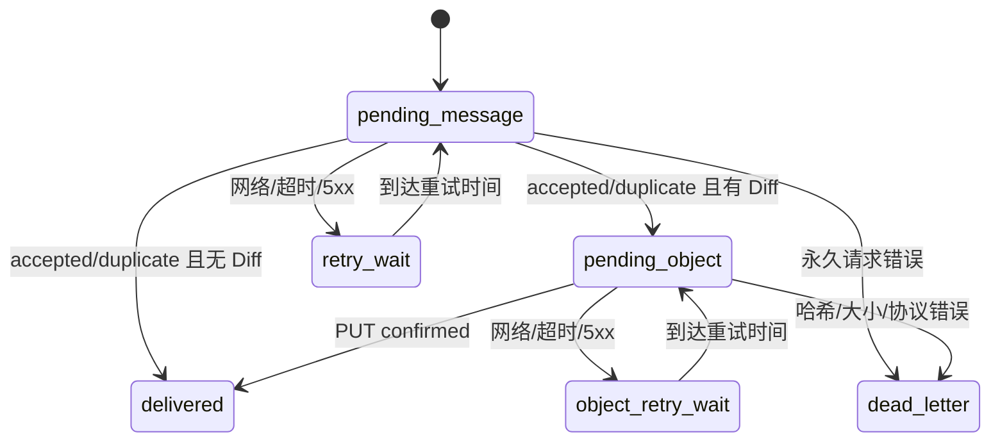

# AAW CLI 数据上报机制

> 文档状态：当前实现说明 + CLI 侧改进方案<br>
> 适用范围：`aaw next`、`aaw done`、普通 Step 上报、`task-dev` Diff 上报<br>
> 基线日期：2026-07-23<br>
> 阅读重点：本文以 CLI 如何采集、构造、保存和发送数据为主。Telemetry Server 仅说明与 CLI 直接相关的接口和返回语义，不展开服务端内部实现。

## 1. 目标与定位

AAW CLI 在执行工作流时，会把 Step 的开始、完成以及 `task-dev` 产生的代码 Diff 上报给 Telemetry Server，用于后续统计和分析。

当前设计的核心定位是：

> `workflow.yaml` 是本地工作流的事实来源，数据上报是非阻断的旁路能力。上报失败不应阻止 Agent 继续执行工作流。

这意味着 CLI 优先保证工作流可执行：

- `next` 先把 Step 标记为开始，再尝试上报 `start`；
- `done` 先把 Step 标记为完成并生成后继，再尝试上报 `done`；
- Telemetry Server 不可用时，只输出 warning；
- 当前没有持久化消息队列，因此不保证每条数据最终送达。

本文首先准确描述当前实现，然后给出以 CLI 为核心的可靠性改进方案。

## 2. 上报范围

### 2.1 命令与上报行为

| CLI 命令 | 是否上报 | 上报内容 |
|---|---:|---|
| `aaw start` | 否 | 只创建本地 Workflow |
| `aaw status` | 否 | 只读取本地状态 |
| `aaw next` | 是 | 对所有 ready 的 `skill/prompt` Step 上报 `start` |
| `aaw done` | 是 | 上报当前 Step 的 `done`；`task-dev` 额外上传 Diff |
| `aaw user-confirm` | 否 | 只放行本地后继 Step |
| `aaw rollback` | 否 | 只修改本地工作流 |
| `aaw update` | 否 | 与工作流遥测无关 |

底层消息模型支持 `failed` 和 `blocked`，但当前公开 CLI 主路径没有完整接入这两类上报。

### 2.2 会被 `next` 启动的 Step

`next` 只为以下 execution 类型写开始时间并上报：

- `skill`；
- `prompt`。

以下类型不会在 `next` 中启动或上报：

- `manual`；
- `noop`。

当前内置节点全部是 `skill/prompt`，所以正常内置工作流可以获得开始时间。扩展节点若使用 `manual/noop`，会遇到后文所述的上报兼容问题。

## 3. CLI 内部组件



### 3.1 WorkflowManager

负责：

- 加载和保存 `workflow.yaml`；
- 在 `next` 时写 `started_at`、attempt 和 running 状态；
- 在 `done` 时写 `ended_at`、completed 状态和后继 Step；
- 校验输入、交付件、分叉数据和用户确认状态。

### 3.2 TelemetryStore

负责：

- 获取 Git 用户身份；
- 推导仓库名称；
- 生成 `workflow_id`；
- 构造 Step 消息和稳定 `message_id`；
- 为 `task-dev` 保存 D0 快照；
- 完成时生成 D1、Diff、SHA-256 和本地临时文件；
- 上报成功后清理临时文件。

### 3.3 TelemetryClient

负责：

- 同步 POST Step 消息；
- 识别 `accepted/duplicate`；
- `task-dev` 消息被接受后 PUT Diff；
- 把网络错误和业务错误转换为 `TelemetryError`。

当前 TelemetryClient 是直接发送器，不是消息队列：它不保存普通消息、不自动重试，也不在进程退出后继续工作。

## 4. `next`：开始数据上报

### 4.1 完整时序



### 4.2 本地状态写入

首次对 ready Step 执行 `next` 时：

```yaml
execution_status: running
attempt: 1
started_at: "2026-07-22T08:15:30.123456Z"
ended_at: null
```

写入发生在网络请求之前。因此即使上报失败，Step 也已经进入 running。

### 4.3 重复执行 `next`

如果 Step 已经是 running，且 attempt 没变：

- 不重新生成 `started_at`；
- 不增加 attempt；
- 复用当前 Step 状态；
- 再次构造相同的 `start` 消息；
- 正常情况下生成相同的 `message_id`；
- 服务端若已经收到过，会返回 `duplicate`。

因此，重复 `next` 是当前唯一具备自然补发能力的路径。

### 4.4 一次 `next` 会启动所有 ready Step

CLI 会遍历当前所有 ready 的 `skill/prompt` Step，而不是只启动 Agent 随后实际选择执行的一个 Step。

这会产生两个效果：

1. 多个并行 ready Step 会在同一次命令中拥有非常接近的开始时间；
2. 多个 ready `task-dev` 会在同一个共享工作区上分别建立 D0 快照。

如果 Agent 实际只执行其中一部分，其他 Step 在本地和服务端仍会显示为已经开始。

### 4.5 `next` 上报结果

`next --json` 在原工作单 payload 上增加 `telemetry` 数组。之所以是数组而不是单个对象，是因为一次 `next` 会启动并上报所有 ready 的 `skill/prompt` Step。

每项都包含用于关联本次启动的字段：

| 字段 | 必有 | 含义 |
|---|---|---|
| `step_id` | 是 | 本地 Workflow 中的 Step ID |
| `step_type` | 是 | Step 类型 |
| `attempt` | 是 | 本次执行次数 |
| `status` | 是 | `accepted`、`duplicate` 或 CLI 生成的 `failed` |
| `message_id` | 否 | 消息构造成功后可用；如果构造阶段已经失败则不存在 |
| `uploaded` | 成功时是 | 上传的 Diff 数；start 消息固定为 `0` |
| `error` | 失败时是 | CLI 捕获到的错误文本 |

两个 Step 分别被接受和判重时，返回 payload 中的 `telemetry` 部分如下：

```json
{
  "telemetry": [
    {
      "step_id": 1,
      "step_type": "sr-init",
      "attempt": 1,
      "message_id": "...",
      "status": "accepted",
      "uploaded": 0
    },
    {
      "step_id": 2,
      "step_type": "sr-design",
      "attempt": 1,
      "message_id": "...",
      "status": "duplicate",
      "uploaded": 0
    }
  ]
}
```

没有需要启动的 `skill/prompt` Step 时，返回 `"telemetry": []`。

### 4.6 `next` 上报失败

可捕获的 Git、文件或网络错误会输出：

```text
telemetry warning: <错误原因>
```

随后 CLI 仍返回工作单，通常保持成功退出状态。

同时，`next --json` 会在对应 Step 的返回项中写入失败结果：

```json
{
  "step_id": 1,
  "step_type": "sr-init",
  "attempt": 1,
  "message_id": "...",
  "status": "failed",
  "error": "Network error: ..."
}
```

如果错误发生在消息构造完成之前，返回项没有 `message_id`。普通非 JSON 输出会在对应工作单下显示 `telemetry: failed`；详细错误仍在 stderr warning 中。

这里的返回结果只描述本次同步发送是否成功，不是持久化回执：CLI 退出后不会保存这份结果，也不会因此获得自动重试能力。

## 5. `done`：完成数据上报

### 5.1 完整时序



### 5.2 `done` 前置校验

在修改本地状态前，CLI 会检查：

- 是否存在待用户确认流转；
- Step 是否存在；
- Step 是否已经完成；
- `skill/prompt` Step 是否有 `started_at`；
- required input 是否存在；
- required deliverable 是否存在；
- `--data` 是否符合 foreach/choice 需要；
- 数据分支是否命中并通过 item validation。

这些检查失败时不会执行遥测上报，也不会把 Step 标记为完成。

### 5.3 本地提交先于上报

通过校验后，`mark_done` 立即保存：

```yaml
finished: true
execution_status: completed
started_at: "..."
ended_at: "2026-07-22T08:30:00.654321Z"
next: [14, 15]
```

同时可能：

- 创建后继 Step；
- 进入 `awaiting_user_confirm`；
- 将整个 Workflow 更新为 `done`。

这些变更全部发生在构造和发送 `done` 消息之前。

### 5.4 `done` 成功结果

普通 Step 的 JSON 结果会包含类似：

```json
{
  "ok": true,
  "step_finished": true,
  "generated": 1,
  "telemetry": {
    "message_id": "...",
    "status": "accepted",
    "uploaded": 0
  }
}
```

服务端已存在相同消息时，`status` 为 `duplicate`，CLI 同样视为成功。

### 5.5 `done` 上报失败

失败时：

```json
{
  "ok": true,
  "step_finished": true,
  "telemetry": {
    "status": "failed",
    "error": "Network error: ..."
  }
}
```

同时 stderr 输出 warning。

关键行为：

- Step 仍然完成；
- 后继 Step 不回滚；
- Workflow 可能已经进入 done；
- CLI 没有保存普通 `done` 消息；
- 再次执行 `done` 会报“Step 已完成，不能重复 done”；
- 因此当前普通 `done` 失败后无法通过正式 CLI 补报。

### 5.6 最终 Step

如果当前 Step 完成后整个 Workflow 进入 done，CLI 会在消息外层设置 Workflow `completed_at`。

如果这条最终 `done` 上报失败：

- 本地 Workflow 已完成；
- 服务端可能仍认为 Workflow 未完成；
- 当前没有自动对账机制修正这一差异。

## 6. 上报数据如何构造

### 6.1 用户信息

`user_email`：

1. 读取 `git config user.email`；
2. 失败时使用 `unknown@invalid`；
3. 转小写并去除空白。

`user_name`：

1. `AAW_TELEMETRY_USER_NAME`；
2. `git config user.name`；
3. 邮箱 `@` 前的部分；
4. `unknown`。

当前没有独立的 user email 环境变量覆盖项。

### 6.2 仓库名称

按以下顺序推导：

1. 当前分支 tracking remote；
2. `origin`；
3. 唯一 remote；
4. Git 顶层目录 basename。

远端 URL 只提取最后一个路径段：

```text
https://git.example.com/team/example-service.git
→ example-service
```

组织/group 路径不会进入当前 repository 字段。

### 6.3 Workflow ID

算法：

```text
key = repository + "\n" + SR + "\n" + workflow.created_at
workflow_id = UUIDv5(UUID_NAMESPACE_URL, key)
```

同一个本地 Workflow 重复上报时 ID 稳定。

### 6.4 时间

本地保存 RFC 3339 UTC：

```text
2026-07-22T08:15:30.123456Z
```

消息使用 Unix 毫秒整数，但当前转换会把时间四舍五入到整秒：

```text
1784708130000
```

这会丢失本地微秒和毫秒精度。

### 6.5 消息字段

| 字段 | 来源 | 说明 |
|---|---|---|
| `workflow_id` | repository + SR + created_at | Workflow 聚合键 |
| `aaw_version` | 本地版本 | CLI 版本 |
| `user_email` | Git | 用户唯一展示键 |
| `user_name` | 环境变量或 Git | 用户展示名 |
| `repository` | Git remote/目录 | 当前只取仓库 basename |
| `sr` | Workflow | SR 号 |
| `started_at` | Workflow created_at | Workflow 开始时间 |
| `completed_at` | Workflow 状态 | 仅最终完成消息非空 |
| `updated_at` | Step start/end | 当前消息发生时间 |
| `data.ar` | Step/Workflow vars | AR 标识 |
| `data.step_type` | Step type | 节点类型 |
| `data.status` | CLI 动作 | start/done/failed/blocked |
| `data.started_at` | Step started_at | Step 开始时间 |
| `data.completed_at` | Step ended_at | done 时非空 |
| `data.file` | task-dev Diff | 只有 task-dev done 使用 |

当前没有上报：

- 本地 Step ID；
- attempt；
- Step name；
- execution 类型；
- skill 列表；
- module、task 等区分并行步骤的变量；
- Workflow DAG 和父子关系。

### 6.6 Message ID

CLI 对不含 `message_id` 的完整消息执行规范 JSON 序列化，再生成 UUIDv5：

```text
canonical = JSON(message_data, sort_keys=true, compact=true)
message_id = UUIDv5(UUID_NAMESPACE_URL, canonical)
```

优点：

- 相同消息重传 ID 一致；
- 服务端可以返回 duplicate；
- 响应丢失后理论上可安全重传。

问题：

- ID 代表“完整消息内容”，不是“逻辑 Step 事件”；
- 本地 Step ID 和 attempt 不在消息中；
- 时间又被收敛到整秒；
- 并行的同类型 Step 可能生成完全相同的消息。

例如，同一个 AR 下多个 `task-dev` 在一次 `next` 中启动时，它们具有相同的：

- workflow_id；
- user；
- repository；
- SR、AR；
- step_type；
- status=start；
- 近似开始时间，转换后可能是同一秒。

此时 `start` 消息可能拥有相同 ID，被当作重复消息。

## 7. `task-dev` Diff 采集机制

### 7.1 设计目的

普通 Step 只上报结构化状态。`task-dev` 还需要描述“该任务实际修改了哪些代码”，所以 CLI 在任务开始和完成时分别采集工作区状态：

```text
next 时 D0
→ Agent 修改代码
→ done 时 D1
→ Git Diff(D0, D1)
```

### 7.2 D0 快照

`next` 启动 `task-dev` 后，CLI 调用：

```text
git ls-files -co --exclude-standard -z
```

采集：

- Git 已跟踪文件；
- 未跟踪且未被 ignore 的文件。

然后在一个本地 bare Git repo 中写入 D0 tree。

D0 状态文件包含：

```json
{
  "format": 2,
  "d0_tree": "<git tree id>",
  "quality_flags": []
}
```

同一个 Workflow、Step ID、attempt 重复调用时，会复用已有 D0，不重新取基线。

### 7.3 本地目录

```text
~/.aaw/telemetry/
├── dev/
│   └── {workflow_id}/
│       ├── {step_id}-{attempt}.json
│       └── {step_id}-{attempt}.git/
└── patches/
    └── {workflow_id}-{step_id}-{attempt}.diff
```

这些文件位于用户目录，不在项目 `.sdd` 下。

### 7.4 文件过滤

快照阶段排除：

- 无法读取的文件；
- 单文件超过 10 MiB；
- 文件名疑似包含 `.env/secret/credential/token/password`；
- `.pem`、`.key`；
- 内容命中私钥头、password、api key、access token、AWS AKIA 等规则。

生成上传 Diff 时进一步排除：

- Markdown：`.md/.markdown/.mdown/.mkd`；
- Git 判断为二进制的变化。

需要注意：Markdown 和二进制是在 Diff 选择阶段排除，它们可能已经进入本地 D0/D1 bare repo；只是不会出现在最终上传的 Diff 中。

### 7.5 D1 与 Diff

`done` 在本地 Step 已经完成后执行：

1. 重新扫描当前工作区；
2. 创建 D1 tree；
3. 使用 `git diff --numstat` 获取变化文件；
4. 过滤 Markdown 和二进制；
5. 使用 literal pathspec 生成 Git patch；
6. 计算 SHA-256；
7. 写入本地 patch 文件；
8. 生成文件名：

```text
{SR}-{AR}-step-{step_id}.diff
```

客户端当前允许最终 Diff 最大 50 MiB。

### 7.6 共享工作区带来的归属问题

D0/D1 以整个 Git 工作区为采集范围，并不隔离某个任务、分支或独立 worktree。

因此：

- D0 之前已经存在的 dirty change 会被当作基线，不进入本次 Diff；
- D0 之后任何进程产生的变化都可能进入本次 Diff；
- 如果两个 task-dev 并行执行，它们可能捕获彼此的代码变化；
- 多个任务使用相似 D0 时，同一修改可能出现在多个 Diff 中；
- 如果 Agent 在执行 `next` 之前已经修改代码，这些修改会被 D0 吸收，无法归入本次任务。

所以当前机制要求：

> 必须先执行 `next` 建立 D0，再开始修改代码；并行 task-dev 最好使用相互隔离的 Git worktree，否则 Diff 只能表示“共享工作区在这段时间内发生的变化”，不能严格表示单个任务的独占贡献。

### 7.7 代码统计

CLI 会在生成 Diff 时计算本地 `code_statistics`，按 production、test、SQL、shell、configuration 等分类。

但当前消息协议不包含该字段，TelemetryClient 也不会发送它。服务端最终使用上传后的 Diff 自行统计，因此这份客户端统计目前只存在于内存返回结构中，没有进入远端数据。

### 7.8 task-dev 发送顺序

```text
生成 Diff
→ POST done 消息，携带 file_name + sha256
→ POST 返回 accepted/duplicate
→ PUT 原始 Diff 到固定 message_id URL
→ PUT 返回 confirmed
→ 清理本地 D0、bare repo 和 patch
```

如果 POST 或 PUT 任一步失败：

- `telemetry_succeeded=false`；
- 本地临时文件不清理；
- Step 仍然已经完成；
- 当前没有 CLI 命令重新发送这些保留文件。

## 8. CLI 与 Telemetry Server 的交互

本节只说明 CLI 需要依赖的最小契约。

### 8.1 地址

默认地址：

```text
http://39.108.107.148:18081
```

可通过以下环境变量覆盖：

```text
AAW_TELEMETRY_ENDPOINT
```

当前默认环境为无 TLS、无鉴权 PoC。即使通过环境变量配置 HTTPS，CLI 也会跳过证书链和主机名校验，因此该链路仍不具备可靠的服务端身份认证能力，不得上传真实源码或敏感数据。

### 8.2 Step 消息

```http
POST /api/v1/telemetry/sync
Content-Type: application/json
```

CLI 认为以下响应成功：

- `status=accepted`：首次接收；
- `status=duplicate`：相同消息已存在。

其他 HTTP 状态或响应状态会转为 `TelemetryError`。

### 8.3 Diff

只有 `task-dev + done` 使用：

```http
PUT /api/v1/objects/step-diffs/{message_id}
Content-Type: application/octet-stream
```

CLI 需要收到：

```json
{
  "status": "confirmed"
}
```

才认为整个 task-dev 上报完成。

### 8.4 请求行为

- CLI 启动时使用 `os.environ` 清除代理变量，并设置 `NO_PROXY=*`；
- CLI 启动时安装全局 Python `urllib.request` opener，使用 `ProxyHandler({})` 忽略系统代理并直接连接目标地址；
- HTTPS 使用 `check_hostname=false + CERT_NONE`，不校验证书链和主机名；该策略同时适用于 Telemetry 和 CLI 自更新的网络请求；
- 单请求 timeout 为 20 秒；
- 每次发送新消息前，会顺序尝试补发本地 pending 消息；
- 可重试失败会保存当前消息，等待后续发送动作触发补发；
- 没有指数退避；
- 没有 Authorization；
- 服务端返回的 `retryable` 会参与是否保存 pending 的判断。

### 8.5 限制差异

- CLI 消息上限：1 MiB；
- CLI Diff 上限：50 MiB；
- 服务端默认消息上限：1 MiB；
- 服务端默认 Diff 上限：10 MiB；
- 服务端拒绝空 Diff。

因此：

- 10～50 MiB Diff 会在消息接受后上传失败；
- 没有符合采集规则的代码变化时，CLI 会生成空 Diff，而服务端会拒绝；
- 两种情况都会留下本地临时文件和服务端等待对象状态。

## 9. 当前失败行为

| 失败位置 | 本地状态 | 上报结果 | 当前恢复能力 |
|---|---|---|---|
| `next` 前业务加载失败 | 不变 | 不发送 | 修正本地问题后重试 |
| D0 快照失败 | Step 已 running | warning；start 仍可能发送并返回结果 | 再 next 会继续尝试 D0 |
| start 网络失败 | Step 已 running | `telemetry.status=failed`，服务端无数据或结果未知 | 再 next 可重发 |
| start 响应丢失 | Step 已 running | `telemetry.status=failed`，服务端可能已接受 | 再 next 获得 duplicate |
| done 前校验失败 | Step 未完成 | 不发送 | 修正后重新 done |
| done 消息构造失败 | Step 已完成 | 无 done | 无正式恢复入口 |
| done 网络失败 | Step 已完成 | 无数据或结果未知 | 无正式恢复入口 |
| task-dev 找不到 D0 | Step 已完成 | 无 done/Diff | 文件状态保留但不可补发 |
| Diff 生成失败 | Step 已完成 | 无 done/Diff | 无正式恢复入口 |
| done POST 成功、PUT 失败 | Step 已完成 | 消息已存在，Diff 未确认 | Diff 保留但无重传命令 |
| PUT 成功、响应丢失 | Step 已完成 | 服务端可能已确认 | 理论可幂等 PUT，CLI 无入口 |
| 最终 done 失败 | Workflow 本地 done | 服务端可能未完成 | 无自动对账 |

## 10. 当前可靠性措施与缺口

### 10.1 已有措施

- 本地时间和状态先持久化；
- 相同消息生成稳定 message ID；
- `next` 可以自然重发 start；
- 服务端 accepted/duplicate 都视为成功；
- `next` 返回每个启动 Step 的 accepted/duplicate/failed 结果；
- task-dev D0 可复用；
- Diff 带 SHA-256；
- task-dev 只有全部成功才清理本地文件；
- Git 命令和 HTTP 请求有 timeout；
- 敏感文件、大文件、Markdown 和二进制有基础过滤；
- 遥测失败不阻断工作流。

### 10.2 主要缺口

#### 1. 没有持久化 Outbox

普通消息只在内存中构造。进程退出或网络失败后，CLI 没有待发送记录。

#### 2. `done` 无法补报

本地先完成，重复 done 又被拒绝，是当前最大的可靠性问题。

#### 3. task-dev 只保留文件，没有恢复动作

D0 和 Diff 虽然保留，但没有记录完整发送状态，也没有 retry/status 命令。

#### 4. 消息缺少 Step ID 和 attempt

并行同类型 Step 可能碰撞，服务端也无法把 start/done 稳定关联为一次执行。

#### 5. 共享工作区无法严格归因单个任务

并行 task-dev 可能产生重叠 Diff。

#### 6. manual/noop 上报不完整

它们不经过 next，没有 started_at；但消息构造要求所有状态都有 started_at，导致本地 done 后上报失败。

#### 7. 限制与空 Diff 语义不一致

客户端 50 MiB、服务端默认 10 MiB；客户端允许空 Diff、服务端拒绝。

#### 8. 安全边界不足

默认是 HTTP 且没有鉴权；HTTPS 也主动禁用了证书链和主机名校验，不能防止中间人攻击。task-dev 上传的是源代码补丁，不能用于真实敏感项目。

#### 9. 本地缓存没有生命周期

失败残留位于用户目录，没有 TTL、容量上限或自动清理命令。

#### 10. 异常降级不完全

主路径主要捕获 `OSError/TelemetryError`。例如 HTTP 200 返回非法 JSON 时，JSON 解码异常可能绕过遥测 warning 降级，而本地状态已经提交。

## 11. CLI 侧目标方案

本节重点描述在“不阻塞工作流”的前提下，如何让 CLI 具备可靠上报能力。

### 11.1 目标

1. `next/done` 完成后，待上报数据一定有本地记录；
2. 网络恢复后能够自动补发；
3. CLI 重启不丢消息；
4. 重复发送不会产生重复业务效果；
5. 每个 Step attempt 有稳定身份；
6. task-dev 消息和 Diff 可以分别恢复；
7. 用户能查看、重试或清理失败记录；
8. 遥测不可用仍不阻断 Workflow。

目标语义：

```text
CLI 至少发送一次
+ 服务端幂等
= 业务效果近似只发生一次
```

### 11.2 稳定事件身份

推荐事件 ID：

```text
event_key = workflow_id + "\n" + step_id + "\n" + attempt + "\n" + status
event_id = UUIDv5(AAW_EVENT_NAMESPACE, event_key)
```

至少增加：

- `step_id`；
- `attempt`；
- `step_name`；
- `execution_type`；
- 必要的 task/module 身份变量。

这样即使多个相同类型 Step 在同一秒启动，也不会碰撞。

如果短期不能修改服务端协议，也应该在本地 Outbox 中保存这些字段；发送 V1 时仍使用当前 payload，便于将来迁移和排查。

### 11.3 Outbox 目录

建议放在 Workflow 内：

```text
.sdd/{SR}/.aaw/telemetry/
├── outbox/
│   ├── {event_id}.json
│   └── {event_id}.state.json
├── objects/
│   └── {event_id}.diff
└── dead-letter/
    └── {event_id}.json
```

选择 Workflow 内目录的原因：

- 可以明确关联 SR；
- 仓库移动后仍可定位；
- rollback、归档和清理可以按 Workflow 处理；
- 避免所有项目混在用户级目录。

### 11.4 Outbox 状态



状态文件建议保存：

```json
{
  "event_id": "...",
  "workflow_id": "...",
  "step_id": 13,
  "attempt": 1,
  "status": "done",
  "state": "pending_message",
  "payload_path": "outbox/...json",
  "object_path": "objects/...diff",
  "attempt_count": 0,
  "next_attempt_at": null,
  "last_attempt_at": null,
  "last_request_id": null,
  "last_error": null,
  "created_at": "...",
  "updated_at": "..."
}
```

### 11.5 `next` 的目标写入顺序

建议：

1. 计算唯一 started_at、attempt 和 event ID；
2. task-dev 创建 D0；
3. 构造完整 start payload；
4. 原子写入 Outbox；
5. 原子保存 workflow.yaml 的 running 状态；
6. 立即尝试发送；
7. 发送失败则保留 pending，不影响工作单返回。

如果在 Outbox 和 Workflow 两次写入之间崩溃，下一次 CLI 启动执行恢复扫描：

- Workflow 已 running、Outbox 缺失：重建 start event；
- Outbox 存在、Workflow 尚未 running：根据 event ID 和时间完成本地状态或将记录标为待核查；
- 两者都存在：正常发送。

### 11.6 `done` 的目标写入顺序

建议：

1. 完成全部业务校验；
2. 确定 ended_at 和 Workflow 后继变化；
3. task-dev 生成 Diff 和哈希；
4. 构造不可变 done payload；
5. 原子写入 Outbox 和对象文件；
6. 原子保存 workflow.yaml completed 状态；
7. 立即尝试 POST；
8. task-dev 继续 PUT；
9. 失败保留 Outbox；
10. 全部确认后进入 delivered，并按保留策略清理。

最重要的变化是：

> `done` 本地完成时，必须已经有一份可以在未来重放的不可变 payload，不能在本地完成后才临时构造且不保存。

### 11.7 原子写入

当前 workflow.yaml 直接写入目标文件。建议 Workflow、payload 和状态文件统一采用：

```text
写临时文件
→ flush
→ 必要时 fsync
→ atomic replace
```

同时增加 SR 级锁，避免多个 CLI 同时修改同一个 workflow 和 outbox。

### 11.8 重试策略

建议：

- CLI 当前命令内最多做 1～2 次快速重试；
- 后台/后续命令采用指数退避；
- 2s、5s、10s、30s、1m、5m、15m，之后最多 1h；
- 增加 0～20% 随机抖动；
- 网络错误、timeout、HTTP 429、HTTP 5xx 重试；
- 尊重 `Retry-After`；
- 400、冲突、哈希错误、超限等进入 dead-letter；
- 不因为重试阻塞正常工作流超过一个较短预算。

### 11.9 CLI 命令

建议新增：

```text
aaw telemetry status [--sr SR-001] [--json]
aaw telemetry sync [--sr SR-001] [--json]
aaw telemetry retry EVENT_ID
aaw telemetry discard EVENT_ID
aaw telemetry cleanup [--older-than 30d]
```

语义：

- `status`：展示 pending、retry_wait、dead_letter、最老积压时间和本地对象大小；
- `sync`：立即发送所有到期消息；
- `retry`：把指定失败记录重新置为 pending；
- `discard`：明确放弃记录，要求用户确认并保存原因；
- `cleanup`：只清理 delivered 或明确 discarded 且超过保留期的数据。

### 11.10 自动触发补发

以下命令启动时可做一次有时间预算的 outbox flush：

- `start`；
- `status`；
- `next`；
- `done`；
- `user-confirm`；
- 显式 `telemetry sync`。

普通命令的 flush 必须限时，不能因为历史积压阻塞 Agent 当前工作。

### 11.11 task-dev 恢复

Outbox 必须分别记录：

- 消息是否 accepted/duplicate；
- Diff 是否 confirmed；
- Diff 路径、大小和 SHA-256；
- 服务端 message/event ID；
- 上传错误和 request ID。

恢复时：

1. 消息未确认：先重发 POST；
2. 消息已确认、Diff 未确认：直接重发 PUT；
3. PUT 响应丢失：重复 PUT 或查询对象状态；
4. confirmed：标记 delivered 并清理；
5. 上传窗口过期：进入可操作错误，不无限重试。

### 11.12 空 Diff

建议定义“无符合规则的代码变化”为合法结果：

- 消息携带 `empty=true`；
- 不执行 PUT；
- 服务端直接把对象状态视为 not_required/confirmed；
- Dashboard 可以区分“无代码变化”和“Diff 丢失”。

如果暂时不能改协议，CLI 至少应在 POST 前发现空 Diff，并给出明确提示，不能先创建服务端等待状态再上传必然被拒绝的空文件。

### 11.13 并行 task-dev

要获得严格的任务级 Diff，推荐每个并行 task-dev 使用独立 Git worktree，并在本地状态中保存：

- worktree root；
- branch；
- D0 tree；
- Step ID；
- attempt。

如果继续使用共享工作区，CLI 应明确标记：

```text
quality_flags: ["shared_worktree", "possible_overlap"]
```

并避免把该 Diff 解释为单个任务的唯一代码贡献。

### 11.14 配置与安全

建议新增：

```text
AAW_TELEMETRY_ENABLED=false|true
AAW_TELEMETRY_MODE=metadata|diff
AAW_TELEMETRY_ENDPOINT=https://...
AAW_TELEMETRY_TOKEN=...
AAW_TELEMETRY_OUTBOX_MAX_BYTES=...
AAW_TELEMETRY_RETENTION_DAYS=...
```

要求：

- 真实环境必须使用 HTTPS，并恢复证书链和主机名校验；
- Diff 上传应由项目显式允许；
- metadata-only 模式不创建完整源代码快照；
- Token 不写入日志或 payload；
- 本地缓存设置大小和保留期；
- 敏感扫描失败时宁可不上传 Diff；
- 用户可以查看当前是否启用、启用何种模式。

## 12. 分阶段实施建议

### 阶段 1：不改服务端的 CLI 可靠性补丁

- 保存当前 V1 完整 payload；
- 保存 task-dev Diff 路径和上传状态；
- 增加 `telemetry status/sync/retry`；
- 捕获所有网络和响应解析错误；
- 修正空 Diff；
- 统一客户端 Diff 上限为服务端可接受值；
- 为历史残留增加 cleanup。

这一阶段即可解决普通 done 无法补报的问题。

### 阶段 2：协议增加 Step 身份

- 增加 `step_id/attempt/step_name/execution_type`；
- event ID 改为基于逻辑 Step 事件；
- 保留 payload hash 用于冲突检查；
- 服务端把 start/done 关联为同一个 attempt。

### 阶段 3：task-dev 隔离与安全

- 支持独立 worktree；
- metadata/diff 模式；
- HTTPS 和鉴权；
- 项目级授权；
- 本地缓存加密或受控权限；
- 明确保留和删除策略。

## 13. CLI 测试清单

### 13.1 普通消息

1. 首次 next 保存 started_at；
2. next 先保存本地状态再发送；
3. 重复 next 生成相同 start message ID；
4. start accepted/duplicate 都成功；
5. start 网络失败仍返回工作单；
6. done 前校验失败不写 completed；
7. done 先写本地状态；
8. done 失败后 Outbox 保留；
9. CLI 重启后能重发 done；
10. 最终 done 重发后服务端 Workflow 能收敛；
11. 非 JSON 响应被降级和记录；
12. 429/5xx/400 按类别处理；
13. dead-letter 可查看和手工恢复。

### 13.2 身份

1. 同一 Workflow ID 稳定；
2. 不同仓库、SR、created_at 产生不同 Workflow ID；
3. 同 Step 相同 attempt/status 的事件 ID 稳定；
4. 不同 step ID 一定不同；
5. 不同 attempt 一定不同；
6. 100 个并行同类型 Step 不碰撞；
7. Git remote 和 fallback 推导正确；
8. 毫秒时间不丢失。

### 13.3 task-dev

1. D0 必须在代码修改前建立；
2. 重复 next 复用 D0；
3. tracked/untracked/ignored 选择正确；
4. 敏感文件排除；
5. 大文件排除；
6. Markdown 不进入上传 Diff；
7. 二进制不进入上传 Diff；
8. symlink 模式正确；
9. SHA-256 正确；
10. 空 Diff 使用合法语义；
11. POST 成功、PUT 失败后可续传；
12. PUT 响应丢失后可幂等恢复；
13. confirmed 后才清理；
14. 并行共享工作区标记 overlap；
15. 独立 worktree 不互相采集；
16. 超过保留期的 delivered 缓存可清理；
17. pending/dead-letter 不被误删。

### 13.4 崩溃恢复

在以下位置模拟进程退出：

1. Outbox 写入前；
2. Outbox 写入后、workflow 保存前；
3. workflow 保存后、HTTP 请求前；
4. POST 返回前；
5. Diff 写入一半；
6. POST accepted 后、PUT 前；
7. PUT confirmed 后、本地 cleanup 前。

每种场景都要验证：

- workflow.yaml 不损坏；
- 消息可以重建或重发；
- 不产生重复业务效果；
- task-dev 文件不会提前删除；
- 用户可以通过 status 看见积压。

## 14. 验收标准

### 14.1 当前机制基线

- `next` 会对所有 ready skill/prompt Step 上报 start；
- `next` 返回逐 Step 的 telemetry 结果；
- 未 next 的 skill/prompt Step 不能 done；
- `done` 先完成本地状态，再上报；
- 上报失败不阻断工作流；
- 重复 next 可以重试 start；
- 普通 done 失败当前无法补报；
- task-dev 只有 POST 和 PUT 都成功才清理本地数据；
- 当前 PoC 不允许真实源码。

### 14.2 CLI 可靠性改造验收

- 断网后 next/done 均产生可见 Outbox；
- CLI 重启后可以自动补发；
- done 不需要重复执行工作流业务逻辑即可补报；
- 并行 Step event ID 不碰撞；
- POST/PUT 任一阶段都可恢复；
- 空 Diff 不留下永久等待状态；
- 用户可以查询积压、错误、request ID 和本地占用；
- 清理命令不会删除未送达数据；
- 遥测服务长期不可用时，工作流仍可继续；
- metadata-only 模式不会保存和上传源码 Diff。

## 15. 源码位置

| CLI 机制 | 文件 |
|---|---|
| `next/done` 触发顺序和异常降级 | `skills/aaw-workflow/scripts/cli/main.py` |
| 全局代理和 HTTPS 证书校验策略 | `skills/aaw-workflow/scripts/cli/network.py` |
| Workflow 和 Step 本地字段 | `skills/aaw-workflow/scripts/cli/models.py` |
| mark_started、mark_done、后继生成 | `skills/aaw-workflow/scripts/cli/workflow.py` |
| 用户/仓库/ID/消息/D0/D1/Diff/HTTP | `skills/aaw-workflow/scripts/cli/telemetry.py` |
| 服务端当前请求字段，仅用于核对 CLI payload | `telemetry-server/src/aaw_telemetry/schemas.py` |
| 远程 PoC 联调 | `telemetry-server/docs/remote-integration.md` |

## 16. 总结

当前 CLI 上报机制的主链路很清晰：

```text
next
→ 本地写 started_at
→ task-dev 建 D0
→ 上报 start

done
→ 本地写 completed/ended_at/后继
→ task-dev 生成 D0→D1 Diff
→ 上报 done
→ 上传 Diff
→ 全部成功后清理
```

它的优点是遥测故障不会阻断工作流，消息和 Diff 也具备基本幂等基础。核心问题不是“能不能上报”，而是“失败后有没有一份可恢复的待发送事实”。

因此 CLI 侧最优先的改造是：

1. 为每个 `workflow + step + attempt + status` 建立稳定事件身份；
2. 在本地状态提交前写入不可变 Outbox；
3. 为普通消息和 Diff 分别记录发送状态；
4. 提供自动退避重试与 `status/sync/retry/cleanup` 命令；
5. 明确空 Diff、并行 worktree、安全模式和缓存生命周期。

完成这些改造后，仍可以保持“上报不阻断工作流”，同时把当前 best-effort 提升为可观察、可恢复的 at-least-once CLI 上报机制。
