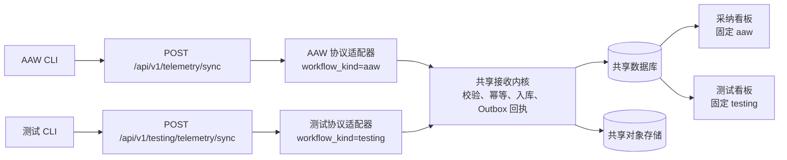

# 测试工作流遥测与看板设计

> 状态：方案设计，待评审后实施  
> 范围：独立测试工作流 CLI、Telemetry Server 的测试 API、测试看板数据隔离  
> 非目标：重写 AAW CLI、复制一套 Telemetry Server、在本阶段定义完整测试工作流编排

## 1. 背景与目标

当前 Telemetry Server 与 AAW CLI 的协议及数据模型围绕 AAW 工作流设计。现有采纳看板与新增的测试看板都依赖同一服务，但测试工作流需要拥有独立的 CLI、版本、状态文件和领域模型。

本方案采用 **独立 API 边界 + 共享服务端内核 + 数据维度隔离**：

- 现有 AAW CLI 继续调用原接口，零协议改动；
- 测试 CLI 只调用测试 API，不依赖 AAW CLI 的代码、目录或步骤名称；
- Server 在路由层确定工作流类别，客户端不传、也不能伪造类别；
- 两类数据共享数据库、对象存储、幂等机制和归因能力，但所有查询按类别隔离；
- 测试看板只读取测试工作流数据，采纳看板只读取 AAW 数据。

## 2. 总体架构



`workflow_kind` 是仅在服务端内部使用的标准化字段，取值在本阶段固定为 `aaw`、`testing`。它不能由 HTTP 请求体指定，而由路由适配器注入。

## 3. 边界与职责

| 层级 | AAW | 测试工作流 | 共享部分 |
|---|---|---|---|
| CLI | `aaw` 命令、`.sdd` 状态、AAW 工作流定义 | 独立命令（暂称 `testwf`）、独立状态目录、测试工作流定义 | Git 身份识别、可靠发送库可复用 |
| HTTP API | `/api/v1/telemetry/*` | `/api/v1/testing/telemetry/*` | 网关、鉴权、中间件、错误格式 |
| Server 适配 | AAW payload 转标准事件 | 测试 payload 转标准事件 | 校验、幂等、持久化、对象上传、归因 |
| 数据 | `workflow_kind=aaw` | `workflow_kind=testing` | 同一数据库及对象存储 |
| 看板 | 请求固定 `aaw` | 请求固定 `testing` | 聚合查询与图表组件 |

测试 CLI 可以复用一个小型、无 AAW 领域依赖的 `telemetry-client` 包；该包只提供鉴权、HTTP、幂等重试、持久化 outbox 和对象上传。工作流状态机、步骤定义、命令参数和本地目录不得复用 AAW 实现。

## 4. API 设计

### 4.1 API 路径

| 用途 | AAW（保留） | 测试工作流（新增） |
|---|---|---|
| 事件上报 | `POST /api/v1/telemetry/sync` | `POST /api/v1/testing/telemetry/sync` |
| 代码变更上传 | `PUT /api/v1/objects/step-diffs/{message_id}` | `PUT /api/v1/testing/objects/code-changes/{message_id}` |
| 看板筛选 | `GET /api/v1/dashboard/filter-options` | `GET /api/v1/testing/dashboard/filter-options` |
| 看板聚合 | `GET /api/v1/dashboard/*` | `GET /api/v1/testing/dashboard/*` |

测试 API 不接受 `workflow_kind`；服务端在进入共享内核前固定注入 `testing`。原 AAW API 固定注入 `aaw`。即便客户端遗漏字段或恶意传递同名字段，也不能改变归属。

测试看板接口可以先复用已有聚合实现：路由将 `workflow_kind=testing` 固定为不可覆盖的查询条件。将来测试指标明显分化时，再在 `/api/v1/testing/dashboard/*` 下增加测试专有聚合，而不改变前端入口。

### 4.2 测试事件契约（v1）

测试 CLI 上报一个步骤事件。`message_id` 是单事件幂等键；相同 ID 与相同标准化内容返回 `duplicate`，不同内容返回 `409 MESSAGE_CONFLICT`。

```json
{
  "message_id": "8e268742-7cdc-4f75-a72f-3146f9de0c39",
  "workflow_id": "a6ff1ec6-e7dd-4d8b-98b9-ef7392a86626",
  "cli_version": "0.1.0",
  "repository": "example-service",
  "user": { "email": "developer@example.com", "name": "Developer" },
  "started_at": 1784966400000,
  "completed_at": 1784966700000,
  "updated_at": 1784966700000,
  "event": {
    "step_id": "case-design-01",
    "step_type": "case-design",
    "step_name": "设计登录模块测试用例",
    "attempt": 1,
    "status": "done",
    "started_at": 1784966400000,
    "completed_at": 1784966700000,
    "test_summary": {
      "cases_total": 12,
      "cases_passed": 10,
      "cases_failed": 1,
      "cases_blocked": 1
    }
  }
}
```

字段约束：

- `workflow_id`：测试 CLI 首次创建工作流时生成 UUID；同一工作流永不变更。
- `message_id`：建议以 `workflow_id + step_id + attempt + status` 生成 UUIDv5；重试必须保持不变。
- `repository`：服务端根据项目注册表校验；不得信任本地目录名作为唯一身份。
- `status`：`start`、`done`、`failed`、`blocked`；终态必须携带 `completed_at`。
- `test_summary`：仅终态允许；四个数均为非负整数，`passed + failed + blocked <= total`。
- 所有时间均为 Unix 毫秒，且服务端校验步骤、工作流与消息的时间先后关系。

测试工作流不使用 AAW 的 `sr`、`ar`、`aaw_version`、`task-dev` 等字段。服务端适配器负责将 `cli_version`、用户对象和测试事件映射为通用内部模型。

### 4.3 测试代码变更与归因

当前归因类指标来自完成的 `task-dev` Diff。测试 CLI 若只上报步骤状态，测试看板可以显示工作流和用例结果，但“AI 生成代码量、满足 60% 一致度的 AI 合入代码量、AI 生成占比”将没有数据。

因此测试 API v1 应定义测试代码变更事件，而不是让测试 CLI 伪装成 AAW 的 `task-dev`：

```json
{
  "event": {
    "step_id": "implement-tests-01",
    "step_type": "test-code-change",
    "attempt": 1,
    "status": "done",
    "change_artifact": {
      "file_name": "TP-20260725-001-tests.diff",
      "sha256": "<64 位小写 SHA-256>",
      "change_kind": "test_code"
    }
  }
}
```

事件被接受后，测试 CLI 上传原始 Git Diff 至测试对象接口。服务端校验 SHA-256 后创建通用的 `ChangeRun` 记录并触发归因。AAW 的 `task-dev` 也应逐步被适配为 `ChangeRun(change_kind=production_code)`；保留原有 `DevRun` 读模型或兼容视图，避免一次性重写已有看板。

归因策略需要按项目配置选择目标分支；测试代码的采纳口径为“测试 Diff 中有效代码行，最终出现在目标分支的行数”。首期可沿用现有 mock 归因，真实 Git/MR 归因上线前必须补充测试代码路径和重命名文件的覆盖用例。

## 5. 数据模型与查询隔离

### 5.1 公共表变更

所有公共事实表新增 `workflow_kind VARCHAR(32) NOT NULL`：

- `workflow_runs`：工作流的归属与最重要的查询条件；
- `telemetry_messages`：便于审计、排障和消息级过滤；
- `step_executions`：避免跨类别步骤聚合；
- `change_runs`（或过渡期的 `dev_runs`）：保证归因和看板的来源一致。

索引至少包括：

```text
workflow_runs(workflow_kind, project_key, started_at)
workflow_runs(workflow_kind, last_activity_at)
telemetry_messages(workflow_kind, user_email, step_completed_at)
change_runs(workflow_kind, completed_at)
```

### 5.2 测试专有表

新增 `test_execution_summaries`，而不是把所有测试字段塞入公共 JSON：

```text
id
workflow_run_id              FK workflow_runs
step_execution_id            FK step_executions
cases_total
cases_passed
cases_failed
cases_blocked
metadata_json                仅放低频扩展字段
created_at
updated_at
```

这样测试看板可以高效聚合用例通过率、失败数和阻塞数；公共查询不需要了解测试领域字段。

### 5.3 看板约束

测试看板的所有请求由测试专用路由生成固定过滤条件：

```text
workflow_kind = testing
```

客户端传入的同名查询参数必须被忽略或返回 `400`。采纳看板同理固定 `workflow_kind = aaw`。这是数据隔离规则，不是可选筛选条件。

## 6. 鉴权与安全

独立 API 需要独立凭据。建议使用 API Key 或短期 Bearer Token，并维护以下服务端 scope：

| Scope | 允许路径 | 固定类别 |
|---|---|---|
| `telemetry:aaw:write` | `/api/v1/telemetry/*` | `aaw` |
| `telemetry:testing:write` | `/api/v1/testing/telemetry/*` | `testing` |
| `telemetry:testing:object-write` | `/api/v1/testing/objects/*` | `testing` |
| `dashboard:testing:read` | `/api/v1/testing/dashboard/*` | `testing` |

对象上传时，服务端须确认 `message_id` 所属类别与路由类别一致，防止用测试凭据上传或覆盖 AAW 的 Diff。日志中记录类别、凭据主体、`workflow_id`、`message_id` 和项目，但不得记录令牌正文或 Diff 内容。

## 7. 测试 CLI 设计约束

测试 CLI 是独立产品，建议具备：

```text
命令：testwf start | finished
配置：TESTWF_TELEMETRY_ENDPOINT、TESTWF_TELEMETRY_TOKEN
本地状态：.testwf/ 或用户目录下 ~/.testwf/
待发队列：~/.testwf/telemetry/outbox/
```

`start` 先原子写本地工作流状态、建立 D0 Git 树快照并上报开始事件；`finished` 建立 D1 快照、生成 D0→D1 Diff 后上报结束事件并上传 Diff。事件和 Diff 先写入 outbox，收到 `accepted` 或 `duplicate` 后删除对应 outbox 条目。网络失败不得阻塞本地测试流程；后续 `start` 或 `finished` 应自动补发未确认事件。

测试 CLI 不读取 `.sdd`、不调用 AAW 命令、不引用 AAW 的版本变量，也不将测试步骤命名为 `task-dev` 来兼容服务端。

## 8. 服务端实现分层

```text
routers/
  telemetry.py                 # 既有 AAW HTTP 适配器，注入 aaw
  testing_telemetry.py         # 新增测试 HTTP 适配器，注入 testing
  objects.py                   # 既有 AAW 对象路由
  testing_objects.py           # 新增测试对象路由
services/
  event_ingestion.py           # 标准事件校验、幂等、公共事实表写入
  testing_ingestion.py         # 测试摘要映射与专有表写入
  change_attribution.py        # 通用代码变更归因
  queries.py                   # 公共聚合，强制接收内部类别过滤器
```

路由层是唯一允许决定类别的地方。业务服务接收已经标准化、带内部 `workflow_kind` 的命令对象；不得从原始 HTTP JSON 的可选字段推断类别。

## 9. 迁移与发布计划

1. **数据迁移**：新增类别列，历史数据全部回填 `aaw`；建立索引；部署期间先保留旧 `DevRun` 模型。
2. **服务端内核**：抽取公共事件入库与类别约束；既有 AAW 路由适配到新内核，回归现有 API 和看板。
3. **测试 API**：实现测试事件、测试摘要、测试对象上传、测试凭据与 OpenAPI 文档。
4. **测试 CLI MVP**：完成独立状态、outbox、`start/done/retry` 和测试 API 客户端。
5. **测试看板接线**：改为测试专属 dashboard API；首期展示现有的代码采纳指标和测试用例摘要。
6. **归因扩展**：实现 `ChangeRun`、真实测试代码归因和对应的回归测试。
7. **灰度发布**：按测试项目启用，监控拒绝率、重复率、outbox 堆积、跨类别查询命中数和归因延迟。

回滚策略：测试路由、凭据和看板是新增能力，可独立下线；历史 AAW 路由及数据不依赖测试 CLI。迁移脚本须保留向下兼容读路径，直到测试能力稳定后再清理旧读模型。

## 10. 验收标准

- AAW CLI 不升级时仍能上报，服务端写入 `workflow_kind=aaw`。
- 测试 CLI 不含 AAW 专有字段，仍能完整上报、重试并查询数据。
- 测试 API 的任意请求都不能写入 `aaw` 类别；AAW API 也不能写入 `testing` 类别。
- 两类工作流在同一仓库、同一用户、同一时间窗内并行运行时，两个看板统计互不包含对方数据。
- 重复事件返回 `duplicate`；相同 `message_id` 不同内容返回 `409`；上传对象所属类别不匹配时返回拒绝。
- 测试代码变更完成上传与归因后，测试看板展示 AI 生成代码量、满足 60% 一致度的 AI 合入代码量，以及 `AI 合入代码量 / 匹配 MR 总行数` 得到的 AI 生成占比。
- 网络中断后，测试 CLI 重启并执行 `retry` 可补发所有待发事件，且不会重复计数。

## 11. 待确认决策

实施前需要业务方确认以下事项：

1. 测试 CLI 的最终命令名和工作流状态文件位置；
2. 测试看板首期是否同时展示“用例通过率/失败/阻塞”，还是仅展示代码采纳指标；
3. 测试代码归因的目标分支、MR 平台和“合入”判定口径；
4. API Key 的签发、轮换、撤销及项目级授权责任方；
5. 历史 AAW 数据是否需要补齐代码类别，或只保证类别回填为 `aaw`。
