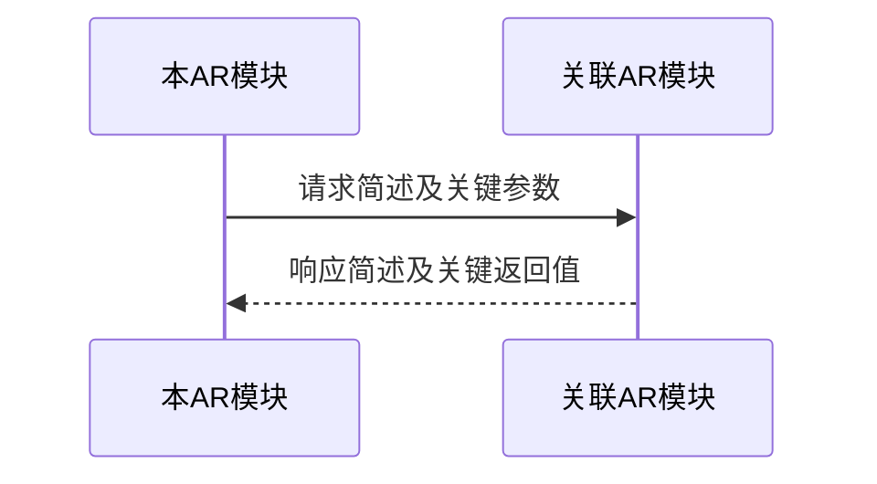

# AR 需求范围说明

## 基本信息

| 字段 | 内容 |
|------|------|
| AR ID | *[填写，如 AR-001]* |
| AR 标题 | *[填写]* |
| 输入模式 | *[SR 派生 / 直接 AR]* |
| 承接模块 | *[填写]* |
| 来源文档/描述 | *[SR 派生模式填写原 SR 文档路径；直接 AR 模式填写 AR 原文、链接或描述来源]* |
| 日期 | *[填写]* |

---

> 模板填写说明：SR 派生模式下，带"从 SR 设计文档提取"的占位内容按语义提取——技术事实和约束原样保留，允许重组结构以适配本文档章节，但不得丢失接口契约、字段定义、约束条件、验收判据等可执行细节，也不得把明确的技术结论改写成模糊摘要。直接 AR 模式下，将直接 AR 来源中的对应信息和澄清结果写入同一章节；来源没有提供的信息必须标记为"待澄清"或写明"直接 AR 输入未提供，已通过澄清补充"。

## 1. AR 概述

### 1.1 职责与交付价值

*[从 SR 设计文档的"AR 拆分 → AR 概览与边界"中该 AR 所在行，以及"背景与范围"中，提取该 AR 的核心职责与交付价值。如有需要，补充业务背景以帮助理解。]*

### 1.2 承接的需求

*[从 SR 设计文档的"需求追溯"章节中，提取承接 AR 为本 AR 的需求行。处置为"范围外/延期/不实现"但与本 AR 直接相关的行，也一并列出并注明处置，避免后续误实现。]*

| 原始需求（原文引用或位置） | 处置 | 说明 | 确认来源 |
|:---------------------------|:-----|:-----|:---------|
| *[填写]* | *[实现/范围外/延期/不实现]* | *[填写]* | *[问题池编号]* |

---

## 2. AR 边界说明

*[从 SR 设计文档的"AR 拆分 → AR 概览与边界"表中该 AR 所在行的"范围外（不负责）"列提取不负责的内容，与该行的职责描述一起展开为下表。]*

| 维度 | 范围内（该 AR 负责） | 范围外（该 AR 不负责） |
|:-----|:---------------------|:-----------------------|
| 功能 | *[具体做什么]* | *[明确不做什么，由哪个 AR 负责]* |
| 数据 | *[管理哪些数据、表]* | *[哪些数据不归该 AR 管，由哪个 AR 负责]* |
| 接口 | *[对外暴露什么接口]* | *[哪些接口由其他 AR 提供]* |
| 异常处理 | *[该 AR 内部处理的异常]* | *[哪些异常应由调用方或依赖方处理]* |

---

## 3. 依赖关系与交互接口

*[从 SR 设计文档的"AR 拆分"章节中，提取与该 AR 相关的所有依赖关系和接口契约定义。]*

### 3.1 依赖关系

*[从"AR 概览与边界"表中该 AR 行的"依赖 AR""可并行组"列，以及其他 AR 行中把本 AR 列为依赖的条目，提取双向依赖关系。]*

| 依赖方向 | 关联 AR | 依赖说明 |
|:---------|:--------|:---------|
| 本 AR 依赖 | *[AR ID]* | *[依赖什么]* |
| 依赖本 AR | *[AR ID]* | *[对方依赖本 AR 的什么]* |

**可并行组**：*[本 AR 所属的可并行组，及可与之并行的 AR；无则写"无"]*

### 3.2 交互接口

*[从 SR 设计文档的"AR 拆分 → AR 间接口契约"中，提取该 AR 作为调用方或提供方的所有条目。每一对依赖关系一个子节。]*

#### [本 AR] 与 [关联 AR] 的交互接口

| 交互方向 | 交互方式 | 接口/事件/数据描述 | 关键字段 | 触发条件与时机 | SLA / 超时 |
|:---------|:---------|:-------------------|:---------|:---------------|:-----------|
| *[谁调用谁]* | *[同步接口/异步消息/共享数据]* | *[接口路径或事件名称]* | *[请求关键字段、响应关键字段]* | *[何时调用、调用频率]* | *[填写]* |

**接口契约补充说明**：
- **幂等性要求**：*[哪些接口需要幂等，如何实现]*
- **重试策略**：*[失败后的重试次数、间隔、退避策略]*
- **降级方案**：*[接口不可用时的降级行为]*
- **数据一致性**：*[跨 AR 的数据一致性保障方式]*

#### 交互时序图

*[从 SR 设计文档的"时序与数据 → 主流程时序"中，截取本 AR 与关联 AR 之间的消息往返，重绘为本 AR 视角的时序图]*

```mermaid
sequenceDiagram
    participant 本AR模块
    participant 关联AR模块
    本AR模块->>关联AR模块: 请求简述及关键参数
    关联AR模块-->>本AR模块: 响应简述及关键返回值
```

*[文字说明：保留 SR 设计文档中与这些消息相关的处理逻辑、分支条件与状态流转说明]*

---

## 4. 功能设计

*[从 SR 设计文档的"背景与范围""前提与约束""关键设计决策""时序与数据"等章节中，提取与该 AR 相关的内容写入以下各子节。]*

### 4.1 主成功场景

*[从"背景与范围"的范围内条目和"关键设计决策"中影响本 AR 的决策，整理出本 AR 在主成功场景中承担的步骤]*

### 4.2 关键设计决策与约束

*[提取"关键设计决策"中影响面涉及本 AR 的决策，保留决策点、选择、理由、影响面四要素；同时提取"前提与约束"中限制本 AR 设计选择的约束条目。]*

| 决策点/约束 | 结论 | 理由/来源 | 对本 AR 的影响 |
|:------------|:-----|:----------|:---------------|
| *[填写]* | *[选择或约束内容]* | *[为什么这样选 / 约束来源]* | *[动到哪些模块、接口、数据]* |

### 4.3 模块职责

*[提取本 AR 承接模块的职责描述]*

| 模块 | 职责 | 对外接口 | 说明 |
|:-----|:-----|:---------|:-----|
| *[该 AR 的承接模块]* | *[填写]* | *[填写]* | *[填写]* |

### 4.4 模块交互时序

*[从"时序与数据 → 主流程时序"中截取本 AR 参与的消息往返及对应文字说明。与 3.2 的跨 AR 时序图不重复：本节聚焦本 AR 内部及其与外部依赖的交互。]*

### 4.5 数据设计

*[从"时序与数据 → 数据模型"中提取本 AR 负责的表/结构、关键字段、变更类型、存储与保留策略]*

| 表名/结构 | 用途 | 关键字段 | 变更类型 | 存储与保留策略 |
|:----------|:-----|:---------|:---------|:---------------|
| *[填写]* | *[填写]* | *[字段名、类型、含义]* | *[新增/修改]* | *[填写]* |

### 4.6 异常场景

*[从"时序与数据 → 异常与冲突场景"中提取本 AR 需要处理的场景]*

| 场景 | 触发条件 | 系统表现 | 处理/恢复方式 |
|:-----|:---------|:---------|:--------------|
| *[填写]* | *[填写]* | *[填写]* | *[填写]* |

---

## 5. 外部依赖

*[从 SR 设计文档的"外部依赖"章节中，提取与该 AR 相关的所有外部依赖条目。]*

| 依赖名称 | 提供方 | 用途 | 接口概述 | SLA / 超时 | 异常处理策略 |
| -------- | ------ | ---- | -------- | ---------- | ------------ |
| *[填写]* | *[填写]* | *[填写]* | *[填写]* | *[填写]* | *[填写]* |

---

## 6. 对外接口

*[从 SR 设计文档的"对外接口"章节中，提取该 AR 承接模块相关的所有对外接口。]*

| 接口名称 | 协议 | 用途 | 输入（关键字段） | 输出（关键字段） | 异常返回 |
| -------- | ---- | ---- | ---------------- | ---------------- | -------- |
| *[填写]* | *[填写]* | *[填写]* | *[填写]* | *[填写]* | *[填写]* |

*[每个接口补充：认证鉴权、幂等性、版本号、性能承诺、新增还是修改旧接口]*

---

## 7. DFX 与验收要求

*[从 SR 设计文档的"DFX 与验收"章节中，提取与该 AR 相关的验收项，保留其类别、通过标准和验证方式。本节只写通过判据，不写测试步骤。]*

| 验收项 | 类别 | 要求与通过标准 | 验证方式 |
|:-------|:-----|:---------------|:---------|
| *[填写]* | *[主流程/异常/接口契约/数据一致性/性能/安全·可靠·可服务]* | *[可量化的通过判据]* | *[如何验证]* |

---

## 8. 配置设计

*[从 SR 设计文档的"附录 C 配置、三方件与架构增量"中，提取与该 AR 相关的配置项与三方件。]*

| 配置项 | 配置说明 | 默认值 | 安全约束 |
| :----- | :------- | :----- | :------- |
| *[填写]* | *[填写]* | *[填写]* | *[填写]* |

---

## 9. 用例设计

*[基于 SR 中的功能描述和澄清结果，从以下四个维度设计验证场景，用于指导后续详细设计阶段的测试设计。用例聚焦于 AR 的对外行为验证，不涉及内部实现细节。]*

### 9.1 正常用例

*[覆盖主成功场景及正常分支，验证 AR 的核心功能正确性]*

| 用例名称 | 前置条件 | 触发动作 | 预期结果 |
|:---------|:---------|:---------|:---------|
| *[填写]* | *[数据/状态/环境要求]* | *[具体的调用或操作]* | *[系统应有的响应或状态变更]* |

### 9.2 异常用例

*[覆盖 AR 内部处理的异常场景，验证错误处理逻辑]*

| 用例名称 | 前置条件 | 触发动作 | 预期结果 |
|:---------|:---------|:---------|:---------|
| *[填写]* | *[数据/状态/环境要求]* | *[具体的异常触发方式]* | *[系统应有的错误响应或回滚行为]* |

### 9.3 边界用例

*[覆盖边界条件、并发冲突、数据量极限等场景]*

| 用例名称 | 前置条件 | 触发动作 | 预期结果 |
|:---------|:---------|:---------|:---------|
| *[填写]* | *[数据/状态/环境要求]* | *[具体的边界触发方式]* | *[系统应有的行为]* |

### 9.4 依赖交互用例

*[覆盖该 AR 与其他 AR 或外部服务的交互场景，验证接口契约的正确性]*

| 用例名称 | 涉及依赖方 | 前置条件 | 触发动作 | 预期结果 |
|:---------|:-----------|:---------|:---------|:---------|
| *[填写]* | *[依赖的 AR 或外部服务]* | *[数据/状态/环境要求]* | *[具体的调用或消息触发]* | *[系统应有的响应或状态变更]* |

---

## 10. 澄清与补充

*[本章节记录在 AR 澄清过程中，对 SR 设计文档中未明确的内容进行补充和细化的结果。]*

### 10.1 接口定义澄清

*[补充接口的输入输出字段细节、错误码、认证鉴权方式等 SR 中未明确的内容]*

### 10.2 数据模型澄清

*[补充表结构变更细节、字段约束、数据迁移方案等 SR 中未明确的内容]*

### 10.3 业务逻辑澄清

*[补充边界条件、校验规则、异常处理、幂等性等 SR 中未明确的内容]*

### 10.4 模块交互澄清

*[补充调用关系、时序、超时重试策略、降级方案等 SR 中未明确的内容]*

### 10.5 配置与部署澄清

*[补充开关、配置项、环境差异等 SR 中未明确的内容]*

### 10.6 兼容性澄清

*[补充与现有接口/数据的兼容、升级策略等 SR 中未明确的内容]*

---

> **使用说明**：本文件是后续详细设计和开发工作的唯一输入。SR 设计文档中与该 AR 相关的技术事实、约束与验收判据已按语义提取到本文档，并补充了澄清结果。阅读者无需翻阅 SR 设计文档或其他 AR 的内容。
