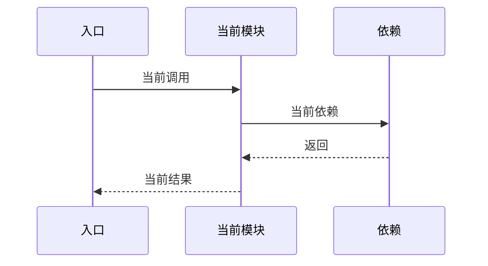

# 模块详细设计 ASIS context 模板

ASIS 阶段只更新同名前缀 `.context.md`，不创建、不编辑、不覆盖正式《{AR编号}-{需求短名}-{模块名}模块详细设计说明书.md》。正式说明书只能由 TOBE 阶段基于本 context 中的证据和结论生成。

本模板用于记录 ASIS 边界、需求理解、探索任务、分任务查证结果、主 Agent 复核吸收、证据、调用链、测试覆盖和阻塞项。所有会影响 TOBE、AICoding、验证或风险判断的 ASIS 结论，都必须在 `.context.md` 中有稳定编号和证据编号，供 TOBE 阶段引用进正式说明书。

## 固定目录规则

生成或更新 `.context.md` 时，必须保留本模板的固定一级目录 `C1` 至 `C15`。某章暂时没有内容时，不得删除标题，应写：

- `不适用，原因：...`
- `未完成，原因：...；影响：...；下一步需要：...`

ASIS context 必须随分析推进逐步维护，不得在所有查证结束后首次生成整份文档。强制写入门槛：

1. 边界和初步线索明确后，更新 `C1` 至 `C4`。
2. 启动 SubAgent 或深入查证前，更新 `C5`。
3. 每批查证完成后，更新 `C6`、`C13` 和 `C14`。
4. 主 Agent 复核吸收后，更新 `C7` 至 `C12`。
5. 结束前检查所有固定目录，补齐不适用、未完成、阻塞和待确认说明。

如果无法直接写文件，必须在会话中维护同等结构的阶段草稿。最终整理只能统一编号、补齐缺章和修正措辞，不得把“现在写完整 context”作为第一次写入动作。

正式 `.context.md` 不得包含对话痕迹、心理活动、工具试错叙事、执行者自评或“过程回顾”式流水账。`C13` 只记录对后续 TOBE 和 Gate 有用的检索摘要。

## C1. ASIS 状态与阅读说明

本章给读者一个入口摘要：本次 ASIS 分析到了什么程度、能支撑什么、还有什么不能支撑。

| 项目 | 内容 |
|---|---|
| 本次需求/AR/变更点 |  |
| 变更类型 | 既有行为改造 / 纯新增行为 / 混合变更 |
| 目标模块 |  |
| 仓库范围 |  |
| 模块边界来源 | `.sdd/software_architecture.md` |
| 边界来源类型 | declared / blocked |
| 本次 ASIS 分析范围 | 需求相关切片 / 完整模块 |
| 是否发生范围扩展 | 否 / 是，原因： |
| ASIS 状态 | 完成 / 部分完成 / 阻塞 |
| 分析置信度 | 高 / 中 / 低 |
| 后续 TOBE 可引用结论 | A1 / A2 / ... |
| 不得定稿的结论 |  |
| 阻塞或待确认项 |  |

当分析置信度为 `低`，或关键结论依赖 `推断/待确认` 时，必须在 `C12` 中记录影响和所需输入，不能只在摘要区标记低置信度后继续流转。

## C2. 需求理解与现状关注点

本章记录 ASIS 如何理解本次需求，以及这些需求会转化成哪些需要查证的代码问题。这里不写 TOBE 方案，也不要求用户选择实现路径。

| 编号 | 需求/AR/功能点/影响点 | 本模块相关性 | 现状关注点 | 需要查证的 ASIS 问题 | 后续探索任务 |
|---|---|---|---|---|---|
| R1 |  | 需求相关 / 疑似相关 / 不涉及本模块 | 入口 / 数据 / 配置 / 权限 / 兼容 / 测试 / 风险 |  | Q1 |

## C3. 模块边界确认

本章只记录模块边界和本次分析切片。模块边界只能来自 `.sdd/software_architecture.md`；代码结构只能用于边界确认后的 ASIS 事实分析。

| 来源 | 发现 | 边界来源类型 | 影响 |
|---|---|---|---|
| `.sdd/software_architecture.md` |  | declared / blocked |  |

### C3.1 模块边界

| 分类 | 路径或组件 | 判断依据 | 证据编号 |
|---|---|---|---|
| 确定属于模块 |  |  | E1 |
| 疑似属于模块 |  |  | E1 |
| 外部依赖 |  |  | E1 |

### C3.2 本次需求相关分析范围

| 分类 | 路径、组件或行为 | 纳入/排除原因 | 证据编号 |
|---|---|---|---|
| 需求相关 |  |  | E1 |
| 疑似相关 |  |  | E1 |
| 本次不分析 |  |  | E1 |

说明为什么 ASIS 限定在该切片内，或为什么必须扩展为完整模块分析。

## C4. 初步代码线索地图

本章记录初步探索发现的可能相关位置，用于支撑 `C5` 的探索任务清单。这里的内容只是线索，不等同于最终 ASIS 事实。

| 线索编号 | 线索类型 | 位置或查询 | 初步发现 | 关联需求/关注点 | 后续任务 |
|---|---|---|---|---|---|
| L1 | 入口 / 配置 / 测试 / 同类实现 / 依赖 / 文档 |  |  | R1 | Q1 |

## C5. ASIS 探索任务清单

本章是 ASIS 的任务分解入口。每个任务应回答一个明确的代码问题，由 SubAgent 查证、主 Agent 复核吸收。

| 任务编号 | 问题 | 来源需求/关注点 | 初始线索 | 查证范围 | 优先级 | 执行者 | 状态 |
|---|---|---|---|---|---|---|---|
| Q1 |  | R1 | L1 |  | P0 / P1 / P2 | SubAgent | 待查 / 已查 / 未完成 |

任务问题示例：

- 当前机制是如何实现的？
- 是否已有类似实现可以参考？
- 当前流程在异常、回滚、重试或幂等场景下如何表现？
- 配置文件在哪里，如何加载，默认值如何生效？
- 是否存在隐藏开关、兼容分支、历史迁移或测试夹具约束？

## C6. 探索任务结果汇总

本章记录每个探索任务的查证输出。SubAgent 结果必须先落在这里，再由主 Agent 在 `C7` 复核吸收。

| 任务编号 | 结论摘要 | 类型 | 证据编号 | 已查范围 | 未覆盖范围 | 置信度 | 对 TOBE/AICoding 的影响 |
|---|---|---|---|---|---|---|---|
| Q1 |  | 事实 / 推断 / 待确认 / 阻塞相关 | E1 |  |  | 高 / 中 / 低 |  |

如果任务未完成，写明未完成原因、影响范围和下一步需要的输入。不得把未完成任务的推断当成事实。

## C7. 主 Agent 复核与吸收记录

本章记录主 Agent 如何复核、合并、修正或拒绝 `C6` 的查证结果。只有被吸收的结论才能进入关键 ASIS 事实。

| 复核编号 | 来源任务 | 复核动作 | 复核证据 | 吸收结果 | 生成/关联 ASIS 结论 | 说明 |
|---|---|---|---|---|---|---|
| V1 | Q1 | 抽查代码 / 合并冲突 / 补查 / 未采纳 | E1 | 已吸收 / 修正后吸收 / 未采纳 / 转待确认 / 转阻塞 | A1 |  |

低置信度、证据无法定位、只基于命名推断、文档与代码冲突或影响关键 ASIS 判断的结论，必须经过补查、待确认或阻塞处理。

## C8. 完整需求/AR 与 ASIS 证据映射

本章证明本次 ASIS 是否覆盖了后续 TOBE 需要的现状事实。

| 编号 | 需求/AR/功能点/影响点 | 本模块相关性 | 现有入口/新增对象状态/代码区域/数据对象/配置/交互 | 探索任务 | ASIS 结论编号 | ASIS 结论 | 证据编号 | 覆盖状态 | 未覆盖或待确认原因 |
|---|---|---|---|---|---|---|---|---|---|
| R1 |  | 需求相关 / 疑似相关 / 不涉及本模块 |  | Q1 | A1 | 事实 / 推断 / 待确认： | E1 | 已覆盖 / 部分覆盖 / 待确认 / 不涉及本模块 |  |

纯新增行为应记录新增对象当前不存在的检索证据、相邻同类实现；如果不存在相邻同类实现，应记录检索证据并标明未发现可复用惯例。不得因为不存在既有实现而跳过 ASIS，也不得在 ASIS 中提前写 TOBE 方案。

## C9. 关键 ASIS 事实

本章只列会影响 TOBE 决策、工程落点、接口、数据库、任务拆分、验证或风险控制的事实、推断或待确认项。

| ASIS 结论编号 | 关键现状结论 | 类型 | 对 TOBE/AICoding 的影响 | 来源任务 | 证据编号 | 备注 |
|---|---|---|---|---|---|---|
| A1 |  | 事实 / 推断 / 待确认 / 阻塞相关 |  | Q1 | E1 |  |

## C10. 当前机制、流程、调用链与数据流

本章说明当前系统如何运行。涉及多入口、多组件协作、跨模块交互、状态变化、写后读、异常路径或回滚时，必须提供现状流程图或时序图；简单单函数变更可写明不适用原因。

| 链路/数据对象 | 当前行为 | 与本次需求/变更的关系 | 对 TOBE 的约束 | 证据编号 |
|---|---|---|---|---|
|  |  |  |  | E1 |

## C11. 配置、数据、测试、依赖现状

本章集中记录容易被遗漏但会影响设计的工程约束。`software_architecture.md` 可以提供配置位置和作用线索，但配置事实以代码、配置文件、测试和运行注册逻辑为准。

| 主题 | ASIS 行为 | 风险或限制 | 与本次需求/变更的关系 | 证据编号 |
|---|---|---|---|---|
| 配置 / 参数校验 / 权限 / 异常 / 事务 / 并发 / 幂等 / 重试 / 降级 / 测试 / 外部依赖 |  |  |  | E1 |

### C11.1 测试覆盖现状

| 测试文件或套件 | 覆盖行为 | 与本次需求/变更的关系 | 未覆盖风险 | 证据编号 |
|---|---|---|---|---|
|  |  |  |  | E1 |

## C12. 隐藏机制、规格漂移、待确认与阻塞

本章记录影响后续设计的隐藏约束、规格漂移、待确认问题和 ASIS 阻塞项。

| 编号 | 类型 | 现状/漂移/风险 | 影响 | 后续关注点 | 证据编号 |
|---|---|---|---|---|---|
| A1 | 兼容 / 历史 / 性能 / 数据 / 安全 / 运维 / 测试 / 规格漂移 |  |  |  | E1 |

### C12.1 待确认问题

| 问题 | 类型 | 为什么影响 TOBE/AICoding | 当前线索 | 建议确认对象 |
|---|---|---|---|---|
|  | 需前置确认 / 普通待确认 |  |  | 用户 / 代码负责人 / 上游设计 / 运行环境 |

### C12.2 ASIS 阻塞项

仅当 ASIS 状态为 `阻塞` 或 `部分完成` 时填写。

| 阻塞项 | 阻塞原因 | 已完成分析范围 | 不能确认的结论 | 需要补充的输入 | 对 TOBE/AICoding 的影响 |
|---|---|---|---|---|---|
|  |  |  |  |  |  |

## C13. 代码检索过程

本章记录主要检索路径，方便 TOBE 和 Gate 判断 ASIS 是否充分，不要求记录无关试错。

| 步骤 | 查询/文件 | 目的 | 结果摘要 | 关联任务 |
|---|---|---|---|---|
|  |  |  |  | Q1 |

## C14. 证据索引

本章是后续 TOBE 和 Gate 反查证据的唯一索引。证据应尽量定位到文件行号；无法定位行号时，记录类名、函数名、配置项、测试名、迁移文件、路由、表名、Topic 或命令输出摘要。

| 编号 | 证据类型 | 位置 | 支撑结论 |
|---|---|---|---|
| E1 | 文件 / 行号 / 函数 / 类 / 测试 / 配置 / 迁移 / 文档 / 命令输出摘要 | `path:line` | A1 / Q1 |

## C15. 可沉淀到模块理解文档的增量知识候选

本章只记录未来可沉淀的候选知识，不在 ASIS 阶段直接更新模块理解文档。适用于后续 module deep research 或知识沉淀流程复用。

| 候选编号 | 增量知识 | 来源证据 | 适合沉淀的位置 | 是否需要后续复核 |
|---|---|---|---|---|
| K1 |  | E1 | 模块机制 / 配置 / 测试 / 架构约束 / 运行时行为 | 是 / 否 |
