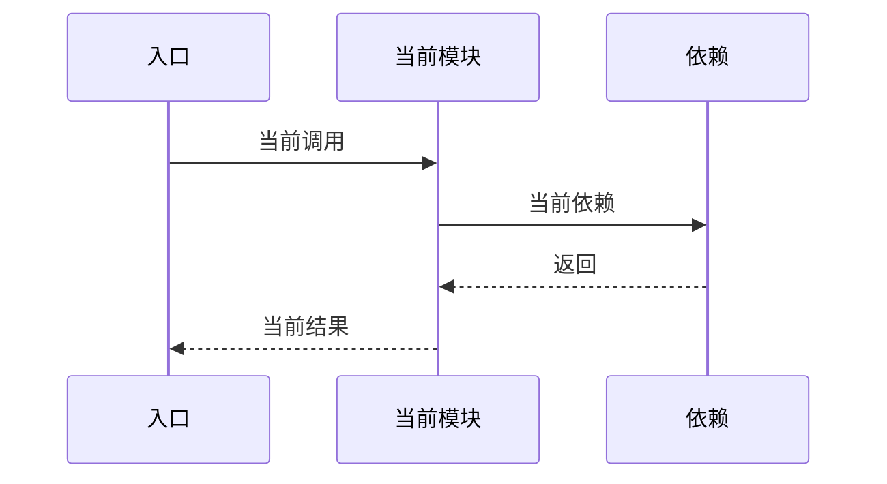

# 模块详细设计 ASIS context 模板

ASIS 阶段只更新模块目录下的 `.context/详细设计上下文.md`，不创建、不编辑、不覆盖同目录下的正式《模块详细设计说明书.md》。正式说明书只能由 TOBE 阶段基于本 context 中的证据和结论生成。

本模板记录 ASIS 查证的现状事实、证据索引、规格漂移和待确认项，供 TOBE 和 Gate 引用。所有会影响 TOBE、AICoding、验证或风险判断的 ASIS 结论，都必须在详细设计上下文中有稳定编号和证据编号。

## 设计原则：只保留下游需要的结论

本模板只输出 TOBE 和 Gate 真正消费的信息——**结论和证据**，不记录 ASIS 自身的工作过程（线索建立、任务分派、SubAgent 查证、复核动作等过程痕迹）。ASIS 的工作纪律（先线索→查证→复核→映射）由 SKILL.md 的工作流程步骤保障，过程痕迹留在主 Agent 内部会话中，不落盘到 context。

这样做的目的：最大化信息密度，避免同一个事实在线索、探索结果、复核记录、关键事实中重复四遍，降低下游阅读成本和上下文压缩风险。

## 固定目录规则

生成或更新 `.context/详细设计上下文.md` 时，必须保留本模板的固定目录 `C1` 至 `C8`。某章暂时没有内容时，不得删除标题，应写：

- `不适用，原因：...`
- `未完成，原因：...；影响：...；下一步需要：...`

## C1. ASIS 状态与阅读说明

本章给读者一个入口摘要：本次 ASIS 分析到了什么程度、能支撑什么、还有什么不能支撑。

| 项目 | 内容 |
|---|---|
| 本次需求/AR/变更点 |  |
| 变更类型 | 既有行为改造 / 纯新增行为 / 混合变更 |
| 目标模块 |  |
| 仓库范围 |  |
| 模块边界来源 | `.sdd/software_architecture.md` |
| 边界来源类型 | declared / blocked |
| 本次 ASIS 分析范围 | 需求相关切片 / 完整模块 |
| 是否发生范围扩展 | 否 / 是，原因： |
| ASIS 状态 | 完成 / 部分完成 / 阻塞 |
| 分析置信度 | 高 / 中 / 低 |
| 后续 TOBE 可引用结论 | A1 / A2 / ... |
| 不得定稿的结论 |  |
| 阻塞或待确认项 |  |

当分析置信度为 `低`，或关键结论依赖 `推断/待确认` 时，必须在 C6 中记录影响和所需输入，不能只在摘要区标记低置信度后继续流转。

## C2. 模块边界确认

本章只记录模块边界和本次分析切片。模块边界只能来自 `.sdd/software_architecture.md`；代码结构只能用于边界确认后的 ASIS 事实分析。

| 来源 | 发现 | 边界来源类型 | 影响 |
|---|---|---|---|
| `.sdd/software_architecture.md` |  | declared / blocked |  |

### C2.1 模块边界

| 分类 | 路径或组件 | 判断依据 | 证据编号 |
|---|---|---|---|
| 确定属于模块 |  |  | E1 |
| 疑似属于模块 |  |  | E1 |
| 外部依赖 |  |  | E1 |

### C2.2 本次需求相关分析范围

| 分类 | 路径、组件或行为 | 纳入/排除原因 | 证据编号 |
|---|---|---|---|
| 需求相关 |  |  | E1 |
| 疑似相关 |  |  | E1 |
| 本次不分析 |  |  | E1 |

## C3. 关键 ASIS 事实

本章是下游（TOBE 和 Gate）唯一需要的事实来源。每条结论必须有稳定编号、类型、对 TOBE 的影响和证据编号。

**类型的取值**反映结论的可靠性，也用于表达 ASIS 复核后的吸收状态：

- `事实`：已查证且复核通过，可直接被 TOBE 引用为现状约束。
- `修正后事实`：查证发现与初步判断不符，经复核修正后的最终事实。
- `推断`：基于间接证据推导，尚未有直接代码证据。
- `待确认`：影响 TOBE 决策但当前无法确认，需前置确认。
- `阻塞相关`：无法确认且阻断后续设计。
- `规格漂移`：上游设计文档（AR/SR）与实际代码不一致。
- `决策输入`：事实已查明，但存在多个设计路径，选择权属于 TOBE。

**禁止把未查证或未复核的结论标记为"事实"。** 如果某条结论还处于"初步"状态（仅凭线索、未经代码查证），类型必须标为 `推断` 或 `待确认`，不得升级为 `事实`。

| 编号 | 关键现状结论 | 类型 | 对 TOBE/AICoding 的影响 | 来源探索 | 证据编号 |
|---|---|---|---|---|---|
| A1 |  | 事实 / 修正后事实 / 推断 / 待确认 / 阻塞相关 / 规格漂移 / 决策输入 |  | Q1 | E1 |

纯新增行为应记录新增对象当前不存在的检索证据、相邻同类实现；如果不存在相邻同类实现，应记录检索证据并标明未发现可复用惯例。不得因为不存在既有实现而跳过 ASIS，也不得在 ASIS 中提前写 TOBE 方案。

## C4. 调用链与数据流

本章说明当前系统如何运行。只记录 C3 关键事实未覆盖的**流程视角**（调用顺序、数据流向），不重复 C3 已有的事实行。涉及多入口、多组件协作、跨模块交互、状态变化、写后读、异常路径或回滚时，必须提供现状流程图或时序图；简单单函数变更可写明不适用原因。

| 链路/数据对象 | 当前行为 | 与本次需求/变更的关系 | 对 TOBE 的约束 | 证据编号 |
|---|---|---|---|---|
|  |  |  |  | E1 |

```mermaid
sequenceDiagram
    participant Entry as 入口
    participant Module as 当前模块
    participant Dep as 依赖
    Entry->>Module: 当前调用
    Module->>Dep: 当前依赖
    Dep-->>Module: 返回
    Module-->>Entry: 当前结果
```

## C5. 配置、数据、测试与依赖现状

本章集中记录容易被遗漏但会影响设计的工程约束。只记录 C3 未覆盖的配置形态、测试覆盖和依赖约束。`software_architecture.md` 可以提供配置位置和作用线索，但配置事实以代码、配置文件、测试和运行注册逻辑为准。

| 主题 | 现状 | 风险或限制 | 与本次需求/变更的关系 | 证据编号 |
|---|---|---|---|---|
| 配置 / 参数校验 / 权限 / 异常 / 事务 / 并发 / 幂等 / 重试 / 降级 / 外部依赖 |  |  |  | E1 |

### C5.1 测试覆盖现状

只记录与本次需求相关的测试缺口（C3 未提及的部分）。

| 测试文件或套件 | 覆盖行为 | 与本次需求的关系 | 未覆盖风险 | 证据编号 |
|---|---|---|---|---|
|  |  |  |  | E1 |

## C6. 规格漂移、待确认与阻塞

本章记录影响后续设计的隐藏约束、规格漂移、待确认问题和 ASIS 阻塞项。

| 编号 | 类型 | 现状/漂移/风险 | 影响 | 后续关注点 | 证据编号 |
|---|---|---|---|---|---|
|  | 规格漂移 / 隐藏约束 / 性能 / 数据 / 安全 / 兼容 / 测试 |  |  |  | E1 |

### C6.1 待确认问题

| 问题 | 类型 | 为什么影响 TOBE/AICoding | 当前线索 | 建议确认对象 |
|---|---|---|---|---|
|  | 需前置确认 / TOBE 决策输入 |  |  | 用户 / 代码负责人 / 上游设计 / 运行环境 |

### C6.2 ASIS 阻塞项

仅当 ASIS 状态为 `阻塞` 或 `部分完成` 时填写。

| 阻塞项 | 阻塞原因 | 已完成分析范围 | 不能确认的结论 | 需要补充的输入 | 对 TOBE/AICoding 的影响 |
|---|---|---|---|---|---|
|  |  |  |  |  |  |

## C7. 证据索引

本章是 TOBE 和 Gate 反查证据的唯一索引。证据应尽量定位到文件行号；无法定位行号时，记录类名、函数名、配置项、测试名、迁移文件、路由、表名、Topic 或命令输出摘要。本章同时记录主要检索路径（原 C13 代码检索过程的职能合并到此），方便 TOBE 和 Gate 判断 ASIS 检索是否充分。

| 编号 | 证据类型 | 位置 | 检索方式 | 支撑结论 |
|---|---|---|---|---|
| E1 | 文件 / 行号 / 函数 / 类 / 测试 / 配置 / 迁移 / 文档 / 命令输出摘要 | `path:line` | 直接阅读 / grep / rg / 文件列表 | A1 |

## C8. 需求/AR 追溯矩阵

本章证明本次 ASIS 覆盖了后续 TOBE 需要的现状事实。每条需求、AR 项、功能点或影响点至少记录对应的 ASIS 结论和证据。

| 编号 | 需求/AR/功能点/影响点 | 本模块相关性 | ASIS 结论编号 | 证据编号 | 覆盖状态 |
|---|---|---|---|---|---|
| R1 |  | 需求相关 / 疑似相关 / 不涉及本模块 | A1 | E1 | 已覆盖 / 部分覆盖 / 待确认 / 不涉及本模块 |
