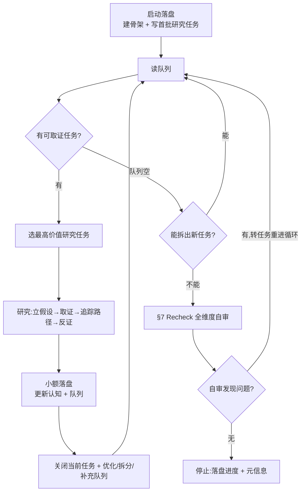

# 模块深度研究

## 1. 定位与边界

本 skill 主动研究一个既有模块，把"需要读代码才能建立的模块理解"沉淀成可复用的认知资产，让后续任何需要理解该模块的工作（设计、维护、交接、二次开发等）不用从零逆向。

- 只读代码、测试、文档和配置。
- 只写 `.sdd/modules/<module>/` 下的认知资产。
- 不得修改业务代码或伪造无法验证的结论。
- 本 skill 产出的是**模块级的稳定认知**，不针对任何特定需求或变更。

资产结构见 `<skill-dir>/references/asset-structure.md`。

## 2. 整体流程与循环结构

本 skill 的产出是一个**持续积累的模块认知库**，不是一次性报告。研究通过**单会话自循环**推进，整体形态如下：



**关键认知**：

- **驱动器是 `研究过程/研究队列.md`**——队列里有什么研究任务，就研究什么；队列空了先拆新任务，拆不出才进 recheck。
- **循环不因"任务完成"或"已总结"而停**——那只是回到队列选下一个的信号。
- **停止的唯一出口**是"队列空 + 拆不出新任务 + 自审无新问题"，停止前必须落盘进度（含元信息，见 §4）。

下文 §3–§6 是每个环节的**操作细节**（怎么做）；本节是**整体骨架**（在做什么）。理解整体在先，细节在后。

## 3. 运行模式：单会话自循环

研究在一个会话内通过**自循环**持续推进，驱动器是 `研究过程/研究队列.md`：

```text
启动落盘 → 读队列 → 选研究任务 → 研究 → 小额落盘 → 关闭/优化/拆分/补充队列 → 读队列 → …
```

只要还能从仓库只读取证，就必须继续推进，**不许浅尝辄止**。

### 自驱纪律（核心）

以下情况**不构成停止理由**，必须继续推进：

- 当前研究任务已完成——立即从队列选下一个，或从已完成任务暴露的新分支拆出子任务。
- 队列暂时为空——从覆盖不足、低置信、相邻调用方、配置入口拆出新任务。
- 已形成阶段性总结——总结只是落盘动作，不是结束。
- 下一步需要新增测试或修改代码——记入 `研究过程/待解问题.md`，转向另一个只读可取证任务。

### 停止条件

只有以下情况允许结束当前运行：

- 收到用户中断指令。
- 环境或工具限制导致无法继续读取必要材料。
- 上下文即将耗尽，必须先落盘当前进度。
- 目标模块无法定位。
- 当前研究必须依赖外部系统、生产数据、团队裁决或代码修改才能继续，**且**仓库内不存在任何可转向的只读任务。

停止前必须把当前任务状态、已更新资产、队列状态和未解问题全部落盘（落盘时同步更新文件元信息，见 §4），保证下次能从 `研究过程/研究队列.md` 继续。

## 4. 启动落盘

启动时建立可恢复的研究骨架，再开始长时间阅读：

1. 定位或创建 `.sdd/modules/<module>/`。
2. 创建缺失的认知资产骨架（见 `asset-structure.md` 初始骨架）。特别注意 `业务功能/` 下的 `业务流程/` 和 `非流程功能点/` **两个子目录都要建**——即使第一次没探索到非流程功能点，结构也要在，避免后续补充时丢失。
3. `研究过程/研究队列.md` 写入**首批研究任务**。理解不到位时，从下面 5 个固定维度切（保底模板，保证质量下限）：

   | 维度 | 首批研究任务 | 为什么先切 |
   |------|------------|-----------|
   | 入口与职责 | 模块怎么被调用、对外暴露什么 | 一切起点 |
   | 核心业务流程 | 主路径（最常见场景端到端） | 模块主心骨 |
   | 数据模型 | 涉及哪些表/数据结构 | 承载状态 |
   | 关键约束 | 明显的业务规则/不变量 | 决定边界 |
   | 异常与失败路径 | 主路径出错时怎么办 | 最易被浅尝辄止 |

   不知道入口时，先写"定位入口"任务（从 API/Controller/Handler/Job/Consumer/公开函数、测试入口、配置入口入手）。

每个认知文件顶部维护一组**元信息**（与正文内容同级维护，不是独立动作）：`状态`、`最后更新`、`最后同步提交`。其中「最后同步提交」运行结束时用 `git rev-parse HEAD` 取值填入 `<模块名>模块设计说明书.md`，作为整个认知库的基线锚点，供后续判断认知对应代码停留在哪一刻——它是只读元信息，不读 diff、不做复核、不自动刷新；环境无法执行 git 时填"无法获取"，不因此阻塞研究。

没有写入首批任务前，不得开始长时间阅读代码，也不得输出只包含意图的计划。

## 5. 研究任务循环

### 研究任务质量判据

一个合格的研究任务 = **一个可在一轮内取证完的单元**，必须同时具备：

- **明确入口**：从哪个函数/接口/事件/配置进入。
- **明确验证目标**：要查证什么具体问题或走通什么路径。
- **明确取证路径**：能指出先读哪些代码/测试。

正例："退款主路径：从退款请求到账状态变更"、"审计日志写入：触发时机与不可变性保证"。

反例（不合格）：
- "研究这个模块"——太大，无入口，无验证目标。
- "看 refund.py"——无场景，无验证目标。
- "了解所有异常"——无边界，无法在一轮内完成。

### 单轮步骤

每轮只研究一个任务，并把它推进到明确状态（`已完成` / `阻塞` / `延后`）。单轮步骤：

1. **选题**：从 `研究过程/研究队列.md` 选最高价值且当前可即时取证的任务。价值排序：能即时取证 > 命中已有重要结论 > 位于核心运行路径 > 影响数据/状态/事务/外部契约 > 低置信。
2. **立假设**：写明本轮要验证的假设、盲区或冲突。
3. **取证**：读最相关的代码、测试、配置和文档。
4. **追踪路径**：沿真实路径追踪入口 → 调用链 → 数据/状态 → 副作用 → 失败路径。
5. **反证**：用调用方、被调用方、测试、相邻实现或反向搜索挑战关键结论。
6. **落盘 + 维护队列**：更新认知资产（带证据锚点），关闭当前任务；并基于新理解对队列做三件事（见下方「队列演进三动作」）。
7. **小额增量**：每轮尽早、小额落盘，不要把大量阅读和推理积压到运行末尾再一次性写入。

若证据不足，**不要扩大结论**，也不要把问题搁在脑中。强制做两件事：① 在 `研究过程/待解问题.md` 记一条（写清问题、卡在哪、需要什么才能解）；② 在队列安排下一步取证任务（若可转向只读切片）或转下一个任务。`待解问题.md` 不是垃圾抽屉——每个条目都要在 §7 recheck 时被处理（能解的转任务重进循环解掉，解不了的标注保留原因）。

### 队列演进三动作（落盘时伴随）

研究完一个任务后，基于新理解对 `研究过程/研究队列.md` 做三件事——优化、拆分、补充并列：

- **优化**：把队列里**未做的**、过粗的、基于旧理解写得太笼统的任务，重写得更精准（补入口、补验证目标、补取证路径）。
- **拆分**：从**刚研究完**的任务里，拆出未尽子问题（分支/异常/调用方/约束/低置信点），作为子任务放回队列。
- **补充**：新理解暴露出**队列里原本没有**的全新问题，新增为任务。

**硬约束**：这三者是落盘的伴随动作，服务于提升后续研究质量；**禁止只调队列不研究**——不能花一整轮只优化/补充队列而不推进任何研究任务。

## 6. 完成判据

研究任务不许停在表层文件摘要，必须达到行为理解。核心路径、状态写入、跨模块契约、高风险区域的任务必须满足：

- **核心运行路径任务**必须说明四要素，缺一不可：入口 → 调用链 → 主要副作用 → 失败路径。
- **功能点任务**（端到端流程 / 横切能力 / 特殊场景）必须：说明触发/入口 → 处理流程（含分支/状态/副作用）→ 失败异常路径；并在说明书「功能概览」索引表中登记一行，指向对应文件。**端到端流程进 `业务功能/业务流程/`，非流程（横切/特殊场景）进 `业务功能/非流程功能点/`**——拿"是不是端到端流程"判断归属。
- **约束任务**必须：区分"有运作过程的处理点"（进 `业务功能/`，讲怎么做）和"纯约束规则"（进 `约束与风险.md`，讲不能破坏什么）——拿"有没有运作过程"判断归属。
- **数据 / 状态任务**必须：说明字段语义、状态机流转、持久化和外部契约。
- **数据模型 / ER 任务**必须：列出涉及的表 + 关键字段语义 + 表间关系（用 mermaid ER 图表达），并在说明书"数据模型概览"指向《数据模型与ER图.md》。模块不涉及数据库表时显式说明并记原因，不编造。
- **代码结构 / 设计模式任务**必须：只记对理解架构有价值的组织方式、实际采用的模式及其原因（带代码证据），**不许变成文件清单**。
- **关键日志点任务**必须：覆盖关键业务节点 + 关键业务报错（ERROR/WARN）两类，带日志位置证据；只记"出问题时第一时间看哪里"，不记级别约定/格式/埋点告警。
- **风险任务**必须：说明风险点 + 触发条件 + 不宜轻动的原因。

不许停留在"这个文件负责 XX""这是入口类"的罗列式描述（那只是清单，不是认知）。

### 队列枯竭时的拆分

`研究过程/研究队列.md` 为空或只剩粗粒度任务时，从以下来源拆出更小、更可取证的任务：

- 覆盖不足的区域（已有认知只说了职责，没说行为）。
- 低置信结论（INFERRED 但未反证）。
- 已完成任务暴露出的分支、异常路径、调用方、测试缺口。
- 相邻调用方、配置入口、文档描述与实现的不一致。

拆出的任务必须具体到可取证（某个路径、某个场景、某个问题），不要又拆出一个粗粒度方向。

## 7. Recheck：交付前全维度自审

研究队列走完、即将停止前，**必须**做一次系统性自审，不得跳过。这不是可选的润色，是交付的质量门。

### 自审范围（全维度）

逐项检查，发现问题全部记下：

1. **说明书完整性**：按骨架逐章核对（职责边界 / 依赖关系含内外部 / 代码结构 / 设计模式 / 核心入口 / 数据模型概览 / 关键日志点 / 功能概览索引表），空缺或停留在"待补充"的章节要补或说明原因。
2. **业务功能覆盖**：`业务功能/业务流程/` 和 `业务功能/非流程功能点/` 下是否覆盖了模块的主要功能点；说明书「功能概览」索引表是否与实际文件一一对应。
3. **数据模型与 ER**：涉及的表、字段语义、表间关系是否齐全；不涉及数据库表时是否已显式说明。
4. **约束与风险**：明显的业务规则、不变量是否提取；高风险区域是否标注。
5. **证据锚点**：重要结论是否都带证据锚点（文件:行号 / 函数 / 测试 / 配置）；状态标注（FACT/INFERRED/CONFIRMED/BLOCKED）是否准确。
6. **文档间一致性**：说明书与各功能点文件、ER 图、约束文档之间有无矛盾（同一结论在多处说法不一、互相指向失效等）。
7. **待解问题清理**：`研究过程/待解问题.md` 里每一条都要过——能解的转任务重进循环解掉，解不了的标注保留原因，不许让待解问题无限堆积成无人看的清单。

### 自审结果处理

自审发现的所有问题，**全部转成新的研究任务**放回 `研究过程/研究队列.md`，重新进入 §5 研究任务循环补窟窿。补完后**再次自审**，直到自审无新问题，才允许交付。

> 自审触点同时保证 `待解问题.md` 至少被完整处理一次——这是它不沦为垃圾抽屉的硬保障。

## 8. 质量要求

- 重要结论必须能反查证据，带证据锚点（文件:行号 / 函数 / 测试名 / 配置项）。
- 重要结论必须标注状态：`FACT`（有直接证据）、`INFERRED`（多信号推出但无直接明示）、`CONFIRMED`（团队/权威确认）、`BLOCKED`（材料不足且影响理解）。
- 不把临时推理过程写成长期事实；只沉淀稳定认知、证据锚点、低置信推断、风险和未解问题。
- 增量更新已有资产，不整篇重写到丢失既有判断。
- 每轮研究必须关闭当前任务或产生更具体的子任务，不能让任务停在"研究中"不动。
- 发现资产与代码冲突时，先标记问题，再写入修正结论和冲突证据。
- 文档内章节统一使用带序号标题（`## 1.` / `### 2.1`），便于跨文档引用。
- 允许且推荐使用 markdown 字体颜色和突出显示作为强调（`**加粗**`、`<mark>高亮</mark>`、`<span style="color: red">红色</span>`），用于真正需要醒目的少量关键结论、风险、阻塞项。
- 流程图、调用链、状态机等优先用 **mermaid** 表达；mermaid 图中所有节点和边的文本**必须用双引号包裹转义**（如 `A["退款入口"] --> B["写入审计"]`）。

## 9. 引用文件

- `<skill-dir>/references/asset-structure.md`：认知资产目录结构、写入原则、结论状态和初始骨架。
