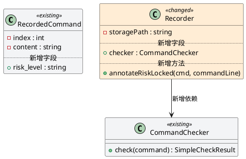
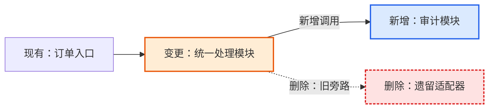

# 模块详细设计说明书 TOBE 正式模板

使用本模板更新当前 SDD 工作流指定的正式《模块详细设计说明书.md》。正式说明书位于 `.sdd/{SR}/{AR}/{模块组名}/`，是指导后续 AICoding 拆分的设计依据；只有 TOBE 阶段可以编辑正式说明书正文。ASIS 写入 `.context/详细设计上下文.md`，Gate 写入 `.context/模块设计门禁结果.md`，测试用例由独立测试设计阶段生成。

TOBE 必须基于 `.context/详细设计上下文.md` 中的 ASIS 证据形成设计，不得脱离证据凭空设计。正式说明书是面向用户、评审和开发的标准交付件，只呈现设计结论、现状约束摘要、接口契约、模块边界、实现方案、风险、可测试性输入和待确认事项；不得写入 ASIS 检索过程、证据编号表、推导过程、反证记录、门禁采样、追踪矩阵等过程性内容。详细设计上下文只记录证据、推导和过程，不参与后续开发指导。

一级标题遵循本模板。未涉及的章节保留标题并写明“不涉及，原因：...”，不要生成大量空表。第 4 章是后续 AICoding 拆分的核心设计依据，必须按需求点展开，不能只用一个总表替代正文。

## 章节顺序与评审叙事

本模板按**理解设计的因果顺序**排列，而非按设计产出物分类：

1. **全局与决策**（第 1-3 章）：需求背景、外部依赖、整体方案。让读者先理解问题和方案决策，再接触细节。
2. **按需求点展开**（第 4 章）：逐个需求点完整呈现现状→设计→接口/字段→流程→异常→配置→观测→可测试性。接口、数据库等细节在需求点内部讲，带着上下文。
3. **索引与全局视图**（第 5-8 章）：对外接口、数据库、模块交互、契约清单等跨需求点的汇总，供检索和全局核对。

## 权威位置与去重约定

同一事实在正式说明书中只在一个位置写实质内容，其他位置引用而不复述。各事实的权威位置：

| 事实类型 | 权威位置 | 只可引用、不得复述的位置 |
|---|---|---|
| 接口/类/数据结构（字段、入参出参、错误码、兼容策略等） | 4.1.4 类/接口/数据结构变化 | 第 5 章对外接口（索引）、第 7 章模块交互（概览）、第 8 章关键契约清单（索引）、工程落点、可测试性输入 |
| 流程/时序图（主流程、异常、回退、调用顺序） | 4.1.5 处理流程 | 第 7 章模块交互（概览表） |

“引用”指写明目标章节号或契约编号，不重复字段细节、签名或图。“一致性”指同一字段在各处定义不冲突，不要求在多处重写实质内容。

# {AR编号}-{需求短名}-{模块或模块组名称}模块详细设计说明书

## 1. 需求背景 / 当前 AR 描述

### 1.1 需求与目标

说明需求背景、当前 AR、目标行为、触发条件和验收口径。

### 1.2 范围说明

说明本模块负责什么、不负责什么。只列处理结论（实现/配合/不涉及），不展开现状约束——现状约束属于 4.1.2 的职责。

| 编号 | 需求/AR/变更点 | 本模块处理结论 | 关联详细方案 |
|---|---|---|---|
| R1 |  | 本模块实现 / 本模块配合 / 不属于本模块 / 待确认 | 4.1 |

## 2. 外部依赖

说明本次涉及的上游、下游、三方系统、中间件、配置、开关、环境依赖。

| 依赖对象 | 类型 | 当前关系 | 本次变化 | 兼容 / 风险说明 |
|---|---|---|---|---|
|  | 上游 / 下游 / 三方系统 / 中间件 / 配置 / 环境 |  | 新增 / 修改 / 不变 / 移除 |  |

## 3. 整体方案

### 3.1 方案概述

说明总体设计思路、关键设计决策、兼容/灰度/回退策略。

| 决策编号 | 设计点 | 设计结论 | 设计依据摘要 | 影响范围 | 状态 / 待确认说明 |
|---|---|---|---|---|---|
| D1 |  |  |  | 文件 / 组件 / 接口 / 数据 / 配置 | 已定稿 / 需前置确认： |

## 4. 模块详细方案

第 4 章按需求点展开，是后续 AICoding 拆分的核心设计依据，不能只用一个总表替代正文。每个需求点自成一个完整闭环：现状→设计→接口/字段→流程→异常→配置→观测→可测试性。

### 4.1 {需求点 / 功能点名称}

#### 4.1.1 需求描述

说明该需求点要解决的问题、目标行为、触发条件、输入输出和验收口径。

#### 4.1.2 现状约束摘要

说明影响本需求点设计决策的现状约束（当前行为、现有限制、隐藏约束或待确认项）。只写影响设计的约束和对应的处理方式，不重复 1.2 已给出的范围结论。内容面向用户和开发者阅读，不写 ASIS 结论编号、证据编号或检索过程。

| 约束项 | 类型 | 对本需求点的影响 | 处理方式 |
|---|---|---|---|
|  | 当前行为 / 现有限制 / 隐藏约束 / 待确认 / 阻塞 |  | 设计承接 / 前置确认 / 暂不定稿 |

#### 4.1.3 TOBE 设计说明

补充 3.1 决策表中未展开的设计理由、与 AR/ASIS 假设的差异、以及关键约束的处理方式。不重复 3.1 已给出的决策结论——如果某条决策在 3.1 已经说清楚了，本节不再复述。

#### 4.1.4 类 / 接口 / 数据结构变化

本章是接口、类、DTO、字段、方法签名等契约的**权威定义位置**；第 5 章对外接口、第 7 章模块交互和第 8 章关键契约清单均引用本章，不得复述本章已定义的字段细节。

**先出图，再补表。** 用 PlantUML 类图展示本次设计涉及的类型结构变化，让评审者一眼看到"新增了什么类型、改了哪个类型、类型间关系是什么"。图之后用精简表格补充图里无法表达的完整签名细节。

**PlantUML 类图**——必须标注每个类型/字段/方法的变化性质：

图的要求：
- 每个涉及变化的类型都画出来，用 `<<new>>`（新增）、`<<changed>>`（修改）、`<<existing>>`（不变/只读复用）构造型区分
- 在类图内部用注释行 `.. 新增字段 ..` / `.. 新增方法 ..` 分隔变化部分与不变部分，让评审者一眼看到改了什么
- 类型间关系用箭头标注，新增的关系在箭头标签上写明（如"新增依赖"）
- 只画本次设计涉及的变化局部，不画全量类图

**签名细节表**——补充图里放不下的完整签名。按对象类型分组：

**方法 / 函数变化**（签名细节，图里只写了方法名，这里补完整签名）：

| 对象 | 变化 | 完整签名 | 异常 / 错误语义 | 关联契约 |
|---|---|---|---|---|
|  | 新增 / 修改 / 废弃 | 例如 `func (r *Recorder) annotateRiskLocked(cmd *RecordedCommand, commandLine string)` |  | K1 |

**常量 / 枚举值**（图里通常不画常量，这里列出）：

| 常量名 | 取值 | 说明 | 关联契约 |
|---|---|---|---|
|  |  |  | K1 |

**关键映射规则 / JSON 示例**（如果设计中有映射表或序列化示例，放在这里）：

| 输入条件 | 输出 | 说明 |
|---|---|---|
|  |  |  |

某种类型没有变化时，对应的表写"不涉及"并说明原因，不要生成空表。

#### 4.1.5 处理流程

本章是流程/时序图的**权威位置**；第 7 章模块交互均引用本章，不在他处重画本章已有的图。

说明主流程。涉及多步骤、多组件、跨模块、异步或状态变化时必须补充 Mermaid 流程图或时序图。

**图必须表达变化，而不只是表达结构。** 评审者最关心的是"什么变了"，因此图里的节点和连线必须让读者直接识别哪些是新增、哪些发生了变更、哪些被删除、哪些保持不变：

- 用文字标注节点性质：`[现有：xxx]`、`[变更：xxx]`、`[新增：xxx]`、`[删除：xxx]`。
- 颜色只作辅助，不作为唯一信息载体；即使颜色失效，文字标注也必须能完整表达含义。

图的目的不是展示全部对象，而是帮助读者理解关系、重点和本次变化。

#### 4.1.6 异常、回退与边界场景

说明异常输入、依赖失败、部分成功、重复请求、重试、补偿、回滚、幂等和兼容行为。

#### 4.1.7 日志与可观测性

说明关键日志、指标、告警、链路追踪、错误定位方式，以及敏感信息处理。

#### 4.1.8 可测试性与验收口径

说明该需求点后续测试设计必须覆盖的目标行为、边界条件、失败路径、兼容/回归要求、风险验证点和可观察信号。本节只提供测试设计输入，不生成测试用例编号、建议测试文件、测试命令、Fixture、Mock 或断言清单。

| 验证目标 | 覆盖范围 | 输入 / 触发条件 | 预期行为 | 可观察信号 | 关联契约 / 设计点 |
|---|---|---|---|---|---|
| 主路径 / 边界 / 失败路径 / 兼容回归 / 安全 / 性能 / 迁移 / 日志观测 |  |  |  | 返回值 / 状态变化 / 数据副作用 / 日志 / 指标 / 告警 | K1 / D1 |

编码任务拆分不在 TOBE 阶段生成；后续 AICoding 流程应基于本说明书中的工程落点、契约和可测试性输入另行拆分。

### 4.2 {需求点 / 功能点名称}

按 4.1 相同结构展开。没有多个需求点时不创建空小节。

## 5. 对外接口

本节是对外接口索引，只列接口的 method、path/topic、调用方和本次变化方向，不复述请求/响应字段、错误码和兼容策略——这些实质内容只在 4.1.4 按「关联契约」编号定义。没有对外接口变化时写明“不涉及，原因：...”。

| 接口编号 | 接口类型 | Method / Topic / Path / 名称 | 调用方 | 提供方 | 本次变化 | 关联契约 |
|---|---|---|---|---|---|---|
| API1 | REST / RPC / MQ / Kafka / 文件 / 批处理 / 定时任务 |  |  |  | 新增 / 修改 / 不变 / 移除 | K1 |

字段、入参出参、错误码、消息结构、示例和兼容策略见 4.1.4 对应契约。如果上文已经明确给出契约，4.1.4 必须完整承接，不得省略字段或改写名称。

## 6. 数据库 / 表设计

说明表、字段、索引、约束、迁移、回填、兼容和回滚变化；没有变化时写明“不涉及，原因：...”。

| 对象 | 变化类型 | 变化内容 | 兼容策略 | 回滚策略 |
|---|---|---|---|---|
| 表 / 字段 / 索引 / 约束 / 迁移脚本 | 新增 / 修改 / 删除 / 不变 |  |  |  |

## 7. 受影响模块与交互

本节是模块边界与交互的概览汇总。模块职责的权威来源是 `module-boundary-design.md` 和 `.context/详细设计上下文.md`；本节只列模块是否本次修改及边界说明一句，不复述职责。模块间的时序/流程图不在本章重画，统一引用各需求点的 4.1.5；接口字段细节引用 4.1.4 对应契约。

### 7.1 受影响模块

| 模块 | 本次是否修改 | 边界说明（一句） |
|---|---|---|
|  | 是 / 否 |  |

### 7.2 模块交互概览

| 交互编号 | 发起方 | 接收方 | 交互方式 | 异常与重试 | 防腐 / 隔离说明 | 关联契约 |
|---|---|---|---|---|---|---|
| I1 |  |  | REST / RPC / MQ / 直接调用 / 文件 / 数据库 |  |  | K1 |

## 8. 关键契约清单

本节是本次设计涉及的契约全局索引，便于跨章节定位和评审收尾核对。契约的字段、签名、入参出参、错误码、兼容策略等实质内容只在 4.1.4 定义，本表不复述；只列出契约编号、类型、名称和指向 4.1.4 的定义位置。

| 契约编号 | 契约类型 | 名称 / Path / Topic | 定义位置（指向 4.1.4） | 可测试性关注点 |
|---|---|---|---|---|
| K1 | REST / RPC / MQ / Method / DTO / Field / ErrorCode / Config / SQL |  | 4.1.4 | 主路径 / 失败路径 / 兼容 / 日志观测 |

## 9. 附录 / 三方件约束

记录三方件版本、框架/SDK 约束、安全/权限/合规、性能/SLA、已知限制、待确认问题、术语表等。

| 主题 | 内容 | 影响 | 处理方式 |
|---|---|---|---|
| 三方件 / 框架 / SDK / 安全 / 权限 / 合规 / 性能 / SLA / 已知限制 / 待确认 / 术语 |  |  |  |
