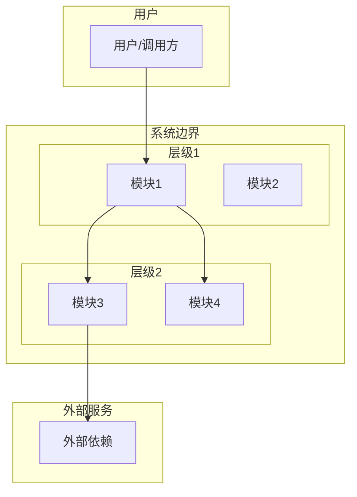
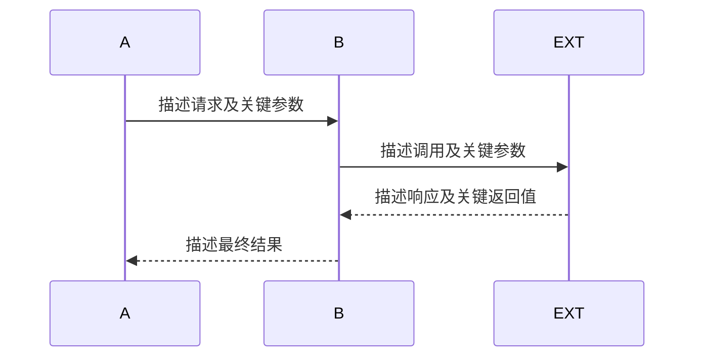
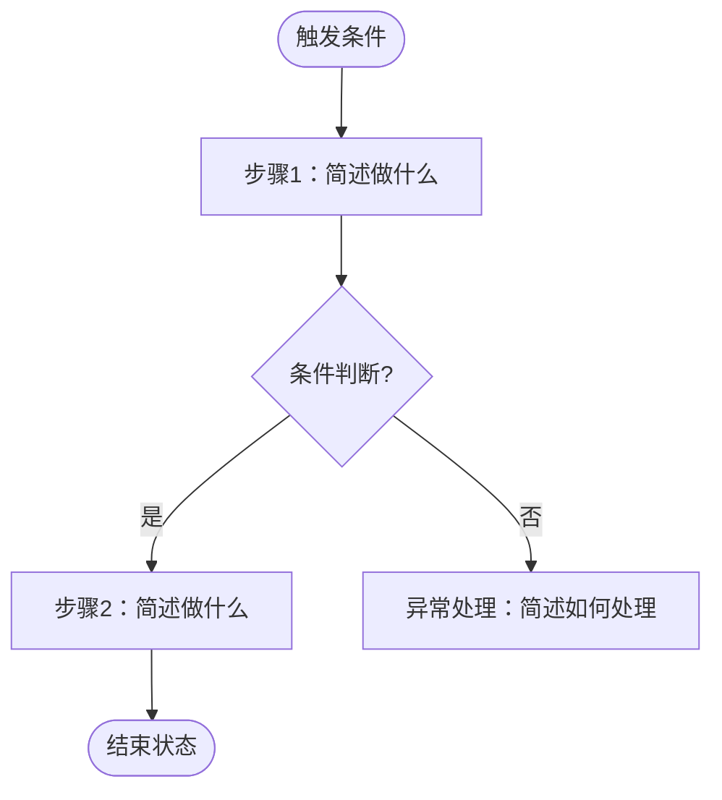
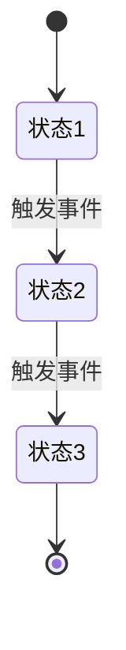
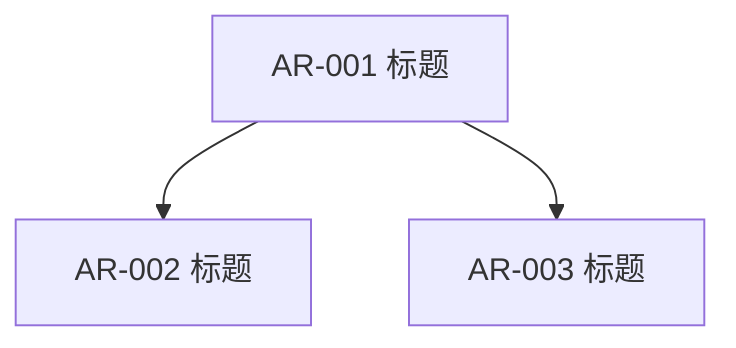
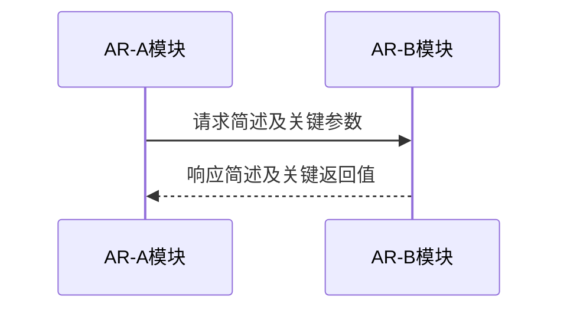

# 功能设计文档

## 文档信息

| 字段     | 内容                       |
| -------- | -------------------------- |
| 功能名称 | *[填写]*                   |
| 版本     | *[填写]*                   |
| 作者     | *[填写]*                   |
| 日期     | *[填写]*                   |
| 状态     | *[草稿 / 评审中 / 已确认]* |

## 修订记录

| 版本     | 日期     | 作者     | 变更说明 |
| -------- | -------- | -------- | -------- |
| *[填写]* | *[填写]* | *[填写]* | *[填写]* |

---

## 1. 需求背景

*[从功能视角描述：业务问题、需求范围、受益方、前置条件]*

---

## 2. 现状分析

*[分析当前系统与该需求相关的现状，为后续设计提供基线。设计基于现状展开，设计意图引用现状作为依据。]*

### 2.1 相关模块现状

*[列出当前系统中与本次需求相关的模块，描述其职责、对外接口、关键约束]*

| 模块 | 当前职责 | 当前对外接口 | 与本需求的关系 |
|:-----|:---------|:-------------|:---------------|
| *[填写]* | *[填写]* | *[填写]* | *[承接变更/被影响/提供依赖]* |

### 2.2 相关接口现状

*[列出当前系统中与本次需求相关的接口，描述其协议、输入输出、调用关系]*

| 接口名称 | 协议 | 输入（关键字段） | 输出（关键字段） | 当前调用方 | 与本需求的关系 |
|:---------|:-----|:-----------------|:-----------------|:-----------|:---------------|
| *[填写]* | *[填写]* | *[填写]* | *[填写]* | *[填写]* | *[复用/修改/废弃/新增]* |

### 2.3 相关数据现状

*[列出当前系统中与本次需求相关的数据表或数据结构]*

| 表名/数据结构 | 当前用途 | 关键字段 | 与本需求的关系 |
|:--------------|:---------|:---------|:---------------|
| *[填写]* | *[填写]* | *[填写]* | *[复用/修改/废弃/新增]* |

### 2.4 现存问题与约束

*[描述当前系统在该需求领域存在的问题、性能瓶颈、架构约束，说明本次需求要解决哪些问题、受哪些约束限制]*

---

## 3. 外部依赖

*[从模块视角列出所有外部依赖]*

| 依赖名称 | 提供方   | 用途     | 接口概述                           | SLA / 超时 | 异常处理策略 |
| -------- | -------- | -------- | ---------------------------------- | ---------- | ------------ |
| *[填写]* | *[填写]* | *[填写]* | *[填写协议、方法、路径、关键字段]* | *[填写]*   | *[填写]*     |

*[补充：认证方式、限流要求、容错机制]*

设计意图：*[为什么选择这些外部依赖？是否有替代方案？为什么选择了当前方案？]*

---

## 4. 对外接口

*[列出本功能对系统外部暴露的接口（如 HTTP API、RPC 等），即外部调用方如何触发本功能。模块之间的内部接口已在 7.3 中描述，此处不重复。]*

| 接口名称 | 协议     | 用途     | 输入（关键字段）           | 输出（关键字段） | 异常返回 | 是否新增接口 |
| -------- | -------- | -------- | -------------------------- | ---------------- | -------- | ------------ |
| *[填写]* | *[填写]* | *[填写]* | *[填写字段名、类型、必填]* | *[填写]*         | *[填写]* | *[填写]*     |

*[每个接口补充：认证鉴权、幂等性、版本号、性能承诺、新增接口还是修改旧接口]*

设计意图：*[为什么定义这些对外接口？接口粒度为什么这样划分？与现状接口的关系是什么（复用/修改/新增）？]*

---

## 5. 功能设计

### 5.1 主成功场景（功能视角）

> 1. *[用户/外部系统做了什么]*
> 2. *[系统如何响应]*
>    ...
>    *[最终结果]*

设计意图：*[为什么是这个流程？与现状流程的差异是什么？考虑了哪些异常路径后选择了主流程？]*

### 5.2 整体架构

*[描述本功能在系统中的位置和上下文关系，只涉猎当前需求需要知道的架构层级]*

设计意图：*[为什么选择这个架构分层？与现状架构的关系是什么？是否复用了现有层级？为什么新增/修改了某些层级？]*

#### 5.2.1 系统架构分层图

*[必须使用 mermaid graph TB 绘制，展示与当前功能相关的架构层级、模块及其交互关系。使用 subgraph 区分层级，标注关键调用关系]*

*[文字说明：解释各层级划分依据、模块间的调用关系、数据流向]*

#### 5.2.2 模块职责

*[列出图中各模块的职责、对外接口和关键说明，注意，如果要新增模块，必须向用户说明必要性，并经过用户确认]*

| 模块             | 职责                     | 对外接口               | 说明                         |
| :--------------- | :----------------------- | :--------------------- | :--------------------------- |
| *[填写模块名称]* | *[填写该模块的核心职责]* | *[填写对外的接口/API]* | *[补充说明，如约束、依赖等]* |

### 5.3 模块交互时序（模块视角）

*[必须使用 mermaid sequenceDiagram 绘制，展示至少 2 个参与者之间的消息传递]*

*[文字说明：解释上述交互中各步骤的处理逻辑、数据变更、状态流转]*

设计意图：*[为什么是这个交互顺序？同步还是异步的选择依据是什么？与现状交互方式的差异是什么？]*

### 5.4 流程图（功能视角）

*[必须使用 mermaid flowchart TD 绘制，展示主流程的分支决策]*

*[文字说明：解释各分支的条件、各步骤的处理逻辑]*

### 5.5 关键步骤说明

*[对时序图或流程图中无法完整表达的步骤展开说明]*

> - *[步骤X]*：*[校验规则、状态变更、数据持久化内容、通知触发等]*

### 5.6 数据流图

*[必须使用 mermaid flowchart 或 graph 绘制，展示数据从输入到输出的流转路径。节点形状要求：圆角矩形表示外部实体/起止点、矩形表示处理步骤、菱形表示分支判断、圆柱形表示数据存储。标注每个节点处理的数据内容和变换]*

*[文字说明：解释数据在各节点间的转换规则、校验逻辑、持久化时机]*

### 5.7 状态机

*[如果本功能涉及核心实体的状态流转，必须使用 mermaid stateDiagram-v2 绘制。如果明确不涉及，说明原因。]*

*[文字说明：解释各状态的含义、进入条件和退出条件]*

### 5.8 数据设计

*[描述本功能涉及的数据模型、存储方案和数据流转。注意：本章关注数据的静态结构（长什么样、存在哪），与 5.6 数据流图的动态流转视角（数据如何一步步变换和传递）互补而非重复。]*

#### 5.8.1 数据模型

*[如果涉及新增或变更数据库表，描述表结构。不写 DDL，用业务语言描述字段含义]*

| 表名     | 用途     | 关键字段                   | 变更类型     |
| :------- | :------- | :------------------------- | :----------- |
| *[填写]* | *[填写]* | *[填写字段名、类型、含义]* | *[新增/修改]* |

设计意图：*[为什么选择这个表结构？与现状数据模型的关系是什么？是否有其他数据建模方案？为什么选择了当前方案？]*

#### 5.8.2 数据流转

*[描述数据如何在模块间传递、转换和落盘。如有需要，使用 mermaid flowchart 绘制。此处侧重数据在模块间的宏观路径，与 5.6 数据流图的处理节点级别细节互补。]*

*[如使用 mermaid，图表下方必须附文字说明，解释数据在各环节的变换。]*

#### 5.8.3 存储策略

*[持久化方式、保留策略、清理机制、数据量预估]*

### 5.9 异常场景、冲突场景、兼容场景

| 场景分类 | 场景名称 | 触发条件 | 系统表现（功能视角+模块视角） | 处理/恢复方式 |
| :------- | :------- | :------- | :---------------------------- | :------------ |
| 异常     | *[填写]* | *[填写]* | *[填写]*                      | *[填写]*      |
| 冲突     | *[填写]* | *[填写]* | *[填写]*                      | *[填写]*      |
| 兼容     | *[填写]* | *[填写]* | *[填写]*                      | *[填写]*      |

---

## 6. DFX 设计

### 6.1 可靠性

> - 故障检测与恢复机制
> - 数据备份与容灾策略
> - 降级与熔断策略

### 6.2 安全性

> - 认证与授权方案
> - 数据加密（传输、存储）
> - 输入校验与防注入
> - 审计日志

### 6.3 可服务性

> - 日志埋点设计
> - 监控指标与告警规则
> - 问题排查路径

### 6.4 性能设计

> - 核心接口预期 QPS / 延迟
> - 并发控制策略
> - 缓存策略
> - 资源占用预估
> - 数据量

### 6.5 敏感参数管理

*[识别本功能涉及的敏感参数（密钥、口令、令牌、私钥等）及安全关键元数据，并说明密钥生命周期、私钥导入导出和进程复制场景的安全策略，确保敏感数据不被泄露。如果本功能涉及基础密码算法的实现或使用，必须参照[《基础密码算法敏感参数与特殊要求分类清单》](./sensitive-param-classification.md)识别参数类型和特殊安全约束，并通过[《基础密码算法敏感参数设计自检 Checklist》](./sensitive-param-checklist.md)逐项自检。]*

#### 6.5.1 敏感参数识别

*[列出本功能涉及的敏感参数和安全关键元数据，说明其用途和存储位置。如涉及密码算法，参照[分类清单](./sensitive-param-classification.md)中的参数类型（密钥类、口令与认证凭据类、随机性与初始化类、中间计算与派生类、协议层敏感参数类、密钥管理元数据与导出材料）逐一识别]*

| 参数编号 | 敏感参数 | 类型 | 用途 | 存储位置（内存/磁盘/配置） | 来源（用户输入/系统生成/外部获取） | 适用的分类清单特殊约束 |
|:---------|:---------|:-----|:-----|:---------------------------|:-----------------------------------|:-----------------------|
| SP-01 | *[填写]* | *[密钥/私钥/口令/令牌/IV/Nonce/Seed/派生密钥/中间缓冲区/会话密钥/密钥安全属性/受保护导出材料/其他]* | *[填写]* | *[填写]* | *[填写]* | *[填写分类清单中该类型的特殊安全约束要点]* |

#### 6.5.2 敏感参数生命周期与密钥管理

*[逐项引用 6.5.1 的参数编号，每个敏感参数至少填写一行，确保所有识别结果均有生命周期或存续期分析。不得把完整密钥生命周期机械套用于所有参数：密钥/私钥重点分析生成、导入、状态、轮换、备份、吊销和销毁；口令、共享秘密和中间值重点分析获取、使用、派生和清零；Nonce、IV 和随机状态重点分析生成、唯一性、并发/Fork 和失效；密钥句柄、安全属性、审计元数据和受保护导出材料重点分析完整性、权限继承、审计和保留期限。不适用的阶段填写 `N/A` 并说明原因。]*

| 参数编号 | 生命周期或存续范围 | 生成/获取/导入 | 存储与保护 | 使用、权限与用途限制 | 状态、轮换或唯一性 | 备份/恢复/归档 | 销毁、失效与异常路径 | N/A 说明 |
|:---------|:-------------------|:---------------|:-----------|:-------------------|:-------------------|:---------------|:---------------------|:---------|
| SP-01 | *[填写从产生到不再可用的阶段]* | *[生成方式、来源认证、完整性和参数校验、安全属性初始化]* | *[内存/磁盘/密钥库保护、文件权限和副本控制]* | *[所有者、访问角色、允许操作、用途隔离、并发访问和审计]* | *[密钥状态及合法转换、使用周期和轮换；或 nonce/IV 唯一性、随机状态重建等]* | *[是否允许及保护要求；不得备份时明确说明]* | *[停用、吊销、清零、释放、指针失效以及错误/异常退出路径]* | *[不适用的列及依据]* |

*[表后补充跨参数的密钥管理策略：版本切换和旧密钥保留窗口；疑似或确认泄露后的停用、吊销、替换及对证书、数据和上层会话的联动处置；KMS/HSM/Provider 等外部密钥服务的认证、会话生命周期、故障切换、不可用时失败策略和审计要求。涉及多个参数的策略必须列出对应参数编号。]*

#### 6.5.3 私钥导入导出接口安全

*[如果不涉及私钥导入、导出、序列化、复制、备份或恢复接口，标注“不涉及”，并给出接口检索范围。涉及时，所有可能使私钥离开原安全边界的路径均须填写]*

| 接口或路径 | 密钥类型 | 导出策略 | 授权与用途限制 | 导出保护和格式 | 安全属性继承 | 缓冲区与副本清理 | 审计与错误防泄露 |
|:-----------|:---------|:---------|:---------------|:---------------|:-------------|:-----------------|:-----------------|
| *[填写]* | *[填写]* | *[禁止/仅加密导出/受控明文导出]* | *[角色、权限、确认或审批]* | *[包装/加密/可信通道、接收方和完整性保护]* | *[不可导出、敏感、允许操作等属性]* | *[所有者、有效期、清零和副本限制]* | *[审计内容、失败和长度探测行为]* |

*[补充私钥导入校验：来源认证、加密与完整性保护、算法和长度、公私钥匹配、目标安全属性，以及复制、派生、恢复和格式转换不得降低安全属性。]*

#### 6.5.4 Fork 与进程复制安全

*[如果目标平台和宿主进程不存在 fork、vfork、预派生 worker 或等价进程复制，标注“不涉及”并说明部署依据。涉及时必须明确支持模型和父子进程安全边界]*

| 场景 | 支持策略 | 可能继承的敏感状态 | 子进程必需动作 | 禁止行为与失败策略 | 后续验证目标 |
|:-----|:---------|:-------------------|:---------------|:-------------------|:-------------|
| *[fork 后立即 exec / 子进程继续密码操作 / 预派生 worker / 其他]* | *[支持/不支持/受限支持]* | *[密钥、DRBG、nonce/计数器、算法上下文、锁、文件描述符、设备会话等]* | *[重播种或重新实例化、上下文失效重建、会话重连、继承资源清理]* | *[禁止复用的状态、可检测错误和回退]* | *[随机/nonce 唯一性、无死锁、无句柄复用和无敏感副本泄露]* |

*[说明父子进程如何避免复用随机序列、nonce/IV、签名随机数、状态化签名索引和密钥使用计数；说明多线程 fork、vfork、KMS/HSM/Provider 会话、内存锁定、共享映射和继承文件描述符的处置。]*

#### 6.5.5 敏感参数防泄露措施

*[如涉及密码算法，以下每项措施必须同时满足[分类清单](./sensitive-param-classification.md)的通用安全约束和[设计自检 Checklist](./sensitive-param-checklist.md)的对应条目]*

> - 内存清零防优化：*[使用项目安全清零机制，防止编译器死存储优化跳过清零；错误路径、异常退出和子进程清理路径同样覆盖]*
> - 日志与异常屏蔽：*[日志、异常信息、错误堆栈、审计和调试输出中禁止输出敏感参数原始值或可还原片段]*
> - 磁盘与缓存清理：*[临时文件、磁盘缓存和页缓存中的敏感数据清理策略；私钥文件权限和 core dump 防护]*
> - 传输与导出保护：*[敏感参数跨模块、跨进程或导出时的加密、包装、可信通道、接收方认证和副本控制]*

#### 6.5.6 算法类别专项要求

| 算法类别 | 涉及的敏感材料 | 唯一性或状态约束 | 专项安全要求 | 后续验证目标 |
|:---------|:---------------|:-----------------|:-------------|:-------------|
| *[AES-GCM/RSA/ECDSA/DRBG/KEM/KDF 等]* | *[密钥、nonce、签名随机数、共享秘密、中间状态等]* | *[填写]* | *[从[分类清单](./sensitive-param-classification.md)复制适用要求]* | *[设计阶段定义验证目标，不填写尚未执行的测试结果]* |

### 6.6 变更影响分析

*[参照[《软件变更影响分析设计阶段自检 Checklist》](./change-impact-analysis-checklist.md)，系统识别本次功能变更对接口行为、边界值处理、上层功能传导、资源消耗和兼容性的影响。分析原则：不得仅以"接口签名未变""代码改动小"或"单元测试通过"推导无对外影响；每个"无影响"结论须提供调用链、代码或测试证据；每个"有影响"结论须落实到兼容措施、测试、文档或发布动作；分析必须从变更点沿直接调用方一直追踪到上层功能和用户场景。]*

#### 6.6.1 变更范围与基线

*[明确本次功能涉及的变更项，逐项写明变更前与变更后，而非只描述新方案。同时识别明确不改变的行为，并给出保证方法]*

| 编号 | 变更对象 | 变更前 | 变更后 | 变更原因 | 关联接口/模块/配置 |
|:-----|:---------|:-------|:-------|:---------|:-------------------|
| CHG-01 | *[填写]* | *[填写]* | *[填写]* | *[填写]* | *[填写]* |

#### 6.6.2 对外可观察行为变更

*[识别所有对外接口、协议、配置、日志等可观察面的变更。接口签名不变时，行为、边界、结果、时序和资源仍可能变化]*

| 编号 | 观察面 | 是否变化 | 变更前 | 变更后 | 受影响对象 | 兼容措施 | 证据 |
|:-----|:-------|:---------|:-------|:-------|:-----------|:---------|:-----|
| EXT-01 | 对外接口参数、返回值和错误码 | *[有影响/无影响/N/A]* | *[填写]* | *[填写]* | *[填写]* | *[填写]* | *[填写]* |
| EXT-02 | 接口行为、调用顺序和幂等性 | *[有影响/无影响/N/A]* | *[填写]* | *[填写]* | *[填写]* | *[填写]* | *[填写]* |
| EXT-03 | 配置项、默认值和环境变量 | *[有影响/无影响/N/A]* | *[填写]* | *[填写]* | *[填写]* | *[填写]* | *[填写]* |
| EXT-04 | 协议、消息和数据格式 | *[有影响/无影响/N/A]* | *[填写]* | *[填写]* | *[填写]* | *[填写]* | *[填写]* |
| EXT-05 | 日志、事件、指标和审计记录 | *[有影响/无影响/N/A]* | *[填写]* | *[填写]* | *[填写]* | *[填写]* | *[填写]* |

#### 6.6.3 边界值与异常行为变更

*[分析边界条件、异常处理和错误码的行为变化]*

| 参数或输入 | 合法范围 | 关键边界用例 | 变更前结果 | 变更后结果 | 是否对外变化 | 处理依据 |
|:-----------|:---------|:-------------|:-----------|:-----------|:-------------|:---------|
| *[填写]* | *[填写]* | *[填写]* | *[填写]* | *[填写]* | *[有影响/无影响]* | *[填写]* |

*[补充执行结果与副作用分析：正常成功、参数错误、资源不足、依赖失败、超时取消、并发冲突、部分执行后失败——每种场景的返回值、输出状态和副作用是否变化。仅填写适用项]*

#### 6.6.4 上层功能影响传导

*[从变更点沿调用链追踪至上层功能和用户场景，不得只分析直接调用方]*

| 变更点 | 直接调用方 | 中间层 | 上层功能 | 用户/业务场景 | 传导方式 | 影响结论 | 验证方式 |
|:-------|:-----------|:-------|:---------|:-------------|:---------|:---------|:---------|
| *[填写]* | *[填写]* | *[填写]* | *[填写]* | *[填写]* | *[填写]* | *[填写]* | *[填写]* |

*[若结论为"无上层影响"，须说明追踪到哪一层、检查了哪些调用方、为什么不会继续传导、使用了哪些回归测试作为证据]*

#### 6.6.5 资源与性能影响

*[先按“较小 / 较大 / 待确认”判断每项资源与性能影响，再选择 SR 阶段的分析粒度：

- **预估影响较小**：预计不会接近或突破既有 SLA、性能门槛、资源预算或容量上限，且未引入复杂度量级变化、额外远程调用/磁盘 I/O、显著复制/分配/锁竞争或无界资源。可给出定性结论、数量级或区间等粗粒度评估，但必须写明场景、规模因子、判断依据和开发阶段验证计划，无需在 SR 阶段提供详细实测数据。
- **预估影响较大**：预计可能接近或突破门槛/预算、显著降低容量，或引入上述高影响机制。必须给出变更前预估、变更后预估、增量/比例和峰值等可计算数据，注明估算模型、假设和依据，并详细说明变化原因以及对超时、重试、限流、容量和上层功能的传导影响。
- **待确认**：现有依据不足以判断影响大小。SR 阶段按“较大”粒度补充估算和风险，或明确阻塞项，不得以“开发阶段再看”替代设计分析。

开发阶段对所有适用指标均须使用一致环境和口径给出详细实测数据并与本节预估对比；对于 SR 预估较大、实测影响较大或明显偏离预估的项目，还须分析原因、影响范围、是否满足门槛及所需优化或风险处置。]*

| 资源/性能指标 | 使用场景与规模 | 预估影响级别 | 变更前预估 | 变更后预估 | 增量/比例/峰值 | 变化原因、模型与假设 | 门槛或资源预算 | 上层影响 | 开发阶段验证计划 |
|:-------------|:-------------|:---------------|:-----------|:-----------|:---------------|:---------------------|:-----------------|:---------|:-------------------|
| *[内存/CPU/延迟/吞吐/连接数等]* | *[典型/峰值场景、输入量、并发量等]* | *[较小/较大/待确认]* | *[较小时可填数量级或定性基线；较大时填写数值]* | *[较小时可填数量级或区间；较大时填写数值]* | *[较小时填粗粒度范围；较大时填写可计算数据]* | *[代码/架构依据、复杂度、额外分配/I/O/调用/锁及估算假设]* | *[SLA、验收门槛、容量上限或预算]* | *[对超时、重试、限流、容量和用户场景的影响]* | *[指标、场景、工具、基线对比口径和原始数据留存位置]* |

#### 6.6.6 兼容性影响

| 兼容性维度 | 是否兼容 | 限制或适配措施 |
|:-----------|:---------|:---------------|
| 源码兼容 | *[兼容/受限兼容/不兼容/N/A]* | *[填写]* |
| 行为兼容 | *[兼容/受限兼容/不兼容/N/A]* | *[填写]* |
| 数据和协议兼容 | *[兼容/受限兼容/不兼容/N/A]* | *[填写]* |
| 配置和默认值兼容 | *[兼容/受限兼容/不兼容/N/A]* | *[填写]* |
| 升级和降级兼容 | *[兼容/受限兼容/不兼容/N/A]* | *[填写]* |

- **设计阶段初步分级**：*[E0 / E1 / E2 / E3 / 待确认]*
- **分级依据**：*[综合引用 6.6.1 至 6.6.6 的关键结论，说明为何判定为该级别。该结论是开发阶段复核的输入，不要求在 SR 阶段执行依赖实际代码和运行证据的快速反证]*

---

## 7. AR 拆分与交互定义

*[本章节是 AI 基于现状分析、澄清结果和功能设计内容，自主完成的 AR 拆分。设计目标：后续各 AR 的详细设计和开发可独立进行，阅读者仅凭本章节加上单个 AR 在第 5 章中对应的功能设计内容，即可理解该 AR 的全貌，无需翻阅其他 AR 的内容。]*

### 7.1 AR 拆分概览

*[列出本次设计涉及的所有 AR，每个 AR 需具备独立的交付价值。]*

| AR ID | AR 标题 | 核心职责与交付价值 | 承接模块 | 优先级 | 依赖 AR |
|:------|:--------|:-------------------|:---------|:-------|:--------|
| *[填写，如 AR-001]* | *[填写]* | *[一句话描述要做什么，交付什么价值]* | *[模块名]* | *[P0/P1/P2]* | *[依赖的 AR ID，无则填"无"]* |

设计意图：*[为什么拆分成这些 AR？划分依据是什么？是否有替代的拆分方案？为什么选择了当前拆分方式？]*

### 7.2 AR 依赖关系图

*[必须使用 mermaid graph 绘制 AR 之间的依赖关系。每个节点代表一个 AR，节点文本使用 AR ID + 标题，有向边 A → B 表示 A 依赖 B（B 必须先完成或 B 提供了 A 需要的接口）。]*

*[文字说明：解释依赖的含义——谁依赖谁、依赖什么、为什么是这样的依赖顺序。说明哪些 AR 可以并行开发，哪些必须串行。]*

### 7.3 AR 间交互接口

*[对每一对有依赖关系的 AR，定义模块间的交互接口契约。这是后续各 AR 独立开发的关键约束，也是接口设计最核心的部分。]*

> 以下以 AR-A 依赖 AR-B 为例（对应模块间的交互），有多对依赖关系则复制多个子节。

#### [AR-A ID]（[AR-A 标题]，[模块A]）与 [AR-B ID]（[AR-B 标题]，[模块B]）的交互接口

| 交互方向 | 交互方式 | 接口/事件/数据描述 | 关键字段 | 触发条件与时机 | SLA / 超时 |
|:---------|:---------|:-------------------|:---------|:---------------|:-----------|
| 模块A 调用 模块B | *[同步接口/异步消息/共享数据]* | *[接口路径或事件名称]* | *[请求关键字段、响应关键字段]* | *[何时调用、调用频率]* | *[填写]* |
| 模块B 回调 模块A | *[同步接口/异步消息/共享数据]* | *[接口路径或事件名称]* | *[请求关键字段、响应关键字段]* | *[何时调用、调用频率]* | *[填写]* |

**接口契约补充说明**：
- **幂等性要求**：*[哪些接口需要幂等，如何实现]*
- **重试策略**：*[失败后的重试次数、间隔、退避策略]*
- **降级方案**：*[接口不可用时的降级行为]*
- **数据一致性**：*[跨 AR 的数据一致性保障方式]*

#### 交互时序图

*[必须使用 mermaid sequenceDiagram 绘制有依赖关系的 AR 对应模块之间的交互时序]*

*[文字说明：解释交互的完整流程、每个步骤的处理逻辑、异常情况下的行为。如果涉及多步交互，需展示完整的消息往返。]*

### 7.4 AR 边界说明

*[对每个 AR，明确其范围和不在范围内的内容，防止开发时范围蔓延。]*

#### [AR ID]（[AR 标题]）

| 维度 | 范围内（该 AR 负责） | 范围外（该 AR 不负责） |
|:-----|:---------------------|:-----------------------|
| 功能 | *[具体做什么]* | *[明确不做什么，由哪个 AR 负责]* |
| 数据 | *[管理哪些数据、表]* | *[哪些数据不归该 AR 管，由哪个 AR 负责]* |
| 接口 | *[对外暴露什么接口]* | *[哪些接口由其他 AR 提供]* |
| 异常处理 | *[该 AR 内部处理的异常]* | *[哪些异常应由调用方或依赖方处理]* |

---

## 8. 需求追溯

| 系统需求（SR） | 承接模块 | 分配需求（AR）描述 |
| :------------- | :------- | :----------------- |
| *[填写]*       | *[填写]* | *[填写]*           |

---

## 9. 配置设计

| 配置项   | 配置说明 | 安全约束 |
| :------- | :------- | :------- |
| *[填写]* | *[填写]* | *[填写]* |

---

## 10. SR 整体验收标准

### 10.1 验收标准总览

> - **正常流程**：*[主成功场景的验证方式]*
> - **异常处理**：*[每个异常场景的触发及预期行为验证]*
> - **接口契约**：*[对外接口输入输出符合性验证]*
> - **性能指标**：*[核心接口延迟、并发量等量化阈值]*
> - **数据一致性**：*[事务场景一致性级别要求]*
> - **安全**：*[安全配置生效、无权限漏洞]*
> 本功能验收通过需满足以下全部条件：所有正常流程和异常场景的测试用例执行通过（详见 10.2），对外接口契约校验通过，核心接口性能指标达到预期阈值，安全配置生效且无高危漏洞，跨模块事务场景数据一致性达标。

### 10.2 系统层级黑盒测试用例

*[以下表格描述从系统外部视角（用户/调用方）对本次需求涉及的功能进行黑盒验证的测试用例。每个用例须覆盖完整的验证闭环，确保功能交付质量。]*

| 序号 | 测试场景 | 前置条件 | 测试步骤 | 预期结果 |
|:-------|:---------|:---------|:---------|:---------|
| TC-001 | *[描述测试的场景：正常流程/异常流程/边界条件]* | *[执行测试前系统及数据需要满足的状态]* | 1. *[步骤1：具体操作]* 2. *[步骤2：具体操作]* 3. *[步骤N：具体操作]* | *[每一步的期望反馈及最终系统状态]* |
| TC-002 | *[填写]* | *[填写]* | 1. *[填写]* 2. *[填写]* | *[填写]* |
| TC-003 | *[填写]* | *[填写]* | 1. *[填写]* 2. *[填写]* | *[填写]* |

**测试用例说明**：
- **TC-001** 为主成功场景验证，覆盖 5.1 中描述的主流程。
- **TC-002** 及后续用例覆盖 5.9 中识别的各异常/冲突/兼容场景。
- *[如用例数较多，可按功能模块或流程分支分组组织。]*

---

## 11. [可选] 软件架构

**情况A：已有架构文档**
*[引用 software_architecture.md，说明本功能位置]*

**情况B：存量代码无架构文档**
*[基于代码分析简述模块现状，指出改动点与影响边界]*

**情况C：新增组件**
*[描述新组件的角色、职责、边界，附交互图]*

---

## 12. 三方件约束

| 名称     | 版本     | 许可证   | 使用目的 | 约束/风险 |
| :------- | :------- | :------- | :------- | :-------- |
| *[填写]* | *[填写]* | *[填写]* | *[填写]* | *[填写]*  |

---

> **使用说明**：所有 *[斜体占位符]* 必须替换为实际分析结果，不得保留。模板结构为强制要求，章节不可缺失。
