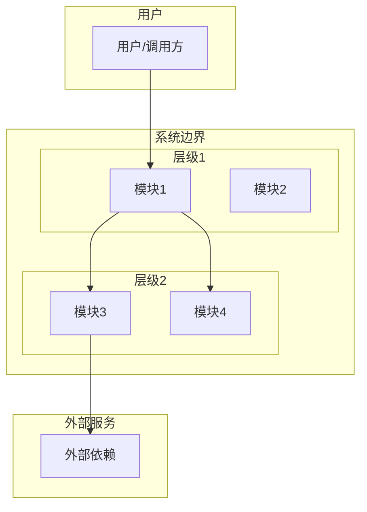
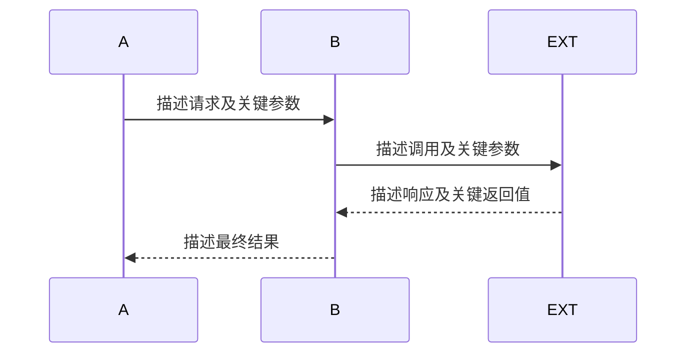
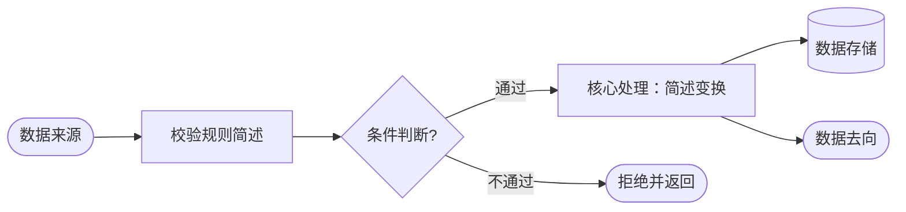
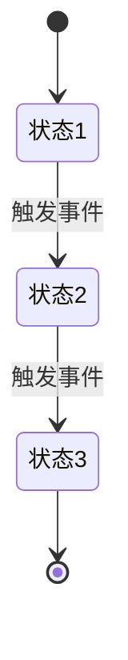
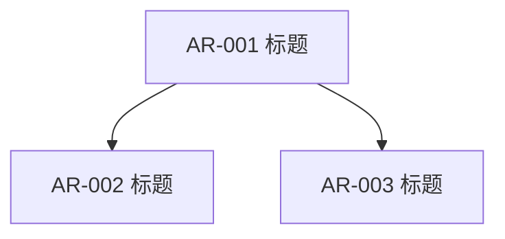
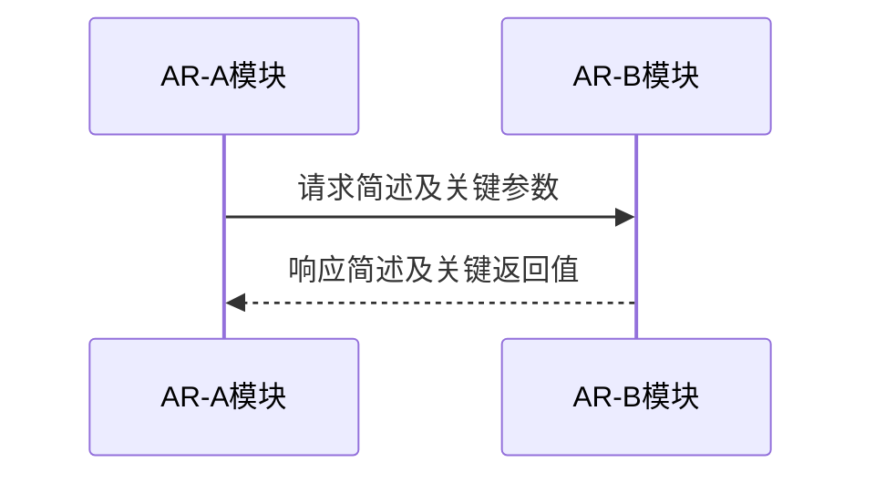

# 功能设计文档

## 文档信息

| 字段     | 内容                       |
| -------- | -------------------------- |
| 功能名称 | *[填写]*                   |
| 版本     | *[填写]*                   |
| 作者     | *[填写]*                   |
| 日期     | *[填写]*                   |
| 状态     | *[草稿 / 评审中 / 已确认]* |

## 修订记录

| 版本     | 日期     | 作者     | 变更说明 |
| -------- | -------- | -------- | -------- |
| *[填写]* | *[填写]* | *[填写]* | *[填写]* |

---

## 1. 需求背景

*[从功能视角描述：业务问题、需求范围、受益方、前置条件]*

---

## 2. 现状分析

*[分析当前系统与该需求相关的现状，为后续设计提供基线。设计基于现状展开，设计意图引用现状作为依据。]*

### 2.1 相关模块现状

*[列出当前系统中与本次需求相关的模块，描述其职责、对外接口、关键约束]*

| 模块 | 当前职责 | 当前对外接口 | 与本需求的关系 |
|:-----|:---------|:-------------|:---------------|
| *[填写]* | *[填写]* | *[填写]* | *[承接变更/被影响/提供依赖]* |

### 2.2 相关接口现状

*[列出当前系统中与本次需求相关的接口，描述其协议、输入输出、调用关系]*

| 接口名称 | 协议 | 输入（关键字段） | 输出（关键字段） | 当前调用方 | 与本需求的关系 |
|:---------|:-----|:-----------------|:-----------------|:-----------|:---------------|
| *[填写]* | *[填写]* | *[填写]* | *[填写]* | *[填写]* | *[复用/修改/废弃/新增]* |

### 2.3 相关数据现状

*[列出当前系统中与本次需求相关的数据表或数据结构]*

| 表名/数据结构 | 当前用途 | 关键字段 | 与本需求的关系 |
|:--------------|:---------|:---------|:---------------|
| *[填写]* | *[填写]* | *[填写]* | *[复用/修改/废弃/新增]* |

### 2.4 现存问题与约束

*[描述当前系统在该需求领域存在的问题、性能瓶颈、架构约束，说明本次需求要解决哪些问题、受哪些约束限制]*

---

## 3. 外部依赖

*[从模块视角列出所有外部依赖]*

| 依赖名称 | 提供方   | 用途     | 接口概述                           | SLA / 超时 | 异常处理策略 |
| -------- | -------- | -------- | ---------------------------------- | ---------- | ------------ |
| *[填写]* | *[填写]* | *[填写]* | *[填写协议、方法、路径、关键字段]* | *[填写]*   | *[填写]*     |

*[补充：认证方式、限流要求、容错机制]*

设计意图：*[为什么选择这些外部依赖？是否有替代方案？为什么选择了当前方案？]*

---

## 4. 对外接口

*[列出本功能对系统外部暴露的接口（如 HTTP API、RPC 等），即外部调用方如何触发本功能。模块之间的内部接口已在 7.3 中描述，此处不重复。]*

| 接口名称 | 协议     | 用途     | 输入（关键字段）           | 输出（关键字段） | 异常返回 | 是否新增接口 |
| -------- | -------- | -------- | -------------------------- | ---------------- | -------- | ------------ |
| *[填写]* | *[填写]* | *[填写]* | *[填写字段名、类型、必填]* | *[填写]*         | *[填写]* | *[填写]*     |

*[每个接口补充：认证鉴权、幂等性、版本号、性能承诺、新增接口还是修改旧接口]*

设计意图：*[为什么定义这些对外接口？接口粒度为什么这样划分？与现状接口的关系是什么（复用/修改/新增）？]*

---

## 5. 功能设计

### 5.1 主成功场景（功能视角）

> 1. *[用户/外部系统做了什么]*
> 2. *[系统如何响应]*
>    ...
>    *[最终结果]*

设计意图：*[为什么是这个流程？与现状流程的差异是什么？考虑了哪些异常路径后选择了主流程？]*

### 5.2 整体架构

*[描述本功能在系统中的位置和上下文关系，只涉猎当前需求需要知道的架构层级]*

设计意图：*[为什么选择这个架构分层？与现状架构的关系是什么？是否复用了现有层级？为什么新增/修改了某些层级？]*

#### 5.2.1 系统架构分层图

*[必须使用 mermaid graph TB 绘制，展示与当前功能相关的架构层级、模块及其交互关系。使用 subgraph 区分层级，标注关键调用关系]*

*[文字说明：解释各层级划分依据、模块间的调用关系、数据流向]*

#### 5.2.2 模块职责

*[列出图中各模块的职责、对外接口和关键说明，注意，如果要新增模块，必须向用户说明必要性，并经过用户确认]*

| 模块             | 职责                     | 对外接口               | 说明                         |
| :--------------- | :----------------------- | :--------------------- | :--------------------------- |
| *[填写模块名称]* | *[填写该模块的核心职责]* | *[填写对外的接口/API]* | *[补充说明，如约束、依赖等]* |

### 5.3 模块交互时序（模块视角）

*[必须使用 mermaid sequenceDiagram 绘制，展示至少 2 个参与者之间的消息传递]*

*[文字说明：解释上述交互中各步骤的处理逻辑、数据变更、状态流转]*

设计意图：*[为什么是这个交互顺序？同步还是异步的选择依据是什么？与现状交互方式的差异是什么？]*

### 5.4 流程图（功能视角）

*[必须使用 mermaid flowchart TD 绘制，展示主流程的分支决策]*

*[文字说明：解释各分支的条件、各步骤的处理逻辑]*

### 5.5 关键步骤说明

*[对时序图或流程图中无法完整表达的步骤展开说明]*

> - *[步骤X]*：*[校验规则、状态变更、数据持久化内容、通知触发等]*

### 5.6 数据流图

*[必须使用 mermaid flowchart 或 graph 绘制，展示数据从输入到输出的流转路径。节点形状要求：圆角矩形表示外部实体/起止点、矩形表示处理步骤、菱形表示分支判断、圆柱形表示数据存储。标注每个节点处理的数据内容和变换]*

*[文字说明：解释数据在各节点间的转换规则、校验逻辑、持久化时机]*

### 5.7 状态机

*[如果本功能涉及核心实体的状态流转，必须使用 mermaid stateDiagram-v2 绘制。如果明确不涉及，说明原因。]*

*[文字说明：解释各状态的含义、进入条件和退出条件]*

### 5.8 数据设计

*[描述本功能涉及的数据模型、存储方案和数据流转。注意：本章关注数据的静态结构（长什么样、存在哪），与 5.6 数据流图的动态流转视角（数据如何一步步变换和传递）互补而非重复。]*

#### 5.8.1 数据模型

*[如果涉及新增或变更数据库表，描述表结构。不写 DDL，用业务语言描述字段含义]*

| 表名     | 用途     | 关键字段                   | 变更类型     |
| :------- | :------- | :------------------------- | :----------- |
| *[填写]* | *[填写]* | *[填写字段名、类型、含义]* | *[新增/修改]* |

设计意图：*[为什么选择这个表结构？与现状数据模型的关系是什么？是否有其他数据建模方案？为什么选择了当前方案？]*

#### 5.8.2 数据流转

*[描述数据如何在模块间传递、转换和落盘。如有需要，使用 mermaid flowchart 绘制。此处侧重数据在模块间的宏观路径，与 5.6 数据流图的处理节点级别细节互补。]*

*[如使用 mermaid，图表下方必须附文字说明，解释数据在各环节的变换。]*

#### 5.8.3 存储策略

*[持久化方式、保留策略、清理机制、数据量预估]*

### 5.9 异常场景、冲突场景、兼容场景

| 场景分类 | 场景名称 | 触发条件 | 系统表现（功能视角+模块视角） | 处理/恢复方式 |
| :------- | :------- | :------- | :---------------------------- | :------------ |
| 异常     | *[填写]* | *[填写]* | *[填写]*                      | *[填写]*      |
| 冲突     | *[填写]* | *[填写]* | *[填写]*                      | *[填写]*      |
| 兼容     | *[填写]* | *[填写]* | *[填写]*                      | *[填写]*      |

---

## 6. DFX 设计

### 6.1 可靠性

> - 故障检测与恢复机制
> - 数据备份与容灾策略
> - 降级与熔断策略

### 6.2 安全性

> - 认证与授权方案
> - 数据加密（传输、存储）
> - 输入校验与防注入
> - 审计日志

### 6.3 可服务性

> - 日志埋点设计
> - 监控指标与告警规则
> - 问题排查路径

### 6.4 性能设计

> - 核心接口预期 QPS / 延迟
> - 并发控制策略
> - 缓存策略
> - 资源占用预估
> - 数据量

---

## 7. AR 拆分与交互定义

*[本章节是 AI 基于现状分析、澄清结果和功能设计内容，自主完成的 AR 拆分。设计目标：后续各 AR 的详细设计和开发可独立进行，阅读者仅凭本章节加上单个 AR 在第 5 章中对应的功能设计内容，即可理解该 AR 的全貌，无需翻阅其他 AR 的内容。]*

### 7.1 AR 拆分概览

*[列出本次设计涉及的所有 AR，每个 AR 需具备独立的交付价值。]*

| AR ID | AR 标题 | 核心职责与交付价值 | 承接模块 | 优先级 | 依赖 AR |
|:------|:--------|:-------------------|:---------|:-------|:--------|
| *[填写，如 AR-001]* | *[填写]* | *[一句话描述要做什么，交付什么价值]* | *[模块名]* | *[P0/P1/P2]* | *[依赖的 AR ID，无则填"无"]* |

设计意图：*[为什么拆分成这些 AR？划分依据是什么？是否有替代的拆分方案？为什么选择了当前拆分方式？]*

### 7.2 AR 依赖关系图

*[必须使用 mermaid graph 绘制 AR 之间的依赖关系。每个节点代表一个 AR，节点文本使用 AR ID + 标题，有向边 A → B 表示 A 依赖 B（B 必须先完成或 B 提供了 A 需要的接口）。]*

*[文字说明：解释依赖的含义——谁依赖谁、依赖什么、为什么是这样的依赖顺序。说明哪些 AR 可以并行开发，哪些必须串行。]*

### 7.3 AR 间交互接口

*[对每一对有依赖关系的 AR，定义模块间的交互接口契约。这是后续各 AR 独立开发的关键约束，也是接口设计最核心的部分。]*

> 以下以 AR-A 依赖 AR-B 为例（对应模块间的交互），有多对依赖关系则复制多个子节。

#### [AR-A ID]（[AR-A 标题]，[模块A]）与 [AR-B ID]（[AR-B 标题]，[模块B]）的交互接口

| 交互方向 | 交互方式 | 接口/事件/数据描述 | 关键字段 | 触发条件与时机 | SLA / 超时 |
|:---------|:---------|:-------------------|:---------|:---------------|:-----------|
| 模块A 调用 模块B | *[同步接口/异步消息/共享数据]* | *[接口路径或事件名称]* | *[请求关键字段、响应关键字段]* | *[何时调用、调用频率]* | *[填写]* |
| 模块B 回调 模块A | *[同步接口/异步消息/共享数据]* | *[接口路径或事件名称]* | *[请求关键字段、响应关键字段]* | *[何时调用、调用频率]* | *[填写]* |

**接口契约补充说明**：
- **幂等性要求**：*[哪些接口需要幂等，如何实现]*
- **重试策略**：*[失败后的重试次数、间隔、退避策略]*
- **降级方案**：*[接口不可用时的降级行为]*
- **数据一致性**：*[跨 AR 的数据一致性保障方式]*

#### 交互时序图

*[必须使用 mermaid sequenceDiagram 绘制有依赖关系的 AR 对应模块之间的交互时序]*

*[文字说明：解释交互的完整流程、每个步骤的处理逻辑、异常情况下的行为。如果涉及多步交互，需展示完整的消息往返。]*

### 7.4 AR 边界说明

*[对每个 AR，明确其范围和不在范围内的内容，防止开发时范围蔓延。]*

#### [AR ID]（[AR 标题]）

| 维度 | 范围内（该 AR 负责） | 范围外（该 AR 不负责） |
|:-----|:---------------------|:-----------------------|
| 功能 | *[具体做什么]* | *[明确不做什么，由哪个 AR 负责]* |
| 数据 | *[管理哪些数据、表]* | *[哪些数据不归该 AR 管，由哪个 AR 负责]* |
| 接口 | *[对外暴露什么接口]* | *[哪些接口由其他 AR 提供]* |
| 异常处理 | *[该 AR 内部处理的异常]* | *[哪些异常应由调用方或依赖方处理]* |

---

## 8. 需求追溯

| 系统需求（SR） | 承接模块 | 分配需求（AR）描述 |
| :------------- | :------- | :----------------- |
| *[填写]*       | *[填写]* | *[填写]*           |

---

## 9. 配置设计

| 配置项   | 配置说明 | 安全约束 |
| :------- | :------- | :------- |
| *[填写]* | *[填写]* | *[填写]* |

---

## 10. SR 整体验收标准

### 10.1 验收标准总览

> - **正常流程**：*[主成功场景的验证方式]*
> - **异常处理**：*[每个异常场景的触发及预期行为验证]*
> - **接口契约**：*[对外接口输入输出符合性验证]*
> - **性能指标**：*[核心接口延迟、并发量等量化阈值]*
> - **数据一致性**：*[事务场景一致性级别要求]*
> - **安全**：*[安全配置生效、无权限漏洞]*
> 本功能验收通过需满足以下全部条件：所有正常流程和异常场景的测试用例执行通过（详见 10.2），对外接口契约校验通过，核心接口性能指标达到预期阈值，安全配置生效且无高危漏洞，跨模块事务场景数据一致性达标。

### 10.2 系统层级黑盒测试用例

*[以下表格描述从系统外部视角（用户/调用方）对本次需求涉及的功能进行黑盒验证的测试用例。每个用例须覆盖完整的验证闭环，确保功能交付质量。]*

| 序号 | 测试场景 | 前置条件 | 测试步骤 | 预期结果 |
|:-------|:---------|:---------|:---------|:---------|
| TC-001 | *[描述测试的场景：正常流程/异常流程/边界条件]* | *[执行测试前系统及数据需要满足的状态]* | 1. *[步骤1：具体操作]* 2. *[步骤2：具体操作]* 3. *[步骤N：具体操作]* | *[每一步的期望反馈及最终系统状态]* |
| TC-002 | *[填写]* | *[填写]* | 1. *[填写]* 2. *[填写]* | *[填写]* |
| TC-003 | *[填写]* | *[填写]* | 1. *[填写]* 2. *[填写]* | *[填写]* |

**测试用例说明**：
- **TC-001** 为主成功场景验证，覆盖 5.1 中描述的主流程。
- **TC-002** 及后续用例覆盖 5.9 中识别的各异常/冲突/兼容场景。
- *[如用例数较多，可按功能模块或流程分支分组组织。]*

---

## 11. [可选] 软件架构

**情况A：已有架构文档**
*[引用 software_architecture.md，说明本功能位置]*

**情况B：存量代码无架构文档**
*[基于代码分析简述模块现状，指出改动点与影响边界]*

**情况C：新增组件**
*[描述新组件的角色、职责、边界，附交互图]*

---

## 12. 三方件约束

| 名称     | 版本     | 许可证   | 使用目的 | 约束/风险 |
| :------- | :------- | :------- | :------- | :-------- |
| *[填写]* | *[填写]* | *[填写]* | *[填写]* | *[填写]*  |

---

> **使用说明**：所有 *[斜体占位符]* 必须替换为实际分析结果，不得保留。模板结构为强制要求，章节不可缺失。
