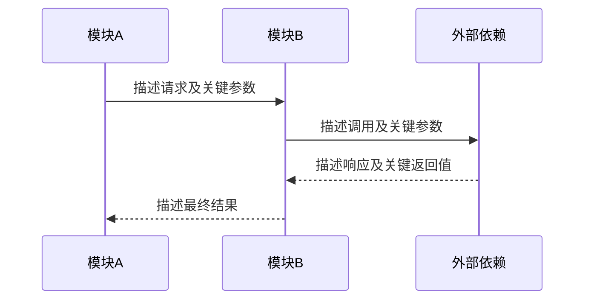

# {功能名称} 设计

`{SR编号}` ｜ 生成日期 `{YYYY-MM-DD}` ｜ 第 `{N}` 轮

---

## 1. 速览

*[5-8 行，纯导航。只写结论标题，不写理由和细节——理由在第 4 节，细节在后续各节。读者扫完本节应知道全局。]*

- **做什么**：*[一句话]*
- **关键取舍**：*[决策标题 1] / [决策标题 2] / [决策标题 3]*（详见第 4 节）
- **怎么拆**：*[N] 个 AR，其中 [AR-001、AR-002] 可并行*
- **影响面**：*[E0/E1/E2/E3]*，*[一句话说明动到了什么]*

---

## 2. 背景与范围

*[业务问题与目标。范围边界必须写明「不做什么」——非目标是消歧成本最低的一栏。]*

**业务问题**：*[为什么要做这件事]*

**范围内**：
- *[要做的事]*

**非目标（本次明确不做）**：
- *[不做的事，及为什么不做/由谁做]*

---

## 3. 前提与约束

*[本节只写**限制设计选择**的约束，不列相关模块/接口/数据的完整清单。判断标准：某条现状如果不写，读者会看不懂为什么某个方案没被选中——这才值得写。]*

*[存量改造：写现有系统对本次设计的限制（架构分层、既有模式、技术栈、不可动的存量）。]*
*[全新项目：写技术选型约束、平台约束、团队/工期约束、必须复用的既有组件。]*

| 约束 | 内容 | 对设计的限制 | 来源 |
|:-----|:-----|:-------------|:-----|
| *[分层/技术栈/兼容性/性能/工期]* | *[填写]* | *[因此某类方案不可选]* | *[代码位置 / software_architecture.md / 问题池编号]* |

---

## 4. 关键设计决策

*[本节是文档主干。只收录影响**架构分层、模块职责、对外契约、数据模型**四类之一的决策，最多 5-7 个。不满足四类标准或影响面小的决策，不在此展开：结论直接写进第 6-8 节的表格，理由记入附录 D 问答摘要。]*

*[每个决策严格按四行写，总长不超过 200 字。理由必须写明「为什么不选另一个方案」，这是评审最需要的信息。]*

### 4.1 *[决策标题：用结论句，如「订单状态改为独立表」]*

- **决策点**：*[要解决的问题是什么]*
- **选择**：*[选了哪个方案]*
- **理由**：*[为什么选它、为什么不选备选方案。存量改造引用第 3 节约束或代码现状；全新项目引用选型标准]*
- **影响面**：*[动到哪些模块/接口/数据；由哪个 AR 承接]*

### 4.2 *[决策标题]*

*[同上四行结构]*

---

## 5. 变更影响

*[全新项目或纯新增功能无既有行为基线时，本节写「不适用：全新系统，无既有行为基线」，并删除下表。]*

| 变更对象 | 变更前 | 变更后 | 兼容性 | 影响的调用方 | 验证方式 |
|:---------|:-------|:-------|:-------|:-------------|:---------|
| *[接口/数据/配置/行为]* | *[填写]* | *[填写]* | *[兼容/部分兼容/不兼容]* | *[谁受影响、需要什么适配]* | *[如何验证没破坏]* |

**分级结论**：*[E0 / E1 / E2 / E3 / 待确认]* —— *[判定理由，一到两句]*

> 分级口径：E0 外部行为与资源约束均不变｜E1 有对外变更但既有用法仍受支持｜E2 部分条件下兼容或行为改变｜E3 既有合法用法不再兼容。
> 证据不足时标记「待确认」，不得直接形成确定分级。「改动行数小」「仅内部重构」「接口签名未变」「单元测试通过」不得作为无影响的证据。
> **分级为 E2 或 E3 时**，必须在附录 B 展开完整变更影响分析（分析基线、对外变化识别、上层影响传导、边界与异常、资源与性能、兼容与发布）。E0/E1 只需本节表格。

---

## 6. 时序与数据

### 6.1 主流程时序

*[全文唯一的 mermaid 图。全部参与模块在同一张图中，展示主成功场景的完整消息往返。标注同步/异步与调用方向。]*

```mermaid
sequenceDiagram
    participant A as 模块A
    participant B as 模块B
    participant EXT as 外部依赖
    A->>B: 描述请求及关键参数
    B->>EXT: 描述调用及关键参数
    EXT-->>B: 描述响应及关键返回值
    B-->>A: 描述最终结果
```

*[文字说明：解释关键步骤的处理逻辑、分支条件、状态流转与数据变换。图里表达不了的行为写在这里，不另设章节。]*

### 6.2 数据模型

*[涉及新增或变更的数据结构。不写 DDL，用业务语言描述字段含义；允许写表名、字段名、类型。无数据变更时写「不适用：本次无数据结构变更」。]*

| 表名/结构 | 用途 | 关键字段 | 变更类型 | 存储与保留策略 |
|:----------|:-----|:---------|:---------|:---------------|
| *[填写]* | *[填写]* | *[字段名、类型、含义]* | *[新增/修改]* | *[持久化方式、保留期、清理机制]* |

### 6.3 异常与冲突场景

| 场景 | 触发条件 | 系统表现 | 处理/恢复方式 |
|:-----|:---------|:---------|:--------------|
| *[填写]* | *[填写]* | *[填写]* | *[填写]* |

---

## 7. 外部依赖

*[无外部依赖时写「不适用：本次不引入外部依赖」并删除下表。]*

| 依赖 | 提供方 | 用途 | 接口概述 | SLA / 超时 | 失败处理 |
|:-----|:-------|:-----|:---------|:-----------|:---------|
| *[填写]* | *[填写]* | *[填写]* | *[协议、方法、路径、关键字段]* | *[填写]* | *[降级/重试/熔断策略]* |

---

## 8. 对外接口

*[本功能对系统外部暴露的接口。跨 AR 的内部契约见 10.2，此处不重复。本节不得判「不适用」。]*

| 接口 | 协议 | 用途 | 输入（关键字段） | 输出（关键字段） | 错误码 | 幂等 | 超时/重试 | 新增/修改 |
|:-----|:-----|:-----|:-----------------|:-----------------|:-------|:-----|:----------|:----------|
| *[填写]* | *[填写]* | *[填写]* | *[字段名、类型、必填]* | *[填写]* | *[填写]* | *[是/否]* | *[填写]* | *[填写]* |

*[补充：认证鉴权方式、版本策略。]*

---

## 9. DFX 与验收

*[本节把「要达到什么」和「怎么验证达到了」合并为一张表——两者本是同一件事的两面，分开写会导致同一批指标写两遍。「类别」列供门禁核对覆盖面，六类必须齐全：`主流程`、`异常`、`接口契约`、`数据一致性`、`性能`、`安全/可靠/可服务`。本节不得判「不适用」。]*

*[不写测试步骤和前置条件——具体用例由 `module-test-design` 基于详设设计。本节只写通过判据。]*

| 验收项 | 类别 | 要求与通过标准 | 验证方式 |
|:-------|:-----|:---------------|:---------|
| *[填写]* | 主流程 | *[可量化的通过判据]* | *[如何验证]* |
| *[填写]* | 异常 | *[填写]* | *[填写]* |
| *[填写]* | 接口契约 | *[填写]* | *[填写]* |
| *[填写]* | 数据一致性 | *[一致性级别要求]* | *[填写]* |
| *[填写]* | 性能 | *[QPS / 延迟 / 并发 / 资源占用的量化阈值]* | *[填写]* |
| *[填写]* | 安全/可靠/可服务 | *[认证授权、加密、审计、故障恢复、降级、日志埋点、监控告警的具体要求]* | *[填写]* |

---

## 10. AR 拆分

*[AR 边界、依赖方向与跨 AR 接口选型均已在澄清阶段经用户确认。设计目标：各 AR 的详细设计和开发可独立进行。本节不得判「不适用」。]*

### 10.1 AR 概览与边界

*[每个 AR 一行。`id` 需简短、唯一、目录安全（如 `AR-001`）；后续流程不得只依赖标题作为唯一标识。「可并行组」列显式写出并行性，读者不必自己从依赖关系推导。]*

| AR ID | 标题 | 职责与交付价值 | 承接模块 | 依赖 AR | 可并行组 | 范围外（不负责） | 确认来源 |
|:------|:-----|:---------------|:---------|:--------|:---------|:-----------------|:---------|
| *[AR-001]* | *[填写]* | *[一句话：做什么、交付什么价值]* | *[模块名]* | *[AR ID，无则「无」]* | *[如「组1」，可与同组 AR 并行]* | *[明确不做什么、由谁负责]* | *[问题池编号]* |

**拆分依据**：*[为什么这样拆？是否有替代拆分方案，为什么不选]*

### 10.2 AR 间接口契约

*[仅当 AR 之间存在依赖时填写。单 AR 或无依赖时写「不适用：<依据>」并删除下表。时序统一见 6.1，本节不重复绘图。]*

| 调用方 → 提供方 | 交互方式 | 接口/事件 | 关键字段 | 触发时机 | SLA/超时 | 幂等与重试 | 失败降级 |
|:----------------|:---------|:----------|:---------|:---------|:---------|:-----------|:---------|
| *[AR-A 模块 → AR-B 模块]* | *[同步接口/异步消息/共享数据]* | *[路径或事件名]* | *[请求、响应关键字段]* | *[何时调用、频率]* | *[填写]* | *[填写]* | *[填写]* |

**跨 AR 数据一致性**：*[保障方式；无跨 AR 数据交互时写「不适用」]*

---

## 11. 需求追溯

*[一条原始需求一行，含被裁剪的需求。「处置」列取值：实现 / 范围外 / 延期 / 不实现。处置非「实现」时，「确认来源」必填——门禁只认文档内的显式记录，缺记录或缺确认来源一律视为静默省略。本节不得判「不适用」。]*

| 原始需求（原文引用或位置） | 处置 | 承接 AR | 说明 | 确认来源 |
|:---------------------------|:-----|:--------|:-----|:---------|
| *[填写]* | *[实现]* | *[AR ID，或「SR 整体承接」]* | *[填写]* | *[问题池编号]* |
| *[填写]* | *[范围外/延期/不实现]* | *[—]* | *[处置理由]* | *[问题池编号，必填]* |

---

## 附录

> 以下内容供门禁核对与后续维护使用，正文阅读不依赖附录。

### 附录 A. 默认假设清单

*[正文以「（基于假设 N）」标注，编号与本表一致。无默认假设时写「无」。]*

| 编号 | 假设内容 | 依据 |
|:-----|:---------|:-----|
| 假设 1 | *[填写]* | *[业界惯例 / 项目既有模式 / 代码现状]* |

### 附录 B. 变更影响明细

*[仅当第 5 节分级为 E2 或 E3 时填写；E0/E1 写「不适用：分级为 E0/E1，第 5 节表格已覆盖」。]*

**分析基线**：*[版本、配置、平台、既有行为基线的来源]*

**对外变化识别**：*[逐项判断既有正确用法是否仍得到语义等价结果。检查维度：接口签名、参数与返回语义、错误码、输出格式与顺序、副作用与状态、调用顺序与幂等、并发与线程安全、配置/环境变量默认值、协议与持久化格式、日志与可观测输出]*

**上层影响传导**：*[从变更点追踪直接调用方 → 封装/框架层 → 上层功能与用户场景。结论为「无上层影响」时必须写明追踪边界、调用方清单和证据]*

**边界与异常**：*[边界收紧或放宽的兼容性判定；失败语义、部分执行副作用、可否重试、状态恢复]*

**资源与性能**：*[先分级 `较小`/`较大`/`待确认`。`较大` 或 `待确认` 须给出变更前后预估、增量或比例、峰值、估算模型。无论大小均须定义开发阶段实测计划]*

**兼容与发布**：*[源码/二进制/行为/数据/配置兼容性分别判断；升级、降级、回退、混合版本互操作；调用方适配与文档更新；灰度观测与回退触发条件]*

**E3 专项**：*[仅 E3 填写：审批计划、迁移设计、回退设计]*

**待确认项**：*[逐项写明责任人与完成时间；无则「无」]*

### 附录 C. 配置、三方件与架构增量

**配置项**：*[无则「无」]*

| 配置项 | 说明 | 默认值 | 生效范围 | 安全约束 |
|:-------|:-----|:-------|:---------|:---------|
| *[填写]* | *[填写]* | *[填写]* | *[填写]* | *[填写]* |

**三方件**：*[无则「无」]*

| 名称 | 版本 | 许可证 | 使用目的 | 约束/风险 |
|:-----|:-----|:-------|:---------|:----------|
| *[填写]* | *[填写]* | *[填写]* | *[填写]* | *[填写]* |

**架构增量**：*[对 `.sdd/software_architecture.md` 的增量——新增/修改的模块、层级、依赖关系。按实际情况选一种：]*
- *[已有架构文档：说明本功能在既有架构中的位置及对该文档的增量]*
- *[架构基线缺失：写明该文件不存在，基于代码分析说明改动点与影响边界。门禁会据此降级检查并记录欠账]*
- *[新增组件：描述新组件的角色、职责、边界及接入点]*

### 附录 D. 问答摘要

*[澄清过程中确认的决策记录。未进入第 4 节主干的决策，其理由记录在此，保证可追溯。]*

| 编号 | 问题 | 用户确认的答案 | 关联章节 |
|:-----|:-----|:---------------|:---------|
| *[问题池编号]* | *[填写]* | *[填写]* | *[章节号]* |

---

> **写作要求**
> - 所有 `*[斜体占位符]*` 与 `{花括号}` 必须替换为实际内容，不得保留。
> - 全文唯一 mermaid 图为 6.1 主流程时序图。不画流程图、状态机、数据流图、架构分层图、AR 依赖图。
> - 表格不得只有表头。确无内容时删除表格，写明「不适用：<依据>」。以下位置不得判不适用：8 对外接口、9 DFX 与验收、10 AR 拆分、11 需求追溯。
> - 禁止编写实现逻辑（方法体、控制流、SQL/DDL、类内部结构、可运行片段）。允许并鼓励契约标识符（接口路径、字段名与类型、表名、枚举值、配置项、事件名、错误码）。
> - 同一事实只在一处写实质内容，其他位置引用而不复述。
