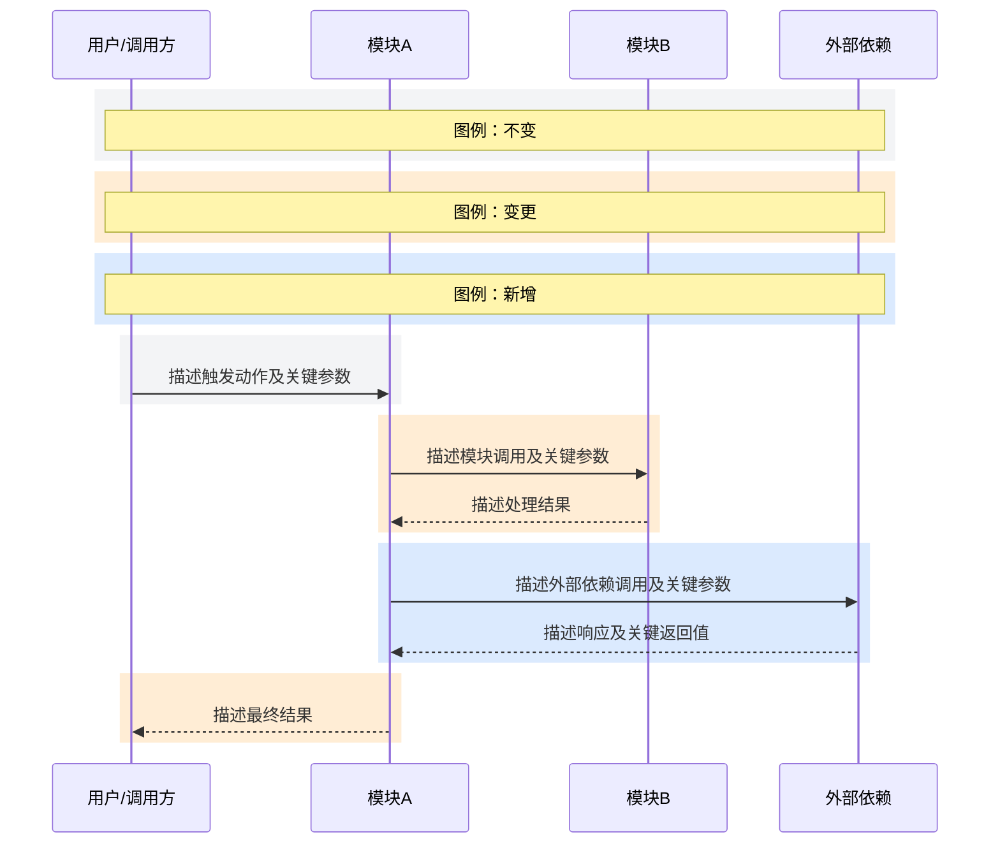
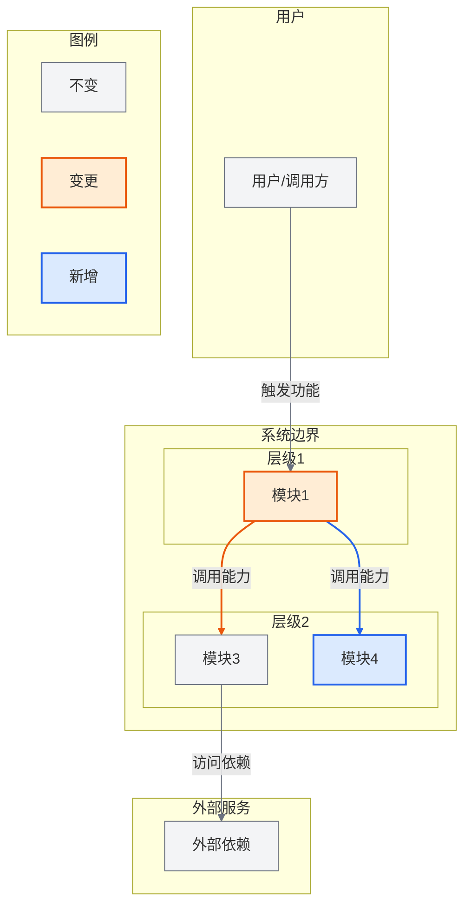

# 功能设计文档

## 文档信息

| 字段     | 内容                       | 取值规则 |
| -------- | -------------------------- | -------- |
| 功能名称 | *[填写]*                   | 取本次 SR 的功能名称 |
| 版本     | *[填写]*                   | 首次生成填 `1.0`；每轮 gate 整改后次版本号 +1（`1.1`、`1.2`…） |
| 作者     | `sr-design skill`          | 固定值，不填人名 |
| 日期     | *[填写]*                   | 本轮生成日期 |
| 状态     | *[草稿 / 整改稿（第 N 轮）]* | 首次生成填「草稿」；第 N 轮 gate 整改后填「整改稿（第 N 轮）」。门禁结论不写在本文档，见 `SR-design-gate.md` |

## 修订记录

| 版本     | 日期     | 作者     | 触发原因 | 变更说明 |
| -------- | -------- | -------- | -------- | -------- |
| *[填写]* | *[填写]* | `sr-design skill` | *[首次生成 / gate 整改（第 N 轮）/ 用户修改]* | *[填写]* |

---

## 1. 需求背景

### 1.1 业务背景

*[从功能视角描述：业务问题、需求范围、受益方、前置条件]*

### 1.2 现状约束

*[描述当前系统在该需求领域存在的问题、性能瓶颈、架构约束，说明本次需求要解决哪些问题、受哪些约束限制。只写制约本次设计的内容，不做全模块盘点；既有行为的具体变更前后差异见第 7 章。]*

---

## 2. 功能设计

*[本章及全文中的 Mermaid 方案图必须以当前代码和现有架构文档为基线，直接表达目标方案的变化，不得退化为系统结构盘点。仅展示新增、变更、删除对象以及理解这些变化所必需的不变上下文。节点与连线独立判定状态，业务名称中不添加“新增/变更/删除/不变”前缀；使用固定颜色、线型和图内图例表达状态，图例只列本图实际使用的状态。默认绘制单张增量图；删除路径可能被误认为仍可执行、同一对象前后职责无法共图表达，或新旧流程存在互斥分支时，改用“变更前/变更后”对照图。]*

### 2.1 主流程

*[本节是功能主流程的唯一权威位置，本节不得判「不适用」。必须使用 mermaid sequenceDiagram 绘制主成功场景的完整消息往返，全部参与者在同一张图中。参与者用调用方与模块名，与 2.2 分层图中出现的模块保持一致。本节与 AR 拆分粒度无关，单 AR 和免拆分场景同样必填。使用短 Note 与彩色 rect 在图内给出仅包含实际状态的图例，并用同色 rect 标识连续的新增、变更或不变交互片段；复杂删除按本章总则使用前后对照图。]*

```mermaid
sequenceDiagram
    participant U as 用户/调用方
    participant A as 模块A
    participant B as 模块B
    participant EXT as 外部依赖

    rect rgb(243, 244, 246)
        Note over U,EXT: 图例：不变
    end
    rect rgb(255, 237, 213)
        Note over U,EXT: 图例：变更
    end
    rect rgb(219, 234, 254)
        Note over U,EXT: 图例：新增
    end

    rect rgb(243, 244, 246)
        U->>A: 描述触发动作及关键参数
    end
    rect rgb(255, 237, 213)
        A->>B: 描述模块调用及关键参数
        B-->>A: 描述处理结果
    end
    rect rgb(219, 234, 254)
        A->>EXT: 描述外部依赖调用及关键参数
        EXT-->>A: 描述响应及关键返回值
    end
    rect rgb(255, 237, 213)
        A-->>U: 描述最终结果
    end
```

*[关键步骤说明：逐条解释图上无法完整表达的内容——校验规则、分支条件与各分支的处理方式、状态变更、数据持久化时机、通知触发；并明确每次调用是同步还是异步、调用方向和幂等性。]*

> - *[步骤X]*：*[填写]*

设计意图：*[为什么是这个流程和交互顺序？同步还是异步的选择依据是什么？考虑了哪些异常路径后选择了主流程？与现状流程的差异见第 7 章。]*

### 2.2 功能定位

*[描述本功能在系统中的位置和上下文关系，只涉猎当前需求需要知道的架构层级。本节只交代功能落在哪些层级和模块上；各模块的职责边界与变更类型见第 8 章。本节是功能视角，对 `software_architecture.md` 这一架构资产的增量见第 10 章。本节不得判「不适用」。]*

*[必须使用 mermaid graph TB 绘制，展示与当前变化相关的架构层级、模块及其交互关系。使用 subgraph 区分层级，标注关键调用关系；不绘制与理解变化无关的对象。业务节点通过 class 表达状态，业务连线通过 linkStyle 独立表达状态；图内使用紧凑 subgraph 图例，且只保留本图实际使用的图例项。]*

```mermaid
graph TB
    subgraph 用户
        U[用户/调用方]
    end

    subgraph 系统边界
        subgraph L1[层级1]
            M1[模块1]
        end

        subgraph L2[层级2]
            M3[模块3]
            M4[模块4]
        end
    end

    subgraph 外部服务
        EXT[外部依赖]
    end

    U -->|触发功能| M1
    M1 -->|调用能力| M3
    M1 -->|调用能力| M4
    M3 -->|访问依赖| EXT

    subgraph Legend[图例]
        direction LR
        LG_UNCHANGED[不变]
        LG_CHANGED[变更]
        LG_ADDED[新增]
    end

    classDef added fill:#dbeafe,stroke:#2563eb,stroke-width:2px;
    classDef changed fill:#ffedd5,stroke:#ea580c,stroke-width:2px;
    classDef deleted fill:#fee2e2,stroke:#dc2626,stroke-width:2px,stroke-dasharray:5 5;
    classDef unchanged fill:#f3f4f6,stroke:#6b7280,stroke-width:1px;

    class U,M3,EXT,LG_UNCHANGED unchanged;
    class M1,LG_CHANGED changed;
    class M4,LG_ADDED added;

    linkStyle 0 stroke:#6b7280,stroke-width:1px;
    linkStyle 1 stroke:#ea580c,stroke-width:2px;
    linkStyle 2 stroke:#2563eb,stroke-width:2px;
    linkStyle 3 stroke:#6b7280,stroke-width:1px;
```

*[文字说明：解释各层级划分依据、模块间的调用关系、数据流向]*

设计意图：*[为什么选择这个架构分层？是否复用了现有层级？为什么新增/修改了某些层级？]*

### 2.3 数据设计

*[本节是数据的唯一权威位置。]*

#### 2.3.1 数据模型

*[如果涉及新增或变更数据库表，描述表结构。不写 DDL，用业务语言描述字段含义，允许写表名、字段名、类型]*

| 表名     | 用途     | 关键字段                   | 变更类型     |
| :------- | :------- | :------------------------- | :----------- |
| *[填写]* | *[填写]* | *[填写字段名、类型、含义]* | *[新增/修改]* |

设计意图：*[为什么选择这个表结构？是否有其他数据建模方案？为什么选择了当前方案？]*

#### 2.3.2 存储策略

*[持久化方式、保留策略、清理机制、数据量预估]*

---

## 3. 外部依赖

*[从模块视角列出所有外部依赖。新增或修改的依赖接口必须按 3.x 完整展开；完全复用且已有可信规范的接口，可引用带版本的权威规范，但仍须摘录本需求实际使用的字段、返回值、错误和治理约束。]*

| 依赖名称 | 提供方 | 用途 | 接口/资源标识 | 变更类型 | 权威规范及版本 |
| :------- | :----- | :--- | :------------ | :------- | :------------- |
| *[填写]* | *[填写]* | *[填写]* | *[方法+路径/RPC 服务+方法/topic+事件/文件标识]* | *[新增/修改/复用]* | *[规范名称、路径或 URL、版本/修订号；无则说明]* |

### 3.x [依赖名称] — [接口/资源名称]

#### 3.x.1 基本契约

| 属性 | 内容 |
| :--- | :--- |
| 交互类型 | *[HTTP / RPC / 消息事件 / 文件交换 / 其他]* |
| 调用方 → 提供方 | *[模块/系统 → 模块/系统]* |
| 接口标识 | *[HTTP 方法+路径 / RPC 服务+方法 / topic+事件名 / 文件标识]* |
| 协议专属属性 | *[HTTP 状态码；RPC 调用模式；消息投递语义、分区键；文件格式、编码、传输方式等]* |
| 契约版本 | *[版本/修订号]* |
| 变更类型 | *[新增/修改/复用]* |
| 权威规范 | *[规范名称及可定位路径/URL；无独立规范时写明依据]* |

#### 3.x.2 请求/输入契约

| 字段路径 | 位置 | 类型 | 必填 | 可空 | 默认值 | 枚举/格式/长度/范围约束 | 业务语义 | 敏感级别 | 示例 |
| :------- | :--- | :--- | :--- | :--- | :----- | :--------------------- | :------- | :--------- | :--- |
| *[如 items[].productId]* | *[path/query/header/cookie/body/RPC/message/file]* | *[填写]* | *[是/否]* | *[是/否]* | *[填写/无]* | *[填写/无]* | *[填写]* | *[公开/内部/敏感/高度敏感]* | *[填写]* |

#### 3.x.3 响应/输出契约

| 字段路径 | 状态/结果 | 类型 | 必返 | 可空 | 默认值 | 枚举/格式/长度/范围约束 | 业务语义 | 敏感级别 | 示例 |
| :------- | :-------- | :--- | :--- | :--- | :----- | :--------------------- | :------- | :--------- | :--- |
| *[填写]* | *[成功状态码/RPC 结果/事件/文件输出]* | *[填写]* | *[是/否]* | *[是/否]* | *[填写/无]* | *[填写/无]* | *[填写]* | *[公开/内部/敏感/高度敏感]* | *[填写]* |

#### 3.x.4 错误契约

| 错误码/状态 | 触发条件 | 错误响应字段与语义 | 调用方处理 | 可重试 | 幂等影响 | 部分成功/副作用 |
| :---------- | :------- | :----------------- | :--------- | :----- | :------- | :-------------- |
| *[填写]* | *[填写]* | *[填写]* | *[填写]* | *[是/否及条件]* | *[填写]* | *[填写/无]* |

#### 3.x.5 接口非功能约束

| 认证与鉴权 | 幂等与去重 | 超时 | 重试 | 限流与配额 | SLA（服务等级协议） | 熔断与降级 | 兼容性策略 |
| :--------- | :--------- | :--- | :--- | :--------- | :------------------ | :--------- | :--------- |
| *[填写]* | *[填写/不适用：依据]* | *[填写]* | *[填写]* | *[填写]* | *[如：P99 < 200ms，可用性 99.9%]* | *[填写]* | *[填写]* |

#### 3.x.6 变更差异 [修改既有接口时必填]

| 变更对象 | 变更前 | 变更后 | 兼容性影响 | 调用方适配 |
| :------- | :----- | :----- | :--------- | :--------- |
| *[字段/错误码/治理属性]* | *[填写]* | *[填写]* | *[兼容/条件兼容/不兼容及依据]* | *[填写]* |

#### 3.x.7 完整示例 [条件必填]

*[嵌套对象、数组、联合类型、分页、批量接口或复杂错误响应必须提供完整请求/响应示例；简单标量接口写明“不适用：字段表示例已完整表达契约”。示例只表达契约，不包含实现逻辑。]*

设计意图：*[为什么选择这些外部依赖？是否有替代方案？为什么选择了当前方案？]*

---

## 4. 对外接口

*[列出本功能对系统外部暴露的接口（如 HTTP API、RPC 等），即外部调用方如何触发本功能。本章是 SR 级接口契约的唯一权威位置，不得判「不适用」。]*

| 接口名称 | 用途 | 交互类型 | 接口标识 | 变更类型 | 契约版本 |
| :------- | :--- | :------- | :------- | :------- | :------- |
| *[填写]* | *[填写]* | *[HTTP/RPC/消息事件/文件交换/其他]* | *[方法+路径/服务+方法/topic+事件/文件标识]* | *[新增/修改/复用]* | *[填写]* |

### 4.x [接口名称]

#### 4.x.1 基本契约

| 属性 | 内容 |
| :--- | :--- |
| 调用方 → 提供方 | *[外部调用方 → 本系统模块]* |
| 交互类型 | *[HTTP / RPC / 消息事件 / 文件交换 / 其他]* |
| 接口标识 | *[HTTP 方法+路径 / RPC 服务+方法 / topic+事件名 / 文件标识]* |
| 协议专属属性 | *[HTTP 状态码；RPC 调用模式；消息投递语义、分区键；文件格式、编码、传输方式等]* |
| 契约版本 | *[填写]* |
| 变更类型 | *[新增/修改/复用]* |

#### 4.x.2 请求/输入契约

| 字段路径 | 位置 | 类型 | 必填 | 可空 | 默认值 | 枚举/格式/长度/范围约束 | 业务语义 | 敏感级别 | 示例 |
| :------- | :--- | :--- | :--- | :--- | :----- | :--------------------- | :------- | :--------- | :--- |
| *[如 items[].productId]* | *[path/query/header/cookie/body/RPC/message/file]* | *[填写]* | *[是/否]* | *[是/否]* | *[填写/无]* | *[填写/无]* | *[填写]* | *[公开/内部/敏感/高度敏感]* | *[填写]* |

#### 4.x.3 响应/输出契约

| 字段路径 | 状态/结果 | 类型 | 必返 | 可空 | 默认值 | 枚举/格式/长度/范围约束 | 业务语义 | 敏感级别 | 示例 |
| :------- | :-------- | :--- | :--- | :--- | :----- | :--------------------- | :------- | :--------- | :--- |
| *[填写]* | *[成功状态码/RPC 结果/事件/文件输出]* | *[填写]* | *[是/否]* | *[是/否]* | *[填写/无]* | *[填写/无]* | *[填写]* | *[公开/内部/敏感/高度敏感]* | *[填写]* |

#### 4.x.4 错误契约

| 错误码/状态 | 触发条件 | 错误响应字段与语义 | 调用方处理 | 可重试 | 幂等影响 | 部分成功/副作用 |
| :---------- | :------- | :----------------- | :--------- | :----- | :------- | :-------------- |
| *[填写]* | *[填写]* | *[填写]* | *[填写]* | *[是/否及条件]* | *[填写]* | *[填写/无]* |

#### 4.x.5 接口非功能约束

| 认证与鉴权 | 幂等与去重 | 超时 | 重试 | 限流与配额 | SLA（服务等级协议）与性能承诺 | 熔断与降级 | 版本与兼容性 |
| :--------- | :--------- | :--- | :--- | :--------- | :---------------------------- | :--------- | :----------- |
| *[填写]* | *[填写/不适用：依据]* | *[填写]* | *[填写]* | *[填写]* | *[如：P99 < 200ms，可用性 99.9%]* | *[填写]* | *[填写]* |

#### 4.x.6 变更差异 [修改既有接口时必填]

| 变更对象 | 变更前 | 变更后 | 兼容性影响 | 调用方适配 |
| :------- | :----- | :----- | :--------- | :--------- |
| *[字段/错误码/治理属性]* | *[填写]* | *[填写]* | *[兼容/条件兼容/不兼容及依据]* | *[填写]* |

#### 4.x.7 完整示例 [条件必填]

*[嵌套对象、数组、联合类型、分页、批量接口或复杂错误响应必须提供完整请求/响应示例；简单标量接口写明“不适用：字段表示例已完整表达契约”。示例只表达契约，不包含实现逻辑。]*

设计意图：*[为什么定义这些对外接口？接口粒度为什么这样划分？与现状接口的关系是什么（复用/修改/新增）？]*

---

## 5. DFX 设计

*[本章写达成手段与策略；量化目标值以第 6 章关键规格为准，不在此重复数值。]*

### 5.1 异常场景、冲突场景、兼容场景

*[每类场景无内容时，删除对应行并在表下写明「<场景分类>不适用：<依据>」。]*

| 场景分类 | 场景名称 | 触发条件 | 系统表现（功能视角+模块视角） | 处理/恢复方式 |
| :------- | :------- | :------- | :---------------------------- | :------------ |
| 异常     | *[填写]* | *[填写]* | *[填写]*                      | *[填写]*      |
| 冲突     | *[填写]* | *[填写]* | *[填写]*                      | *[填写]*      |
| 兼容     | *[填写]* | *[填写]* | *[填写]*                      | *[填写]*      |

### 5.2 可靠性

> - 故障检测与恢复机制
> - 数据备份与容灾策略
> - 降级与熔断策略

### 5.3 安全性

> - 认证与授权方案
> - 数据加密（传输、存储）
> - 输入校验与防注入
> - 审计日志

### 5.4 可服务性

> - 日志埋点设计
> - 监控指标与告警规则
> - 问题排查路径
> - 配置项与开关：*[新增或变更的配置项名、默认值、生效范围、安全约束；无则写明「不涉及配置变更」]*

### 5.5 性能设计

> - 核心接口预期 QPS / 延迟
> - 并发控制策略
> - 缓存策略
> - 资源占用预估
> - 数据量

---

## 6. 关键规格

*[本章是 SR 级量化规格的唯一权威位置：只写"要达到什么"（目标值/阈值/上限），不写"怎么达到"（达成手段见第 5 章 DFX 设计）。本章不得判「不适用」；某个子章节无内容时保留标题并写明「不适用：<依据>」。每项规格的「依据」列必须可溯源（原始需求原文、问题池决策或代码现状），不得拍脑袋；「验收用例」列映射 9.2 的用例编号。]*

### 6.1 性能规格

*[核心链路时延（P50/P95/P99）、吞吐（QPS/TPS）、并发上限、大数据量场景耗时]*

| 规格项 | 目标值/阈值 | 测量/适用条件 | 依据 | 验收用例 |
| :--- | :--- | :--- | :--- | :--- |
| *[填写]* | *[填写]* | *[数据量/负载模型/环境]* | *[需求原文/问题池决策/代码现状]* | *[TC-xxx]* |

### 6.2 容量与资源规格

*[数据容量与增长预估、存储/内存/CPU/连接数/句柄上限、配额与限额（单用户/单租户等）]*

| 规格项 | 目标值/阈值 | 测量/适用条件 | 依据 | 验收用例 |
| :--- | :--- | :--- | :--- | :--- |
| *[填写]* | *[填写]* | *[填写]* | *[填写]* | *[TC-xxx]* |

### 6.3 可靠性与可用性规格

*[可用性目标（如 99.9%/年停机时长）、RTO/RPO、降级底线能力、故障自愈时限]*

| 规格项 | 目标值/阈值 | 测量/适用条件 | 依据 | 验收用例 |
| :--- | :--- | :--- | :--- | :--- |
| *[填写]* | *[填写]* | *[填写]* | *[填写]* | *[TC-xxx]* |

### 6.4 安全与合规规格

*[认证强度（如 mTLS/Token 有效期）、加密算法与密钥长度（传输/存储）、审计留存期、数据敏感级别上限]*

| 规格项 | 目标值/阈值 | 测量/适用条件 | 依据 | 验收用例 |
| :--- | :--- | :--- | :--- | :--- |
| *[填写]* | *[填写]* | *[填写]* | *[填写]* | *[TC-xxx]* |

### 6.5 兼容性与运行环境规格

*[前后兼容版本窗口、平台/操作系统/硬件约束、协议与标准遵循（含版本号）、混合版本互操作要求]*

| 规格项 | 目标值/阈值 | 测量/适用条件 | 依据 | 验收用例 |
| :--- | :--- | :--- | :--- | :--- |
| *[填写]* | *[填写]* | *[填写]* | *[填写]* | *[TC-xxx]* |

### 6.6 接口治理关键值汇总

*[跨接口统一的治理数值（默认超时、重试次数、限流阈值、幂等窗口）。只收 SR 级统一值；接口个性值见第 3/4 章「接口非功能约束」表，不在此重复。]*

| 规格项 | 目标值/阈值 | 适用接口范围 | 依据 | 验收用例 |
| :--- | :--- | :--- | :--- | :--- |
| *[填写]* | *[填写]* | *[填写]* | *[填写]* | *[TC-xxx]* |

---

## 7. [可选] 变更影响分析

*[本章只写「变更前 → 变更后」的差异与兼容性判定，供阅读者了解本次改动对既有行为的影响。无既有行为基线或本次不涉及既有行为变更时，整章判「不适用：<依据>」。]*

*[分析基线：写明所依据的版本、配置、平台和既有行为基线来源。]*

*[逐项列出本次变更对既有行为的影响。下列维度作为排查引导，逐一过一遍，只把**确有影响**的写成表格行；某维度无影响时不占行，在表下一句话写明「<维度>无影响：<证据>」。「变更前」列必须写明可核对的既有行为（接口签名、字段、默认值、错误码等），不得只写「原有逻辑」这类无信息量描述。]*

> - **接口与语义**：API/接口签名、参数与返回语义、错误码、输出格式与顺序、副作用与状态、调用顺序与幂等、并发与线程安全。
> - **上层传导**：直接调用方、封装/适配/框架层直至上层功能和用户场景。判「无上层影响」时须写明追踪边界和调用方清单。
> - **边界与异常**：边界收紧或放宽、失败语义、部分执行副作用、失败后能否重试及状态恢复。
> - **资源与性能**：CPU/内存/IO/网络/存储的变化及其向超时、重试、限流、容量的传导。变化较大时，须给出变更前后预估、增量或比例、峰值和估算模型。
> - **兼容与发布**：源码/二进制/行为/数据/配置兼容性；升级、降级、回退与混合版本互操作；调用方适配与文档更新；灰度观测与回退触发条件。

| 维度 | 变更对象 | 变更前 | 变更后 | 影响与所需适配 | 证据 |
|:-----|:---------|:-------|:-------|:---------------|:-----|
| *[接口与语义/上层传导/边界与异常/资源与性能/兼容与发布]* | *[填写]* | *[填写既有行为的可核对事实]* | *[填写]* | *[受影响对象、兼容性判定、调用方需要做什么]* | *[设计章节、代码位置、调用链检索结果、计划测试用例或评审结论]* |

---

## 8. 模块划分与职责

*[基于前面的功能设计与变更影响，定出本次涉及的模块及其职责边界。模块名称必须与 `.sdd/software_architecture.md` 中一致。「变更类型」列取值：`新增` / `修改` / `复用`；判为 `复用` 表示本次不改动该模块，仅依赖其既有能力。如果要新增模块，必须向用户说明必要性，并经过用户确认。本章不得判「不适用」。]*

| 模块         | 变更类型         | 职责             | 对外接口            | 不承担的范围            |
| :--------- | :----------- | :------------- | :-------------- | :---------------- |
| *[填写模块名称]* | *[新增/修改/复用]* | *[填写该模块的核心职责]* | *[填写对外的接口/API]* | *[明确不负责什么，由哪个模块承担]* |

设计意图：*[为什么是这些模块？职责边界依据什么划分？新增模块的必要性是什么？是否有替代的划分方案？]*

---

## 9. SR 整体验收标准

*[本章不得判「不适用」。]*

### 9.1 验收标准总览

> - **正常流程**：*[主成功场景的验证方式]*
> - **异常处理**：*[每个异常/冲突/兼容场景的触发及预期行为验证]*
> - **接口契约**：*[对外接口输入输出符合性验证]*
> - **数据一致性**：*[事务场景一致性级别要求]*
> - **性能指标**：*[核心接口延迟、并发量等量化阈值]*
> - **DFX**：*[可靠性、可服务性、安全配置生效的验证方式]*
>
> 本功能验收通过需满足以下全部条件：9.2 中所有测试用例执行通过，对外接口契约校验通过，核心接口性能指标达到预期阈值，DFX 要求（可靠性、可服务性、安全）均已验证且无高危漏洞，跨模块事务场景数据一致性达标，原始需求中所有明确的可验收行为均有用例覆盖。

### 9.2 系统层级黑盒测试用例

*[以下表格描述从系统外部视角（用户/调用方）对本次需求涉及的功能进行黑盒验证的测试用例。「覆盖对象」列标注该用例覆盖哪一类验收对象，六类必须全部出现至少一次：`主流程`、`异常/冲突/兼容`、`接口契约`、`数据一致性`、`DFX 阈值`、`原始需求条目`。一个用例可覆盖多类，用逗号分隔。]*

| 序号 | 覆盖对象 | 测试场景 | 前置条件 | 测试步骤 | 预期结果 |
|:-------|:---------|:---------|:---------|:---------|:---------|
| TC-001 | 主流程 | *[描述测试的场景]* | *[执行测试前系统及数据需要满足的状态]* | 1. *[步骤1：具体操作]* 2. *[步骤2：具体操作]* 3. *[步骤N：具体操作]* | *[每一步的期望反馈及最终系统状态]* |
| TC-002 | 异常/冲突/兼容 | *[填写]* | *[填写]* | 1. *[填写]* 2. *[填写]* | *[填写]* |
| TC-003 | 接口契约 | *[填写]* | *[填写]* | 1. *[填写]* 2. *[填写]* | *[填写]* |
| TC-004 | 数据一致性 | *[填写]* | *[填写]* | 1. *[填写]* 2. *[填写]* | *[填写]* |
| TC-005 | DFX 阈值 | *[填写]* | *[填写]* | 1. *[填写]* 2. *[填写]* | *[填写]* |
| TC-006 | 原始需求条目 | *[填写，注明对应的原始需求原文引用]* | *[填写]* | 1. *[填写]* 2. *[填写]* | *[填写]* |

**测试用例说明**：
- 主流程用例覆盖 2.1 中描述的主流程。
- 异常/冲突/兼容用例覆盖 5.1 中识别的各场景。
- 接口契约用例覆盖第 4 章对外接口。
- 数据一致性用例覆盖 2.3 中涉及的跨模块事务场景。
- DFX 阈值用例覆盖第 5 章中可量化的可靠性、性能与安全要求。
- 原始需求条目用例覆盖 `original-requirement.md` 中明确要求但未被上述用例覆盖的可验收行为。
- *[如用例数较多，可按功能模块或流程分支分组组织。]*

---

## 10. [可选] 软件架构

*[本章为可选章节：允许判「不适用」，但必须保留本章标题并写明依据，不得整章省略。本章是资产视角，只写对既有架构资产的增量；功能视角的分层图见 2.2。按实际情况选择一种填写，删除其余两种。]*

**情况A：已有架构文档**
*[引用 `.sdd/software_architecture.md`，说明本功能在既有架构中的位置，以及本次设计对该文档的增量（新增/修改的模块、层级、依赖关系）]*

**情况B：架构基线缺失（存量代码无架构文档）**
*[写明 `.sdd/software_architecture.md` 不存在，基于代码分析简述模块现状，指出改动点与影响边界。门禁会据此对「模块边界」维度做降级检查并记录待补项]*

**情况C：新增组件**
*[描述新组件的角色、职责、边界，以及它在既有架构中的接入点]*

---

## 11. 三方件约束

| 名称     | 版本     | 许可证   | 使用目的 | 约束/风险 |
| :------- | :------- | :------- | :------- | :-------- |
| *[填写]* | *[填写]* | *[填写]* | *[填写]* | *[约束/风险]*  |

---

> **使用说明**
> - 所有 *[斜体占位符]* 必须替换为实际分析结果，不得保留。
> - 除标注 `[可选]` 的章节外，章节不可缺失。`[可选]` 的含义是「允许判不适用」，仍需保留章节标题并写明依据，不得整章省略。
> - 表格不得只有表头。确无内容时删除表格，写明「不适用：<依据>」。以下位置承载设计主干，任何情况下都不得判不适用：2.1 主流程、2.2 功能定位、第 4 章对外接口、第 6 章关键规格、第 8 章模块划分与职责、第 9 章验收标准。这些位置内容缺失时必须停止工作，回到澄清流程补齐，严禁私自标注不适用。
> - 必填 mermaid 图共 2 张：2.1 主流程时序图、2.2 架构分层图。
> - Mermaid 方案图的基线是当前代码和现有架构文档。图只保留变化及必要的不变上下文；节点与连线独立判定，不在业务文字中添加状态前缀。固定色板为：新增 `fill:#dbeafe,stroke:#2563eb`，变更 `fill:#ffedd5,stroke:#ea580c`，删除 `fill:#fee2e2,stroke:#dc2626` 且使用虚线，不变 `fill:#f3f4f6,stroke:#6b7280`。每张适用图必须包含图内图例，且只列实际使用的状态。`graph/flowchart` 同时为节点和连线着色；`sequenceDiagram` 使用短 `Note` 和同色 `rect`。满足复杂删除、职责前后难以共图或新旧流程互斥任一条件时，必须使用“变更前/变更后”对照图。
> - 同一事实只写一次，其他位置引用不复述：主流程与交互时序以 2.1 为准，架构分层以 2.2 为准，数据模型以 2.3 为准，对外接口契约以第 4 章为准，DFX 达成手段以第 5 章为准，量化规格数值以第 6 章为准，变更前后差异以第 7 章为准，模块职责以第 8 章为准。
