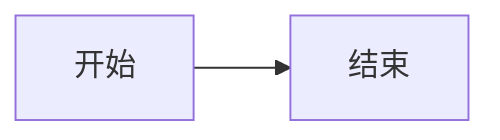
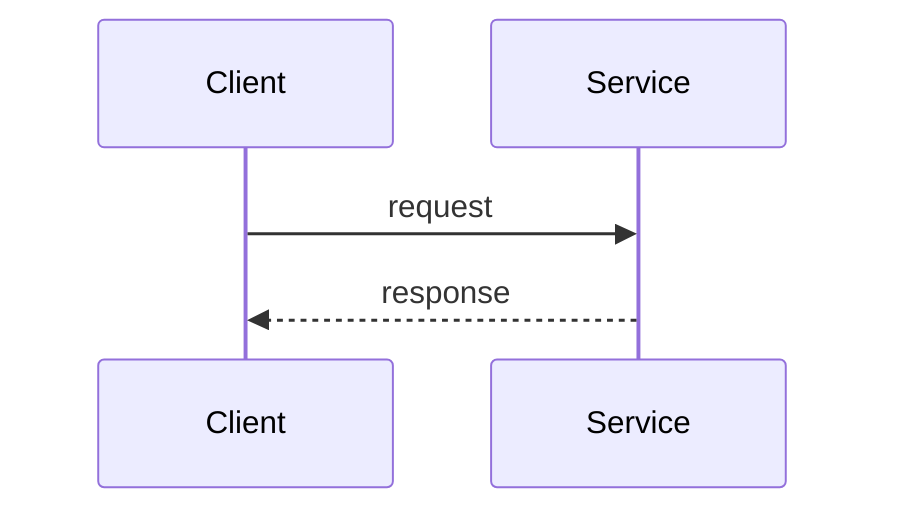
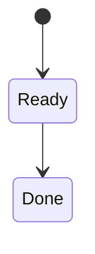
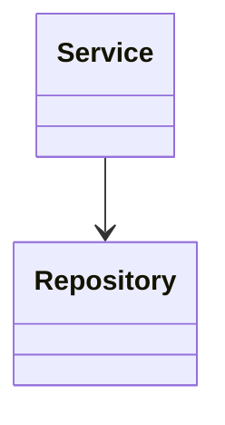
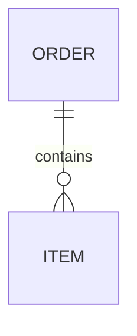

```mermaid
flowchart LR
    A[开始] --> B[结束]
```

```mermaid
sequenceDiagram
    Client->>Service: request
    Service-->>Client: response
```

```mermaid
stateDiagram-v2
    [*] --> Ready
    Ready --> Done
```

```mermaid
classDiagram
    Service --> Repository
```

```mermaid
erDiagram
    ORDER ||--o{ ITEM : contains
```
