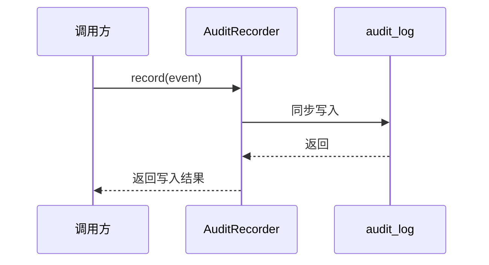

# 模块详细设计 ASIS context（测试 fixture）

> 本文件是测试 fixture 的一部分，预置了 ASIS 阶段的证据、结论与待确认问题。其中 A3 是一个**植入的 EVIDENCE 缺陷**：状态为"待确认"，但本文件及正式说明书将其当成了事实使用。

## C1. ASIS 状态与阅读说明

| 项目 | 内容 |
|---|---|
| 本次需求/AR/变更点 | AR07758 支持快速退款接口相关功能 - 支付审计模块需要记录退款审计事件 |
| 变更类型 | 混合变更 |
| 目标模块 | 支付审计模块 |
| 仓库范围 | `src/payment-audit/` |
| 模块边界来源 | `.sdd/software_architecture.md` |
| 边界来源类型 | declared |
| 本次 ASIS 分析范围 | 需求相关切片 |
| 是否启用小模块模式 | 否 |
| 是否使用 SubAgent 查证 | 是，任务编号：Q1 / Q2 / Q3 / Q4 |
| 是否发生范围扩展 | 否 |
| ASIS 状态 | 完成 |
| 分析置信度 | 中 |
| 后续 TOBE 可引用结论 | A1 / A2 / A5；A3 必须保持待确认状态 |
| 不得定稿的结论 | A3：退款事件幂等性是否需要新增幂等字段 |
| 阻塞或待确认项 | 见 C12.1：A3 / A4 |

## C2. 需求理解与设计关注点

| 编号 | 需求/AR/功能点/影响点 | 本模块相关性 | 设计关注点 | 需要查证的 ASIS 问题 | 后续探索任务 |
|---|---|---|---|---|---|
| R1 | 记录退款审计事件 | 需求相关 | 入口、写入路径、失败路径 | 当前审计记录器如何写入 audit_log？ | Q1 |
| R2 | 提供退款审计查询接口 | 需求相关 | 查询入口、接口契约 | 当前查询服务是否已有可扩展入口？ | Q2 |
| R3 | 退款事件幂等写入 | 需求相关 | 幂等、数据字段、待确认 | 当前是否已有退款事件幂等键？是否需要新增字段？ | Q3 |
| R4 | 是否读取订单退款状态 | 疑似相关 | 跨模块边界、数据归属 | 订单表是否存在 `refund_status` 字段，审计模块能否读取？ | Q4 |

## C3. 模块边界确认

| 来源 | 发现 | 边界来源类型 | 影响 |
|---|---|---|---|
| `.sdd/software_architecture.md` | 支付审计模块声明位于 `src/payment-audit/`，负责审计记录和审计查询 | declared | 本次 ASIS 限定在支付审计模块，不把订单表写入纳入本模块职责 |

### C3.1 模块边界

| 分类 | 路径或组件 | 判断依据 | 证据编号 |
|---|---|---|---|
| 确定属于模块 | `src/payment-audit/` | `.sdd/software_architecture.md` 声明 | E0 |
| 疑似属于模块 | 不适用 | 未发现其他疑似归属路径 | E0 |
| 外部依赖 | 订单模块、订单表 | 与审计模块存在数据关系但不属于审计模块 | E4 |

### C3.2 本次需求相关分析范围

| 分类 | 路径、组件或行为 | 纳入/排除原因 | 证据编号 |
|---|---|---|---|
| 需求相关 | `AuditRecorder.record(event)` | 记录退款审计事件会复用此写入路径 | E1 |
| 需求相关 | `AuditQueryService.query(byFilter)` | 退款审计查询会扩展此查询路径 | E2 |
| 疑似相关 | 幂等键相关代码 | 需求涉及退款事件幂等写入，但当前未发现实现 | E3 |
| 本次不分析 | 订单模块内部写入逻辑 | 不属于支付审计模块边界 | E4 |

## C4. 初步代码线索地图

| 线索编号 | 线索类型 | 位置或查询 | 初步发现 | 关联需求/关注点 | 后续任务 |
|---|---|---|---|---|---|
| L1 | 入口 | `src/payment-audit/AuditRecorder.java` | 存在 `record(event)` 写入入口 | R1 | Q1 |
| L2 | 入口 | `src/payment-audit/AuditQueryService.java` | 存在 `query(byFilter)` 查询入口 | R2 | Q2 |
| L3 | 搜索 | `idempotent` / `dedupe` / `refundId` | 未发现退款事件幂等键相关代码 | R3 | Q3 |
| L4 | 数据 | 订单表结构 | 仓库中未确认 `order.refund_status` 字段 | R4 | Q4 |

## C5. ASIS 探索任务清单

| 任务编号 | 问题 | 来源需求/关注点 | 初始线索 | 查证范围 | 优先级 | 执行者 | 状态 |
|---|---|---|---|---|---|---|---|
| Q1 | 当前审计记录器如何写入 audit_log？ | R1 | L1 | `src/payment-audit/AuditRecorder.java` | P0 | SubAgent | 已查 |
| Q2 | 当前查询服务是否已有可扩展入口？ | R2 | L2 | `src/payment-audit/AuditQueryService.java` | P0 | SubAgent | 已查 |
| Q3 | 当前是否已有退款事件幂等键？ | R3 | L3 | `src/payment-audit/` 下幂等相关搜索 | P0 | SubAgent | 已查，结论待确认 |
| Q4 | 订单表是否含 `refund_status` 字段？ | R4 | L4 | 仓库内订单表结构线索 | P1 | SubAgent | 已查，结论待确认 |

## C6. 探索任务结果汇总

| 任务编号 | 结论摘要 | 类型 | 证据编号 | 已查范围 | 未覆盖范围 | 置信度 | 对 TOBE/AICoding 的影响 |
|---|---|---|---|---|---|---|---|
| Q1 | 当前审计记录器通过 `record(event)` 方法同步写入 audit_log 表，无异步队列 | 事实 | E1 | `AuditRecorder.java` | 运行时数据库行为未执行验证 | 中 | 退款事件会复用此路径 |
| Q2 | 查询服务已存在 `query(byFilter)` 方法 | 事实 | E2 | `AuditQueryService.java` | 具体过滤字段需 TOBE 定义 | 中 | 退款查询可扩展 |
| Q3 | 现有代码未见退款事件的幂等键，是否需新增幂等字段未确认 | 待确认 | E3 | `src/payment-audit/` | 代码负责人未确认业务策略 | 低 | 影响是否新增幂等字段，不能被 TOBE 当成事实 |
| Q4 | 订单表结构未在仓库中确认，`refund_status` 字段是否存在未知 | 待确认 | E4 | 仓库内订单表结构线索 | 订单模块负责人未确认 | 低 | 影响审计模块是否可读取订单状态 |

## C7. 主 Agent 复核与吸收记录

| 复核编号 | 来源任务 | 复核动作 | 复核证据 | 吸收结果 | 生成/关联 ASIS 结论 | 说明 |
|---|---|---|---|---|---|---|
| V1 | Q1 | 抽查代码 | E1 | 已吸收 | A1 | 保持为事实 |
| V2 | Q2 | 抽查代码 | E2 | 已吸收 | A2 | 保持为事实 |
| V3 | Q3 | 抽查搜索范围并保留状态 | E3 | 转待确认 | A3 | 不得作为事实定稿 |
| V4 | Q4 | 抽查搜索范围并保留状态 | E4 | 转待确认 | A4 | 不得越界写订单模块 |
| V5 | Q2 | 补充历史数据线索 | E5 | 修正后吸收 | A5 | 仅作为推断使用，TOBE 需显式降级 |

## C8. 完整需求/AR 与 ASIS 证据映射

| 编号 | 需求/AR/功能点/影响点 | 本模块相关性 | 现有入口/新增对象状态/代码区域/数据对象/配置/交互 | 探索任务 | ASIS 结论编号 | ASIS 结论 | 证据编号 | 覆盖状态 | 未覆盖或待确认原因 |
|---|---|---|---|---|---|---|---|---|---|
| R1 | 记录退款审计事件 | 需求相关 | `src/payment-audit/AuditRecorder.java` | Q1 | A1 | 事实：当前审计记录器通过 `record(event)` 方法同步写入 audit_log 表 | E1 | 已覆盖 | |
| R2 | 提供退款审计查询接口 | 需求相关 | `src/payment-audit/AuditQueryService.java` | Q2 | A2 | 事实：查询服务已存在 `query(byFilter)` 方法 | E2 | 已覆盖 | |
| R3 | 退款事件幂等写入 | 需求相关 | 新增对象当前不存在 | Q3 | A3 | 待确认：现有代码未见退款事件的幂等键，是否需新增幂等字段未确认 | E3 | 待确认 | A3 状态为待确认 |

## C9. 关键 ASIS 事实

| ASIS 结论编号 | 关键现状结论 | 类型 | 对 TOBE/AICoding 的影响 | 来源任务 | 证据编号 | 备注 |
|---|---|---|---|---|---|---|
| A1 | AuditRecorder.record(event) 同步写 audit_log 表，无异步队列 | 事实 | 退款事件会复用此路径 | Q1 | E1 | |
| A2 | AuditQueryService.query(byFilter) 已存在 | 事实 | 退款查询可扩展 | Q2 | E2 | |
| A3 | 退款事件幂等性未确认，可能存在重复写入风险 | 待确认 | 影响是否新增幂等字段 | Q3 | E3 | **植入缺陷：A3 为待确认状态，但 TOBE 已将其当作事实用于设计** |
| A5 | 旧系统退款订单的审计记录可能已落 audit_log（字段格式为 legacyOrderId） | 推断 | 支持 8.2 历史数据查询设计 | Q2 | E5 | 合法：本条为推断结论，TOBE 8.2 已显式标注其推断性质并做只读降级处理（不回写） |

## C10. 当前机制、流程、调用链与数据流

| 链路/数据对象 | 当前行为 | 与本次需求/变更的关系 | 对 TOBE 的约束 | 证据编号 |
|---|---|---|---|---|
| 审计写入链路 | `AuditRecorder.record(event)` 同步写 audit_log | 退款审计记录会复用或扩展该链路 | 失败路径和幂等策略需要 TOBE 明确 | E1 |
| 审计查询链路 | `AuditQueryService.query(byFilter)` 查询审计记录 | 退款审计查询会扩展过滤条件 | DTO、过滤字段和权限需要 TOBE 明确 | E2 |

## C11. 配置、数据、测试、依赖现状

| 主题 | ASIS 行为 | 风险或限制 | 与本次需求/变更的关系 | 证据编号 |
|---|---|---|---|---|
| 数据 | audit_log 写入路径存在 | 幂等字段未确认 | 影响退款事件重复写入设计 | E1 / E3 |
| 跨模块依赖 | 订单表结构未确认 | 不应由审计模块越界写订单表 | 影响退款状态读取边界 | E4 |

### C11.1 测试覆盖现状

| 测试文件或套件 | 覆盖行为 | 与本次需求/变更的关系 | 未覆盖风险 | 证据编号 |
|---|---|---|---|---|
| 不适用 | fixture 未提供真实测试代码 | 本 fixture 关注 gate 缺陷检测 | 失败路径测试缺口由独立测试设计 fixture 植入 | E6 |

## C12. 隐藏机制、规格漂移、待确认与阻塞

| 编号 | 类型 | 现状/漂移/风险 | 影响 | 后续设计关注点 | 证据编号 |
|---|---|---|---|---|---|
| A3 | 数据 | 退款事件幂等性未确认 | 影响审计表是否新增字段 | 需代码负责人确认 | E3 |
| A4 | 数据 | 订单表 `order.refund_status` 字段是否存在未确认 | 影响审计模块是否可直接读订单表 | 需确认订单表结构和模块边界 | E4 |

### C12.1 待确认问题

| 问题 | 类型 | 为什么影响 TOBE/AICoding | 当前线索 | 建议确认对象 |
|---|---|---|---|---|
| A3：退款事件幂等性是否需要新增幂等字段 | 需前置确认 | 决定审计表是否新增字段、是否影响契约 | E3 | 代码负责人 |
| A4：订单表是否含 refund_status 字段 | 需前置确认 | 决定审计模块读取订单数据的边界 | E4 | 订单模块负责人 |

### C12.2 ASIS 阻塞项

不适用，原因：fixture 将 A3/A4 作为待确认问题保留，用于验证 Gate 是否阻止 TOBE 把待确认项当成事实。

## C13. 代码检索过程

| 步骤 | 查询/文件 | 目的 | 结果摘要 | 关联任务 |
|---|---|---|---|---|
| S1 | `src/payment-audit/AuditRecorder.java` | 查审计写入入口 | 找到 `record(event)` | Q1 |
| S2 | `src/payment-audit/AuditQueryService.java` | 查审计查询入口 | 找到 `query(byFilter)` | Q2 |
| S3 | `src/payment-audit/` 下搜索幂等关键词 | 查退款事件幂等键 | 未见任何幂等键相关代码 | Q3 |
| S4 | 仓库内订单表结构线索 | 查 `refund_status` 字段 | 订单表结构未在仓库中确认 | Q4 |

## C14. 证据索引

| 编号 | 证据类型 | 位置 | 支撑结论 |
|---|---|---|---|
| E0 | 架构声明 | `.sdd/software_architecture.md` | C3 |
| E1 | 函数 | `src/payment-audit/AuditRecorder.java:45` `record(event)` | A1 / Q1 |
| E2 | 函数 | `src/payment-audit/AuditQueryService.java:28` `query(byFilter)` | A2 / Q2 |
| E3 | 缺失证据 | `src/payment-audit/` 下未见任何幂等键相关代码 | A3 / Q3 |
| E4 | 缺失证据 | 订单表结构未在仓库中确认 | A4 / Q4 |
| E5 | 推断依据 | 旧系统数据迁移文档（仓库外）描述 audit_log 含 legacyOrderId 格式记录 | A5（推断） |
| E6 | fixture 说明 | `test/module-design-gate/fixtures/case-01-退款审计模块/` | C11.1 |

## C15. 可沉淀到模块理解文档的增量知识候选

| 候选编号 | 增量知识 | 来源证据 | 适合沉淀的位置 | 是否需要后续复核 |
|---|---|---|---|---|
| K1 | 支付审计模块当前写入链路为同步写 audit_log | E1 | 模块机制 | 是 |
| K2 | 支付审计模块 fixture 中未确认退款事件幂等键 | E3 | 数据约束 | 是 |
