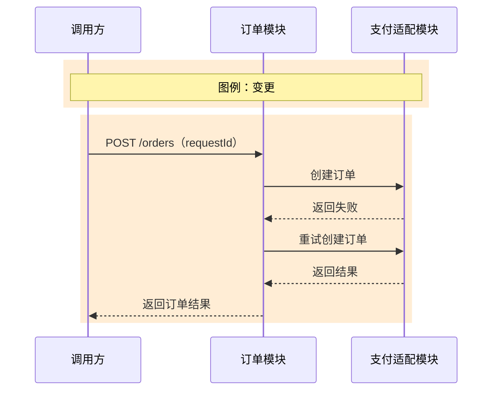
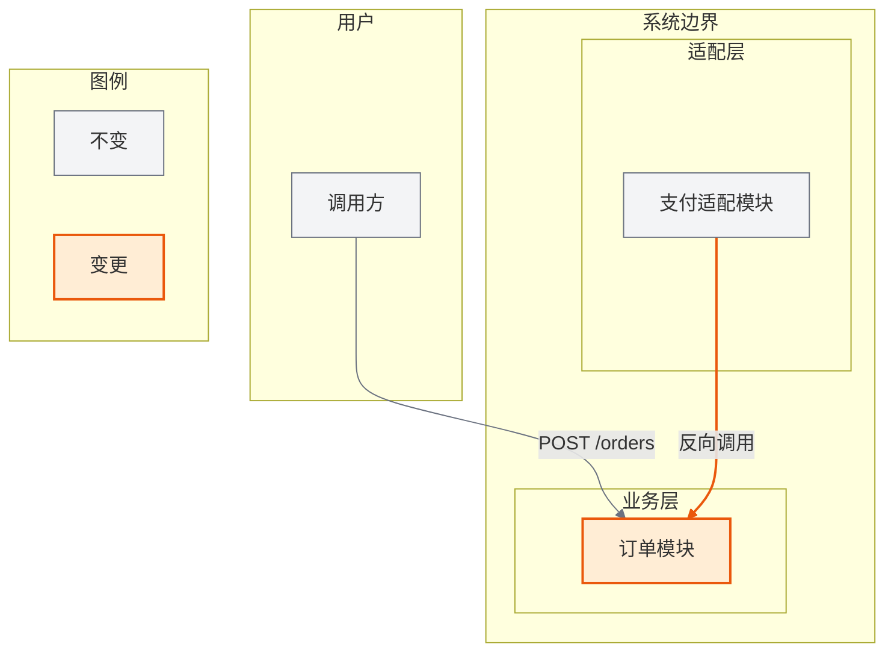

# 冲突订单功能设计

## 1. 需求背景

范围内包含订单创建。

## 2. 现状分析

`requestId` 是字符串。

## 3. 外部依赖

### 3.1 支付服务

基本契约：订单模块通过 RPC `PaymentAdapter.create` 调用支付服务，复用规范 `contracts/payment-adapter.md` 修订版 2.1。

请求字段 `requestId: string` 必填不可空；响应字段 `created: boolean` 必返不可空。错误 `PAYMENT_TIMEOUT` 在 3 秒超时时触发，可使用同一 requestId 重试一次，无部分成功。服务身份认证，3 秒超时，1000 QPS，SLA 99.9%，失败时熔断。结构简单，完整示例不适用：字段描述已覆盖契约。

## 4. 对外接口

### 4.1 创建订单

基本契约：HTTP `POST /orders`，版本 v1，本次修改。

| 字段路径 | 位置 | 类型 | 必填 | 可空 | 默认值 | 约束 | 业务语义 | 敏感级别 | 示例 |
|---|---|---|---|---|---|---|---|---|---|
| requestId | body | string | 是 | 否 | 无 | 1-64 字符 | 幂等请求标识 | 内部 | req-001 |

响应字段 `orderId: string` 在 HTTP 200 时必返不可空。错误 `ORDER_CREATE_FAILED` 表示创建失败，可重试一次，无部分成功。接口使用 OAuth2、requestId 幂等、3 秒超时、1000 QPS，版本 v1；差异表声明 requestId 由 string 改为 integer 且不兼容。结构简单，完整示例不适用：字段描述已覆盖契约。

## 5. 功能设计

### 5.1 主成功场景（功能视角）

订单创建失败时进行一次重试。

### 5.2 整体架构

支付适配模块反向调用订单模块。

### 5.3 模块交互时序（模块视角）

订单模块同步调用支付适配模块。

### 5.4 流程图（功能视角）

失败后直接终止，不执行重试。

### 5.5 关键步骤说明

创建订单并发送通知。

### 5.6 数据流图

订单数据流入订单存储。

### 5.7 状态机

状态只有 `PENDING`、`CREATED` 和 `FAILED`。

### 5.8 数据设计

`requestId` 类型为 integer。

### 5.9 异常场景、冲突场景、兼容场景

失败后重试一次。

## 6. DFX 设计

接口 P99 小于 200ms。

## 7. 配置设计

`order.create.timeoutSeconds` 默认值为 5 秒。

## 8. SR 整体验收标准

### 8.1 验收标准总览

订单接口 P99 小于 500ms，超时为 5 秒，可进入 `CANCELING` 状态。

### 8.2 系统层级黑盒测试用例

验证失败后立即终止，不发生重试。
