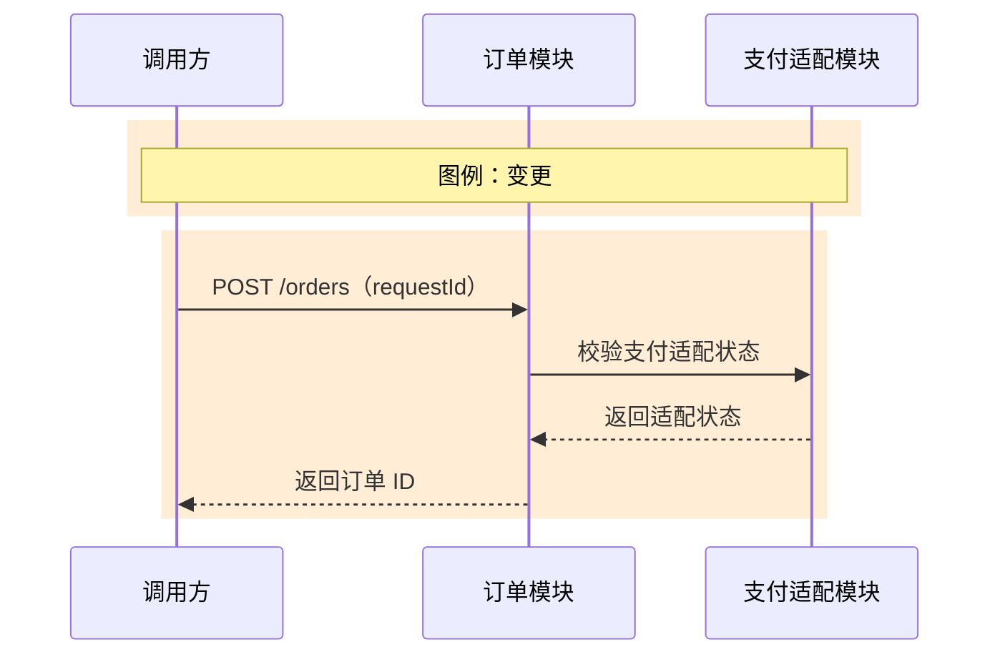
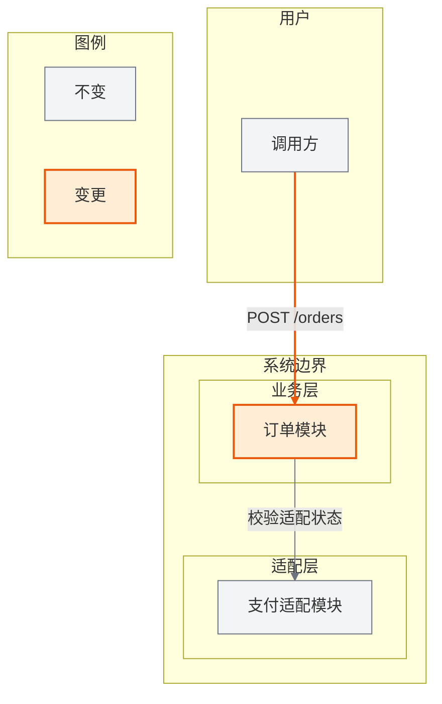

# 订单创建功能设计

## 1. 需求背景

支持可靠地创建订单，范围外不包含支付渠道实现。

## 2. 现状分析

现有订单模块缺少统一创建入口。

## 3. 外部依赖

### 3.1 支付适配状态查询

基本契约：订单模块通过 RPC `PaymentAdapter.getStatus` 调用支付适配模块，复用规范 `contracts/payment-adapter.md` 修订版 2.1。

| 字段路径 | 位置 | 类型 | 必填 | 可空 | 默认值 | 约束 | 业务语义 | 敏感级别 | 示例 |
|---|---|---|---|---|---|---|---|---|---|
| requestId | RPC | string | 是 | 否 | 无 | 1-64 字符 | 幂等请求标识 | 内部 | req-001 |

响应字段 `available: boolean` 必返且不可空，表示适配服务是否可用。错误 `PAYMENT_ADAPTER_TIMEOUT` 在 3 秒超时时触发，调用方可幂等重试一次，无部分成功或副作用。使用服务身份认证，SLA 99.9%，限流 1000 QPS，熔断后拒绝创建订单，契约向后兼容。结构简单，完整示例不适用：字段表示例已完整表达契约。

## 4. 对外接口

### 4.1 创建订单

基本契约：调用方通过 HTTP `POST /orders` 调用订单模块，契约版本 v1，本次新增。

| 字段路径 | 位置 | 类型 | 必填 | 可空 | 默认值 | 约束 | 业务语义 | 敏感级别 | 示例 |
|---|---|---|---|---|---|---|---|---|---|
| requestId | body | string | 是 | 否 | 无 | 1-64 字符 | 幂等请求标识 | 内部 | req-001 |

| 字段路径 | 状态/结果 | 类型 | 必返 | 可空 | 默认值 | 约束 | 业务语义 | 敏感级别 | 示例 |
|---|---|---|---|---|---|---|---|---|---|
| orderId | HTTP 201 | string | 是 | 否 | 无 | 1-64 字符 | 新建订单标识 | 内部 | order-001 |

错误 `ORDER_CREATE_FAILED` 返回 HTTP 503，表示订单创建失败；调用方可使用同一 `requestId` 重试一次，不产生重复订单。接口使用 OAuth2、`requestId` 幂等、3 秒超时、1000 QPS 限流、P99 小于 200ms，版本 v1 向后兼容，无部分成功。结构简单，完整示例不适用：字段表示例已完整表达契约。

## 5. 功能设计

### 5.1 主成功场景（功能视角）

校验请求，创建订单，再返回订单 ID。

### 5.2 整体架构

订单模块调用支付适配模块，不产生反向依赖。

### 5.3 模块交互时序（模块视角）

订单模块同步调用支付适配模块。

### 5.4 流程图（功能视角）

开始、校验、创建、返回。

### 5.5 关键步骤说明

失败时返回统一错误码并终止。

### 5.6 数据流图

请求数据只写入订单存储。

### 5.7 状态机

`PENDING` 只能转换为 `CREATED` 或 `FAILED`。

### 5.8 数据设计

`requestId` 为非空字符串，由订单模块持有。

### 5.9 异常场景、冲突场景、兼容场景

超时后以 `requestId` 幂等重试一次，仍失败则进入 `FAILED`。

## 6. DFX 设计

接口 P99 小于 200ms；外部依赖超时不计入该指标。

## 7. 配置设计

`order.create.timeoutSeconds` 为整数，默认值 3，单位秒。

## 8. SR 整体验收标准

### 8.1 验收标准总览

订单创建成功返回订单 ID，失败返回统一错误码。

### 8.2 系统层级黑盒测试用例

调用 `POST /orders`，断言成功、幂等重试和超时失败路径。
